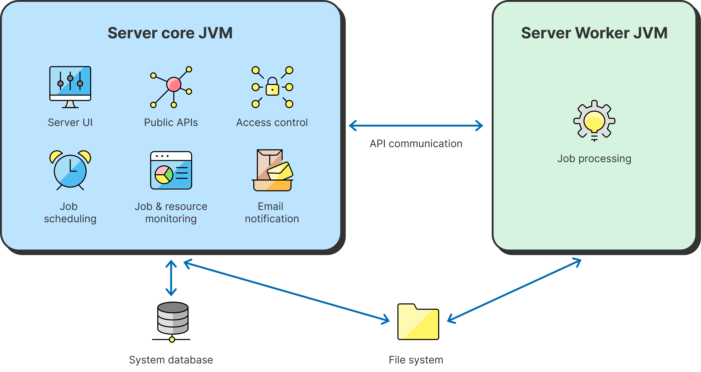

<!-- Administration > Installation > Server installation > CloverDX Server architecture -->

### CloverDX Server architecture

**CloverDX Server** requires a compatible [Java Development Kit (JDK)](system-requirements-for-cloverdx-server.md#software-requirements) to run. To function effectively, it demands adequate disk space for both long-term data storage ([transformation graphs](../developer/part-graph-elements-structures-tools.md)) and temporary files essential for its operations.

The Server relies on a system database to store critical information such as user accounts, job execution history, and other settings. While an embedded Derby database is provided for evaluation purposes (see [Installing Evaluation Server](evaluation-server.md)), production environments need a dedicated, external relational database (see [Installing Production Server](production-server.md)).

The Server environment can integrate with an [SMTP server](setup.md#e-mail) to send notifications. User management can be streamlined by integrating with an [LDAP server](ldap-authentication.md), allowing for centralized user authentication and authorization.

Architecturally, the server consists of two standalone JVMs (Java Virtual Machine): the ***Core***, which orchestrates overall operations, and the ***Worker***, responsible for executing jobs.

*Figure 12. System architecture*

#### CloverDX Core

**CloverDX *Core*** is the central component of **CloverDX Server**, accessible through a web-based user interface (Server Console). **CloverDX *Core*** provides a comprehensive [management and monitoring interface](../operations/monitoring-intro.md), along with [user management and access control](users-groups-index.md). It also offers robust [scheduling capabilities](../operations/scheduling.md) and facilitates communication between **CloverDX Designer** and the *Worker* process. To integrate with other applications, the *Core* exposes multiple APIs such as [Data Service](../operations/data-services.md), [REST API](../operations/rest-api.md), and [Web Service APIs](../operations/soap-ws.md).

The *Core* functionality relies on a [system database](examples-db-connection-configuration.md) to store configuration and service information. For enhanced capabilities, the *Core* can integrate with an [SMTP server](setup.md#e-mail) for [email notifications](../operations/tasks.md#send-an-email) and an [LDAP server](setup.md#ldap) for user authentication.

#### CloverDX Worker

*Worker* is a standalone Java Virtual Machine (JVM) process that executes jobs independently from the **CloverDX Server***Core*. This isolation safeguards the Server *Core* from potential issues arising from job execution.

*Worker* is automatically started and managed by the Server *Core*, requiring no separate installation. The *Worker* process runs on the same host as the Server. In a clustered environment, each node has its own Worker.

*Worker* is a lightweight and simple executor of jobs. It is optimized for efficient job execution and does not handle high-level job management or scheduling. *Worker* communicates with the Server *Core* via API for complex tasks like requesting additional job execution or checking file permissions.

##### Configuration

###### General configuration

*Worker* configuration is managed through specific [configuration properties](list-of-properties.md#worker-configuration-properties). You can modify or add these properties within the [Setup](setup.md#worker) module:

- Heap memory limits
- Port ranges
- Additional command line arguments (e.g. tweak [garbage collector](postinstallation-configuration.md#garbage-collector-for-worker) settings)

These configurations are stored in the Server’s main [configuration file](configuration-sources.md#configuration-file-on-specified-location).

For a full list of *Worker* properties, see [Properties on Worker’s command line](list-of-properties.md#properties-on-workers-command-line).

Full *Worker*[command line](../operations/monitoring.md#4-showing-worker-command-line-arguments) is available in the Monitoring section.

###### Cluster-specific configuration

To ensure optimal performance, use a consistent [portRange](list-of-properties.md#lop-worker-portrange) across all cluster nodes: all nodes should have identical value of `portRange`. That is the preferred configuration, although different ranges for individual nodes are possible.

##### Management

The Server *Core* controls the lifecycle of Worker, including starting, stopping, and restarting. It can be monitored and managed in the Server Console, [Monitoring section](../operations/monitoring.md) section.

For troubleshooting *Worker* issues, see [Troubleshooting worker](../operations/administration-troubleshooting-worker.md).

##### Job execution

By default, jobs are executed in *Worker*. The Server *Core* retains the ability to run jobs as well. However, executing jobs in the Server *Core* is generally discouraged and should be an exception.

If needed, you can specify which jobs should run on the Server *Core* using the [worker_execution](../developer/jobconfig.md) property - the property can be added at the job level or sandbox level. If the *Worker* is [disabled entirely](list-of-properties.md#lop-worker-initialworkers) all jobs are executed in the Server *Core*.

To see where a job was executed, look in the run details in **Execution History** (Executor field). Jobs started in *Worker* also log a message in their log, e.g. `Job is executed on Worker:[Worker0@node01:10500]`.

##### Job-specific configuration

The following areas of *Worker* configuration affect job execution:

- **JNDI**
  Graphs running in *Worker* cannot use JNDI as defined in the application container of the Server *Core*, because *Worker* is a separate JVM process. *Worker* provides its own [JNDI configuration](list-of-properties.md#worker-jndi-properties).
- **Classpath**
  The classpath is not shared between the Server *Core* and Worker. If you need to add a library to *Worker* classpath, e.g. a JDBC driver, follow the instructions in [Adding libraries to Worker classpath](../admin/server-manual-install.md#optional-installation-steps).

#### Server Core - Worker communication

The Server *Core* and *Worker* processes communicate through internal APIs over TCP connections. Additionally, the Server *Core* receives the *Worker’s* standard output (stdout) and standard error (stderr) streams through this channel.
