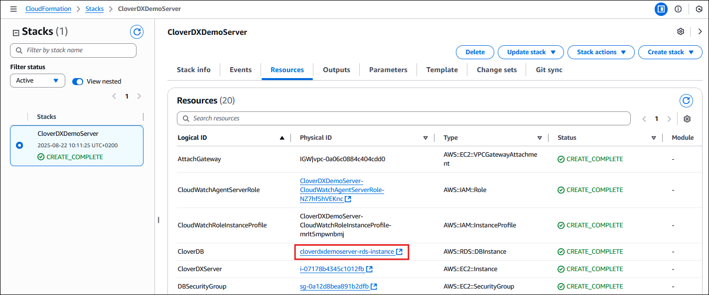
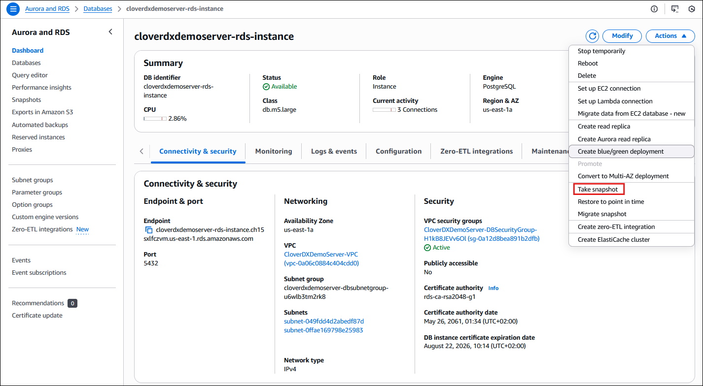
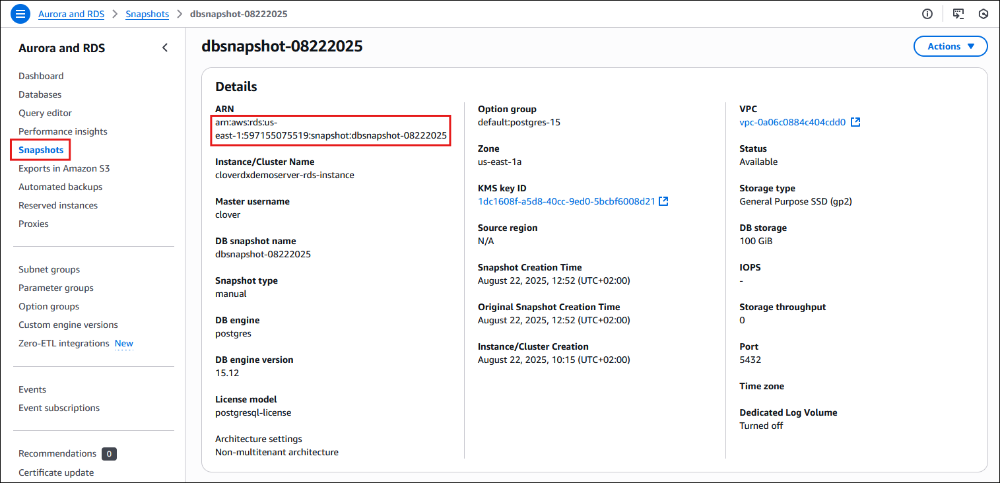
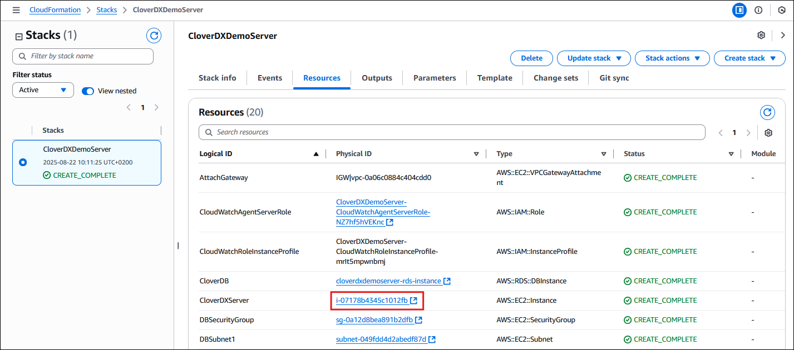
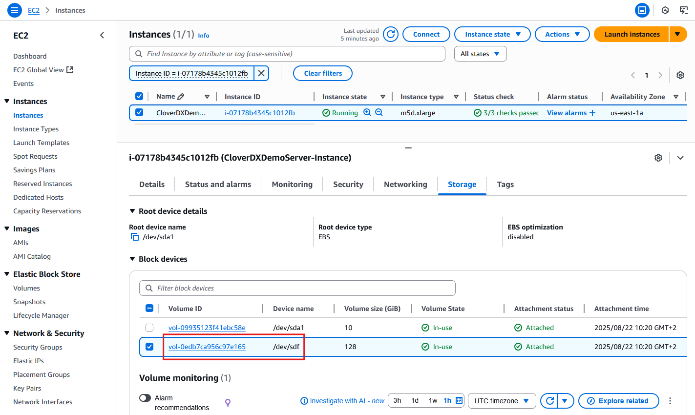
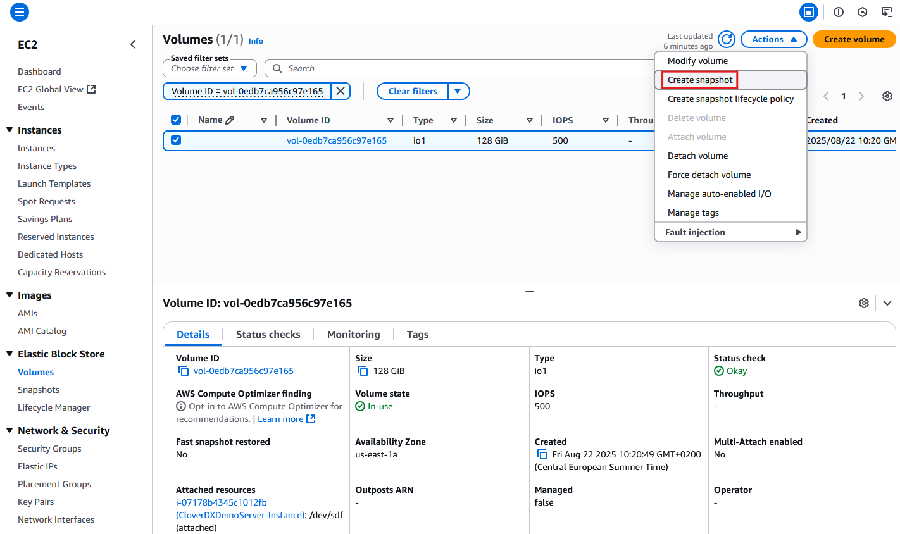
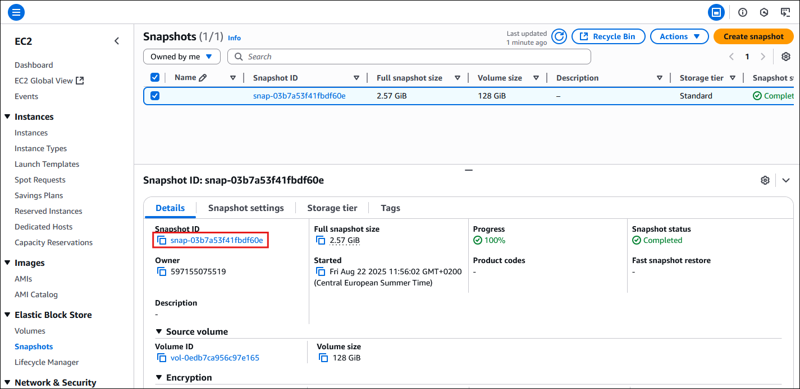
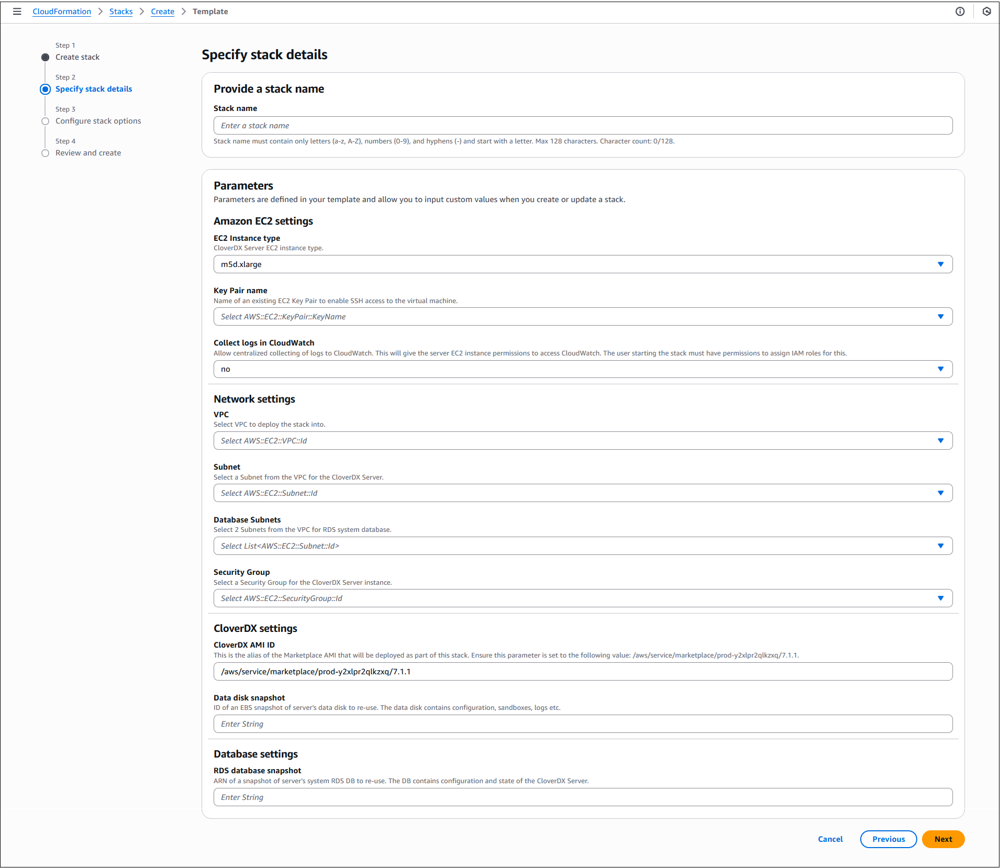

<!-- Administration > Upgrade > Server upgrade in cloud > Server upgrade in AWS -->

### Server upgrade in AWS

To upgrade **CloverDX Server** to a new version in AWS Marketplace, use the **CloverDX Server Upgrade** template. The upgrade template creates a new stack with the new version of CloverDX and possibly an updated cloud architecture. Configuration and data are reused from the previous version by using snapshots of data disk and RDS system database. The previous version has only minimal downtime and can run in parallel with the new version.

First, see an overview of the upgrade process in [Common cloud upgrade](common-marketplace-upgrade.md). This section assumes familiarity with deploying a new CloverDX Server as described in [Quickstart](aws-marketplace.md#quickstart-deployment-with-a-new-vpc). The upgrade template is also similar to the template for deployment into existing infrastructure (see [Deployment into existing infrastructure](aws-marketplace.md#deployment-into-existing-infrastructure)).

**High-level overview:**

1. Create snapshots of the data disk and RDS database of the previous version.
2. Subscribe to a new version of CloverDX Server on the AWS Marketplace using the **CloverDX Server Upgrade** template.
3. Configure and deploy the CloudFormation stack of the new version, using the above snapshots.
4. Test the new version.

#### Upgrade steps

The steps below focus on the actions specific to the upgrade process and assume knowledge of the deployment of a new CloverDX Server stack (see [Quickstart](aws-marketplace.md#quickstart-deployment-with-a-new-vpc)).

1. Pause processing of jobs in your current deployment - disable listeners and schedules. This starts the downtime of your current CloverDX Server environment.
2. Create a snapshot of the system RDS database - you can find the RDS database in the **Resources** section of your stack.
   
   *Figure 44. Selecting the RDS system database in the stack*
   After clicking on it, use the **Take Snapshot** action on the database.
   
   *Figure 45. Creating a snapshot of the RDS system database*
3. In the **Aurora and RDS console** > **Snapshots** section, locate the **Snapshot ARN** value to be later used in the **RDS Database Snapshot** parameter in the CloudFormation upgrade template.
   
   *Figure 46. RDS system database snapshot ARN*
4. Create a snapshot of the data disk - in the **Resources** section of your stack, you can find the EC2 instance.
   
   *Figure 47. Selecting CloverDX Server EC2 instance*
   After clicking on it, in the EC2 details, you can click on the `/dev/sdf` volume to take you to the EBS volume to create the snapshot.
   
   *Figure 48. Selecting data disk EBS volume*
   
   *Figure 49. Create snapshot option*
5. In the **EC2 console** > **Snapshots** section, select the snapshot and locate the **Snapshot ID** value to be later used in the **Data disk snapshot** parameter in the CloudFormation upgrade template.
   
   *Figure 50. Data disk snapshot ID*
6. Resume processing of jobs in your current version - this ends the downtime.
7. Subscribe to the new version of **CloverDX Data Management Platform - Server BYOL** offering on the AWS Marketplace, and use the **CloverDX Server Upgrade** CloudFormation template.
8. Configure the stack of the new version:
   
   *Figure 51. Upgrade stack details*

| Parameter | Description |
| --- | --- |
| **Network settings** |  |
| **VPC** | Select the VPC where the previous version is running. If you used the *CloverDX Server Deployment New VPC* template to deploy the previous version, then you can find the VPC by its name `stackname-VPC` (`stackname` is the name of the stack of the previous version). |
| **Subnet** | Select the Subnet where the previous version EC2 instance with CloverDX Server is running. You can find the Subnet by its name “stackname-Subnet” if you deployed the previous version via the *CloverDX Server Deployment New VPC* template. |
| **Database Subnets** | Select the 2 Subnets where the previous version RDS system database is running. You can find the Subnets by their names `stackname-DBPrivateSubnet1` and `stackname-DBPrivateSubnet2` if you deployed the previous version via the *CloverDX Server Deployment New VPC* template. |
| **Security Group** | Select the Security Group used by the previous version’s EC2 instance. You can find the Security Group by its name `stackname-SecurityGroup` if you deployed the previous version via the *CloverDX Server Deployment New VPC* template. |
| **CloverDX Settings** |  |
| **CloverDX AMI ID** | Alias of the Marketplace AMI that will be deployed as part of this stack. This parameter is pre-defined and **must not be changed**. |
| **Data disk snapshot** | ID of the snapshot of the data disk of the previous version that you created in one of the previous steps. You can find it in the EC2 console in the **Snapshots** section after selecting the snapshot. |
| **Database settings** |  |
| **RDS Database Snapshot** | ARN of the snapshot of the RDS system database of the previous version that you created in step 2 above. You can find it in the **Aurora and RDS console** > **Snapshots** section after selecting the snapshot. |
> [!NOTE]
> You’re not configuring the credentials of the CloverDX Server admin user and database credentials - they are the same as in the previous version.

**Success**. A new version of **CloverDX Server** is now available in AWS. You can find its URL in the **Outputs** tab of the CloudFormation stack. Login credentials for the new version are the same as for the previous version. The new version is deployed in a new version of the cloud architecture, while re-using the data disk and RDS system database of the previous version based on their snapshots. The previous version is left untouched and can continue to be used.

##### Follow-up steps

- *Activate the new server* - you will need to provide a license version compatible with the new CloverDX Server version. Download the latest version from our [Customer Portal](https://support.cloverdx.com/login).
- *Test the new version* - perform thorough testing of the new version. If you disabled the listeners and schedules on the previous version, then the new version starts up and does not process new data. You need to carefully enable processing that can be enabled, e.g., if it doesn’t consume production data.
- After finishing testing of the new version, it is possible to *switch the Elastic IP address* of the previous version to point to the new version instance. This allows you to continue using the same IP address or hostname with the new version, e.g., for server projects in CloverDX Designer.
  Steps to switch Elastic IP address:
  1. *Disassociate the new Elastic IP* - unbind the new Elastic IP from the new version instance. Select the Elastic IP of the new version (e.g., from the **Resources tab** of the stack of the new version) and use the **Disassociate Elastic IP address** action. Warning: this will cause the new version instance to be available on a different IP address than previously (one will be assigned automatically by AWS).
  2. *Release the new Elastic IP* - the above disassociated Elastic IP is currently unused, and you’re being charged for it. So release it via the **Release Elastic IP address** action.
  3. *Associate the old Elastic IP to the new version instance* - to redirect the old Elastic IP address to the new version instance, select it (e.g., from the **Resources** tab of the stack of the previous version) and use the **Associate Elastic IP address**. Warning: this will cause the previous version instance to be available on a different IP address than previously (one will be assigned automatically by AWS).
  4. For SSL connectivity to the new version to work correctly, we need to re-generate the self-signed certificate to correspond to the new public hostname. For this, just restart the new version instance.
