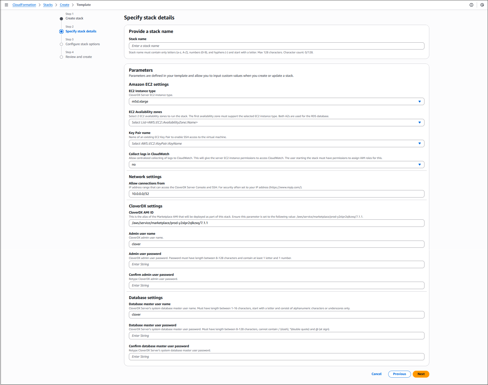
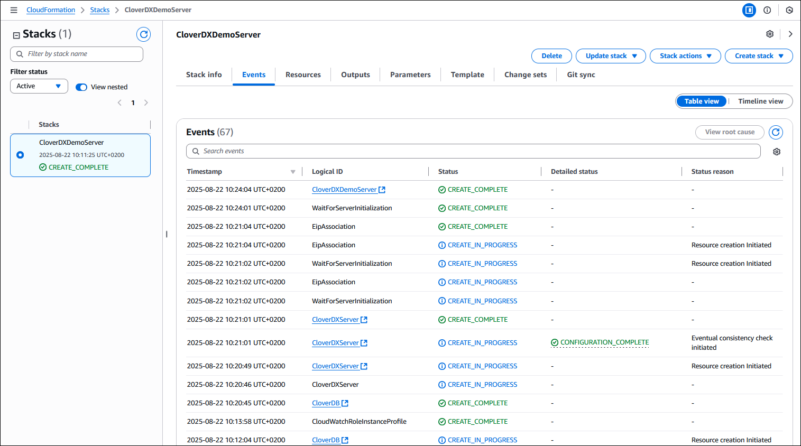
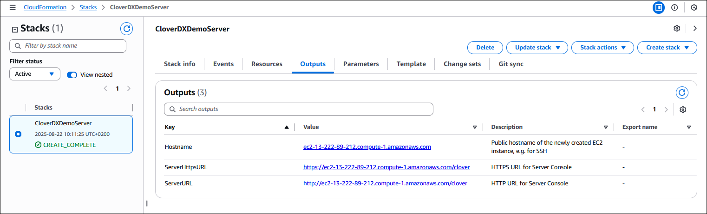
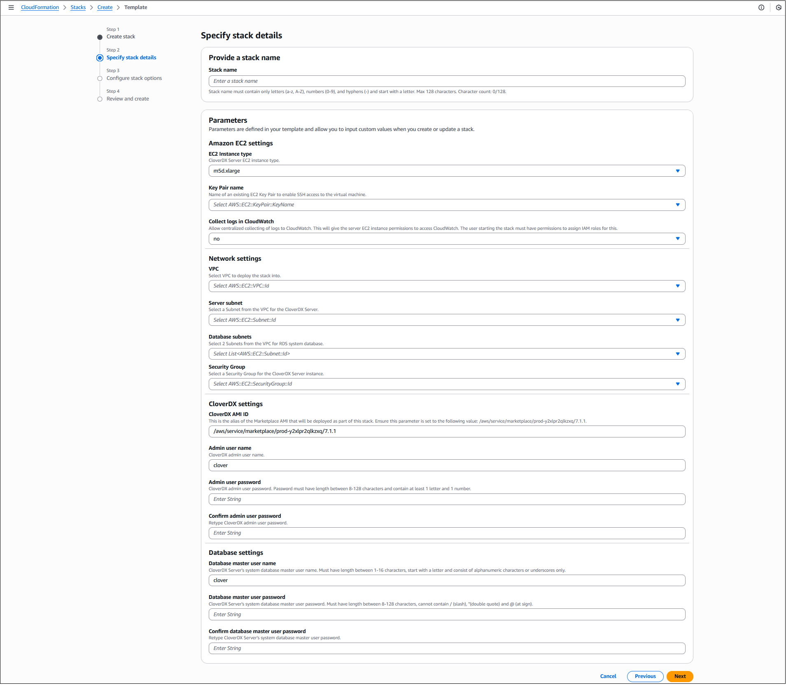
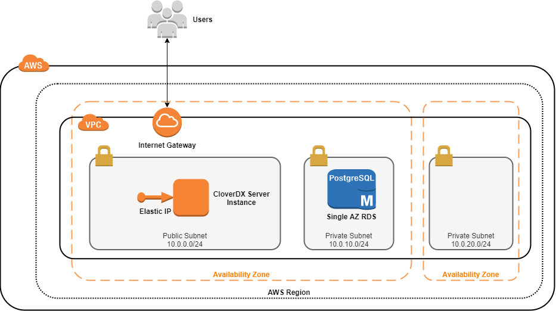
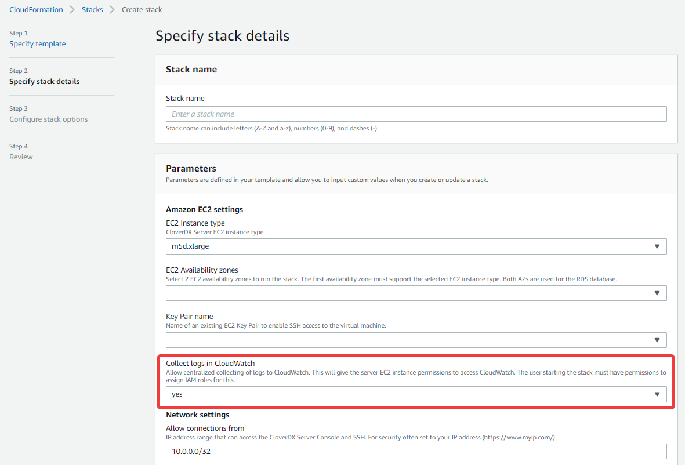
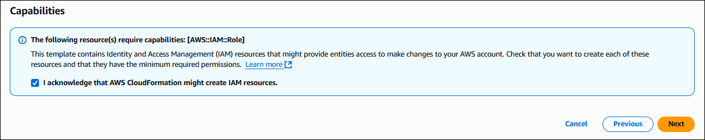
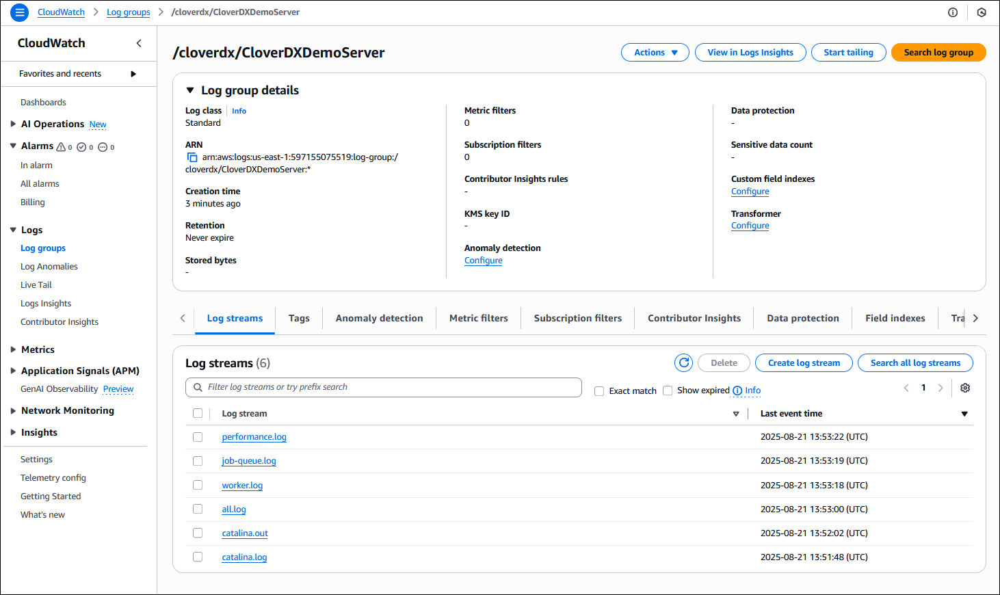

<!-- Administration > Installation > Server installation > Cloud deployments > AWS Marketplace -->

#### AWS Marketplace

| [Overview](aws-marketplace.md#overview) |
| --- |
| [Quickstart - Deployment with a new VPC](aws-marketplace.md#quickstart-deployment-with-a-new-vpc) |
| [Deployment into existing Infrastructure](aws-marketplace.md#deployment-into-existing-infrastructure) |
| [Architecture](aws-marketplace.md#architecture) |
| [Configuration](aws-marketplace.md#configuration) |

##### Overview

The **CloverDX Server offering on AWS Marketplace** provides an easy way to create a CloverDX Server instance in the AWS cloud infrastructure. The offering spins up a recommended cloud architecture that contains a standalone **CloverDX Server** with good defaults and a recommended environment. The server uses **PostgreSQL in RDS** as its system database, which is automatically created and configured. The server instance uses your AWS resources, and you are billed for them directly by Amazon.

The **CloverDX Server AWS offering** consists of an AMI image of a virtual machine and a **CloudFormation template** that provides a simple configuration user interface and creates the required cloud infrastructure as a CloudFormation stack.

The following templates are provided:

| Template | Description |
| --- | --- |
| **CloverDX Server Deployment New VPC** | Deploys a new instance of CloverDX Server with newly created network infrastructure (VPC, Subnets, etc.), see [Quickstart](aws-marketplace.md#quickstart-deployment-with-a-new-vpc). This is the easiest deployment option. |
| **CloverDX Server Deployment Existing VPC** | Deploys a new instance of CloverDX Server into an existing network infrastructure selected by the user, see [Deployment into existing infrastructure](aws-marketplace.md#deployment-into-existing-infrastructure). This is the option to use if you already have existing infrastructure in AWS and want to integrate CloverDX into it. |
| **CloverDX Server Upgrade** | Upgrades a CloverDX Server instance to a new version, see [Upgrade in AWS](aws-marketplace-upgrade.md). |

##### Quickstart - Deployment with a new VPC

Prerequisites:

- License for CloverDX Server - this is a BYOL (Bring Your Own License) offering. If you already have a Server license issued, you can download it from our [Customer Portal](https://support.cloverdx.com/license-keys). If you don’t have one yet, reach out to your [Account Manager](https://support.cloverdx.com/contact).
- Basic familiarity with [AWS EC2 infrastructure](https://docs.aws.amazon.com/AWSEC2/latest/UserGuide/concepts.html).
- Basic familiarity with [AWS RDS infrastructure](https://docs.aws.amazon.com/AmazonRDS/latest/UserGuide/Welcome.html).
- Basic familiarity with [AWS CloudFormation](https://docs.aws.amazon.com/AWSCloudFormation/latest/UserGuide/Welcome.html).
- Account on AWS and permissions to use EC2, RDS, and CloudFormation services.
- Key pair registered in EC2.

High-level overview of steps:

1. Subscribe to the **CloverDX Data Management Platform** on AWS Marketplace.
2. Configure and deploy the CloudFormation stack.
3. Activate and configure CloverDX Server.

###### Steps

1. Subscribe to the **CloverDX Data Management Platform - Server BYOL** offering on the AWS Marketplace, and use the **CloverDX Server Deployment New VPC** CloudFormation template. Use the **Continue to Subscribe** button on the offering marketplace page and proceed through the wizard to the **Launch** action (meanwhile accepting Terms and Conditions, selecting template, etc).
2. Deploy the CloudFormation stack:
   1. First step: **Specify template** - a CloudFormation template is already selected from the marketplace offering, continue with **Next**.
   2. Second step: **Specify stack details** - configure the stack:
      
      *Figure 15. Stack details*
      | Parameter | Description |
      | --- | --- |
      | **Stack name** | Enter a unique stack name. |
      | **Amazon EC2 settings** |  |
      | **EC2 Instance type** | The EC2 instance CloverDX Server will run on. A default instance type is pre-selected. You can select a different instance type from the list. Larger instances have better performance but come at a higher cost. |
      | **EC2 Availability zones** | An Availability Zone is essentially a separate data center. Select 2 zones in which the stack will run. The first zone is used for the **CloverDX Server EC2 instance**, while both zones are used for the **system RDS database**.  Be aware that some availability zones may not support the chosen EC2 instance type, or the instance type might be unavailable for capacity reasons. Such issues will appear in the stack’s Events log during startup. If this occurs, select a different zone. |
      | **Key Pair name** | Select a public key registered in your EC2 infrastructure. This key will be used to administer the EC2 instance via SSH. |
      | **Collect logs in CloudWatch** | Default value is `no`. Set it to `yes` to enable the centralized collection of logs to *CloudWatch*. See [Server logs in AWS CloudWatch](aws-marketplace.md#server-logs) for more details. |
      | **Network settings** |  |
      | **Allow connections from** | The CloudFormation template automatically creates a *Security Group* that allows only connections from specific IP ranges to specific ports on the instance. We recommend specifying the range of IP addresses from which the instance should be accessible - typically your offices or data center network.  For evaluation purposes, you can use your public IP, obtained, e.g., from [myip.com](https://myip.com).  **We do not recommend making the instance visible to the whole Internet.** |
      | **CloverDX settings** |  |
      | **CloverDX AMI ID** | Alias of the Marketplace AMI that will be deployed as part of this stack. This parameter is pre-defined and **must not be changed**. |
      | **Admin user name** | Specify the user name of the **CloverDX Server administration user** (or keep the default `clover` user). This user is the first user available in the Server Console for administration of the Server environment.  This is NOT the operating system user - you must use the above public key to SSH to the instance. |
      | **Admin user password** | Enter a password for the Server admin user. Password must be between 8-128 characters and contain at least 1 letter and 1 number. |
      | **Confirm admin user password** | Re-type the password. |
      | **Database settings** |  |
      | **Database master user name** | Specify the master user name of the **RDS** database that will be created as the Server’s system database. This user name and below password will be used by **CloverDX Server** to connect to the database. |
      | **Database master user password** | Specify the password for the above database master user. |
      | **Confirm database master user password** | Re-type the password. |
   3. Configure stack options and review the stack - the next two pages allow you to set up additional, more advanced stack options, and review the whole stack configuration.
   4. Create stack - click the final **Create Stack** button to start the stack. Creation of the whole stack takes some time (up to a few minutes). You will see a CloudFormation log of resources being created.
      The stack is created and ready to use when the state changes to `CREATE_COMPLETE`.
      
      *Figure 16. Stack deployment*

**Success**. **CloverDX Server** is now available in AWS. You can find its URL in the `Outputs` tab of the CloudFormation stack - the `ServerURL` entry. There, you can also find its hostname for SSH access.


*Figure 17. Stack outputs*

On the Server’s URL, you will see the login page where you can:

- Activate the Server - the Server is licensed in BYOL (Bring Your Own License) mode. Load a compatible Server license. If you have an existing Server license, you can download it from our [Customer Portal](https://support.cloverdx.com/license-keys). If you do not have a license, reach out to your [Account Manager](https://support.cloverdx.com/contact).
- To log in, use the credentials set in the CloudFormation configuration wizard (**Admin user name and password** in the CloverDX section).
  
  *Figure 18. CloverDX Server login page*

The Server is running with default settings and is immediately usable. It can be configured further to get it into full production quality.

##### Deployment into existing Infrastructure

If you’re already operating services and instances in AWS and want to deploy CloverDX Server alongside them, e.g., to integrate several data sources, then the deployment is performed with the CloudFormation template **CloverDX Server Deployment Existing VPC**. The template does not create a new VPC, Subnets, and some other networking infrastructure, but lets you select existing ones. The template creates a new CloverDX Server **EC2 instance** and a new **RDS system database** and deploys them into the selected network resources.

Deployment steps and settings in this case are similar as those described in [Quickstart](aws-marketplace.md#quickstart-deployment-with-a-new-vpc), with these differences:

1. Subscribe to **CloverDX Data Management Platform - Server BYOL** offering on the AWS Marketplace - use the **CloverDX Server Deployment Existing VPC** template.
2. When configuring the stack, fill in the **Network settings** to point to existing VPC, Server, and database subnets, and Security Group.
   
   *Figure 19. Deployment to an existing infrastructure stack details*

| Parameter | Description |
| --- | --- |
| **Network settings** |  |
| **VPC** | Select a VPC where the stack will be deployed. |
| **Subnet** | Select a Subnet which will be used by the **CloverDX Server EC2 instance**. The Subnet must be in the VPC selected above. |
| **Database Subnets** | Select 2 Subnets which will be used by the RDS system database. Typically the subnets are private and not visible from the Internet. The subnets must be in the VPC selected above. |
| **Security Group** | Select a Security Group which will be used by the **CloverDX Server EC2 instance**. The RDS system database will use its own Security Group that is created by the template and allows connections only from the Server. |

##### Architecture

The **CloverDX Server** AWS offering consists of an AMI image of a virtual machine and a CloudFormation template that orchestrates the required cloud resources:


*Figure 20. Architecture - CloverDX Server in AWS marketplace*

##### Details of the AWS topology

- The instance runs in the AWS cloud, in the *Region* selected by the user, and in its 2 selected *Availability Zones*. The first AZ is used by the server’s EC2 instance, and both AZs are used by the RDS database (for potential Multi-AZ deployment, see [database details](aws-marketplace.md#rds-database-details) below).
- A new *VPC* (Virtual Private Cloud) is created to isolate the CloverDX instance from other resources present in the AWS cloud. The VPC has an *Internet Gateway* for connectivity to the Internet (also for the users to connect to the Server Console).
- A new *public Subnet* is created in the VPC for the server’s network resources.
- A single EC2 instance is created from an AMI. The **CloverDX Server** is running in this instance and uses an RDS instance of PostgreSQL, see below.
- The EC2 instance is available via an *Elastic IP* - this IP address doesn’t change between restarts of the instance.
- The EC2 instance uses a *Security Group* to limit access only to specific ports (`22, 80, 443`) and only from IP addresses from a defined CIDR range.
- 2 new *private Subnets* are created in the VPC for the RDS database. The database currently uses just one of them; the second one is prepared for multi-AZ deployment of the database.
- An *RDS PostgreSQL database* is created with recommended settings and is used as the server’s system database.
- The RDS database uses a *Security Group* to limit access only from the server’s EC2 instance.

###### EC2 instance details

For additional information, see [Common cloud architecture](server-in-cloud-marketplaces.md#architecture):

| EC2 instance details |  |
| --- | --- |
| **Operating system** | Ubuntu 24.04 LTS |
| **Java** | Eclipse Temurin JDK 21 (formerly AdoptOpenJDK) |
| **Application server** | Tomcat 10.1 |
| **Disks** | **OS disk (10GB)** and **data disk (128GB)**. Both are *Provisioned IOPS SSD EBS* volumes. It is possible to increase the size of the disks or change the provisioned IOPS. To do so, follow the instructions [here](https://docs.aws.amazon.com/AWSEC2/latest/UserGuide/ebs-modify-volume.html).  Encryption is enabled on both disks, see [Security](aws-marketplace.md#security) for more details. |

###### RDS database details

| RDS database details |  |
| --- | --- |
| **Database type** | PostgreSQL 15 |
| **DB instance type** | *db.m5.large* (2 vCPUs, 8GB RAM) |
| **Storage** | 100GB SSD allocated storage, can autoscale to 200GB. |
| **Backup** | Automatic daily backups enabled. Backups retained for 7 days. |
| **Accessibility** | Available only from the server’s EC2 instance, not visible from the Internet. |
| **CloverDX Server-database communication** | Server uses SSL to communicate with the database. |
| **Multi-AZ deployment** | Disabled by default. Multi-AZ deployment runs multiple replicas of the database in different availability zones for high availability, which is why 2 availability zones have to be selected when creating the stack. The architecture and configuration is prepared for Multi-AZ deployment, and it’s possible to enable it in the RDS configuration later. |

##### Configuration

For details about **CloverDX Server** configuration, see [Common cloud configuration](server-in-cloud-marketplaces.md#configuration).

###### Instance type

The EC2 instance type can be changed after the stack is deployed. To use a different instance type, stop the VM instance in the EC2 console, change its instance type (via *right-clicking > Instance settings > Change instance type*), and start it again. It’s also possible to modify the CloudFormation template to use different instance types than the ones we offer by default. However, behavior and performance on other instance types than the default ones are not guaranteed.

###### Memory

Heap sizes for Server Core and Worker are set automatically based on the instance memory size, see [Common cloud memory configuration](server-in-cloud-marketplaces.md#memory). It is possible to change the instance type of the VM, and the memory sizes will be re-calculated - for this, stop the VM instance in the EC2 console, change its instance type, and start it again.

###### Server logs

By default, server logs are collected in `/var/clover/cloverlogs` directory, and Tomcat logs in `/var/clover/tomcatlogs`.

The VM is pre-configured to send some specific logs to [Amazon CloudWatch](https://aws.amazon.com/cloudwatch/) for centralized log collection and analysis. However, it is necessary to start the VM with an [IAM role](https://docs.aws.amazon.com/IAM/latest/UserGuide/id_roles.html) that allows it to send the logs to *CloudWatch*. The following steps create the IAM role and fully enable the *CloudWatch* integration:

1. Set the **Collect logs in CloudWatch** stack parameter to `yes`. The template will automatically create an IAM role that allows the EC2 instance to send the logs to *CloudWatch*.
   
   *Figure 21. Collect logs in CloudWatch stack parameter*
   This operation requires that the user starting the stack has permissions to manipulate IAM roles. Example of an IAM policy that allows the user to do that:
   ```json
   {
       "Version": "2012-10-17",
       "Statement": [
           {
               "Sid": "VisualEditor0",
               "Effect": "Allow",
               "Action": [
                   "iam:CreateInstanceProfile",
                   "iam:DeleteInstanceProfile",
                   "iam:PassRole",
                   "iam:DetachRolePolicy",
                   "iam:RemoveRoleFromInstanceProfile",
                   "iam:CreateRole",
                   "iam:DeleteRole",
                   "iam:AttachRolePolicy",
                   "iam:PutRolePolicy",
                   "iam:AddRoleToInstanceProfile"
               ],
               "Resource": "*"
           }
       ]
   }
   ```
2. Acknowledge that the template might create IAM resources in the last step of launching the stack. If you don’t acknowledge that, you’ll see an error message `Requires capabilities : [CAPABILITY_IAM]`.
   
   *Figure 22. Confirmation that your stack can create IAM resources*

The CloudWatch integration creates a log group called `/cloverdx/stack-name`, with the following logs:


*Figure 23. Logs in CloudWatch*

- `all.log` - main CloverDX Server log.
- `performance.log` - contains performance metrics that are useful for diagnostics of incidents, see [Performance log](../operations/logging.md#performance-log).
- `job-queue.log` - contains metrics useful for analysing behavior of the job queue, see [Job queue log](../operations/logging.md#job-queue-log).
- `worker.log` - log of CloveDX Worker, which executes jobs.
- `catalina.out` & `catalina.log` - Tomcat logs, useful primarily in case CloverDX Server doesn’t start.

The *CloudWatch* integration is done via the [CloudWatch Agent](https://docs.aws.amazon.com/AmazonCloudWatch/latest/monitoring/Install-CloudWatch-Agent.html), which is automatically configured and installed on the VM. Useful files and commands:

- `/opt/aws/amazon-cloudwatch-agent/etc/amazon-cloudwatch-agent.json` - configuration of *CloudWatch Agent*, e.g., which logs are collected. Note that this file is on the OS disk, so changes to it will be overwritten when upgrading to new version (see [Upgrade in AWS](aws-marketplace-upgrade.md)).
- `/var/log/amazon/amazon-cloudwatch-agent/amazon-cloudwatch-agent.log` - log file of the *CloudWatch Agent*, useful for diagnostics in case the logs are not collected.
- `sudo systemctl restart amazon-cloudwatch-agent.service` - restart the *CloudWatch Agent* service. This is needed after manual assignment of a role to the EC2 server instance or after changes to the above configuration file.

The IAM role that allows *CloudWatch* integration can be assigned to the VM also manually in the EC2 console later. The role must allow write access to *CloudWatch*, e.g., by using the `CloudWatchAgentServerPolicy` managed policy. After assigning the role, you need to restart the CloudWatch Agent.

###### JMX monitoring

To successfully establish a JMX connection over SSL to the server (e.g., for troubleshooting via VisualVM, see [Common JMX monitoring](server-in-cloud-marketplaces.md#jmx-monitoring)), the client needs to trust the server’s certificate. One option would be to replace the default server’s self-signed certificate with a production-quality certificate (see [HTTPS in AWS](aws-marketplace.md#https)). In such a case, no further configuration is required.

To use JMX with the default self-signed certificate, follow these steps:

1. Export the server’s certificate from the keystore:
   `keytool -export -keystore $CLOVER_HOME/conf/serverCertificate.jks -storepass changeit -alias clover -rfc -file clover.cert`
2. Transfer the `clover.cert` certificate to the client machine.
3. On the client machine, import the server certificate into the client’s truststore:
   1. Into default Java truststore:
      `sudo keytool -import -file clover.cert -alias clover -storetype JKS -keystore $JAVA_HOME/jre/lib/security/cacerts -storepass changeit`
   2. Into a custom truststore:
      `keytool -import -file clover.cert -alias clover -storetype JKS -keystore clover.truststore -storepass changeit`
      In this case, the JMX client needs to be configured to use this custom truststore via properties:
      `-Djavax.net.ssl.trustStore=clover.truststore -Djavax.net.ssl.trustStorePassword=changeit`

###### Users

Users available in the EC2 instance:

| Parameter | Description |
| --- | --- |
| `ubuntu` | Standard AWS administrator user of the instance. Use `sudo` to run commands that require root privileges. Log in via SSH using the public key selected when starting the stack. |
| `root` | Not recommended to be used, cannot log in to it directly. |
| `clover` | User that runs the **CloverDX Server** (i.e., it runs Tomcat). All files that CloverDX uses are owned by the `clover` user. It is not possible to log in as `clover`. |

###### Timezone

The EC2 instance uses UTC timezone by default. To change the timezone, follow the [AWS documentation](https://docs.aws.amazon.com/AWSEC2/latest/UserGuide/set-time.html). The documentation specific to Ubuntu Linux, on which the instance runs, is [available here](https://manpages.ubuntu.com/manpages/noble/man1/timedatectl.1.html).

##### Security

This section describes security-related aspects of the CloverDX Marketplace offering.

###### Disk encryption

Both OS and data disks are encrypted by default via [EBS encryption](https://docs.aws.amazon.com/AWSEC2/latest/UserGuide/EBSEncryption.html). No configuration is necessary; the disks are encrypted with the default key managed by AWS.

###### Security Group

The CloudFormation template creates a security group that serves as a virtual firewall. The security group allows connections to the following ports:

| Port | Description |
| --- | --- |
| `22` | SSH |
| `80` | HTTP for Server Console and Server API |
| `443` | HTTPS for Server Console and Server API |

The connections are allowed only from the IP range specified when configuring the stack during its startup.

The security group settings can be modified - you can find the security group in the *Resources* section of the CloudFormation stack and click on its configuration.

###### HTTPS

The CloverDX Server running in the stack has both **HTTP and HTTPS enabled by default**. You can find the server’s HTTPS URL in the *Outputs* section of the CloudFormation stack under `ServerHttpsURL` key. The HTTPS connector is running on port `443`.

The default HTTPS connector is using a self-signed certificate. So it is useful for encryption of communication between the client (e.g., Designer) and the Server, but not for server identity verification. When connecting from a browser to the Server Console, you will first see a warning about the certificate (e.g., `Your connection is not private, NET::ERR_CERT_AUTHORITY_INVALID`). After accepting this certificate, you can work as usual, and the following accesses will not show this warning. When first connecting from the Designer, you will need to accept the certificate.

You can use your own production-quality certificate for the HTTPS connector:

- Add your certificate to `/var/clover/conf/serverCertificate.jks` keystore (via the `keytool` command), with an alias that is different from `clover`.
- Modify the `/opt/clover/tomcat/conf/server.xml` Tomcat configuration file to use the new certificate alias for its HTTPS connector.

To disable usage of plain HTTP connectivity, modify the security group of the stack to block all connections to port `80`.
