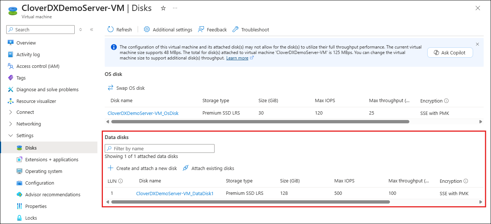
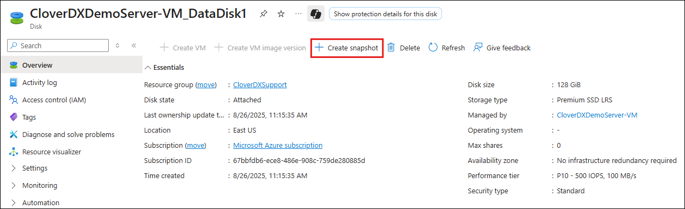
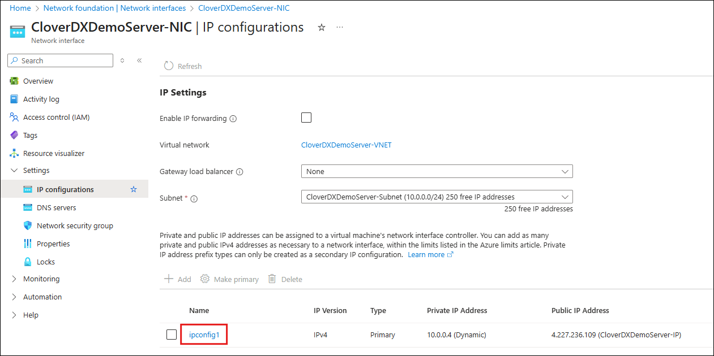
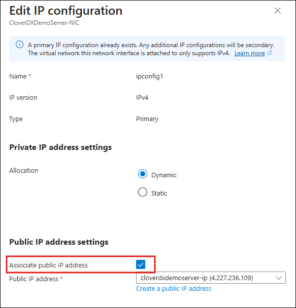

<!-- Administration > Upgrade > Server upgrade in cloud > Server upgrade in Azure -->

### Server upgrade in Azure

To upgrade **CloverDX Server** to a new version in Azure Marketplace, use the **CloverDX Server <version> BYOL - Upgrade** software plan. The upgrade template creates a new virtual machine with a new version of **CloverDX** and possibly an updated cloud architecture. Configuration and data are reused from the previous version by using a snapshot of the data disk and a copy of the system database. The previous version has only minimal downtime and can run in parallel with the new version.

First, see an overview of the upgrade process in [Common cloud upgrade](common-marketplace-upgrade.md). This section assumes familiarity with deploying a new CloverDX Server as described in [Quickstart](azure-marketplace.md#quickstart).
> [!NOTE]
> This upgrade process is supported when upgrading from **CloverDX** version 5.16.0 or newer. For instructions how to upgrade from an older version, see [https://cloverdx.atlassian.net/browse/CLO-24107](https://cloverdx.atlassian.net/browse/CLO-24107)

**High-level overview:**

1. Create a snapshot of the data disk of your current CloverDX version.
2. Create a new deployment in the Azure Portal using the **CloverDX Server <version> BYOL - Upgrade** software plan, configure it to use the above snapshot, and deploy it.
3. Test the new version.

#### Upgrade steps

The steps below focus on the actions specific to the upgrade process and assume knowledge of the deployment of a new CloverDX Server (see [Quickstart](azure-marketplace.md#quickstart)).

1. Pause processing of jobs in the previous version - disable listeners and schedules. This starts the downtime of the current version.
2. Create a snapshot of the data disk of the previous version. Navigate to the virtual machine resources of your current version in the Azure Portal. Select **Disks** in the left menu.
   
   *Figure 54. Selecting the data disk of the virtual machine*
   Click on the data disk to open its details, then use the **Create snapshot** button. When creating the disk snapshot, selecting `Standard HDD` as the storage type is sufficient.
   
   *Figure 55. Creating a snapshot of the data disk*
3. Resume processing of jobs in the previous version - this ends the downtime.
4. Now, you can start deploying the new version. Open the **CloverDX offer** in the Azure marketplace and select the **CloverDX Server <version> BYOL - Upgrade** software plan.
5. On the **Network Settings** page, you may reuse the virtual network of the previous version. This has the advantage of having network access already configured, e.g., any IPs that are allowed to have access to the previous server will also have access to the new version. See [Deployment Into existing infrastructure in Azure](azure-marketplace.md#deployment-into-existing-infrastructure).
   > [!NOTE]
   > Before deploying to an existing network, allow inbound network access from the Internet for the duration of the deployment - this is necessary to generate SSL certificate, see [Let’s Encrypt certificate](azure-marketplace.md#azure-marketplace-lets-encrypt). If you’re not using the default Let’s Encrypt certificate, you do not need to modify the network rules.
6. On the **CloverDX Settings** page, select the resources with persistent data that will carry over data and configuration from your previous version.
   | Parameter | Description |
   | --- | --- |
   | **CloverDX Settings** page |  |
   | **Data disk snapshot name** | The name of the data disk snapshot you created in Step 2. The snapshot must be in the same *Resource Group* as you are deploying the new server into. |
   | **Origin database name** | The name of the database server of the previous version. This must be the name of your top level database resource. You can navigate to the *Resource Group* of the database and copy the name from there. |
   | **Database copy timestamp** | The timestamp from which the database for the new version will be copied from. Select a time during the downtime of the previous version - the same time as data disk snapshot was created is the best. Note that this timestamp must be filled in UTC (without timezone). |
   > [!NOTE]
   > You are not configuring the credentials of the **CloverDX Server admin user and database credentials** - they are the same as in the previous version.

**Success**. A new version of **CloverDX Server** is now available in Azure. You can find its URL in the *Outputs* tab of the *Deployment*. Login credentials for the new version are the same as for the previous version. The new version is deployed in a new version of the cloud architecture, while re-using the data disk and system database of the previous version based on their snapshots. The previous version is left untouched and can be continued to be used.

Follow-up steps:

- Activate the new server - you will need to provide a license version compatible with the new CloverDX Server version. Download the latest version from our [Customer Portal](https://support.cloverdx.com/login).
- Test the new version - perform thorough testing of the new version. If you disabled the listeners and schedules on the previous version, then the new version starts up and does not process new data. You need to carefully enable processing that can be enabled, e.g., if it doesn’t consume production data.
- After finishing testing of the new version, it is possible to switch the public IP address of the previous version to be used by the new version instance. This allows you to continue using the same hostname with the new version, e.g., for Server projects in **CloverDX Designer**.
  1. If you want to perform the IP switch, first disassociate the IP address from the previous version. Navigate to the *Network Interface* of the previous version, select **IP Configurations** in the left menu and then select **ipconfig1**.
     
     *Figure 56. Selecting IP configuration*
     In the configuration details, uncheck the **Associate public IP address** check box and then **Save**. This will make the previous version inaccessible from outside. If you still want the previous version to be accessible, you can associate a different public IP instead.
     
     *Figure 57. Disassociating the previous IP address*
  2. Now that the old IP is free, you can associate it with the new version. Navigate to the *Network Interface* of the new version, open its *IP configuration*, and replace its associated Public IP by the IP of the old version that you previously disassociated.
  3. For SSL connectivity to the new version to work correctly, we need to use the correct certificate - it must correspond to the new public hostname. If you’re using the default Let’s Encrypt certificate, you need to renew it - follow the renewal steps in [Let’s Encrypt certificate](azure-marketplace.md#azure-marketplace-lets-encrypt).
