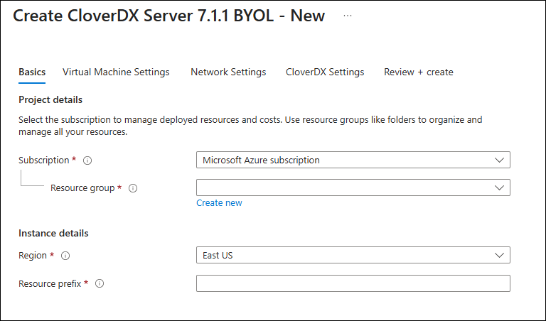
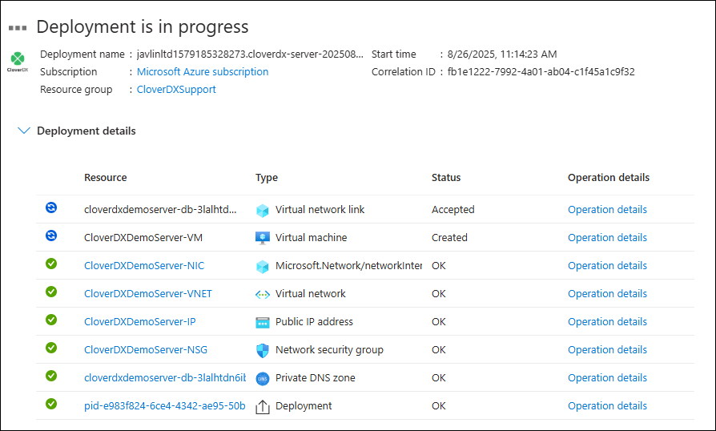
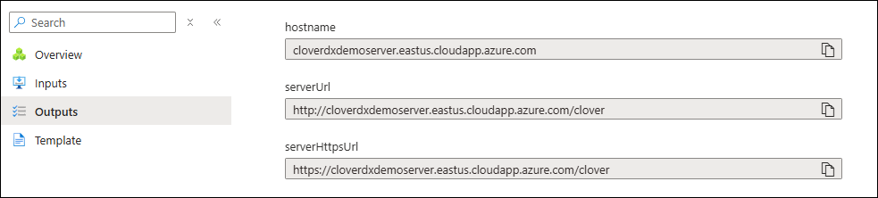
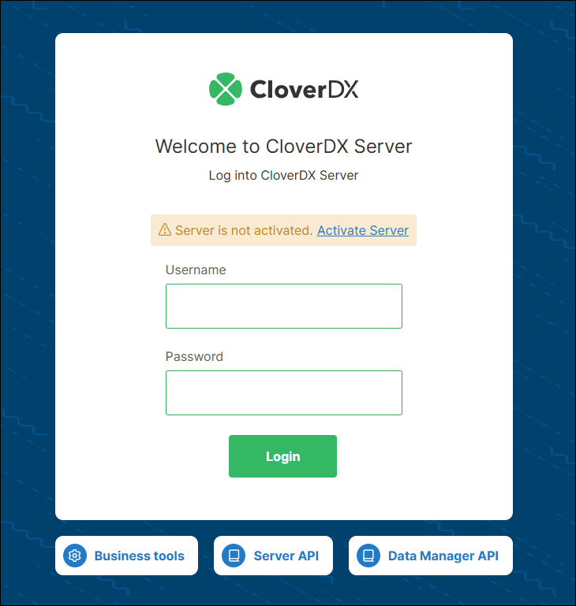
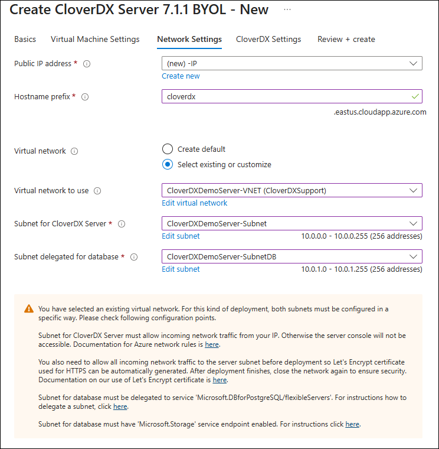
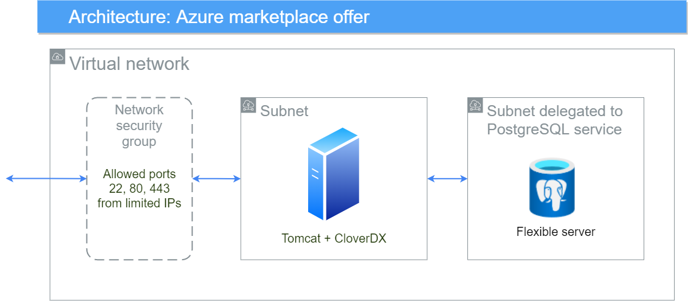
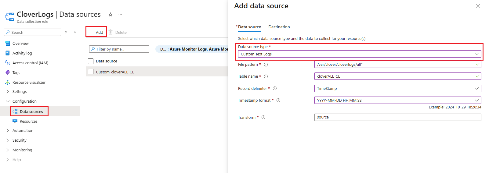
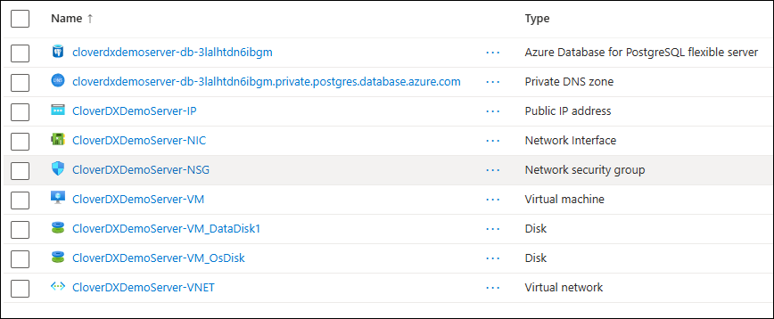

<!-- Administration > Installation > Server installation > Cloud deployments > Azure Marketplace -->

#### Azure Marketplace

| [Overview](azure-marketplace.md#overview) |
| --- |
| [Quickstart](azure-marketplace.md#quickstart) |
| [Deployment into existing infrastructure](azure-marketplace.md#deployment-into-existing-infrastructure) |
| [Architecture](azure-marketplace.md#architecture) |
| [Configuration](azure-marketplace.md#configuration) |

##### Overview

The **CloverDX Server offering on Azure Marketplace** provides an easy way to create a **CloverDX Server instance** in the Azure cloud infrastructure. The offering spins up a recommended cloud architecture that contains a standalone CloverDX Server with good defaults and a recommended environment. The server uses **Azure Database for PostgreSQL** as its system database, which is automatically created and configured. The server instance uses Azure resources of the user, who is charged for them by Azure.

The **CloverDX Server** Azure offering contains an ARM (Azure Resource Manager) template that deploys a virtual machine and other necessary resources. The ARM template is configured by a user interface with simple configuration options. All the resources are deployed to a single *Resource Group* chosen by the user.

The following software plans are provided:

| Template | Description |
| --- | --- |
| **CloverDX Server <version> BYOL - New** | Deploys a new instance of **CloverDX Server**, see [Quickstart](azure-marketplace.md#quickstart). |
| **CloverDX Server <version> BYOL - Upgrade** | Upgrades a **CloverDX** instance to a new version of CloverDX Server, see [Upgrade in Azure](azure-marketplace-upgrade.md). |

##### Quickstart

Prerequisites:

- Basic familiarity with [Azure Cloud VM infrastructure](https://docs.microsoft.com/en-us/azure/virtual-machines/linux/overview).
- Basic familiarity with [Azure Database for PostgreSQL](https://docs.microsoft.com/en-us/azure/postgresql/flexible-server/overview).
- Basic familiarity with [Azure Portal](https://docs.microsoft.com/en-us/azure/azure-portal/azure-portal-overview).
- Subscription on the Azure Portal with a Resource Group where you can create resources.

High-level overview of steps:

1. Deploy CloverDX Server on Azure Marketplace.
2. Activate and configure the server instance.

###### Steps

1. Navigate to the **CloverDX Server BYOL offering** on the Azure Marketplace and use the **GET IT NOW** button on the offering’s marketplace page. Accept the Terms and Conditions and proceed with the **Continue** button.
2. You were redirected to the **CloverDX Server BYOL offering** inside the Azure Portal. To proceed, click the **Create** button. This will launch the wizard where you can configure the server deployment.
   
   *Figure 24. Azure Marketplace Configuration Wizard*

| Parameter | Description |
| --- | --- |
| **Basics** page |  |
| **Subscription** | The top-level Azure subscription used for billing. |
| **Resource group** | We recommend deploying to an empty resource group which won’t be shared with other deployments. Managing resources is easier when multiple deployments do not share resource groups. |
| **Region** | The location where all resources are going to be deployed. Our offering is designed to work in all regions. |
| **Resource prefix** | Names of all resources created by our offering will start with this prefix. This makes identifying resources easier. |
| **Virtual Machine Settings** page |  |
| **Virtual machine size** | The VM instance size. Default size is pre-selected, and you can pick from 5 different sizes that we support. If you want to change the size and can’t see any other sizes in the selector, make sure to disable filters. Larger instances have better performance but higher cost. |
| **Admin user name** | The OS admin account name of the virtual machine. |
| **Authentication type** | You can choose between **Password** and **SSH Public Key authentication** for the admin user. |
| **Password / Confirm password** | If you selected the **Password** option above, enter and confirm the password for the VM admin user. |
| **SSH public key source** | If you selected the **SSH Public Key authentication** option, select the source of your public key (*Generate new key pair, Use existing key stored in Azure,* or *Use existing public key*) |
| **SSH Key Type** | If you selected the **SSH Public Key authentication** option, select the desired key type. |
| **Key pair name** | If you selected the **SSH Public Key authentication** option, enter the name for the key pair. |
| **Network Settings** page |  |
| **Public IP address** | Pre-defined public IP resource. You don’t need to change this, the defaults work well for all deployments. |
| **Hostname prefix** | The server will be available on an Azure hostname, and this is the prefix for that hostname. The hostname must be globally unique, which is immediately validated. If there’s a green validation check, the hostname is not taken. |
| **Virtual network** | Whether to create new or reuse an existing virtual network. When selecting an existing network, you can only select networks that are in the location you are deploying to. See [Deployment into existing infrastructure](azure-marketplace.md#deployment-into-existing-infrastructure) for more information. |
| **Allow connections from** | This option is available only when creating a new virtual network. The ARM template creates a *Network Security Group* automatically which allows only connections from specific IP ranges to specific ports on the instance.  We recommend that you provide a range of IP addresses from which the instance should be available - typically your offices or data centers. For evaluation purposes you can use your public IP, obtained e.g., from [myip.com](https://myip.com).  **We do not recommend making the instance visible to the whole internet**. |
| **CloverDX Settings** page |  |
| **CloverDX admin user name** | The user name of the **CloverDX Server administration user** (or keep the default `clover`). This user is the first user available in the Server Console, for administration of the server itself. This is NOT the operating system user - you have already configured that on the *Virtual Machine Settings* page. |
| **CloverDX admin user password** | Specify the password for the above admin user. |
| **Confirm password** | Re-type the above password to confirm it. |
| **Database admin user name** | Specify the admin user name of **Azure Database for PostgreSQL** that will be created as the server’s system database. This user name and below password will be used by **CloverDX Server** to connect to the database. |
| **Database admin user password** | Specify the password for the above database admin user. |
| **Confirm password** | Re-type the above password to confirm it. |
| **Review + create** page |  |
| On this page, all the configuration is validated and summarized. If there are no problems, you can proceed by clicking on the `Create` button.If any problems are found, you will see a red error with a description. The error description might not be descriptive enough to see what the problem really is. In that case, open up the Web Console of your browser (`F12` key) and see if the error messages logged there contain more information. |  |

1. The deployment will start. You will be redirected to the page in the Azure Portal where you can see the deployment progress. This process will take several minutes.


*Figure 25. Azure Portal - Deployment in progress*

**Success**. **CloverDX Server** is now available in Azure. You can find its URL in the *Outputs* tab of the *Deployment* - the `serverHttpsUrl` entry.


*Figure 26. Azure Portal - Deployment outputs*

On the Server’s URL, you will see the login page where you can:

- Activate the Server - the Server is licensed in BYOL (Bring Your Own License) mode. Load a compatible Server license - if you have an existing Server license, you can download it from our [Customer Portal](https://support.cloverdx.com/license-keys). If you do not have a license, reach out to your [Account Manager](https://support.cloverdx.com/contact).
- To log in, use the credentials set in the configuration wizard.
  
  *Figure 27. CloverDX Server login page*

The Server is running with default settings and is immediately usable. It can be configured further to get it into full production quality.

##### Deployment into existing infrastructure

If you are already operating services and instances in Azure and want to deploy **CloverDX Server** alongside them, e.g., to integrate several data sources or services, then you can use the option to reuse some of your network resources. Instead of creating a new *Virtual Network* and *Network Security Group*, you can choose an existing virtual network and connect the newly deployed **CloverDX Server** to it. The templates do not support reusing other resources than the virtual network.

Deployment steps and settings in this case are the same as described in [Quickstart](azure-marketplace.md#quickstart), with one difference:

- On the **Network Settings** page, select option **Select existing or customize** for **Virtual network**. Using the additional controls, choose an existing virtual network you want to use. You will only be able to choose virtual networks in the same location as you chose at the start of the wizard. Subnets from the selected virtual network must be selected as well. The subnets require specific configuration to be usable; follow the instructions presented by the wizard.
  
  *Figure 28. Azure - selecting an existing virtual network*

##### Architecture

The **CloverDX Server** Azure offering consists of a virtual machine image and an ARM template that orchestrates the required cloud resources:


*Figure 29. Architecture - CloverDX Server in the Azure marketplace*

**Details of the Azure topology:**

- The *Virtual Machine* (VM) runs in the Azure cloud, in the *Region* selected by the user.
- A new *Virtual Network* (VNET) is created to isolate the CloverDX instance from other resources present outside (on Azure Cloud or on the Internet).
- The Virtual Network uses a *Network Security Group* (NSG) to limit access only to specific ports (22, 80, 443) and only from IP addresses from a defined IP range.
- The Virtual Network contains a *subnet* for the VM and a second *subnet* delegated to Azure’s PostgreSQL service.
- A new *Azure Database for PostgreSQL* is created in the delegated subnet to be used as the server’s system database.
- *Private DNS zone* is linked to both the VNET and the Database, so the DB is accessible by all services inside the VNET.
- The Virtual Machine is assigned a *Network Interface Controller* (NIC) to allow network communication.
- The Virtual Machine is assigned a *Public IP Address* with a configured DNS label. The IP address is static and the DNS label is always the same, so the server is always available on the same hostname.
- The **CloverDX Server** is running on the Virtual Machine and connects to the PostgreSQL database.

###### Virtual machine details

For additional information, see [Common cloud architecture](server-in-cloud-marketplaces.md#architecture).

| Virtual machine details |  |
| --- | --- |
| **Operating system** | Ubuntu 24.04 LTS |
| **Java** | Eclipse Temurin JDK 21 (formerly AdoptOpenJDK) |
| **Application server** | Tomcat 10.1 |
| **Disks** | **OS disk (30GB)** and **data disk (128GB)**. Both are *Premium SSD* type. It is possible to increase the size of the disks (which also affects the provisioned IOPS), just follow the steps in [Microsoft’s documentation](https://docs.microsoft.com/en-us/azure/virtual-machines/linux/expand-disks). |

###### Azure Database for PostgreSQL details

| Virtual machine details |  |
| --- | --- |
| **Database type** | PostgreSQL 15 |
| **Pricing tier** | General purpose, 2 vCores, 8GB RAM |
| **Storage** | 64GB allocated storage |
| **Backup** | Automatic daily backups enabled. Backups retained for 7 days. |
| **Accessibility** | Available only from the server’s VM instance, not visible from the Internet. |
| **CloverDX Server-database communication** | Server uses SSL to communicate with the database. |

##### Configuration

For details about **CloverDX Server** configuration, see [Common cloud configuration](server-in-cloud-marketplaces.md#configuration).

###### Memory

Heap sizes for Server Core and Worker are set automatically based on the instance memory size, see [Common cloud memory configuration](server-in-cloud-marketplaces.md#memory). It is possible to change the size of the VM, and the memory sizes will be recalculated - for this, stop the VM instance in the Azure Portal, change its size, and start it again.

###### Server logs

By default, server logs are collected in `/var/clover/cloverlogs` directory, and Tomcat logs in `/var/clover/tomcatlogs`. It is possible to enable integration with the [Azure Monitor](https://docs.microsoft.com/en-us/azure/azure-monitor/overview) service, in which case the logs can also be sent to a *Log Analytics workspace*, where they can be saved and queried. This lets you view the logs directly in the Azure Portal, where they are kept for 30 days by default.
How to send logs to Azure Monitor
The integration with the Azure Monitor service is not enabled by default. To start sending server logs to the Log Analytics workspace, follow these steps:

1. Azure Monitor doesn’t support circular log rolling. `All.log`, `performance.log`, and `worker.log` files are by default configured to roll over to a new file every day or when the 20 MB limit has been reached, so these log types can be monitored without further configuration changes. See [Default logging logic](../operations/logging.md#default-logging-logic) for more information.
   If you want to monitor also other log types, you will need to reconfigure them to roll daily. See [Logging customization](../operations/logging.md#logging-customization) for more information.
2. Create a [Data collection endpoint](https://learn.microsoft.com/en-us/azure/azure-monitor/essentials/data-collection-endpoint-overview?tabs=portal#create-a-data-collection-endpoint) in the Azure Portal.
3. Create a [Log Analytics workspace](https://docs.microsoft.com/en-us/azure/azure-monitor/learn/quick-create-workspace) in the Azure Portal.
4. Next, you will need to create a log table that will hold logs collected from the VM. Go to the Log Analytics workspace created in the previous step and follow the [Azure Documentation](https://learn.microsoft.com/en-us/azure/azure-monitor/logs/create-custom-table#create-a-custom-table) to create a new DCR-based custom log. Make sure to:
   1. Create a new Data Collection Rule (DCR) as described in the article.
   2. When prompted for a Data collection endpoint, select the one created in step 2.
   3. When you’re asked to upload a sample of the log file, upload a file containing the following mock data:
      ```json
      {
        "TimeGenerated": "2025-01-01T11:00:00.000Z",
        "RawData": "data"
      }
      ```
5. Go to the Data Collection rule (DCR) you created in the previous step and create a new Data Source. Choose `Custom Text Logs` from the *Data source type* dropdown.:
   
   *Figure 30. Adding a data source to the Data collection rule*
   The most important server log file is the `all` log. To collect the main log, we recommend the following setup:
   - File pattern: `/var/clover/cloverlogs/all*`
   - Table name: the name of the log table created in step 4, including the mandatory suffix `_CL`
   - Record delimiter: TimeStamp
   - TimeStamp format: `YYYY-MM-DD HH:MM:SS`
   - Transform: `source`
   Another useful log to collect is the performance log. For the performance log, we recommend the following setup:
   - File pattern: `/var/clover/cloverlogs/performance*`
   - Table name: the name of the log table created in step 4, including the mandatory suffix `_CL`
   - Record delimiter: End-of-Line
   - Transform: `source | extend TimeGenerated = now()`
   On the *Destination* tab, add the Log Analytics workspace created in step 3.
6. After you save the above configuration, go to *Resources* (located right under the *Data Sources* in the menu) and add the VM running **CloverDX Server**. This will automatically install an [extension](https://learn.microsoft.com/en-us/azure/azure-monitor/agents/azure-monitor-agent-manage) on the VM, which might take several minutes. Wait until the process finishes.
7. If you want to monitor multiple log files, repeat steps 4 to 6 for every one of them.
8. It might take several hours before the collected log content will be available to view in the Azure Portal. After that, you can view and query the collected logs in the Log Analytics workspace. To start exploring the logs, follow the [Log Analytics tutorial](https://docs.microsoft.com/en-us/azure/azure-monitor/log-query/get-started-portal).

###### Users

Users available in the virtual machine:

| Parameter | Description |
| --- | --- |
| `<admin user>` | The user configured in the wizard before deployment. Use `sudo` to run commands that require root privileges. Log in via SSH using either password or public key defined in the configuration wizard. |
| `root` | Not recommended to be used, cannot log in to it directly. |
| `clover` | User that runs the **CloverDX Server** (i.e., it runs Tomcat). All files that CloverDX uses are owned by the `clover` user. It is not possible to log in as `clover`. |

##### Security

This section describes security-related aspects of the CloverDX Marketplace offering.

###### Network Security Group

The ARM template creates a network security group that serves as a virtual firewall. The security group allows connections to the following ports:

| Port | Description |
| --- | --- |
| `22` | SSH |
| `80` | HTTP for Server Console and Server API |
| `443` | HTTPS for Server Console and Server API |

The connections are allowed only from the IP range specified in the wizard when configuring the deployment.

The security group settings can be modified - you can find the security group in the *Resource Group* where the server was deployed.

###### HTTPS

The **CloverDX Server** has both HTTP and HTTPS enabled by default. You can find the server’s HTTPS URL in the *Outputs* section of the *Deployment* under the `serverHttpsUrl` key. The HTTPS connector is running on port `443`.
Let’s Encrypt Certificate
The default HTTPS connector is using a certificate issued by [Let’s Encrypt](https://letsencrypt.org). It is useful for encryption of communication between the client (e.g., Designer) and the Server, and for server identity verification. The certificate is free, but it’s valid only for 90 days because Let’s Encrypt does not support longer validity.

When the certificate expiry time is less than 30 days, the server deployed in Azure will automatically attempt a renewal every time it is started. The renewal process requires external access from Let’s Encrypt servers, which is blocked by default by the *Network Security Group*. To renew the certificate, you must first allow external network access, then restart the virtual machine, and then block external network access again.

**The full process to renew the certificate is:**

1. Locate and open the **Network Security Group** of the server. It’s in the same **Resource Group** where the server is deployed, next to all the other resources.
   
   *Figure 31. Azure resources - network security group*
2. Add a new *Inbound security rule* to allow access from Let’s Encrypt servers. Set the following properties:
   - *Source* - `Any`
   - *Source port ranges* - `*`
   - *Destination* - `Any`
   - *Destination port ranges* - `80`
   - *Protocol* - `Any`
   - *Action* - `Allow`
3. Find the *Virtual Machine* resource and restart it. During its startup, the server automatically attempts a certificate renewal if the expiry time is 30 days or less.
4. Access the Server Console on HTTPS in your browser and verify that the certificate has been renewed. You can check it by inspecting the lock icon next to the address box of the browser and checking the certificate validity. Your certificate should be valid for the next 90 days.
5. Remove the *Inbound security rule* you added in step 2. It is no longer necessary.
Using your own certificate
In case you do not want to use the default Let’s Encrypt certificate for any reason, you can use your own production-quality certificate for the HTTPS connector and for JMX monitoring:

1. Create `/var/clover/conf/customCertificate.jks` keystore with your own server certificate. Do not use or modify the already existing file `serverCertificate.jks` - it is used and overwritten by automation scripts.
2. Modify the `/opt/clover/tomcat/conf/server.xml` Tomcat configuration file to use your `customCertificate.jks` file instead of `serverCertificate.jks`.
3. Modify files `jmx-conf-core.properties` and `jmx-conf-worker.properties` in the directory `/var/clover/conf/` to use your `customCertificate.jks` file instead of `serverCertificate.jks`.

To disable usage of plain HTTP connectivity, modify the network security group to block all connections to port `80`.
