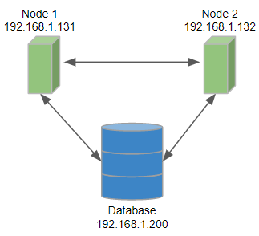
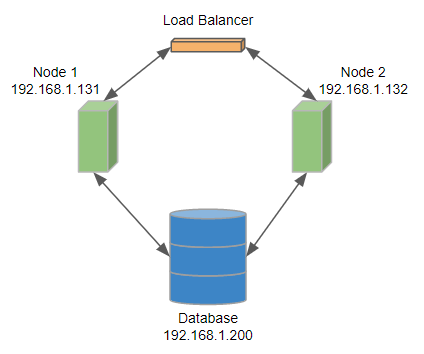
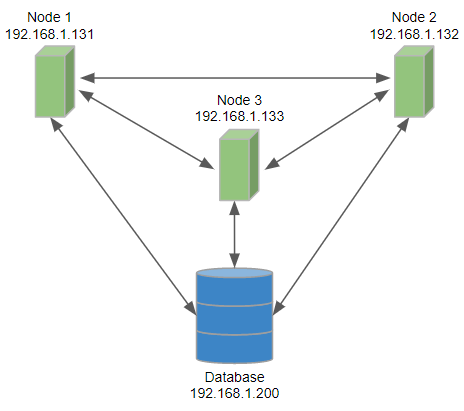
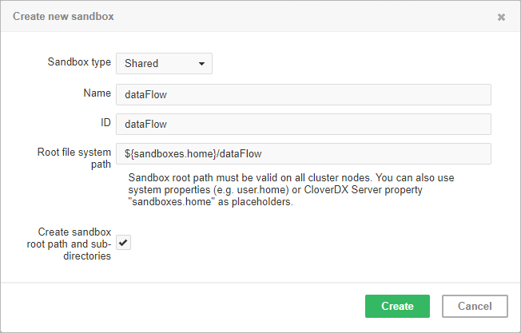
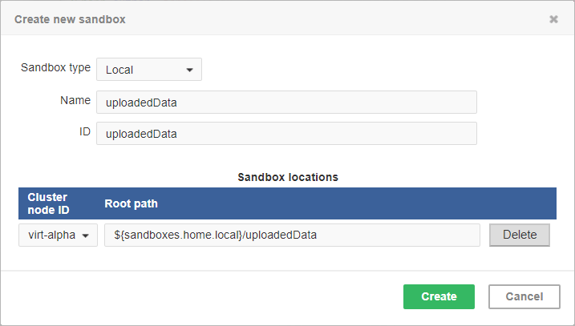
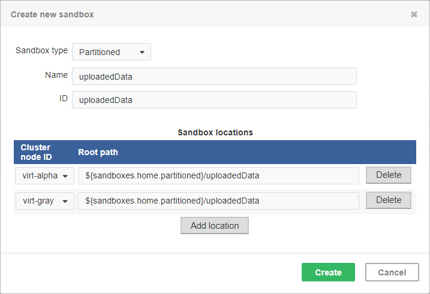
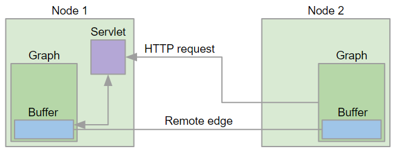

<!-- Administration > Installation > Server cluster setup and configuration -->

## 3. Server cluster setup and configuration

### Cluster introduction

**CloverDX Server cluster** enables effortless scaling of data partitioning without graph modifications. The cluster offers two key advantages: high availability and scalability, both managed by CloverDX Server at multiple levels.

This section provides a fundamental overview of CloverDX clustering.
> [!NOTE]
> Clustering can be enabled only when your license includes the clustering option.

#### High availability

**CloverDX Server** does not recognize any differences between cluster nodes. Thus, there are no "master" or "slave" nodes meaning all nodes can be virtually equal. There is no single point of failure (SPOF) in the **CloverDX cluster** itself; however, SPOFs may be in input data or some other external element.

Clustering offers high availability (HA) for all features accessible through HTTP, for event listeners and scheduling. Regarding the HTTP accessible features: it includes sandbox browsing, modification of services configuration (scheduling, listeners) and primarily job executions. Any cluster node may accept incoming HTTP requests and process them itself or delegate it to another node.

##### Requests processed by any cluster node

- **Job files, metadata files, etc. in shared sandboxes**
  All job files, metadata files, etc. located in [shared sandboxes](cluster-setup-index.md#shared-sandbox) are accessible to all nodes. A shared filesystem may be a SPOF, so it is recommended to use a replicated filesystem instead.
- **Database requests**
  In cluster, a database is shared by all cluster nodes. Again, a shared database might be a SPOF, however it may be clustered as well.

However, there is a possibility that a node itself cannot process a request (see below). In such cases, it completely and transparently delegates the request to a node which can process the request.

##### Load balancer

**CloverDX** itself implements a load balancer for executing jobs. So a job which isn’t configured for some specific node(s) may be executed anywhere in the cluster and the **CloverDX** load balancer decides, according to the request and current load, which node will process the job. All this is done transparently for the client side.

To achieve HA, it is recommended to use an independent HTTP load balancer. Independent HTTP load balancers allow transparent fail-overs for HTTP requests. They send requests to the nodes which are running.

#### Scalability

There are two independent levels of scalability implemented. Scalability of transformation requests (and any HTTP requests) and data scalability (parallel data processing).

Both of these scalability levels are horizontal. Horizontal scalability means adding nodes to a cluster, whereas vertical scalability means adding resources to a single node. Vertical scalability is supported natively by the **CloverDX** engine and it is not described here.

##### Transformation requests

Basically, the more nodes we have in a cluster, the more transformation requests (or HTTP requests in general) we can process at one time. This type of scalability is the **CloverDX Server**'s ability to support a growing number of clients. This feature is closely related to the use of an HTTP load balancer which is mentioned in the previous section.

##### Requests limited to specific node(s)

- **A request for the content of a partitioned or local sandbox**
  These sandboxes aren’t shared among all cluster nodes. Note that this request may come to any cluster node which then delegates it transparently to a target node; however, this target node must be up and running.
- **A job configured to use a partitioned or local sandbox**
  These jobs need nodes which have a physical access to the required [partitioned](cluster-setup-index.md#partitioned-sandbox) or [local](cluster-setup-index.md#local-sandbox) sandbox.
- **A job with allocation specified by specific cluster nodes**
  Concept of allocation is described in the following sections.

In the cases above, inaccessible cluster nodes may cause a failure of the request; So it is recommended to avoid using specific cluster nodes or resources accessible only by specific cluster node.

### Cluster configuration

Cluster can work properly only if each node is properly configured. Clustering must be enabled, nodeID must be unique on each node, all nodes must have access to a shared database and shared sandboxes, and all properties for inter-node cooperation must be set according to network environment.

Properties and possible configuration are the following:

- [Mandatory cluster properties](cluster-setup-index.md#mandatory-cluster-properties)
- [Optional cluster properties](cluster-setup-index.md#optional-cluster-properties)
- [Firewall exceptions](cluster-setup-index.md#firewall-exceptions)
- [Example of 2-node cluster configuration](cluster-setup-index.md#example-of-2-node-cluster-configuration)
- [Jobs load balancing properties](cluster-setup-index.md#jobs-load-balancing-properties)

#### Mandatory cluster properties

Besides mandatory cluster properties, you need to set other necessary properties which are not specifically related to the cluster environment. Database connection must be also configured.

##### Mandatory properties

These properties must be properly set on each node of the cluster.

| Name | Type | Description | Default |
| --- | --- | --- | --- |
| cluster.enabled | boolean | Switch whether the Server should start in the standalone or cluster node mode. By default, the property isn’t set (empty value), which means that the mode is chosen according to your license. It is strongly recommended to set the property to `true` if the other cluster properties are configured, as well. Thus the cluster node will be initialized regardless of the license. |  |
| cluster.node.id | String | Each cluster node must have a unique ID. | node01 |
| cluster.jgroups.bind_address | String, IP address | An IP address of the Ethernet interface which is used for communication with another cluster nodes. Necessary for inter-node messaging. | 127.0.0.1 |
| cluster.jgroups.start_port | int, port | Port where a jGroups server listens for inter-node messages. | 7800 |
| cluster.http.url | String, URL | The URL of the CloverDX cluster node. It must be an HTTP/HTTPS URL to the root of a web application. Typically it would be `http://[hostname]:[port]/clover`. Primarily, it is used for synchronous inter-node communication from other cluster nodes. It is recommended to use a fully qualified hostname or IP address, so it is accessible from a client browser or **CloverDX Designer**. | http://localhost:8080/clover |
| cluster.grpc.port | int, port | Port where a gRPC server listens for synchronous inter-node communication. | 10600 |
| sandboxes.home | String, URL | For more information, see [sandboxes.home](list-of-properties.md#lop-sandboxes-home). |  |

#### Optional cluster properties

| [Optional general properties](cluster-setup-index.md#optional-general-properties) |
| --- |
| [Optional remote edge properties](cluster-setup-index.md#optional-remote-edge-properties) |

##### Optional general properties

These properties are not vital for cluster configuration - default values are sufficient.

| Name | Type | Description | Default |
| --- | --- | --- | --- |
| cluster.group.name | String | Each cluster has its unique group name. If you need 2 clusters in the same network environment, each of them would have its own group name. | cloverCluster |
| cluster.grpc.url | String, URL | The URL of a gRPC server running in the CloverDX cluster node, used for synchronous inter-node communication from other cluster nodes. By default, the property isn’t set (empty value), and the value is derived from properties `cluster.http.url` and `cluster.grpc.port`. Setting the url here overrides the computed value. Typically it would be `grpc://[hostname]:[port]` or `grpcs://[hostname]:[port]`. It is recommended to use a fully qualified hostname or IP address. | grpc://localhost:10600 |
| cluster.grpc.keyStore | String | Absolute path to the KeyStore file. If the `clover.http.url` scheme is HTTPS, or the `clover.grpc.url` scheme is GRPCS, the KeyStore is mandatory and configures gRPC Transport Layer Security. This should be the same keystore used for the [node HTTPS identity](../admin/https-server-config.md#server-configuration). |  |
| cluster.grpc.keyStorePassword | String | The KeyStore password. |  |
| cluster.jgroups.external_address | String, IP address | The IP address of the cluster node. Configure this only if the cluster nodes are on different sub-nets, so the IP address of the network interface isn’t directly accessible from the other cluster nodes. |  |
| cluster.jgroups.external_port | int, port | The port for asynchronous messaging. Configure this only if the cluster nodes are on different sub-nets and the port opened on the IP address is different than the port opened on the node’s network interface IP address. |  |
| cluster.jgroups.protocol.AUTH.value | String | The authentication string/password used for verification cluster nodes accessing the group. It is a protection against fake messages. If this property is not specified, the cluster should be protected by firewall settings. Must be the same on all cluster nodes. |  |
| cluster.jgroups.protocol.NAKACK.gc_lag | int | The number of delivered messages kept in the **sent messages buffer** of each jGroups view member. Messages are kept in a sender cache even though they were reported as delivered by existing view members, because there may be some other member temporarily not in the view. The higher the number, the higher the chance of reliable messages delivery in an unreliable network environment. However the messages consume memory: approximately 4kB for each message. | 10000 |
| cluster.jgroups.protocol.NAKACK.xmit_table_obsolete_member_timeout | long | How long (in milliseconds) we keep an obsolete member in the xmit-table. It is necessary for recognition of a member temporarily unaccessible and removed from the view. With previous NAKACK implementation, the member removed from the view was also automatically removed from xmit-table, so it appeared as a new member when it re-joined the view. With current modified implementation, the member is kept in the xmit-table for a configured interval longer, so when it re-joins the view, it is a known member and undelivered messages may be re-delivered to it. A member in the xmit-table isn’t consuming memory. | 3600000 |
| cluster.jgroups.tcpping.initial_hosts | String, in format: `IPaddress1[port1],IPaddress2[port2],…` | JGroups automatically handles initial host discovery, making this configuration optional. Users can still set it to enforce a specific configuration, but it’s not required for basic functionality. If you want to set the property, specify a list of IP addresses (with ports) where you expect running and listening nodes (other nodes "bind_address" and "start_port" properties). |  |
| cluster.max_allowed_time_shift_between_nodes | int | A maximum allowed time shift between nodes. All nodes must have system time synchronized, otherwise the cluster may not work properly. So if this threshold is exceeded, the node will be set as invalid. | 2000 |
| cluster.node.check.checkMinInterval | int | Periodicity of cluster node checks, in milliseconds, i.e. the time period after which the Server checks whether the cluster node is running. | 20000 |
| cluster.node.remove.interval | int | A time interval in milliseconds. If no node info comes in this interval, the node is considered as lost and it is removed from the cluster. | 50000 |
| cluster.node.sendinfo.history.interval | int | A time interval in milliseconds, for which each node stores a heart-beat in the memory. It is used for rendering figures in the web GUI-monitoring section. | 240000 |
| cluster.node.sendinfo.interval | int | A time interval in milliseconds. Each node sends a heart-beat with information about itself to another nodes. This interval specifies how often the information is sent under common circumstances. | 2000 |
| cluster.node.sendinfo.min_interval | int | A specified minimum interval (in milliseconds) between two heart-beats. A heart-beat may be send more often than specified by `cluster.node.sendinfo.interval`, e.g. when jobs start or finish. However the interval will never be shorter then this minimum. | 500 |
| cluster.shared_sandboxes_path | String | **This property is deprecated.** This property still works but is used only when a shared sandbox doesn’t have its own path specified. It is just for backward compatibility and it is not recommended for new deployments. Since 3.5, we recommend to specify the sandbox path explicitly and use the `sandboxes.home` property/placeholder. |  |
| cluster.sync.connection.connectTimeout | int | Specifies the connection timeout (in milliseconds) when performing remote procedure call (RPC) between cluster nodes. | 10000 |
| cluster.sync.connection.nodeInfo.connectTimeout | int | Checks the node connection availability. If the node doesn’t respond in the set number of milliseconds, it is suspended. Under heavy load, a node may fail to respond in time; in such a case, increasing the value may prevent the node from suspension. | 10000 |
| cluster.sync.connection.nodeInfo.readTimeout | int | Checks the node read availability. If the node doesn’t respond in the set number of milliseconds, it is suspended. Under heavy load, a node may fail to respond in time; in such a case, increasing the value may prevent the node from suspension. | 5000 |
| cluster.sync.connection.readTimeout | int | Specifies the read timeout (in milliseconds) when performing RPC between cluster nodes. Increasing the read timeout can help to suppress `SocketReadTimeout` errors in communication with a cluster node under heavy load. | 90000 |
| sandboxes.home.local | String | Intended as a placeholder in the location path. So the sandbox path is specified with the placeholder and it is resolved to the real path just before it is used. For backward compatibility, the default value uses the [clover.home](list-of-properties.md#lop-clover-home) configuration property. | ${clover.home}/sandboxes-local |
| sandboxes.home.partitioned | String | Intended as a placeholder in the location path. So the sandbox path is specified with the placeholder and it is resolved to the real path just before it is used. For backward compatibility, the default value uses the [clover.home](list-of-properties.md#lop-clover-home) configuration property. | ${clover.home}/sandboxes-partitioned |

##### Optional remote edge properties

Below is a list of names and default values of properties used to configure remote edges in a clustered environment.

| Name | Description | Default |
| --- | --- | --- |
| cluster.edge.chunkSize | Specifies the size of a chunk created by the right side of a remote edge (in bytes). | 524288 |
| cluster.edge.chunkWaitTimeout | Specifies how long should the servlet wait for a next chunk to become available (in milliseconds). | 60000 |
| cluster.edge.connectTimeout | Specifies a socket connection timeout when fetching a chunk (in milliseconds). | 30000 |
| cluster.edge.readTimeout | Specifies a socket read timeout when fetching a chunk (in milliseconds). | 90000 |
| cluster.edge.handshakeTimeout | Specifies how long should the client wait until a remote edge is registered by a data producing job (in milliseconds). | 120000 |
| cluster.edge.chunkReadRetries | Specifies how many times should be a chunk fetch re-attempted before reporting an error to the consumer. | 2 |
| cluster.edge.disableChunkProtocol | Disables the chunked data transfer protocol, switching to the old implementation. | false |
| cluster.ssl.disableCertificateValidation | Disables validation of certificates in HTTPS connections of remote edges. Disabling the validation affects jobs run on both Worker and Server Core. | false |

#### Firewall exceptions

The nodes within a cluster use various types of communication between each other. The table below summarizes all the ports required to be open for proper functionality of a **CloverDX cluster**.

| Type | Default Port(s) | Description |
| --- | --- | --- |
| HTTP | e.g. 80 \| 8080 | Server Console and HTTP API. |
| HTTPS | e.g. 443 \| 8443 | The same as HTTP, but over HTTPS. |
| JGroups | 7800 | JGroups communication for inter-node cluster messaging. |
| Worker port range | 10500-10599 | Inter-Worker communication between different cluster nodes, mainly for [Remote edges](../admin/cluster-setup-index.md#remote-edges). |
| gRPC | 10600 | Synchronous calls between cluster nodes. |

See also [Troubleshooting](cluster-setup-index.md#troubleshooting).

#### Example of 2-node cluster configuration

This section contains examples of **CloverDX** cluster nodes configuration. We assume that the user "clover" is running the JVM process and the license will be uploaded manually in the web GUI. In addition it is necessary to configure:

- Sharing or replication of the file system directory which the property "sandboxes.home" is pointing to. E.g. on Unix-like systems it would be typically `/home/[username]/CloverDX/sandboxes`.
- The connection to the same database from both nodes.

##### Basic 2-Node cluster configuration

This example describes a simple cluster: each node has a direct connection to a database.


*Figure 36. Configuration of a 2-node cluster, each node has access to a database*

Configuration of Node 1 on 192.168.1.131

```properties
jdbc.driverClassName=org.postgresql.Driver
jdbc.url=jdbc:postgresql://192.168.1.200/clover_db?charSet=UTF-8
jdbc.dialect=org.hibernate.dialect.PostgreSQLDialect
jdbc.username=clover
jdbc.password=clover

cluster.enabled=true
cluster.node.id=node01
cluster.http.url=http://192.168.1.131:8080/clover
cluster.jgroups.bind_address=192.168.1.131
cluster.jgroups.start_port=7800

cluster.group.name=TheCloverCluster1

sandboxes.home=/home/clover/shared_sandboxes
```

Configuration of Node 2 on 192.168.1.132

```properties
jdbc.driverClassName=org.postgresql.Driver
jdbc.url=jdbc:postgresql://192.168.1.200/clover_db?charSet=UTF-8
jdbc.dialect=org.hibernate.dialect.PostgreSQLDialect
jdbc.username=clover
jdbc.password=clover

cluster.enabled=true
cluster.node.id=node02
cluster.http.url=http://192.168.1.132:8080/clover
cluster.jgroups.bind_address=192.168.1.132
cluster.jgroups.start_port=7800

cluster.group.name=TheCloverCluster1

sandboxes.home=/home/clover/shared_sandboxes
```

The configuration is done in a **properties file**. The file can be placed either on a [default](configuration-sources.md#properties-file-default-location) or [specified](configuration-sources.md#configuration-file-on-specified-location) location.

##### A 2-node cluster with load balancer

If you use an external load balancer, the configuration of CloverDX cluster will be same as in the first example.


*Figure 37. Configuration of a 2-node cluster with load balancer*

The `cluster.http.url` and `cluster.jgroups.bind_address` are URLs of particular cluster nodes even if you use a load balancer.

Configuration of Node 1 on 192.168.1.131

```properties
jdbc.driverClassName=org.postgresql.Driver
jdbc.url=jdbc:postgresql://192.168.1.200/clover_db?charSet=UTF-8
jdbc.dialect=org.hibernate.dialect.PostgreSQLDialect
jdbc.username=clover
jdbc.password=clover

cluster.enabled=true
cluster.node.id=node01
cluster.http.url=http://192.168.1.131:8080/clover
cluster.jgroups.bind_address=192.168.1.131
cluster.jgroups.start_port=7800

cluster.group.name=TheCloverCluster3

sandboxes.home=/home/clover/shared_sandboxes
```

Configuration of Node 2 on 192.168.1.132

```properties
jdbc.driverClassName=org.postgresql.Driver
jdbc.url=jdbc:postgresql://192.168.1.200/clover_db?charSet=UTF-8
jdbc.dialect=org.hibernate.dialect.PostgreSQLDialect
jdbc.username=clover
jdbc.password=clover

cluster.enabled=true
cluster.node.id=node02
cluster.http.url=http://192.168.1.132:8080/clover
cluster.jgroups.bind_address=192.168.1.132
cluster.jgroups.start_port=7800

cluster.group.name=TheCloverCluster3

sandboxes.home=/home/clover/shared_sandboxes
```

#### Example of 3-node cluster configuration

##### Basic 3-node cluster configuration

This example describes a cluster with three nodes where each node has a direct connection to a database.


*Figure 38. Configuration of a 3-node cluster, each node has access to a database*

Configuration of Node 1 on 192.168.1.131

```properties
jdbc.driverClassName=org.postgresql.Driver
jdbc.url=jdbc:postgresql://192.168.1.200/clover_db?charSet=UTF-8
jdbc.dialect=org.hibernate.dialect.PostgreSQLDialect
jdbc.username=clover
jdbc.password=clover

cluster.enabled=true
cluster.node.id=node01
cluster.http.url=http://192.168.1.131:8080/clover
cluster.jgroups.bind_address=192.168.1.131
cluster.jgroups.start_port=7800

cluster.group.name=TheCloverCluster4

sandboxes.home=/home/clover/shared_sandboxes
```

Configuration of Node 2 on 192.168.1.132

```properties
jdbc.driverClassName=org.postgresql.Driver
jdbc.url=jdbc:postgresql://192.168.1.200/clover_db?charSet=UTF-8
jdbc.dialect=org.hibernate.dialect.PostgreSQLDialect
jdbc.username=clover
jdbc.password=clover

cluster.enabled=true
cluster.node.id=node02
cluster.http.url=http://192.168.1.132:8080/clover
cluster.jgroups.bind_address=192.168.1.132
cluster.jgroups.start_port=7800

cluster.group.name=TheCloverCluster4

sandboxes.home=/home/clover/shared_sandboxes
```

Configuration of Node 3 on 192.168.1.133

```properties
jdbc.driverClassName=org.postgresql.Driver
jdbc.url=jdbc:postgresql://192.168.1.200/clover_db?charSet=UTF-8
jdbc.dialect=org.hibernate.dialect.PostgreSQLDialect
jdbc.username=clover
jdbc.password=clover

cluster.enabled=true
cluster.node.id=node03
cluster.http.url=http://192.168.1.133:8080/clover
cluster.jgroups.bind_address=192.168.1.133
cluster.jgroups.start_port=7800

cluster.group.name=TheCloverCluster4

sandboxes.home=/home/clover/shared_sandboxes
```

#### Jobs load balancing properties

Properties of load balancing criteria. A load balancer decides which cluster node executes the graph. It means, that any node may process a request for execution, but a graph may be executed on the same or on different node according to current load of the nodes and according to these properties. Cluster node’s load information is sent periodically to all other nodes - this interval is set by the [cluster.node.sendinfo.interval](cluster-setup-index.md#cluster-node-sendinfo-interval) property.

The [Job queue](../operations/job-queue.md) affects the cluster load balancer - the load balancer prefers nodes with an empty queue. Nodes that are enqueing jobs (i.e. their job queue is not empty) are omitted from the selection during the load balancing process. Only if all nodes are currently enqueueing, then they’re all part of the load balancing selection.

Each node of the cluster may have different load balancing properties. Any node may process incoming requests for transformation execution and each may apply criteria for load balancing in a different way according to its own configuration.

These properties aren’t vital for cluster configuration and the default values are sufficient, but if you want to change the load balancing configuration, see the example below the table for more details about the node selection algorithm.

| Name | Type | Default | Description |
| --- | --- | --- | --- |
| cluster.lb.memory.weight | float | 3 | The memory weight multiplier used in the cluster load balancing calculation. Determines the importance of a node’s free heap memory compared to CPU utilization. |
| cluster.lb.memory.exponent | float | 3 | Changes the dependency on free heap memory between linear and exponential. Using the default value, it means that the chance for choosing the node for job execution rises exponentially with the amount of the node’s free heap memory. |
| cluster.lb.memory.limit | float | 0.9 | The upper limit of a node’s heap memory usage. Nodes exceeding this limit are omitted from the selection during the load balancing process. If there is no node with heap memory usage below this limit, all nodes will be used in the selection. The node with a lower heap memory usage has a higher preference. The property can be set to any value between 0 (0%) and 1 (100%).  If the job queue is enabled on this node, then this property is ignored - the job queue provides protection from high heap memory usage. See [Job queue](../operations/job-queue.md) for more details. |
| cluster.lb.cpu.weight | float | 1 | The CPU weight multiplier used in the cluster load balancing calculation. Determines the importance of a node’s CPU utilization compared to free heap memory. |
| cluster.lb.cpu.exponent | float | 1 | Changes the dependency on available CPU between linear and exponential. Using the default value, it means that the chance for choosing the node for job execution rises linearly with the node’s lower CPU usage. |
| cluster.lb.cpu.limit | float | 0.9 | The upper limit of a node’s CPU usage. Nodes exceeding this limit are omitted from the selection during the load balancing process. If there is no node with CPU usage below this limit, all nodes will be used in the selection. The node with a lower CPU usage has a higher preference. The property can be set to any value between 0 (0%) and 1 (100%).  If the job queue is enabled on this node, then this property is ignored - the job queue provides protection from high CPU usage. See [Job queue](../operations/job-queue.md) for more details. |

##### A 2-Node cluster load balancing example

In the following example, you can see the load balancing algorithm on a 2-node cluster. Each node sends the information about its current load status (this status is updated at an interval set by [cluster.node.sendinfo.interval](cluster-setup-index.md#cluster-node-sendinfo-interval)).

In this example, the current load status states that:

**node01** has the maximum heap memory set to 4,000 MB; and at the time, the node has 1,000 MB free heap memory with an average CPU usage of 10%.

**node02** also has the maximum heap memory set to 4,000 MB; but at the time, the node has 3,000 MB free heap memory with an average CPU usage of 10%.

**Node selection process:**

1. **Computing nodes' metric ratios**
   - Heap memory ratios (`[selected node’s free memory]` / `[least loaded node’s free memory]`)
     **node01:** 1000 / 3000 = **0.33**
     **node02:** 3000 / 3000 = **1**
   - CPU ratios (`[selected node’s free CPU average]` / `[least loaded node’s free CPU average]`)
     **node01:** 0.9 / 0.9 = **1**
     **node02**: 0.9 / 0.9 = **1**
2. **Exponentiation of the ratios**
   - Heap memory ratio exponentiation (`[heap memory ratio]` ^ [[cluster.lb.memory.exponent](cluster-setup-index.md#cluster-lb-memory-exponent)])
     **node01:** 0.33^3 = **0.035937**
     **node02:** 1^3 = **1**
   - CPU ratio exponentiation (`[CPU ratio]` ^ [[cluster.lb.cpu.exponent](cluster-setup-index.md#cluster-lb-cpu-exponent)])
     **node01:** 1^1 = **1**
     **node02:** 1^1 = **1**
3. **Resolving target job distribution**
   - **The sum of heap memory ratios:** 0.035937 + 1 = **1.035937**
     **The sum of CPU ratios:** 1 + 1 = **2**
   - Computing available weighted resources ([[cluster.lb.memory.weight](cluster-setup-index.md#cluster-lb-memory-weight)] * (`[exponentiated memory ratio]` / `[sum of heap ratios]`) + [[cluster.lb.cpu.weight](cluster-setup-index.md#cluster-lb-cpu-weight)] * (`[exponentiated CPU ratio]` / `[sum of CPU ratios]`)
     **node01:** 3 * (0.035937/1.035937) + 1*(1/2) = **0.604**
     **node02:** 3 * (1/1,035937) + 1 * (1/2) = **3.396**
   - Resolving target job ratios by rescaling weighted resources to sum up to 1.
     **node01:** 0.604 / 4 = **0.151**
     **node02:** 3.396 / 4 = **0.849**
   Resulting target job distributions are:
   **node01: 15.1%**
   **node02: 84.9%**

Therefore, for the duration of [cluster.node.sendinfo.interval](cluster-setup-index.md#cluster-node-sendinfo-interval) (by default 2 seconds), the load balancer stores this information and distributes incoming jobs between nodes in an attempt to meet the target job distribution for each node (i.e. out of 100 jobs processed by the load balancer in the last 2 seconds, approximately 15 would be sent to node01 and 85 to node02).

After this interval, the load status of each node is updated and a new target job distribution is calculated.

##### Cluster load balancer debugging

**CloverDX Server** can log the cluster load balancing decisions, so if the load balancer acts unexpectedly (i.e. sends too many jobs to one node), you can enable the logging and debug the load balancer based on the content of the `node.log` file.

To enable the logging in `log4j2.xml`, change the `level` attribute to `"debug"` or `"trace"`:

Note that the logging must be set in the **Server Core** Log4j 2 configuration file. For more information, see the [Logging customization](../operations/logging.md#logging-customization) section.

```xml
<Logger name="LoadBalancerLogger" level="trace" additivity="false">
    <AppenderRef ref="nodeStatusAppender" />
</Logger>
```

Below is an example of cluster load balancing decision from the `node.log` file.

```
2019-06-21 15:11:54,600[1525675507-2344] rJobLoadBalancer TRACE Selecting one node for execution, excluded nodes are: [], viable nodes are: [node2, node3, node1]
2019-06-21 15:11:54,600[1525675507-2344] rJobLoadBalancer DEBUG NodeId {node3} selected for execution, from nodes:
NodeProbability#node2 { execProbability: 0,340, freeMemRatio: 0,795, freeCpuRatio: 0,999 } Jobs#node2 { running: 24, recent: 10 }
NodeProbability#node3 { execProbability: 0,253, freeMemRatio: 0,527, freeCpuRatio: 0,999 } Jobs#node3 { running: 15, recent: 8 } *
NodeProbability#node1 { execProbability: 0,406, freeMemRatio: 1,000, freeCpuRatio: 1,000 } Jobs#node1 { running: 26, recent: 12 }
```

#### Running more clusters

If you run more clusters, each cluster has to have its own unique name. If the name is not unique, the cluster nodes of different clusters may consider foreign cluster nodes as part of the same cluster. The cluster name is configured using `cluster.group.name` option. See [Optional cluster properties](cluster-setup-index.md#optional-cluster-properties).

### Recommendations for cluster deployments

1. All nodes in a cluster should have synchronized system date-time.
2. All nodes share sandboxes stored on a shared or replicated filesystem. The filesystem shared among all nodes is a single point of failure. Thus, the use of a replicated filesystem is strongly recommended.
3. All nodes share a DB, thus it must support transactions. For example, the MySQL table engine, MyISAM, may cause unusual behavior because it is not transactional.
4. All nodes share a DB, which is a single point of failure. Use of a clustered DB is strongly recommended.
5. Configure the license using the `license.file` property or upload it in the Web GUI, so it is stored in the database.

### Troubleshooting

#### Cluster reliability in unreliable network environment

**CloverDX Server** instances must cooperate with each other to form a Cluster together. If the connection between nodes doesn’t work at all, or if it is not configured, the Cluster can’t work properly. This chapter describes Cluster nodes behavior in an environment where the connection between nodes is somehow unreliable.

##### Nodes use three channels to exchange status info or data

1. synchronous calls (via HTTP/HTTPS, gRPC)
   Typically NodeA requests some operation on NodeB, e.g. job execution. HTTP/HTTPS is also used for streaming data between workers of parallel execution
2. asynchronous messaging (TCP connection on port 7800 by default)
   Typically heart-beat or events, e.g. job started or finished.
3. shared database – each node must be able to create DB connection
   Shared configuration data, execution history, etc.

##### Following scenarios are described below one by one, however they may occur together:

- [NodeA cannot establish gRPC connection to NodeB](cluster-setup-index.md#nodea-cannot-establish-grpc-connection-to-nodeb)
- [NodeA cannot establish TCP connection (Port 7800 by default) to NodeB](cluster-setup-index.md#nodea-cannot-establish-tcp-connection-port-7800-by-default-to-nodeb)
- [NodeB is killed or it cannot connect to the database](cluster-setup-index.md#nodeb-is-killed-or-it-cannot-connect-to-the-database)
- [Auto-resuming in unreliable network](cluster-setup-index.md#auto-resuming-in-unreliable-network)
- [Long-term network malfunction may cause jobs to hang on](cluster-setup-index.md#long-term-network-malfunction-may-cause-jobs-to-hang-on)

#### NodeA cannot establish gRPC connection to NodeB

When gRPC request can’t be established between nodes, jobs which are delegated between nodes or jobs running in parallel on more nodes will fail. The error is visible in the Execution History. Each node periodically executes a check-task which checks the gRPC connection to other nodes. If the problem is detected, one of the nodes is suspended, since they can’t cooperate with each other.

##### Time-line describing the scenario:

- 0s network connection between NodeA and NodeB is down
- 0-40s a check-task running on NodeA can’t establish gRPC connection to NodeB; check may last for 30s until it times-out; there is no re-try, if connection fails even just once, it is considered as unreliable, so the nodes can’t cooperate.
- status of NodeA or NodeB (the one with shorter uptime) is changed to “suspended”

##### The following configuration properties set the time intervals mentioned above:
`cluster.node.check.checkMinInterval`
Periodicity of Cluster node checks, in milliseconds.

**Default:** 20000
`cluster.sync.connection.readTimeout`
An gRPC connection response timeout, in milliseconds.

**Default:** 90000
`cluster.sync.connection.connectTimeout`
Establishing gRPC connection timeout, in milliseconds.

**Default:** 10000

#### NodeA cannot establish TCP connection (Port 7800 by Default) to NodeB

TCP connection is used for asynchronous messaging. When the NodeB can’t send/receive asynchronous messages, the other nodes aren’t notified about started/finished jobs, so a parent jobflow running on NodeA keeps waiting for the event from NodeB. A heart-beat is vital for meaningful load-balancing, the same check-task mentioned above also checks the heart-beat from all Cluster nodes.

##### Time-line describing the scenario:

- 0s - the network connection between NodeA and NodeB is down;
- 60s - NodeA uses the last available NodeB heart-beat;
- 0-40s - a check-task running on NodeA detects the missing heart-beat from NodeB;
- the status of NodeA or NodeB (the one with shorter uptime) is changed to `suspended`.

##### The following configuration properties set the time intervals mentioned above:
`cluster.node.check.checkMinInterval`
The periodicity of Cluster node checks, in milliseconds.

**Default:** 40000
`cluster.node.sendinfo.interval`
The periodicity of heart-beat messages, in milliseconds.

**Default:** 2000
`cluster.node.sendinfo.min_interval`
A heart-beat may occasionally be sent more often than specified by `cluster.node.sendinfo.interval`. This property specifies the minimum interval in milliseconds.

**Default:** 500
`cluster.node.remove.interval`
The maximum interval for missing a heart-beat, in milliseconds.

**Default:** 50000

#### NodeB is Killed or It Cannot Connect to the Database

Access to a database is vital for running jobs, running scheduler and cooperation with other nodes. Touching a database is also used for detection of dead process. When the JVM process of NodeB is killed, it stops touching the database and the other nodes may detect it.

##### Time-line describing the scenario:

- 0s-30s - the last touch on DB;
- NodeB or its connection to the database is down;
- 90s - NodeA sees the last touch.
- 0-40s - a check-task running on NodeA detects an obsolete touch from NodeB;
- the status of NodeB is changed to `stopped`, jobs running on the NodeB are `solved`, which means that their status is changed to `UNKNOWN` and the event is dispatched among the Cluster nodes. The job result is considered as `error`.

##### The following configuration properties set the time intervals mentioned above:
`cluster.node.touch.interval`
The periodicity of a database touch, in milliseconds.

**Default:** 20000
`cluster.node.touch.forced_stop.interval`
The interval when the other nodes accept the last touch, in milliseconds.

**Default:** 60000
`cluster.node.check.checkMinInterval`
The periodicity of Cluster node checks, in milliseconds.

**Default:** 40000
`cluster.node.touch.forced_stop.solve_running_jobs.enabled`
A **boolean** value which can switch the `solving` of running jobs mentioned above.

#### Node cannot access the sandboxes home directory

The sandboxes home directory is a place where shared sandboxes are located (configured by sandboxes.home server property). The directory can be on a local or network file system. If the directory is not accessible, it is a serious problem preventing the node from working correctly (e.g. jobs cannot be executed and run). In such a case the affected node must be suspended to prevent jobs from being sent to it.

The suspended node can be resumed when the directory is accessible again, see the [Auto-resuming in unreliable network](cluster-setup-index.md#auto-resuming-in-unreliable-network) section.

##### Timeline describing the scenario:

- sandboxes home is connected to a remote file system
- the connection to the file system is lost
- periodic check is executed trying to access the directory
- if the check fails, the node is suspended

##### The following configuration properties set the time intervals mentioned above:
`sandboxes.home.check.checkMinInterval`
Periodicity of sandboxes home checks, in milliseconds.

**Default:** 20000
`sandboxes.home.check.filewrite.timeout`
Accessing sandboxes home timeout, in milliseconds.

**Default:** 600000
> [!WARNING]
> Be careful, setting the timeout value too low might force the node under a heavy load to suspend even if the sandboxes home is actually available.

#### Auto-resuming in unreliable network

In version 4.4, auto-resuming of suspended nodes was introduced.

##### Time-line describing the scenario:

- NodeB is suspended after connection loss
- **0s** - NodeA successfully reestablishes the connection to NodeB;
- **120s** - NodeA changes the NodeB status to `forced_resume`;
- NodeB attempts to resume itself if the maximum auto-resume count is not reached;
- If the connection is lost again, the cycle repeats; if the maximum auto-resume count is exceeded, the node will remain suspended until the counter is reset, to prevent suspend-resume cycles.
- **240m** auto-resume counter is reset

##### The following configuration properties set the time intervals mentioned above:
`cluster.node.check.intervalBeforeAutoresume`
Time a node has to be accessible to be forcibly resumed, in milliseconds.

**Default:** 120000
`cluster.node.check.maxAutoresumeCount`
How many times a node may try to auto-resume itself.

**Default:** 3
`cluster.node.check.intervalResetAutoresumeCount`
Time before the auto-resume counter will be reset, in minutes.

**Default:** 240

#### Long-term network malfunction may cause jobs to hang on

The jobflow or master execution executing child jobs on another Cluster nodes must be notified about status changes of their child jobs. When the asynchronous messaging doesn’t work, events from the child jobs aren’t delivered, so the parent jobs keep running. When the network works again, the child job events may be re-transmitted, so hung parent jobs may be finished. However, the network malfunction may be so long, that the event can’t be re-transmitted.

##### See the following time-line to consider a proper configuration:

- job A running on NodeA executes job B running on NodeB;
- the network between NodeA and NodeB is down from some reason;
- job B finishes and sends the `finished` event; however, it can’t be delivered to NodeA – the event is stored in the `sent events buffer`;
- since the network is down, a heart-beat can’t be delivered as well and maybe HTTP connections can’t be established, the Cluster reacts as described in the sections above. Even though the nodes may be suspended, parent job A keeps waiting for the event from job B.
- **now, there are 3 possibilities:**
  1. The network finally starts working and since all undelivered events are in the `sent events` buffer, they are re-transmitted and all of them are finally delivered. Parent job A is notified and proceeds. It may fail later, since some Cluster nodes may be suspended.
  2. Network finally starts working, but the number of the events sent during the malfunction exceeded the `sent events` buffer limit size. So some messages are lost and won’t be re-transmitted. Thus the buffer size limit should be higher in the environment with unreliable network. Default buffer size limit is 10,000 events. It should be sufficient for thousands of simple job executions; basically, it depends on number of job phases. Each job execution produces at least 3 events (job started, phase finished, job finished). Please note that there are also other events fired occasionally (configuration changes, suspending, resuming, cache invalidation). Also messaging layer itself stores own messages to the buffer, but the number is negligible (tens of messages per hour). The heart-beat is not stored in the buffer.
     There is also an inbound events buffer used as a temporary storage for events, so events may be delivered in correct order when some events can’t be delivered at the moment. When the Cluster node is inaccessible, the inbound buffer is released after timeout, which is set to 1 hour, by default.
  3. Node B is restarted, so all undelivered events in the buffer are lost.

##### The following configuration properties set the time intervals mentioned above:
`cluster.jgroups.protocol.NAKACK.gc_lag`
Limits the size of the sent events buffer; Note that each stored message takes 2kB of heap memory.

**Default:** 10000
`cluster.jgroups.protocol.NAKACK.xmit_table_obsolete_member_timeout`
An inbound buffer timeout of unaccessible Cluster node.

### Sandboxes in cluster

There are three sandbox types in total - shared sandboxes, and partitioned and local sandboxes (introduced in 3.0) which are vital for parallel data processing.

#### Shared sandbox

This type of sandbox must be used for all data which is supposed to be accessible on all cluster nodes. This includes all graphs, jobflows, metadata, connections, classes and input/output data for graphs which should support high availability (HA). All shared sandboxes reside in the directory, which must be properly shared among all cluster nodes. You can use a suitable sharing/replicating tool according to the operating system and filesystem.


*Figure 39. Dialog form for creating a new shared sandbox*

As you can see in the screenshot above, you can specify the root path on the filesystem and you can use placeholders or absolute path. Placeholders available are environment variables, system properties or **CloverDX Server** configuration property intended for this use: `sandboxes.home`. Default path is set as `[user.data.home]/CloverDX/sandboxes/[sandboxID]` where the `sandboxID` is an ID specified by the user. The `user.data.home` placeholder refers to the home directory of the user running the JVM process (`/home` subdirectory on Unix-like OS); it is determined as the first writable directory selected from the following values:

- `USERPROFILE` environment variable on Windows OS
- `user.home` system property (user home directory)
- `user.dir` system property (JVM process working directory)
- `java.io.tmpdir` system property (JVM process temporary directory)

Note that the path must be valid on all cluster nodes; not just nodes currently connected to the cluster, but also on nodes that may be connected later. Thus when the placeholders are resolved on a node, the path must exist on the node and it must be readable/writable for the JVM process.

#### Local sandbox

This sandbox type is intended for data, which is accessible only by certain cluster nodes. It may include massive input/output files. The purpose being, that any cluster node may access content of this type of sandbox, but only one has local (fast) access and this node must be up and running to provide data. The graph may use resources from multiple sandboxes which are physically stored on different nodes since cluster nodes can create network streams transparently as if the resources were a local file. For details, see [Using a sandbox resource as a component data source in Readers](../developer/examples-of-file-url-in-readers.md#sandbox-resource-as-data-source) and [Using a sandbox resource as a component data source in Writers](../developer/examples-of-file-url-in-writers.md#sandbox-resource-as-data-source).

Do not use a local sandbox for common project data (graphs, metadata, connections, lookups, properties files, etc.), as it can cause odd behavior. Use shared sandboxes instead.


*Figure 40. Dialog form for creating a new local sandbox*

The sandbox location path is pre-filled with the `sandboxes.home.local` placeholder which, by default, points to `[user.data.home]/CloverDX/sandboxes-local`. The placeholder can be configured as any other CloverDX configuration property.

#### Partitioned sandbox

This type of sandbox is an abstract wrapper for physical locations existing typically on different cluster nodes. However, there may be multiple locations on the same node. A partitioned sandbox has two purposes related to parallel data processing:

1. **node allocation specification**
   Locations of a partitioned sandbox define the workers which will run the graph or its parts. Each physical location causes a single worker to run without the need to store any data on its location. In other words, it tells the **CloverDX Server**: to execute this part of the graph in parallel on these nodes.
2. **storage for part of the data**
   During parallel data processing, each physical location contains only part of the data. Typically, input data is split in more input files, so each file is put into a different location and each worker processes its own file.


*Figure 41. Dialog form for creating a new partitioned sandbox*

As you can see on the screenshot above, for a partitioned sandbox, you can specify one or more physical locations on different cluster nodes.

The sandbox location path is pre-filled with the `sandboxes.home.partitioned` placeholder which, by default, points to `[user.data.home]/CloverDX/sandboxes-paritioned`. The `sandboxes.home.partitioned` config property may be configured as any other **CloverDX Server** configuration property. Note that the directory must be readable/writable for the user running JVM process.

Do not use a partitioned sandbox for common project data (graphs, metadata, connections, lookups, properties files, etc.), as it can cause odd behavior. Use shared sandboxes instead.

### Remote edges

Data transfer between graphs running on different nodes is performed by a special type of edge - remote edge. The edge utilizes buffers for sending data in fixed-sized chunks. Each chunk has a unique number; therefore, in the case of an I/O error, the last chunk sent can be re-requested.

You can set up values for various remote edge parameters via configuration properties. For list of properties, their meaning and default values, see [Optional remote edge properties](../admin/cluster-setup-index.md#optional-remote-edge-properties).

The following figure shows how nodes in a cluster communicate and transfer data - the client (a graph running on Node 2) issues an HTTP request to Node 1 where a servlet accepts the request and checks the status of the source buffer. The source buffer is the buffer filled by the component writing to the left side of the remote edge. If the buffer is full, its content is transmitted to the Node 2, otherwise the servlet waits for a configurable time interval for the buffer to become full. If the interval has elapsed without data being ready for download, the servlet finishes the request and Node 2 will re-issue the request at later time. Once the data chunk is downloaded, it is made available via the target buffer for the component reading from the right side of the remote edge. When the target buffer is emptied by the reading component, Node 2 issues new HTTP request to fetch the next data chunk.

This communication protocol and its implementation have consequences for the memory consumption of remote edges. A single remote edge will consume 3 x chunk size (1.5MB by default) of memory on the node that is the source side of the edge and 1 x chunk size (512KB by default) on the node that is the target of the edge. A smaller chunk size will save memory; however, more HTTP requests will be needed to transfer the data and the network latency will lower the throughput. Large data chunks will improve the edge throughput at the cost of higher memory consumption.


*Figure 42. Remote edge implementation*
