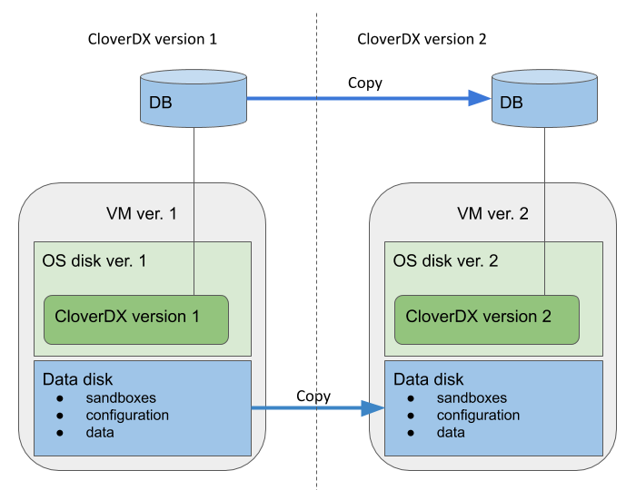

<!-- Administration > Upgrade > Server upgrade in cloud -->

## 5. Server upgrade in cloud

There are 2 ways to upgrade **CloverDX** to a new version:

- *Upgrade of the whole architecture* - upgrades the whole cloud architecture defined by **CloverDX** offerings to a new version. The architecture in newer offering version can be improved by incorporating new cloud services, better defaults etc. This is the recommended way to upgrade the cloud offerings and is described in detail below.
- *Upgrade of clover.war* - simply change the clover.war file to a new version. This doesn’t use improvements to the cloud architecture in new versions and is equivalent to ordinary upgrade of **CloverDX**. For this upgrade, follow [Server manual upgrade](upgrading-server.md). Make sure to use WAR suitable for Tomcat 10 container. The server WAR is located in `/opt/clover/tomcat/webapps`. To stop and start the server use the above commands to control its systemd service.

The recommended upgrade process of the whole cloud architecture follows the same basic principles for all cloud offerings. The main idea is that we create the new version instance and its cloud architecture using a copy of the previous versions database, data, configuration, sandboxes etc. The previous version instance is kept running with minimal impact. This way the new version can be run and tested alongside the previous version, while the previous version keeps running and providing its services. The new version does not modify anything of the previous version.

*Figure 44. Upgrade overview*

The data disk and system database of the new version are based on snapshots of the data disk and database of the previous version. Everything else is created as new - OS disk, VM, networking resources and other cloud resources. This way the **CloverDX** configuration, data, sandboxes used in the previous version are easily used in the new version, while the whole architecture of the offering is upgraded.

Overview of the upgrade process:

1. *Pause processing of jobs* in the previous version. This is best done by disabling schedules and event listeners. The reason for this is for the new version to not start processing your data immediately after start. This starts the downtime of the previous version.
2. *Create a snapshot of the system database* - contains the state and configuration.
3. *Create a snapshot of the data disk* - contains data, sandboxes, configuration, logs etc.
4. *Resume processing of jobs* in the previous version - this ends the downtime of the previous version.
5. *Deploy the new version* using the above snapshots via a template specific for upgrade. The new version is deployed alongside the previous version, while the previous version is kept running.
6. *Activate the new version* - on the login page you will probably be prompted to enter a new license that supports the new version.
7. *Test the new version* - perform testing of the new version to verify the upgrade. In the step 1 above you disabled listeners and schedules - you might need to re-activate them correctly if it’s safe (e.g. if they won’t process production data).
8. When the new version is verified, you might want to *re-use the IP address* of the previous version - follow cloud-specific steps below. This allows you to continue using the same IP address or hostname with the new version, e.g. for Server projects in **CloverDX Designer** or other services calling the server API.

Upgrade details specific to cloud providers:

1. [Upgrade in AWS](aws-marketplace-upgrade.md)
2. [Upgrade in Azure](azure-marketplace-upgrade.md)
