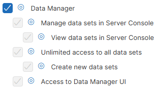
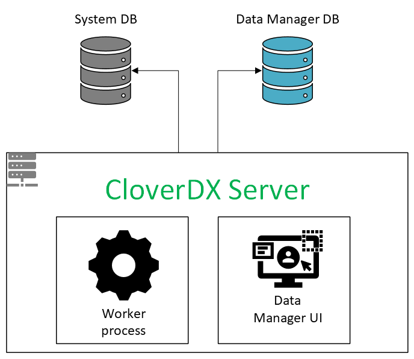
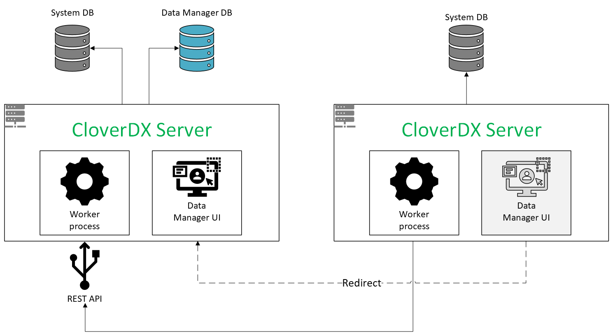
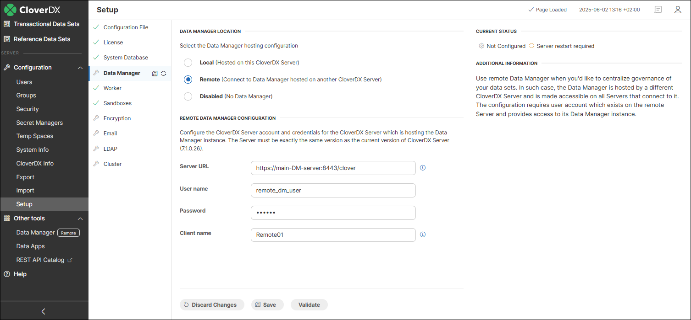
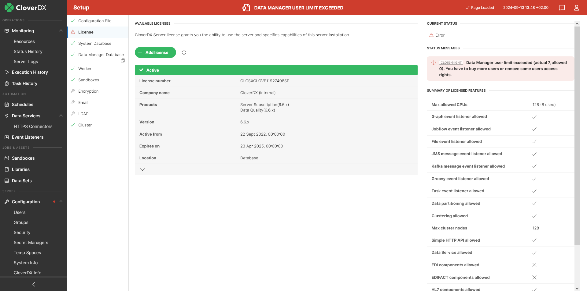
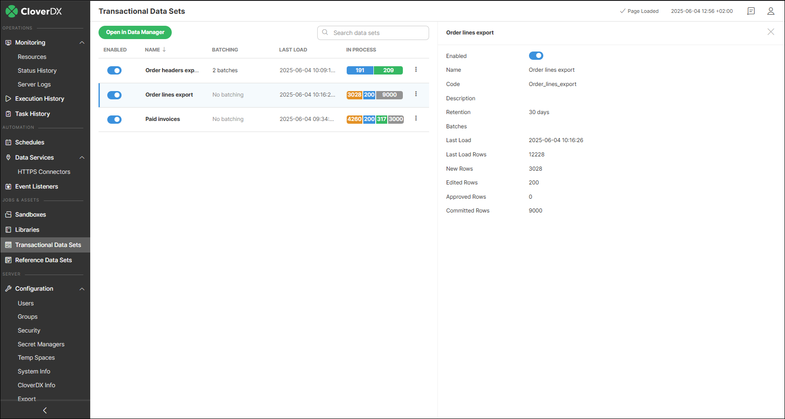
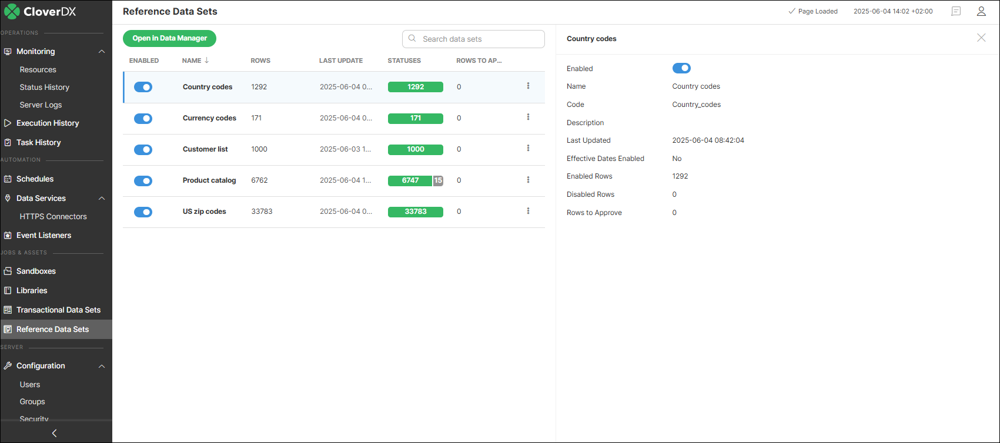

<!-- Administration > Wrangler and Data Manager administration > Data Manager administration -->

## 11. Data Manager administration

This section provides an overview of Data Manager configuration, including how to set up user accounts, how the permissions model works, and how to configure the instance backend.

### Data Manager permissions in CloverDX Server

Users who wish to access the Data Manager can do so either from the CloverDX Home page available at `http(s)://[host]:[port]/clover/home` or, if they are already logged in in one of the other apps in CloverDX, they can use the **App Switcher** to switch to the Data Manager.

Every user wanting to access the Data Manager will require Data Manager permissions which are configured on a per [user group](groups.md) basis. Following permissions control whether users can access Data Manager:

*Figure 142. Data Manager permissions in Group permissions configuration.*

The **Access to Data Manager app** permission at the bottom gives the users the ability to log in to the Data Manager. The user’s permission to work with the data sets is controlled by setting the role (Admin, Editor, Approver, Reader) directly on the individual data sets. Each user with this permission requires a Data Manager seat (see [Data Manager licensing](data-manager-administration.md#data-manager-licensing) for more details).

If a user is to be able to create new instances of a data set, they need to be assigned the **Create new data sets** permission. The user who creates a new data set becomes its owner with Admin permission. The user can create new data sets either in Data Manager or via [Data Manager API](../operations/part4.md).

A user with the **Unlimited access to all data sets** permission becomes the administrator of all existing data sets. They can manipulate them in the same way as if they were their owner. A user with this permission can also create new data sets.

The **Manage data sets in Server Console** and **View data sets in Server Console** permissions are separate from the Data Manager access permissions since they are meant to be used for users who work in CloverDX Server console and require the ability to see and manage data sets in the Data Manager. Typically, this will be Server admin, support team etc. – they do not necessarily need to have access to the Data Manager to work with data (in fact, in many organizations it is desirable for the admin to not be able to see the data) and hence these users do not require Data Manager seat.

These permissions will grant them the ability to see Data Sets module in CloverDX Console. In addition, the **Manage data sets in Server Console** permission allows the user to disable and enable data sets. See more information about this module below.

The top-level **Data Manager** permission can be used for users who require full access to the Data Manager – the administrative **Data Sets** module as well as access to the **Data Manager** app.

Note that inside the Data Manager, a separate permissions system applies. This controls access of different users to different data sets and their roles within each data set (Admin, Editor, Approver, Reader). The data set permissions are configured in each data set by the data set administrator.

### Data Manager configuration

To configure the Data Manager, go to **Configuration** → **Setup** → **Data Manager** in CloverDX Server Console. Data Manager can be configured either as a **local instance**, available only to a specific CloverDX Server environment, or as **a remote connection**, allowing other CloverDX Server environments to access it.

Select [**Local (Hosted on this CloverDX Server)**](data-manager-administration.md#local-data-manager-configuration) to configure Data Manager for your standalone CloverDX Server or CloverDX cluster environment. In this mode, data sets are available exclusively to that instance-accessible both through the Data Manager interface and within CloverDX Designer, where they can be manipulated using dedicated components for data set handling.

*Figure 143. Diagram of local Data Manager setup*

Select [**Remote (Connect to Data Manager hosted on another CloverDX Server)**](data-manager-administration.md#remote-data-manager-configuration) to connect your CloverDX Server instance to a Data Manager hosted on a different CloverDX Server environment. This setup allows multiple CloverDX environments to share a central repository of data sets. Once connected, data sets from the main Server environment where the Data Manager is set up become available for use in graphs within projects on other Server environments.

Users logged into the CloverDX Server Console on remote servers can view data set overviews in the Transactional and Reference Data Set modules, provided they have the [Manage Data Sets in Server Console](groups.md#permission-dm-manage-data-sets-server) permission. However, they cannot enable or disable the data sets.

Note that accessing the Data Manager UI from a remote Server instance will automatically redirect you to the Data Manager URL of the main Server.

*Figure 144. Diagram of remote Data Manager setup*

#### Local Data Manager configuration

*Figure 145. Local Data Manager configuration in Setup*

Local Data Manager requires a dedicated database. Make sure Data Manager doesn’t use the same database schema as your CloverDX Server. It’s best to create a separate schema or even a separate database. This keeps your CloverDX system data (like settings and logs) separate from the business data stored in Data Manager.

Data Manager supports only the following databases:

| Database provider | Supported major version | Note |
| --- | --- | --- |
| PostgreSQL | 15 | Follow the database creation instructions for the [PostgreSQL system database](postgresql.md#creating-database), modifying the database name and owner as appropriate. |
| Oracle | 23 | Follow the database creation instructions for the [Oracle system database](oracle.md#creating-database), modifying the database name and owner as appropriate. |
| MS SQL Server | 2022 | Follow the database creation instructions for the [MS SQL system database](mssql.md), modifying the database name and owner as appropriate. |

You can configure the database connection either using a JDBC driver or by referencing a JNDI-bound data source defined in the application server. If configuring a JDBC connection, check that the database driver for your chosen database is available on your application server’s classpath (typically the `lib` folder in your Tomcat install directory). This is especially important if you’re using different databases for the Server and Data Manager—like PostgreSQL for the Server and MS SQL Server for the Data Manager. In that case, drivers for both need to be present.

Use the **Validate** button at the bottom to see if your connection is valid. After saving the changes, restart CloverDX Server for the changes to take effect.

#### Remote Data Manager configuration

*Figure 146. Remote Data Manager configuration in Setup*

To configure a remote Data Manager connection:

- Enter the **full URL** to the CloverDX Server where the Data Manager is set up. The URL of the target CloverDX Server environment must be reachable from the server where the remote connection is being configured. This may require firewall exceptions or other network adjustments to ensure open communication.
- Enter the **user name** and **password** of a user that exists on the CloverDX Server where the local Data Manager is running. We recommend creating a dedicated technical user account just for this purpose. The account doesn’t need to be assigned to any user group, as it requires no special permissions. Any job history and log entries related to this connection will be logged under this user.
> [!IMPORTANT]
> Access to data sets through the remote connection (via *Server Console, Designer,* or *running jobs*) is determined by this user’s assigned roles. What a user connecting through a remote connection can see or manage depends entirely on these roles. This means that the user specified in the remote connection must be assigned an appropriate role for each data set. See [Data set permissions](../user/data-manager-introduction.md#data-set-permissions) for more information.

- Enter a unique **client name**. This name is used to identify the remote Server and appears in places such as [Remote Data Manager logs](../operations/monitoring-server-logs.md) and data set rows, where it is stored together with the job run ID to help with identification of the source of changes. Make sure each remote Server has a distinct name to avoid confusion.

Use the **Validate** button at the bottom to see if your connection is valid. After saving the changes, restart CloverDX Server for the changes to take effect.

### Data Manager licensing

Data Manager is licensed on per seat basis. A seat is consumed by any user that has **Access to Data Manager app** permission configured in CloverDX Server. This means that every user that can log in to the Data Manager user interface is counted regardless of whether they ever used their access or not.

This is different from Wrangler where users are only counted once they start using Wrangler and their Wrangler workspace is created. The Data Manager does not look at any other resources, just at the group permissions and will count every user with the Data Manager access.

Note that [remote Data Manager connections](data-manager-administration.md#data-manager-configuration) do not consume any seats and the Server environments connecting remotely do not need their own Business Tools licenses.

The number of seats that you have available can be shown in **Configuration** → **Setup** → **License** in the **Summary of licensed features** panel:

If you have more users than the seats, an error will be displayed in your Server Console:

*Figure 147. An error shown if more users have access to the Data Manager than there are Data Manager seats on the Server.*

If this happens, you will not be able to use the Data Manager user interface, but the data will remain intact. Your users will be able to log-in to the Data Manager again once the number of seats is higher than the number of users with Data Manager permissions (i.e., you will have to either add additional seats or change user permissions so that fewer users have access).

### Data Sets modules

**Transactional** and **Reference Data Sets** modules in CloverDX Server Console allow users with **Manage data sets in Server Console** or **View data sets in Server Console** permission to see the overview of data sets and basic information about the data volumes and usage. This should help them make informed decisions about the storage required for the Data Manager.

The **Data Sets** modules provides a list of data sets configured in Data Manager, including both enabled and disabled data sets. Additional details about each data set can also be viewed.

- When connected to a **local Data Manager**, *all* data sets are displayed.
- When connected to a **remote Data Manager**, only data sets *visible to the user specified in the [remote Data Manager configuration](data-manager-administration.md#remote-data-manager-configuration)* are shown. At least *Read-only* access must be granted for a reference data set to be listed, or *Data editor* access for a transactional data set to be listed. See [Data set permissions](../user/data-manager-introduction.md#data-set-permissions) for more information.

*Figure 148. Transactional Data Sets module showing a list of data sets and a sidebar with details of the selected data set.*

The information displayed for each **transactional data set** includes the following:

- **Enabled**: whether the data set is enabled or not. Disabling the data set will make it unavailable in any job (every job attempting to read/write a disabled data set will fail) and will prevent Data Manager UI users from editing the data in the data set. Disabling the data set in the Data Sets module is the same as disabling the data set in the data set configuration (see [Editing transactional data set configuration](../user/data-manager-working-with-transactional-data.md#editing-transactional-data-set-configuration)). The ability to enable or disable a data set is not available for users with only the "View data sets in Server Console" permission or if the Data Manager configuration is remote.
- **Name**: name of the data set.
- **Batching**: number of batches in the data set. Only available for data sets that have batching enabled.
- **Description**: description of the data set provided when the data set was created.
- **Retention**: number of days for how long to store *Committed* records in the Data Manager’s database. Records older than the **Retention period** will be deleted.
- **Batches**: number of batches in the data set. Only available for data sets that have the batching enabled.
- **Last load**: date and time of when the last data was loaded to the data set.
- **Last Load Rows**: how many rows were loaded the last time the data was uploaded to the data set.
- **New Rows**: number of rows that have *New* status in the data set.
- **Edited Rows**: number of rows that have *Edited* status in the data set.
- **Approved Rows**: number of rows that have *Approved* status in the data set.
- **Committed Rows**: number of rows that have *Committed* status in the data set.

*Figure 149. Reference Data Sets module showing a list of data sets and a sidebar with details of the selected data set.*

The information displayed for each **reference data set** includes the following:

- **Enabled**: whether the data set is enabled or not. Disabling the data set will make it unavailable in any job (every job attempting to read/write a disabled data set will fail) and will prevent Data Manager UI users from editing the data in the data set. Disabling the data set in the Data Sets module is the same as disabling the data set in the data set configuration (see [Editing reference data set configuration](../user/data-manager-working-with-reference-data.md#editing-reference-data-set-configuration)).
- **Name**: name of the data set.
- **Code**: unique identifier of the data set. The code is assigned to the data set when the data set is created and cannot be changed. You should not make any assumptions about what the code looks like – current version uses normalized data set name as the code, but the algorithm can change in the future without any prior notice.
- **Description**: description of the data set provided when the data set was created.
- **Last Updated**: Date and time of the last change in the data set.
- **Effective Dates Enabled**: Indicates whether effective dates are enabled. When enabled, a data set can store multiple versions of a record, each valid only within a specific time range defined by two columns: *Valid* from and *Valid to*.
- **Enabled rows**: number of enabled rows.
- **Disabled rows**: number of disabled rows.
- **Rows to Approve**: number of changed rows, waiting to be approved.
