<!-- Administration > Configuration > Designer configuration -->

## 8. Designer configuration

CloverDX Designer offers many configuration options that allow you to configure wide range of settings – fonts, window layouts, colors, editor preferences and much more. In this chapter, we will focus only on settings that are specific to CloverDX platform. For information about other settings offered by CloverDX Designer, please consult Eclipse documentation that is available directly in the Designer via the question mark button in the bottom left corner of the dialog.

### General configuration

All CloverDX settings are grouped together in one node of the settings tree accessible via menu **Window** ****Preferences**:

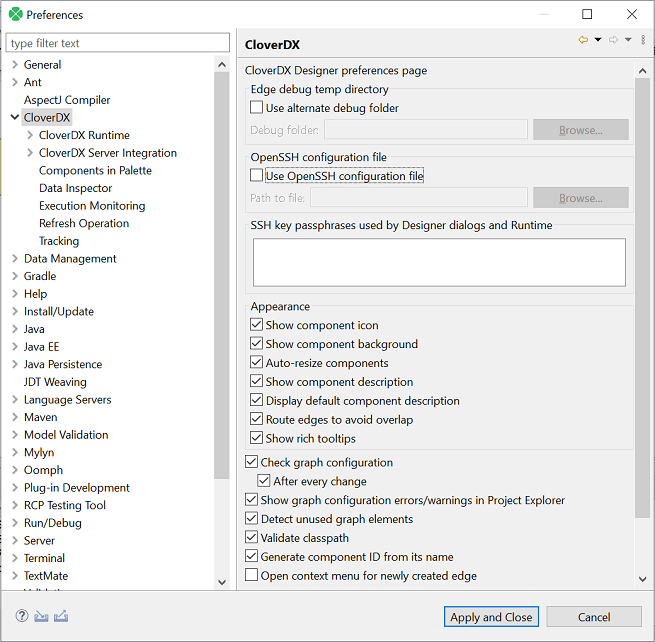
*Figure 62. CloverDX-specific configuration in CloverDX Designer.*

| Option | Description | Default value |
| --- | --- | --- |
| **Edge debug temp directory** |  |  |
| Use alternate debug folder | Allows you to specify the path to an alternate folder containing edge debug files (`.dbg`). | disabled |
| **OpenSSH configuration file** |  |  |
| Use OpenSSH configuration file | Specifies the location of the OpenSSH configuration file which allows you to define SSH access outside of **CloverDX Designer**. The path to the file is `~/path/to/.ssh/ssh_config` There is no default file; therefore, without proper specification, no configuration file is loaded. Enabling/disabling this option requires restart of the **CloverDX Designer** runtime to take effect. | disabled |
| SSH key passphrases | Specifies list of passphrases for SSH keys used in Designer dialogs and jobs executed in Runtime environment. Each line represents one passphrase used by a specific SSH key. The line content should be `[key identity]=[passphrase]`. The key identity can be `[username]@[hostname]` or just `[hostname]`. For example `john@my-sftp-server.com=changeit`. If the key is stored in project’s `ssh-keys` directory the identity must match the name of the file without the `.key` suffix. If OpenSSH configuration file is used the identity must match the information stored in the configuration. In this case, the `[username]` is optional. |  |
| **Appearance** |  |  |
| Show component icon | Switches component icons on or off. | enabled |
| Show component background | Enables or disables the background color of components. | enabled |
| Auto-resize components | Automatically adjusts components' size to fit their name. | enabled |
| Show component description | Displays or hides components' description in a graph. If **Display default component description** is disabled, only user-defined description is visible. | enabled |
| Display default component description | When **Show component description** is enabled, it shows the components' default description (e.g. path to the file in **Readers** or **Writers**). | enabled |
| Route edges to avoid overlap | Enables or disables different edge-routing algorithm. | enabled |
| Show rich tooltips | Enables or disables detailed tooltips on edges. | enabled |
| **Other** |  |  |
| Check graph configuration | Enables or disables graph configuration validation. When this validation is disabled, error icons on components are not shown. | enabled |
| After every change | Configure when the graph validation is performed. If this is disabled, validation is only done after save. When enabled, validation is done when changes are made. | enabled |
| Show graph configuration errors/warnings in Project Explorer | Allows to suppress detected configuration errors and warnings in **Project Explorer** and **Problems** views. | enabled |
| Detect unused graph elements | Enables or disables updates and reporting of used/unused graph elements. Disabling can solve some specific performance issues. | enabled |
| Validate classpath | Checks whether the content of the classpath file is valid for both **Designer** and **Server**. Can be disabled in case it significantly slows down the working process (opening new projects, etc.) or indicates false positives. | enabled |
| Generate component ID from its name | Generates component identifier based on its name by converting to uppercase and replacing special characters with underscores. | enabled |
| Open context menu for newly created edge | Opens the context menu after creating an edge between two components. In the menu, you can select metadata for the edge. | disabled |
| **Switch to preferred perspective on graph editor activation** |  |  |
| Three options | Configure whether to automatically change perspective on graph editor activation. Three options are available:  - Always: always switch automatically - Never: never switch automatically - Prompt: ask and allow user to decide (and save the decision for later) | Prompt |

### CloverDX AI Assistant configuration

The **AI Assistant** pages allow you configure **Clover Assistant**. The most important part is the connection to a 3rd party LLM (Large Language Model) provider such as OpenAI or Anthropic which powers Clover Assistant. On top of that you decide which model each agent runs on, and additional options allow you to configure agent behavior, logging and more.
> [!NOTE]
> CloverDX AI Assistant is released as a **technology preview** in CloverDX 7.5.0. It is present in Designer but remains inert until you apply an Assistant license key and configure an LLM connection in Designer preferences (it will not do anything on its own).
>
> As a technology preview, it is under active development. Its behavior, interfaces, and defaults may change in future releases, sometimes in incompatible ways. **Use it in dev/test environments only, not in production.** Treat it as a tool for evaluation and non-critical work, and review everything it produces before relying on it. Use it with caution: the Assistant can read and modify files and run jobs in the CloverDX Server project you connect it to.
>
> Gathering feedback on how teams want to govern the Assistant is one of the goals of this technology preview. Contact your Account representative if you wish to provide feedback that could help us improve future versions of the Assistant.

The main **AI Assistant** page holds two groups: **Connections**, the named LLM connections available to the Assistant, and **Model profiles**, which decides what each agent runs on. **At least one connection is required before the Assistant can be used.**

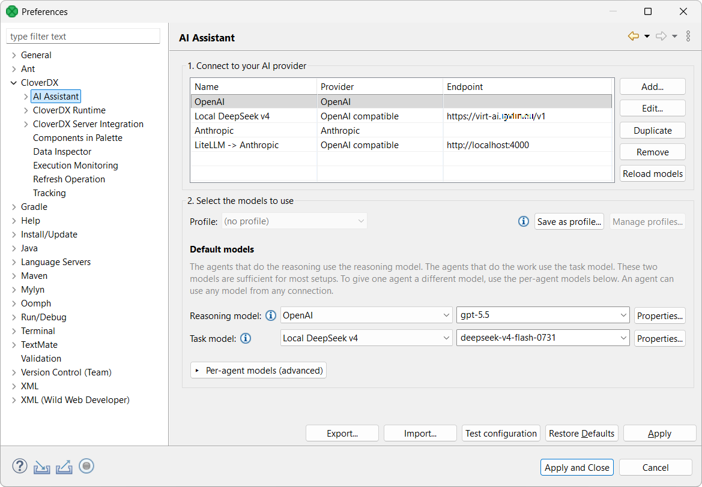
*Figure 63. General settings for Clover Assistant.*

#### Connections

A **connection** describes one LLM endpoint: its provider, the API key and whatever else that provider needs. Connections are named and there can be as many of them as you like – one per provider, several accounts with the same provider, or a cloud provider next to a locally hosted model. Agents then refer to connections by name, so you can point different agents at different providers.

The table lists the connection **Name**, its **Provider** and the **Endpoint** it points at (empty for providers that have a single fixed endpoint). The buttons on the right manage the list. Removing a connection also deletes its API key from the secure storage, once you confirm the page with **OK** or **Apply**.

Each connection is edited in its own dialog. Enter a **Name** – it is what you will pick from in the agents grid, so name connections after what they are for – choose a **Provider**, and fill in the fields that provider requires. Every field carries an info icon with a description of what belongs in it.

The following providers are available:

| Provider | Connects to |
| --- | --- |
| **OpenAI** | GPT models provided by OpenAI. |
| **OpenAI compatible** | A tool exposing an OpenAI-compatible API, such as Ollama, vLLM or a custom proxy. The **Base URL** is the address of that API, e.g. `http://localhost:11434/v1`; the API key is optional, so an endpoint that requires no credentials can be used as well. |
| **Anthropic** | Claude models such as Opus or Sonnet provided by Anthropic. |
| **Google AI** | Gemini models provided by Google AI. |
| **Microsoft Foundry (Azure OpenAI)** | OpenAI GPT models hosted by Microsoft in the Azure cloud. |
| **Microsoft Foundry via Azure AI Gateway** | Microsoft Foundry models via API endpoints provided by Azure API Management. |
| **OpenAI-compatible via Azure AI Gateway** | Azure-hosted endpoints exposing OpenAI-compatible APIs of non-Microsoft providers. |

The **Test connection** button verifies the connection: it loads the list of models the endpoint offers and sends a short request to check the credentials. The loaded models are remembered and offered in the agents grid afterwards.
> [!NOTE]
> For the three Azure variants the model is part of the connection itself – the **Deployment name**, or the **Model name** for the OpenAI-compatible gateway – because a deployment serves exactly one model. Such a connection offers that single model to the agents. The remaining providers serve their whole catalogue, so their models are listed separately for each agent.

#### Model profiles

A **profile** is a named set of choices – which connection and which model each agent uses, plus optional per-agent model properties. You can keep several profiles side by side, for example a fast and cheap one for everyday work and a frontier-model one for hard design tasks, and switch between them.

The bar at the top of the group selects the **Profile** you are editing – it is also the profile the Assistant runs on – and manages the list with **New…​**, **Duplicate**, **Rename…​** and **Delete**. At least one profile always remains.

The grid below configures the agents of the selected profile. See [Agent types](../developer/designer-ai-assistant.md#agent-types) for more details about the individual agents, their requirements and usage patterns.
**Connection**
The connection the agent’s model is called on. Leave the cell blank to inherit; the inherited connection is then shown greyed.
**Model**
The model to use. The drop-down offers the models the agent’s connection reported – press **Reload models** to refresh them – but you can also type a model name the list does not contain. Leave the cell blank to inherit.
**Properties**
Per-agent model settings, see [Model properties](designer-configuration.md#model-properties) below. The button reads *Default* while the agent overrides nothing and *Custom…​* once it does.

Values are inherited along the agent hierarchy: the **Sub-agent** row is the default for every sub-agent and inherits from **Master**, and each specific agent below it inherits from **Sub-agent**. Configuring the Master row is therefore enough to run the whole Assistant, and the rows below are there for the cases where one agent should differ. The Master is the root of the hierarchy – it cannot inherit and always carries its own connection and model.

In general, we recommend largest ("frontier") models for Master and Architect, and medium-size models or models from previous generation for other agents.

The two buttons below the grid work on the whole active profile:
**Reload models**
Connects to every connection the profile uses and downloads the list of models you have currently available. The lists are remembered between Designer sessions, so this is only needed when a provider’s offer changes.
**Test connection**
Sends a short request to every distinct connection/model pair the profile uses and reports the result of each. This is the quickest check that a profile is fully usable.

##### Model properties

The **Properties** button of a row opens the model properties of that agent. Leave a field blank to inherit it – the greyed value shows what would apply.
**Temperature**
How focused or creative the answers are: 0.0 for the most focused ones, higher values for more creative ones. When left blank, the model’s own default applies. The accepted range depends on the provider (up to 1.0 for Anthropic, up to 2.0 elsewhere).
**Max output tokens**
Maximum number of tokens this agent’s model may generate in a single reply. When left blank, the global value from the [Advanced configuration](designer-configuration.md#advanced-configuration) applies.

Only the properties the agent’s provider actually accepts are shown.

##### Switching the profile from chat

The active profile can also be switched directly from the chat, without opening the preferences: type `/profile` in the chat input to pick from the available profiles, or `/profile <name>` to switch straight away.

The switch applies to that chat view only and is not persisted – it is a way to try a different profile for a while, not a way to change the configured default. While a view runs on something other than the default, its header shows a **Model profile** badge with the profile name.

#### Advanced configuration

Advanced configuration allows you to configure additional settings that tune the behavior of Assistant, its token consumption, logging details or even zoom level for Assistant view.

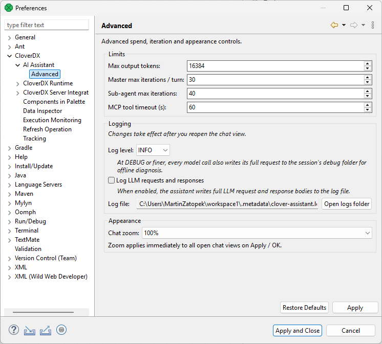
*Figure 64. Advanced configuration of Clover Assistant.*

The configuration uses few basic terms:
**Turn**
One user message and the Assistant’s complete response to it. A turn may involve many model calls and tool calls.
**Iteration**
A single round-trip to the model. One iteration may carry several tool calls which are executed before the next iteration.
**Master**
The main assistant agent that talks to you. It may delegate work to sub-agents (specialists such as the *Architect*, *Developer*, *Data inspector*, etc.).

##### Limits

The **Limits** section allows you to influence token consumption and iteration counts for your agents. These guard against runaway tool call loops and oversized model responses. The defaults suit regular usage, change these values only if you are hitting the limits or if you need tighter control over your Assistant costs.
**Max output tokens**
Configure the maximum number of tokens the model may generate in a single reply. This limits the length of each model response within a turn, not the turn’s total token count. Raise this limit if answers are being cut off in the middle of the output; lower this value to reduce per-reply cost. The value range is from 256 to 64000. This value applies to every agent that does not set its own – see [Model properties](designer-configuration.md#model-properties).
**Master max iterations / turn**
Configure the maximum number of model round trips the Master may make while answering one message. If the Master reaches this ceiling without producing a final answer, the turn stops with an iteration limit error – usually a sign of a confused tool call loop. Raise this only for genuinely long, multi-step tasks. You can use values from 5 to 200.
**Sub-agent max iterations**
Configure the number of model round trips sub-agents may make while answering the queries they are given. If a sub-agent reaches this limit without finishing, it will return an error to Master. Master can then decide whether to call the task with narrower scope or to try another approach. Value range is 5 to 200.
**MCP tool timeout (s)**
Configure how long to wait for MCP Server’s response in seconds. If MCP does not respond before the timeout expires, the call is considered a failure, and the agent will then decide how to continue (whether to end the turn, call the tool again, or switch to a different tool). Increase this value if legitimate calls to long-running tools time out (e.g., on overloaded Server). Decrease the value to fail faster if the Server is stuck. Values can range from 10 seconds to 600 seconds.

##### Logging

The **Logging** section allows you to configure the amount and location of logs produced by agents when they run. Logging settings are applied when an agent starts, so they take effect once you reopen the chat view.
**Log level**
Configure which log messages are written to the log. Note that on *DEBUG* and *TRACE* levels, full requests and responses may be written to logs which can significantly increase the log size; on these levels every model call also writes its full request into the session’s debug folder for offline diagnosis. Default level is *INFO* and should be suitable for most common situations.
**Log LLM requests and responses**
Allows you to force agents to always write full requests and responses to log files. By default, this is disabled.
**Log file**
Location of the Assistant log file. By default, this will be a file within `.metadata` folder of your current workspace. Use the **Open logs folder** button to open the containing folder.

##### Appearance

The **Appearance** section allows you to configure the appearance of the Clover Assistant panel.
**Chat zoom**
Configure the zoom level of the chat panel. This is useful especially if you are using high-DPI screen and wish to present your work to others to allow them to read even on regular screen sizes. Default value is 100%, larger values make the text bigger, smaller values make the text smaller.

### Runtime Configuration

CloverDX Runtime is the execution core which runs jobs (graphs, jobflows, …​) which are part of local projects in CloverDX Designer (as opposed to jobs that are part of Server projects and which run on the Server even when started from the Designer).

Current status of the Runtime can be seen in the bottom right corner of the Designer.


Clicking on the little arrow next to the Runtime icon will bring up a context menu which will allow you to control the Runtime (start, restart, …​) or view its logs.

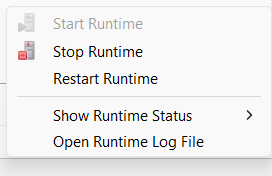

Runtime settings can be found in **Window** ****Preferences** menu under **CloverDX** ****CloverDX Runtime** node in the configuration tree.

When changing Runtime settings, Runtime will need to be restarted for the settings to take effect. This will be done automatically for you once you save the configuration and confirm the restart.

#### Basic settings

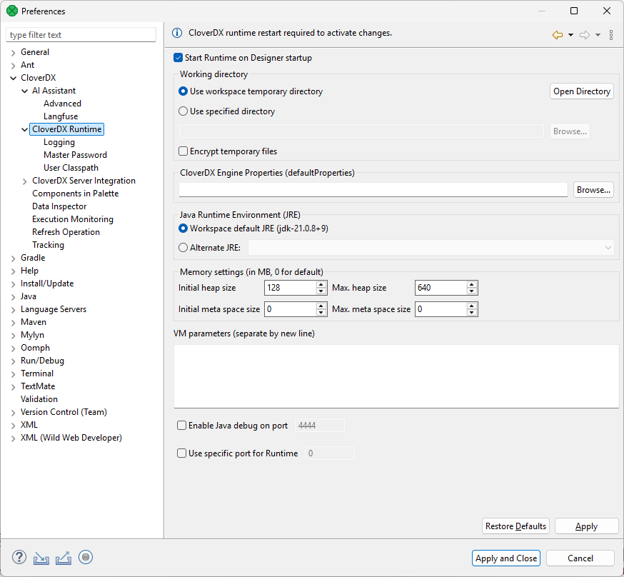
*Figure 65. Basic settings for CloverDX Runtime.*

- **Start Runtime on Designer startup**: when checked, Runtime will automatically start when you run CloverDX Designer. This is recommended to ensure that you can use all features of the Designer since some of the functionality depends on the Runtime being available (running any job, metadata propagation, and more).
- **Working directory** allows you to change where temporary files are stored when jobs run in the Runtime. By default, this is set to a directory within the workspace and this is the recommended setting. You can also select your own directory if needed via **Use specified directory** option.
  - You can also encrypt your temporary files if needed via **Encrypt temporary files** option. This is disabled by default since file encryption can lower performance of your jobs.
- **CloverDX Engine Properties (defaultProperties)** allows you to configure additional properties that the Engine (a library within Runtime responsible for actually running jobs) will use. These settings are quite low-level and very seldom need to be changed. To learn more about which settings are available here, see [Engine configuration](designer-configuration.md#engine-configuration).
- **Java Runtime Environment (JRE)** allows you to select which Java Runtime Envinronment to use when running CloverDX jobs. Default is to use value as configured in the workspace (which in turn defaults to JDK bundled with the Designer). This should not be changed unless you rely on specific version of Java for various reasons. In general, jobs may not run correctly on JDK other than the one supported by CloverDX Server (see compatibility matrix). See [Java Configuration](designer-configuration.md#java-configuration) for more information about Java in Designer.
- **Memory settings**: allows you to configure how much memory the Runtime can use. In general, more memory means faster job processing and more stable environment. More complex jobs and large data sets require more memory to run with reasonable performance and may not run at all if there is not enough memory.
  - If you are working with Server projects, Runtime will not require too much memory since all data processing happens on the Server. In that case, default values should be enough even if you are working with complex data flows or large volumes of data. In those cases, you will have to make sure that your Server has enough memory provisioned for its Worker process.
  - **Initial heap size** and **Max. heap size** allow you to configure how much memory the Runtime will use. The default settings should be sufficient in most cases. To allow the Runtime to use more memory, simply increase the **Max. heap size**.
  - The **Initial meta space size** and **Max. meta space size** allow you to configure the size of Java Meta Space – a native memory space Java uses to keep metadata about classes that are loaded. You should not modify this setting – the default values should be good.
- **VM parameters** allows you to send additional command-line arguments to Java VM which runs the runtime. Each parameter goes on new line.
  - Most commonly this is used to add additional libraries to Java classpath. A library can be added by specifying full path to where it is located via `-D` parameter by adding a line like `-Djava.library.path=path/to/library` to VM arguments. The path can be a path to jar file or to a folder with jar files.
  - Note that if you just need to use Java library within a project, simply place it into the `lib` directory within that project instead of Runtime classpath.
- **Enable Java debug on port** allows you to enable or disable Java debugging for jobs running in Runtime and to configure on which port the debugger will be available.
- **Use specific port for Runtime** allows you select which port to use for CloverDX Runtime when it communicates with the Designer. By default, a random port will be selected. This may cause issues with strict security in some environments. In such cases, you can manually configure which port the Runtime will use. This should not be changed unless you have issues with the Designer not being able to connect to the Runtime.

#### Logging

CloverDX Runtime writes its logs into **Console** tab. This screen allows you to configure the severity of the log messages that will be shown.

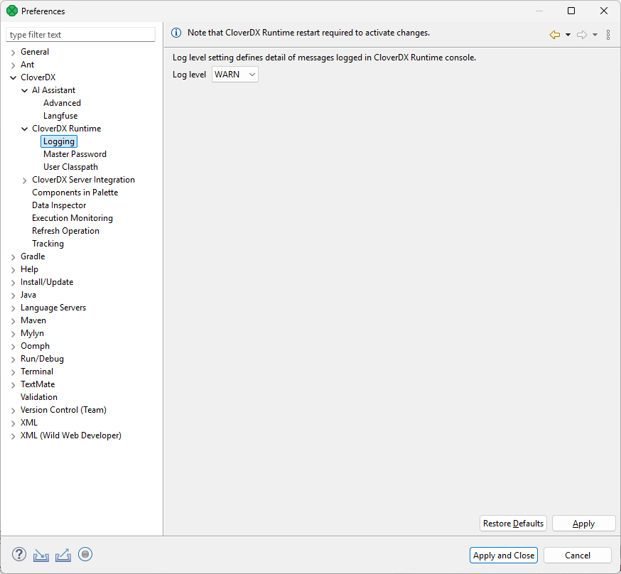
*Figure 66. CloverDX Runtime – Logging settings.*

#### Master Password

**Master Password** serves for encryption and decryption of [Secure graph parameters](../developer/parameters.md#secure-graph-parameters).

You need to set up the **Master Password** to be able to use the **Secure parameters** in **CloverDX Designer**.

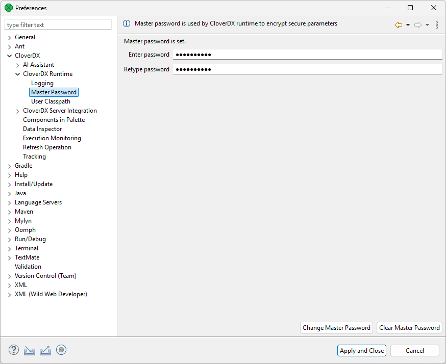
*Figure 67. Setting the Master password.*

Note that jobs running in Server project will use Master password configured on the Server and not the one configured in the Designer’s Runtime.

#### User Classpath

You can add your own libraries to the CloverDX Runtime classpath. Usually, you do not need to add any libraries here.

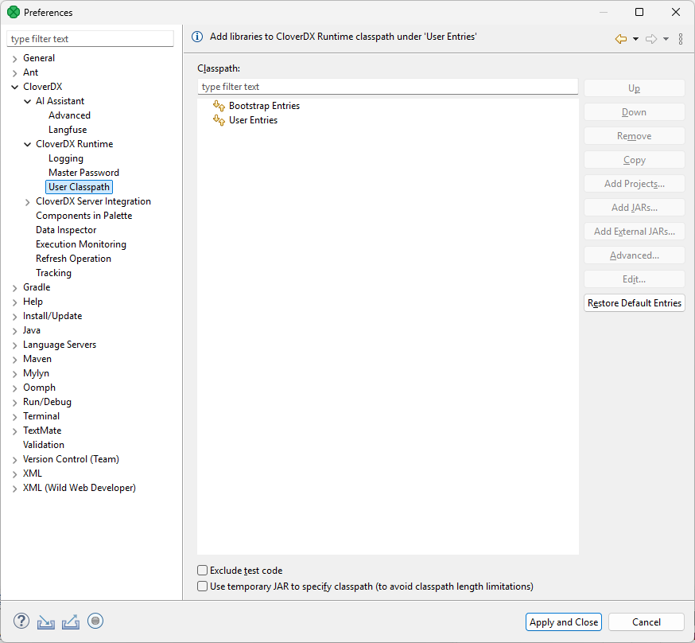
*Figure 68. CloverDX Runtime - User Classpath*

### CloverDX Server integration

**Preferences of CloverDX Server Integration** allow you to tweak communication between **Designer** and **Server**.

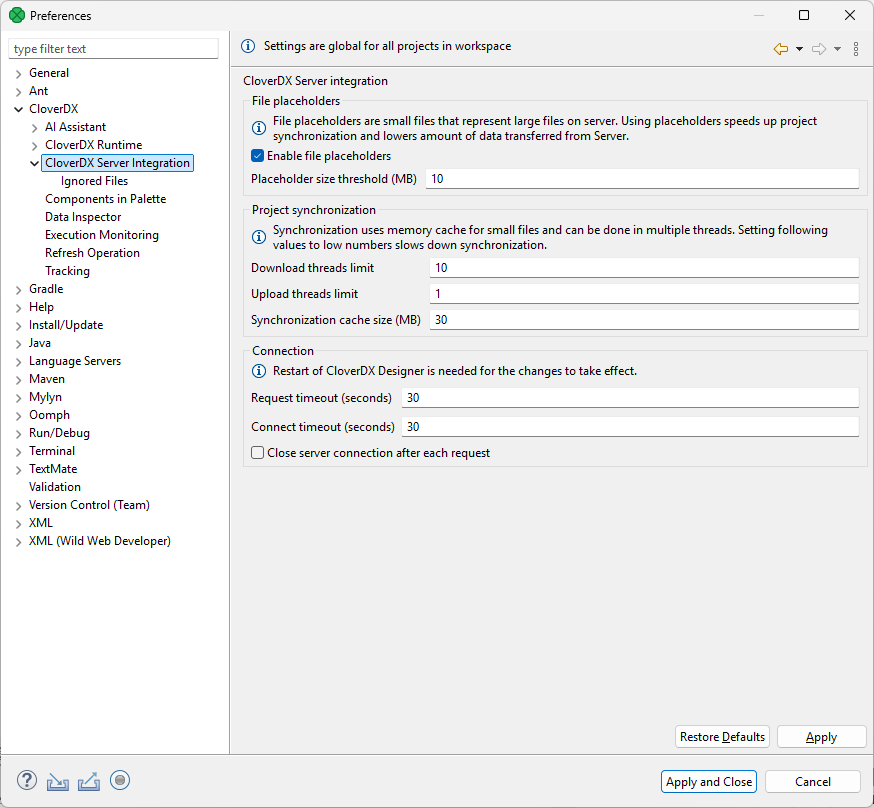
*Figure 69. CloverDX Server Integration*

| Option | Description | Default Value |
| --- | --- | --- |
| Enable File Placeholders | Enables usage of *placeholder files*. A *placeholder file* serves to save your disk space and to speed up synchronization in server projects. Files in sandbox with a size above the specified limit are replaced with *placeholder files* (in **Designer**) – one placeholder for each large file in the sandbox.  Usually, you do not need to see the content of these files and you do not commit them into repository. See [CloverDX Server project](../developer/cloverdx-projects-type.md#cloverdx-server-project). | enabled |
| Placeholder Size Threshold | Files above this threshold are replaced with *placeholder files*. The size is in MB. | 10 |
| Download threads limit | The maximum number of threads used for downloading files from **CloverDX Server**. Using more threads can speed up synchronization in networks with high latency but can also decrease **CloverDX Server** performance. | 10 |
| Upload threads limit | The maximum number of threads used for uploading files to **CloverDX Designer** and **CloverDX Server**. | 1 |
| Synchronization Cache Size | While downloading files from **CloverDX Server** during synchronization, the content of files is cached in memory to improve the performance. This parameter sets the cache size. | 30 |
| Request Timeout | A request timeout of connection to **CloverDX Server**. The request timeout is in seconds. | 30 |
| Connect Timeout | Timeout of the connection to **CloverDX Server**. The timeout is in seconds. | 30 |
| Close server connection after each request | Enables closing the connection to the server after each request. Used for performance tuning. | false |

Restart **CloverDX Designer** to use new timeout values.

#### Ignored files

The *Ignored files* setting allows you to avoid synchronization of particular files. This is often used to prevent synchronization of various temporary files, version control files, system metadata and so on. By default, we exclude metadata files and directories of the most common ones: Bazaar, CVS, Git, Mercurial, Subversion. If you use any other version control system, add its metadata files to the list.

The configuration has the same syntax as the `.gitignore` file.

This is a global (workspace-scope) configuration template. When a new project is created, this content is copied into the new project configuration. Therefore, any change of this configuration does not change configuration of any existing project.

See also [Ignored files](designer-configuration.md#ignored-files) in project configuration.

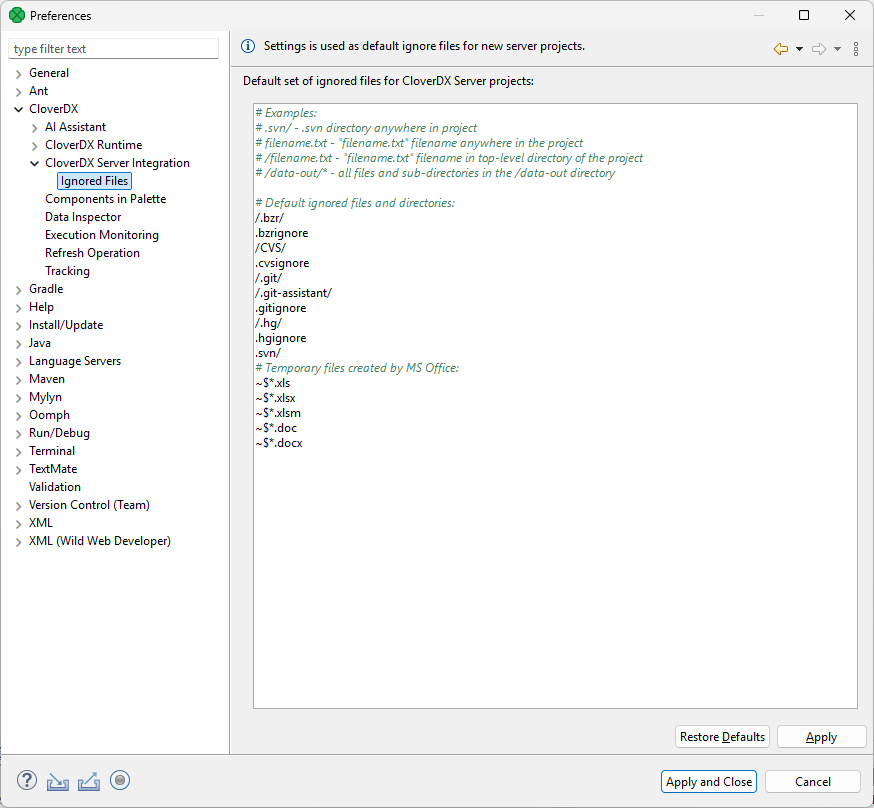
*Figure 70. CloverDX Server Integration*

### Execution monitoring

**Execution Monitoring** lets you set up status and log update intervals. Monitoring intervals do not affect runtime of jobs, just the frequency at which logs and status information are refreshed in the Designer.

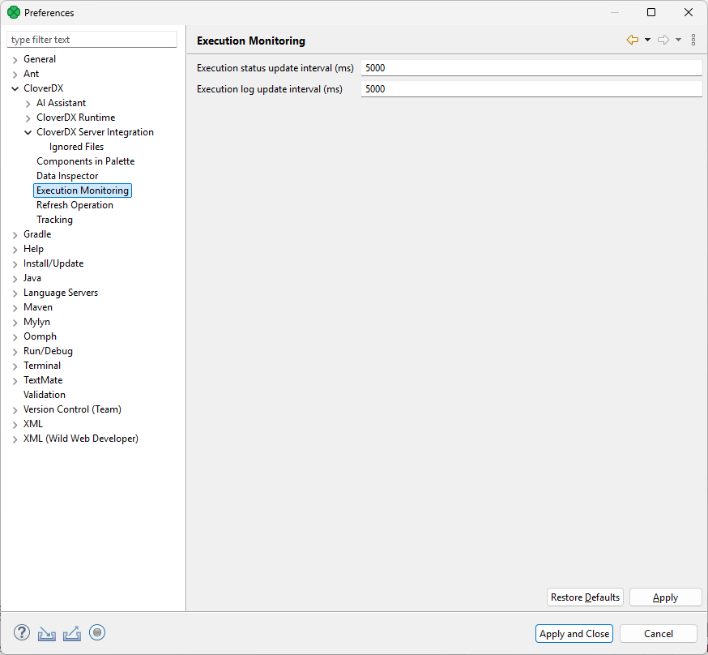
*Figure 71. Execution Monitoring*

Refreshing the `data-out` folder is described in [Refresh operation](designer-configuration.md#refresh-operation).

### Refresh operation

**Refresh Operation** lets you configure which resources should be refreshed after graph run on a per project basis.

The refresh operation configuration is accessible from the main menu under **Window** ****Preferences**. Choose **CloverDX** ****Refresh Operation** in **Preferences** window.

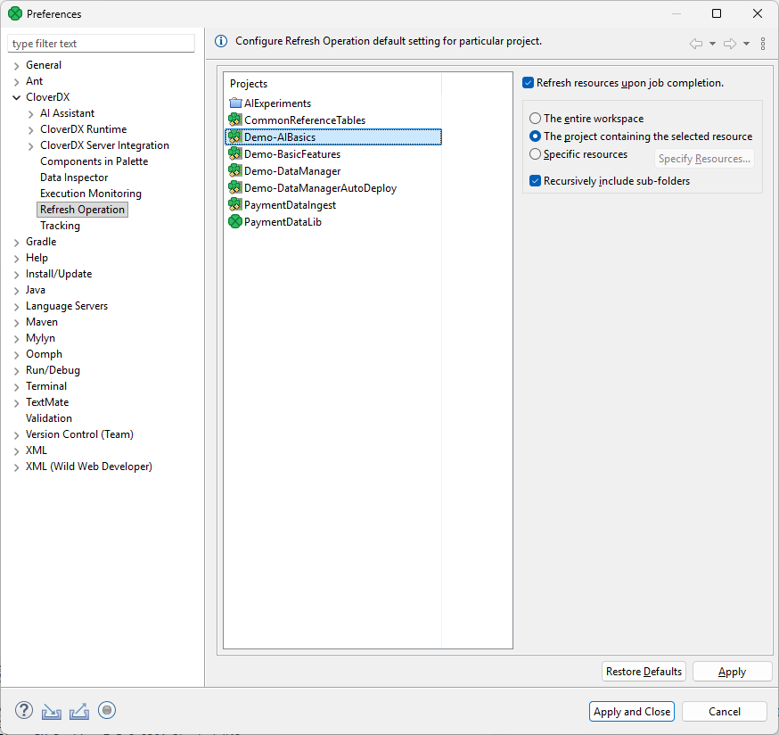
*Figure 72. Refresh Operation*

Choose the project in the middle part of the dialog and specify which resources should be updated.

The **Refresh resources upon job completion** checkbox enables or disables refreshing of resources.

Radio buttons on the right hand side let you choose between refreshing **the entire workspace**, **the project containing the selected resource** or **specific resource**.

The refreshing can be performed in the selected directories or recursively using the **Recursively include sub-folders** option.

Refreshing after graph run can be configured per particular graph, too. See [Run configuration](../developer/running-graphs.md#run-configuration).

### Java configuration

The JDK installed during **CloverDX Designer** installation is also used to compile and run your Java and CTL code in local projects. By default, the Designer is installed with the recommended *Eclipse Temurin JDK version 21*.

When running your jobs in a **CloverDX Server** environment, the jobs are run with the Java version configured in the Server environment. If your **CloverDX Server** runs on *Eclipse Temurin JDK 21*, there is no need to add a different JDK. If your Server environment runs on a different JDK (refer to our Compatibility Matrix [here](../admin/system-requirements-for-cloverdx-server.md)), the default *Eclipse Temurin JDK* version should in most cases work without an issue as well. However, if you want to ensure that you are developing your code with the same Java version as is configured on the server, you can add the desired JDK and globally change the Java used during runtime.
> [!NOTE]
> Make sure to add a JDK (Java Development Kit) package. JRE (Java Runtime Environment) packages are not supported.

If you want to switch to a different JDK, perform the steps below:

1. Open preference via **Windows** ****Preferences** menu and then navigate to **Java** ****Installed JREs**. By default, you will see the Java version selected during the Designer installation.
   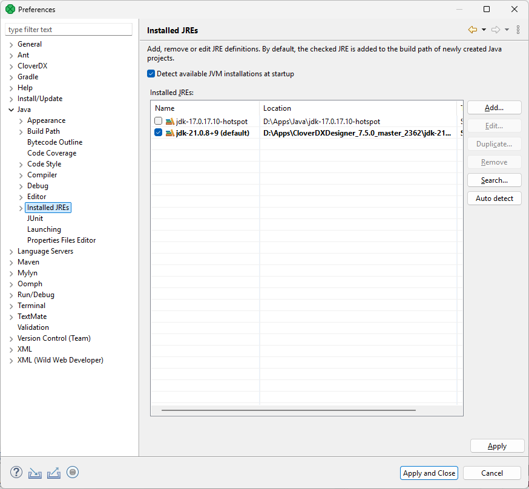
   *Figure 73. List of Java environments showing two Java versions – JDK 17 and JDK 21. The JDK 21 is the default one bundled with CloverDX Designer 7.5.*
2. To add a new Java installation click on **Add**, select **Standard VM**, and hit **Next**.
   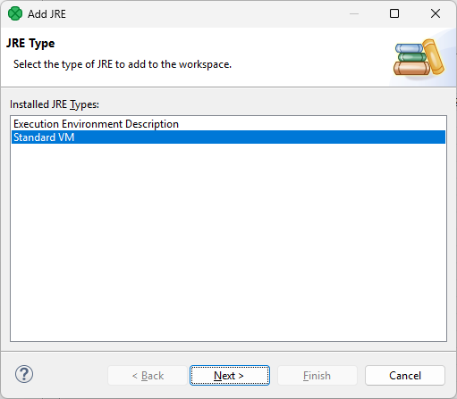
   *Figure 74. Adding new JRE via Add JRE wizard.*
3. Select the directory of the desired JDK and click on **Finish**.
   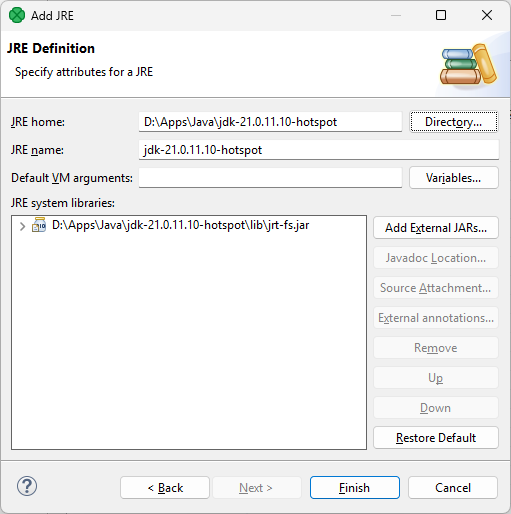
   *Figure 75. Configuring the new JDK – select JDK via the Directory button. All the other settings should be auto-detected for you.*
4. To start using the JDK, select the checkbox next to it. After saving this change, the JDK is automatically added to the build path of your projects.
   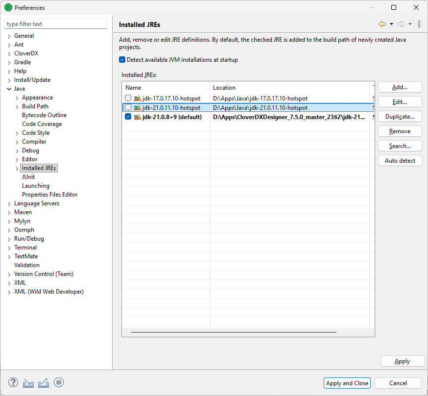
   *Figure 76. New JDK added to the list (the JDK 21 – second item from the top).*

### Configuring two-way authentication

To strengthen the security of your CloverDX environment, you can configure two-way authentication between the CloverDX Server and individual Designer instances. This setup involves creating a client keystore with a key pair and server truststore to encrypt data transmission and authenticate communication between the Server and Designers.

#### Configuration overview

The configuration steps in this section build on the [Securing Server with HTTPS](https-server-config.html) chapter and assume that CloverDX Server already has a configured keystore with a keypair and HTTPS enabled. Below is a summary of the steps required to configure secure communication between CloverDX Designer and CloverDX Server using mutual authentication.

1. Create a client keystore with a key pair for CloverDX Designer.
2. If you want to use a certificate signed by a certificate authority (CA):
   1. Create a certificate signing request (CSR).
   2. Send it to your CA for signing.
   3. Import the signed certificate back into its keystore.
> [!NOTE]
> For detailed steps and explanations on keystore, key pair, CSR generation, and certificate import (points 1-2 above), follow the steps in the [Securing Server with HTTPS](https-server-config.html) section.

1. [Export](designer-configuration.md#certificate-export) the self-signed certificate from the client keystore in `.cer` format, or, preferably, obtain the Certificate Authority’s certificate.
2. [Create a server truststore and import the client certificate into it](designer-configuration.md#create-server-truststore-and-import-client-certificate).
3. [Configure your Server’s application server](designer-configuration.md#server-configuration) to use the truststore.
4. [Configure Designer](designer-configuration.md#designer-configuration) to use the client keystore.

This guide describes two options for certificate and keystore/truststore management:

- Using the [**keytool command**](https://docs.oracle.com/en/java/javase/17/docs/specs/man/keytool.html) (CLI): This method requires familiarity with command-line tools. This method offers granular control over the certificate creation process, empowering you to tailor it to your needs.
- Using [**KeyStore Explorer**](https://keystore-explorer.org/) (GUI): This intuitive graphical interface simplifies the complexities of certificate management, allowing you to quickly and easily generate keystores and key pairs.
> [!NOTE]
> - Tomcat supports three truststore types: *JKS, PKCS11*, and *PKCS12*. Although **JKS** is the recommended and thoroughly tested option, other keystore types may also work. However, we cannot ensure full compatibility or functionality of all Tomcat features and configurations with non-standard keystore types. To maintain optimal compatibility and security, it is best to use **JKS**.
> - The behavior of the `keytool` command might differ between JDK providers and versions. This guide is based on the `keytool` utility in Eclipse Temurin JDK 17.

#### Certificate export

Export your client self-signed certificate in the `.cer` format.
> [!NOTE]
> If your key pair is signed by a certificate authority (CA), the industry standard is to use the CA’s certificate instead of exporting the signed certificate. This ensures that all certificates issued by the CA are automatically trusted. Contact your IT team to obtain your certificate authority’s certificate.

| [Keytool command](https-server-config.html#id_https_config_cli) |
| --- |
| [KeyStore Explorer](https-server-config.html#id_https_config_gui) |

##### Keytool command

Run the following command on the client keystore to export your self-signed certificate. Modify the values accordingly. See [Keytool command breakdown](designer-configuration.md#keytool-command-breakdown) for the command options explanation.

```
keytool -exportcert -alias cloverdxdesigner -file cloverdxdesigner.crt -keystore clientKS.jks -storepass p4ssw0rd
```

###### Keytool command breakdown

- **Alias**: the key alias in the keystore.
- **File**: the output file for the exported certificate.
- **Keystore**: the keystore file from which to export the certificate.
- **Storepass**: keystore password.

##### KeyStore Explorer

Open your keystore, right-click your key pair, and navigate to **Export > Export Certificate Chain.**

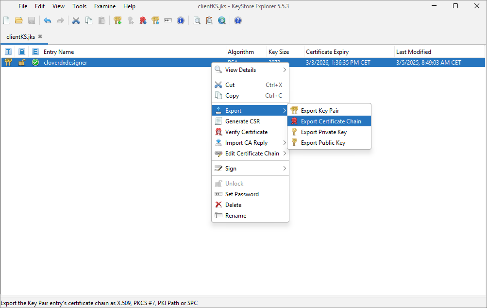
*Figure 77. Export certificate chain*

Switch to the **Entire Chain** option and select an export path.

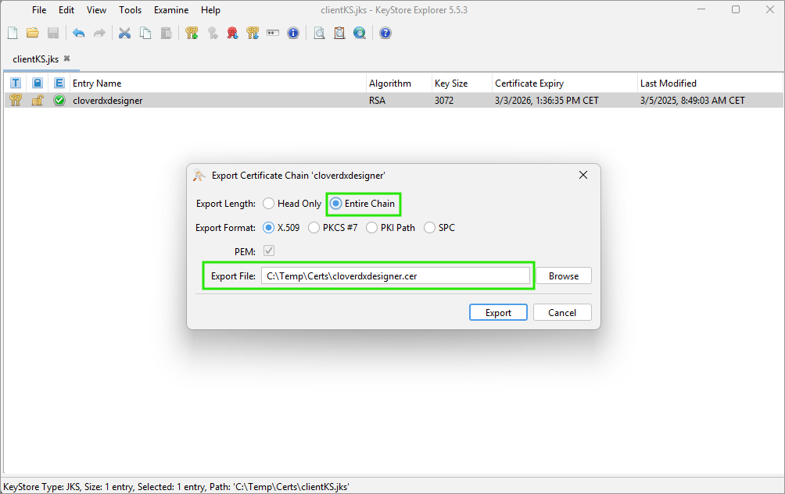
*Figure 78. Export certificate chain*

The certificate is exported to the specified path.

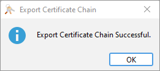
*Figure 79. Successful export*

#### Create server truststore and import client certificate

| [Keytool command](designer-configuration.md#keytool-command) |
| --- |
| [KeyStore Explorer](designer-configuration.md#keystore-explorer) |

##### Keytool command

Run the following command to create a server truststore and import your certificate (self-signed certificate or certificate of the certificate authority used to sign your key pair) into it. Modify the values accordingly. See [Keytool command breakdown](designer-configuration.md#keytool-command-breakdown) for the command options explanation.

```
keytool -importcert -alias cloverdxdesigner -file cloverdxdesigner.crt -keystore serverTS.jks -storetype jks -storepass p4ssw0rd
```

##### Keytool command breakdown

- **Importcert**: imports a certificate into the specified keystore.
- **Alias**: specifies the alias for the certificate.
- **File**: specifies the file containing the certificate to import (cloverdxdesigner.crt).
- **Keystore**: specifies the keystore file to store the certificate.
- **Storetype**: specifies the keystore type (jks).
- **Storepass**: sets password for the keystore.

##### KeyStore Explorer

Open the KeyStore Explorer and click on the **New** button or use the Ctrl+N shortcut. You will be prompted to select the keystore type. Select the `JKS` (Java Key Store) type.

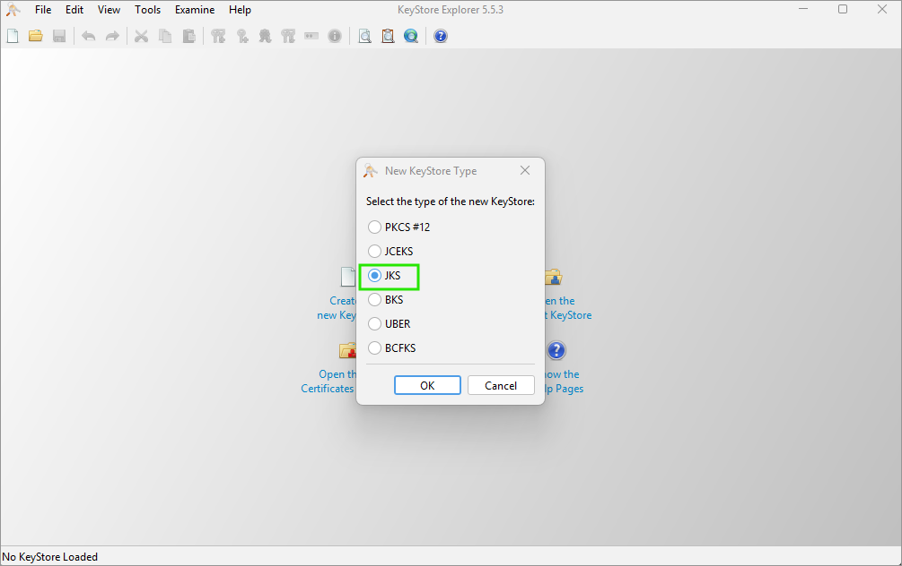
*Figure 80. Create new truststore*

Use the **Import Trusted Certificate** button (or press Ctrl+T) and select the `.crt` file to import.

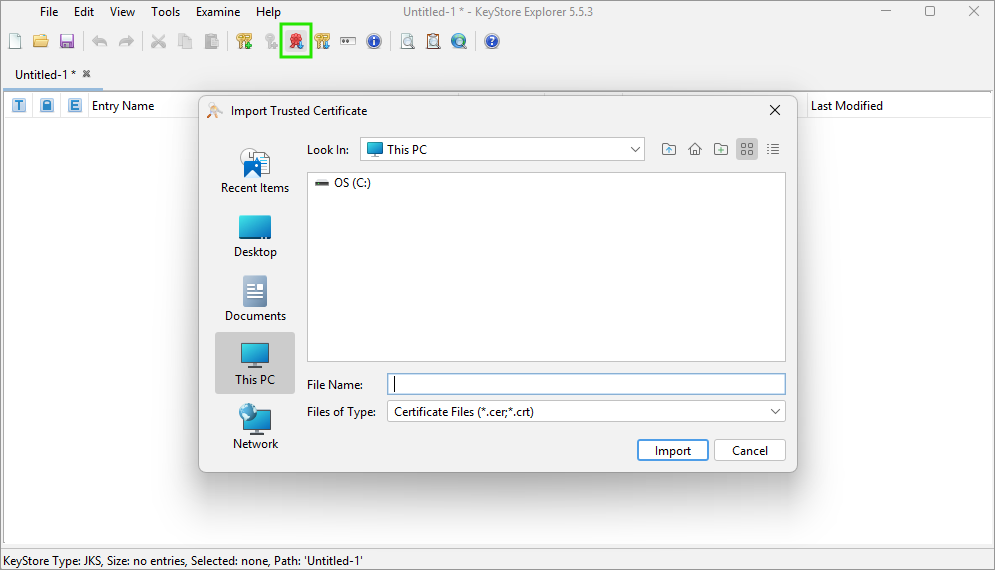
*Figure 81. Select the certificate to import*

Leave the pre-filled alias or modify it as needed. The alias can always be changed by right-clicking on the key pair and selecting the *Rename* option.

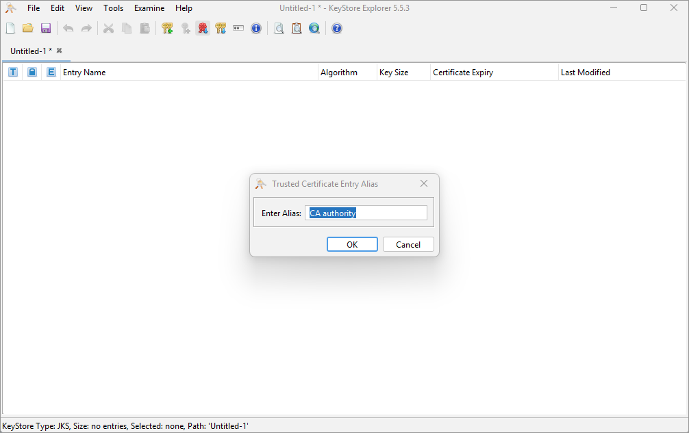
*Figure 82. Enter an alias name for the certificate*

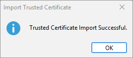
*Figure 83. Successful import*

Now save the truststore (click on Save or press Ctrl+S). You will be prompted to enter and confirm a password.

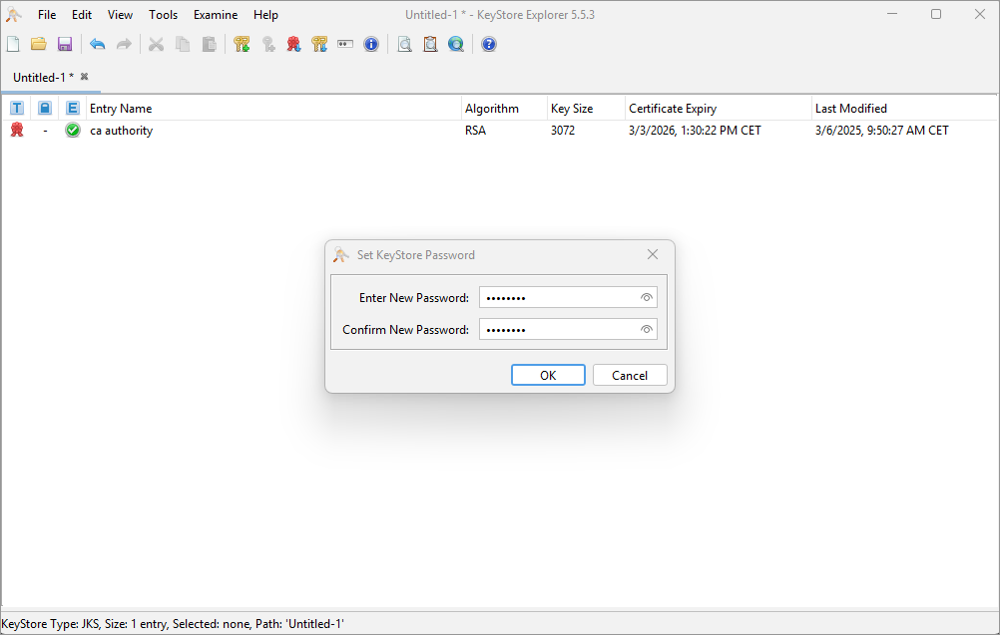
*Figure 84. Creating truststore password*

Save the truststore as a keystore file.

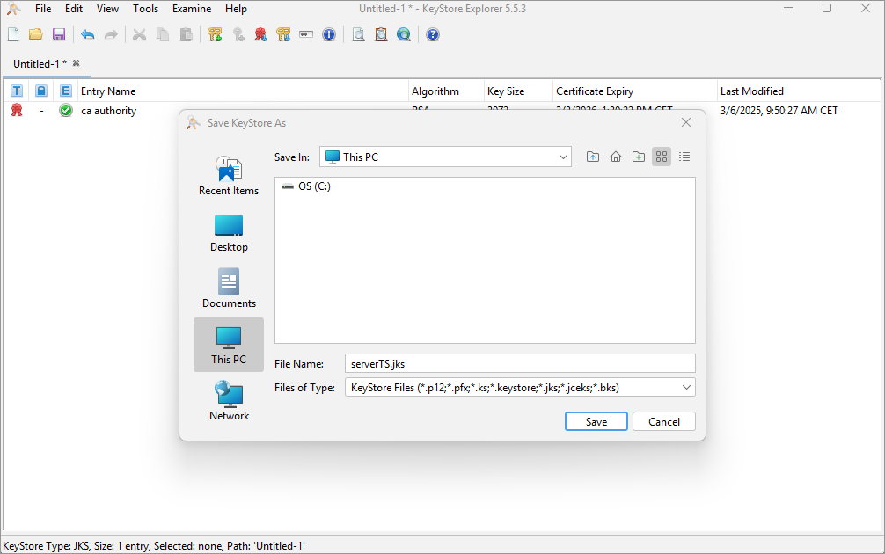
*Figure 85. Saving the .jks file*

#### Server configuration

To configure your application server to use the server truststore, perform the following steps:

1. Move the generated truststore `.jks` file to the `<TOMCAT_INSTALL_DIR>/conf` directory.
2. Edit the `server.xml` file and add the `trustoreFile` and `truststorePass` properties to the SSL connector.

```
<Listener
    className="org.apache.catalina.core.AprLifecycleListener"
    SSLEngine="off"
/>
<Connector
    protocol="org.apache.coyote.http11.Http11NioProtocol"
    port="8443"
    maxThreads="200"
    maxParameterCount="1000"
    SSLEnabled="true">
    <SSLHostConfig
        certificateVerification="required"
        truststoreFile="pathToTomcatDirectory/conf/serverTS.jks"
        truststorePassword="p4ssw0rd">
        <Certificate
            certificateKeystoreFile="pathToTomcatDirectory/conf/serverKS.jks"
            certificateKeystorePassword="p4ssw0rd"
            type="RSA"
         />
    </SSLHostConfig>
</Connector>
```

##### Important notes

- *truststoreFile*: Use forward slashes (/) in the `keystoreFile` path, both on Linux and Windows.
- *truststorePass*: Replace `p4ssw0rd` with your actual keystore password.

After making these changes, restart your CloverDX Server.

#### Designer configuration

Move the keystore `.jks` file to a directory accessible by CloverDX Designer. Locate the `CloverDXDesigner.ini` file in the Designer install directory. Edit it and add the following configuration:

```
-Djavax.net.ssl.keyStore=locationOfClientFiles/clientKS.jks
-Djavax.net.ssl.keyStorePassword=p4ssw0rd
```

##### Important notes

- *keyStore*: Use forward slashes (/) in the `keystoreFile` path.
- *keyStorePassword*: Replace `p4ssw0rd` with your actual keystore password.

After making these changes, restart your CloverDX Designer.

### Engine configuration

**CloverDX** internal settings (defaults) are stored in the `defaultProperties` file located in the **CloverDX** engine. This source file contains various parameters that are loaded at run-time and used during transformation execution. We **do not** recommend changing values in this file.

In Designer, the path to the file is `plugins/com.cloveretl.gui/lib/lib/cloveretl.engine.jar`. In Server Core, the path to the file is `WEB-INF/lib/cloveretl.engine.jar`.

If you need to change the default setting, create a local file with only those properties you need to override and place the file in the project directory. To instruct **CloverDX** to retrieve the properties from this local file, go to **Window** ****Preferences** ****CloverDX** ****CloverDX Runtime** and either define the path to the file in the **CloverDX Engine Properties** field or put the following parameter in the **VM parameters** field:

`-Dclover.engine.config.file=/full/path/to/file.properties`

**Note:** engine properties must be set for each workspace individually.

#### Content of defaultProperties file

Here we present some of the properties and their values as they are presented in the `defaultProperties` file:

- `Record.RECORD_LIMIT_SIZE = 268435456`
  Limits the maximum size of a record. Theoretically, the limit can be set very high, but you should keep it as low as possible for an easier error detection. For more details on memory demands, see [Edge memory allocation](../developer/edge.md#edge-memory-allocation).
- `Record.RECORD_INITIAL_SIZE = 65536`
  Sets the initial amount of memory allocated to each record. The memory can grow dynamically up to `Record.RECORD_LIMIT_SIZE`, depending on how memory-greedy an edge is. See [Edge memory allocation](../developer/edge.md#edge-memory-allocation).
- `Record.FIELD_LIMIT_SIZE = 268435456`
  Limits the maximum size of one field within a record. For more details on memory demands, see [Edge memory allocation](../developer/edge.md#edge-memory-allocation).
- `Record.FIELD_INITIAL_SIZE = 65536`
  Sets the initial amount of memory allocated to each field within a record. The memory can grow dynamically up to `Record.FIELD_LIMIT_SIZE`, depending on how memory-greedy an edge is. See [Edge memory allocation](../developer/edge.md#edge-memory-allocation).
- `Record.DEFAULT_COMPRESSION_LEVEL = 5`
  This sets the compression level for compressed data fields (`cbyte`).
- `DEFAULT_INTERNAL_IO_BUFFER_SIZE = 32768`
  Determines the internal buffer size the components allocate for I/O operations. Increasing this value affects performance negligibly.
- `USE_DIRECT_MEMORY = false`
  The **CloverDX** engine can use direct memory for data records manipulation. For example, underlying memory of CloverBuffer (container for serialized data records) uses direct memory (if the usage is enabled). This attribute is by default `false`.
  Using direct memory can slightly improve performance in some cases. However, direct memory is out of control of a Java Virtual Machine, as the direct memory is allocated outside of the Java heap space in direct memory. If `OutOfMemory` exception occurs and usage of direct memory is enabled, try to turn it off.
  In **CloverDX 4.9.0-M2**, the default value was changed from `true` to `false`.
- `DEFAULT_DATE_FORMAT = yyyy-MM-dd`
- `DEFAULT_TIME_FORMAT = HH:mm:ss`
- `DEFAULT_DATETIME_FORMAT = yyyy-MM-dd HH:mm:ss`
- `DEFAULT_REGEXP_TRUE_STRING = true|T|TRUE|YES|Y|t|1|yes|y`
- `DEFAULT_REGEXP_FALSE_STRING = false|F|FALSE|NO|N|f|0|no|n`
- `DataParser.DEFAULT_CHARSET_DECODER = UTF-8`
- `DataFormatter.DEFAULT_CHARSET_ENCODER = UTF-8`
- `Lookup.LOOKUP_INITIAL_CAPACITY = 512`
  The initial capacity of a lookup table when created without specifying the size.
- `DataFieldMetadata.DECIMAL_LENGTH = 12`
  Determines the default maximum precision of decimal data field metadata. Precision is the number of digits in a number, e.g. the number 123.45 has a precision of 5.
- `DataFieldMetadata.DECIMAL_SCALE = 2`
  Determines the default scale of decimal data field metadata. Scale is the number of digits to the right of the decimal point in a number, e.g. the number 123.45 has a scale of 2.
- `Record.MAX_RECORD_SIZE = 33554432`
  > [!NOTE]
  > This is a deprecated property. Nowadays, you should use `Record.RECORD_LIMIT_SIZE`.
  Limits the maximum size of a record. Theoretically, the limit is tens of MBs, but you should keep it as low as possible for easier error detection.
> [!IMPORTANT]
> You can define locale that should be used as the default one.
>
> The setting is the following:
>
> `# DEFAULT_LOCALE = en.US`
>
> By default, system locale is used by **CloverDX**. If you uncomment this row you can set the `DEFAULT_LOCALE` property to any locale supported by **CloverDX**, see the [List of all locale](../developer/metadata-records-and-fields.md#locale-list-all).
>
> Similarly, the default time zone can be overridden by uncommenting the following entry:
>
> `# DEFAULT_TIME_ZONE = 'java:America/Chicago';'joda:America/Chicago'`
>
> For more information about time zones, see the [Time zone](../developer/metadata-records-and-fields.md#timezone) section.

#### Properties specific to Wrangler

- `CSVAnalyzer.LINES_TO_ANALYZE = 1000`
  Maximum number of lines read during metadata analysis of a CSV data file. This sets the data sample size Wrangler uses to detect columns and their data types for CSV sources.
- `CSVAnalyzer.BYTES_TO_ANALYZE = 524288`
  Maximum number of bytes read during metadata analysis of a CSV data file. This sets the data sample size Wrangler uses to detect columns and their data types for CSV sources.
- `CSVAnalyzer.MAJORITY_TYPE_GUESS_THRESHOLD = 90`
  The confidence needed for CSV data type detection of a column, in percent. With default setting, 90% or more values in a column must contain integer number for Wrangler to detect the column as integer. If only 89% of values are integers Wrangler will attempt to generalize the data type to a larger data type such as decimal or string.
- `XLSAnalyzer.LINES_TO_ANALYZE = 1000`
  Maximum number of lines read during metadata analysis of an Excel file. This sets the data sample size Wrangler uses to detect columns and their data types for Excel sources.
- `Wrangler.MAX_NUMBER_OF_COLUMNS = 1000`
  Maximum number of columns allowed in Wrangler data set. Data sets with more columns are rejected and cannot be worked with.
- `Wrangler.DEFAULT_SORT_LOCALE = en.US`
  Locale used for sorting wrangler data sets. If not specified DEFAULT_LOCALE is used.
> [!NOTE]
> Compatibility
> In **4.4.0-M2**, the default encoding was changed from ISO-8859-1 to UTF-8. Therefore, `DataParser.DEFAULT_CHARSET_DECODER` and `DataFormatter.DEFAULT_CHARSET_ENCODER` were set to UTF-8.
