<!-- Administration > Configuration > Designer configuration -->

## 8. Designer configuration


*Figure 60. CloverDX Server Integration*

| Option | Description | Default Value |
| --- | --- | --- |
| **Edge debug temp directory** |  |  |
| Use alternate debug folder | Allows the user to specify the path to an alternate folder containing edge debug files (`.dbg`). | disabled |
| **OpenSSH configuration file** |  |  |
| Use OpenSSH configuration file | Specifies the location of the OpenSSH configuration file which allows you to define SSH access outside of **CloverDX Designer**. The path to the file is `~/path/to/.ssh/ssh_config` There is no default file; therefore, without proper specification, no configuration file is loaded. Enabling/disabling this option requires restart of the **CloverDX Designer** runtime to take effect. | disabled |
| SSH key passphrases | Specifies list of passphrases for SSH keys used in Designer dialogs and jobs executed in Runtime environment. Each line represents one passphrase used by a specific SSH key. The line content should be `[key identity]=[passphrase]`. The key identity can be `[username]@[hostname]` or just `[hostname]`. For example `john@my-sftp-server.com=changeit`. If the key is stored in project’s `ssh-keys` directory the identity has to match the name of the file without the `.key` suffix. If OpenSSH configuration file is used the identity has to match the information stored in the configuration. Also in this case the `[username]` is optional. |  |
| **Appearance** |  |  |
| Show component icon | Switches component icons on or off. | enabled |
| Show component background | Enables or disables the background color of components. | enabled |
| Auto-resize components | Automatically adjusts components' size to fit their name. | enabled |
| Show component description | Displays or hides components' description in a graph. If **Display default component description** is disabled, only user-defined description is visible. | enabled |
| Display default component description | When **Show component description** is enabled, it shows the components' default description (e.g. path to the file in **Readers** or **Writers**). | enabled |
| Route edges to avoid overlap | Enables or disables different edge-routing algorithm. | enabled |
| Show rich tooltips | Enables or disables detailed tooltips on edges. | enabled |
| Check graph configuration | Enables or disables graph configuration check. Without checking, errors on components are not displayed. | enabled |
| Show graph configuration errors/warnings in Project Explorer | Allows to suppress detected configuration errors and warnings in **Project Explorer** and **Problems** views. | enabled |
| Detect unused graph elements | Enables or disables updates and reporting of used/unused graph elements. Disabling can solve some specific performance issues. | enabled |
| Validate classpath | Checks whether the content of the classpath file is valid for both **Designer** and **Server**. Can be disabled in case it significantly slows down the working process (opening new projects, etc.) or indicates false positives. | enabled |
| Generate component ID from its name | Generates component identifier based on its name. | enabled |
| Open context menu for newly created edge | Opens the context menu after creating an edge between two components. In the menu, you can select metadata for the edge. | disabled |

### Runtime Configuration

CloverDX Runtime is one of architectural layers of **CloverDX Designer**. It takes care of running graphs and subgraphs.

Current state of CloverDX Runtime can be seen in the right bottom corner of the perspective.

CloverDX Runtime is configured in the **Preferences** dialog: open **Window** ****Preferences** and choose **CloverDX** ****CloverDX Runtime**.

The CloverDX Runtime Configuration serves to set up:

#### Temporary Disk Space Settings

The temporary disk space is necessary for debug files. You can store temporary files either into a temporary directory within the workspace directory or into a user-defined directory.

#### Engine configuration

Change max record size, etc. See [Engine configuration](designer-configuration.md#engine-configuration).

#### Java Runtime Environment to be Used

See [Java Configuration](designer-configuration.md#java-configuration) for more information.

#### Amount of Memory for Java Heap Size

It is important to define some memory size, because Java Virtual Machine requires memory to run graphs.

#### Additional Virtual Machine Parameters

Additional libraries can be added to the classpath.

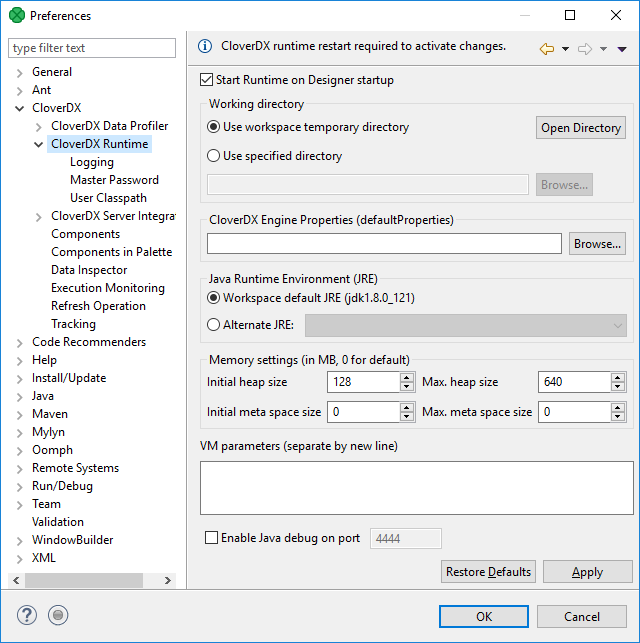
*Figure 61. CloverDX Runtime*

To take effect of the changes in runtime configuration, restart of CloverDX Runtime is needed. The runtime menu is accessible in the right bottom corner of CloverDX window.

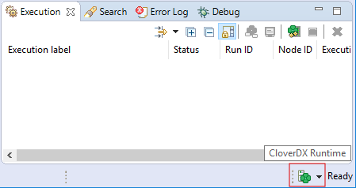
*Figure 62. Accessing CloverDX Runtime menu*

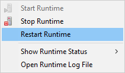
*Figure 63. Restarting CloverDX Runtime*
Example 3. Adding an External Library to Classpath
To add an external library to the **CloverDX runtime**'s classpath, the `-Djava.library.path=path/to/library` option should be used.

To add libraries `located in C:/path/to/lib`, type `-Djava.library.path=C:\path\to\lib` into the **VM parameters** field.

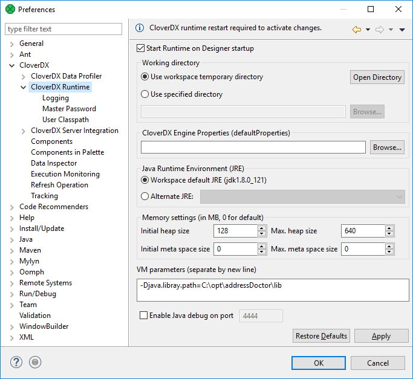
*Figure 64. Adding library to classpath using VM parameters*

#### Additional VM Parameter

##### Server mode (-server)

There are two flavors of JVM: client and server. The client system (default) is optimal for applications which need fast start-up times or small footprints. Switching to server mode is advantageous to long-running applications for which reaching the maximum program execution speed is generally more important than having the fastest possible start-up time. To run the server system, Java Development Kit (JDK) needs to be downloaded.

#### Logging

CloverDX Runtime writes its logs into **Console** tab.

Here you can set up messages of which severity are written down. If you set up a particular level, you can see messages of the specified level and more severe ones. For example, if you set up level to INFO, messages of INFO and WARN levels are logged.

Do not forget to restart the **CloverDX Engine** to take effect of the change.

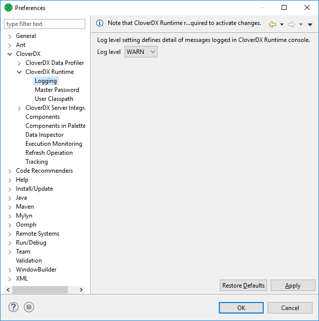
*Figure 65. CloverDX Runtime - Logging*

#### Master Password

**Master Password** serves for encryption and decryption of [Secure graph parameters](../developer/parameters.md#secure-graph-parameters).

You need to set up the **Master Password** to be able to use the **Secure parameters** on **CloverDX Designer**.

The maximum length of the master password is 255 characters; there are no other restrictions or complexity requirements.

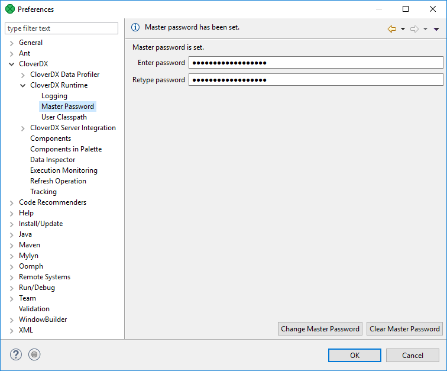
*Figure 66. Setting the Master password*

If you use the **Clear Master Password** button, restart of **CloverDX Runtime** is required.

#### User Classpath

You can add your own libraries to the CloverDX Runtime classpath.

##### User Entries

Add your libraries under **User Entries**.

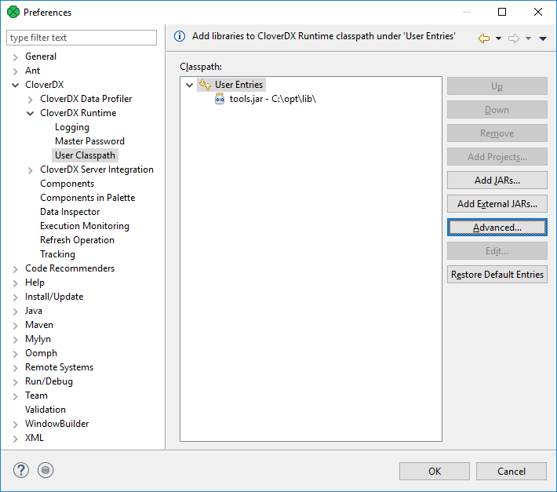
*Figure 67. CloverDX Runtime - User Classpath*

##### Add Projects

**Add Project** adds the source code of a project and all libraries of the project which are marked as exported to the classpath.

Note: Libraries can be marked as exported using **Properties** ****Java Build path** in context menu of corresponding project.

##### Add JARs

Adds `.jar` file(s). The files have to be within the workspace.

##### Add External JARs

Adds `.jar` file(s). The files do not have to be within the workspace, they may be placed within an arbitrary directory on the file system.

##### Advanced

The **Advanced** button opens an additional dialog to choose not frequently used options.

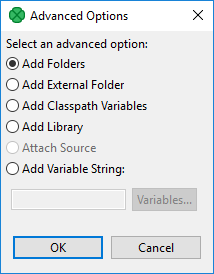
*Figure 68. User Classpath - Advanced Options*

##### Add Folder

Adds a folder with `.class` files within the workspace.

##### Add External Folder

Adds a folder with `.class` files. The folder can be on arbitrary place within the system, it does not have to be in the workspace.

##### Add Classpath Variables

Adds a variable name pointing to a `.jar` file, folder with `.class` files. It may be within the workspace or out of the workspace.

##### Add Library

Adds a library (`.jar` file or set of `.class` files with a predefined name).

Opens a wizard for adding a library. You can use it, for example, to add CloverDX Engine libraries.

##### Add Variable String

Adds an environment variable. The value of the variable will be added to the classpath.

### CloverDX Server integration

**Preferences of CloverDX Server Integration** allow you to tweak communication between **Designer** and **Server**.

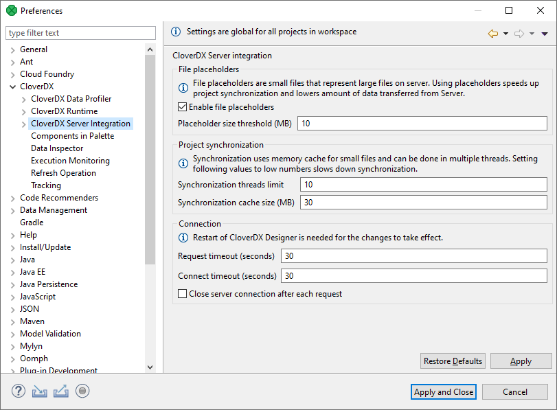
*Figure 69. CloverDX Server Integration*

| Option | Description | Default Value |
| --- | --- | --- |
| Enable File Placeholders | Enables usage of *placeholder files*. The *placeholder file* serves to save your disk space and to speed up synchronization in server projects. The files with a size above the specified limit are replaced with *placeholder files* (in **Designer**).  Usually, you do not need to see the content of these files and you do not commit them into repository. See [CloverDX Server project](../developer/cloverdx-projects-type.md#cloverdx-server-project). | enabled |
| Placeholder Size Threshold | Files above this threshold are replaced with *placeholder files*. The size is in MB. | 10 |
| Synchronization Threads Limit | The maximum number of threads used for synchronization between **CloverDX Designer** and **CloverDX Server**. Using more threads can speed up synchronization in networks with high latency but can also decrease **CloverDX Server** performance. | 10 |
| Synchronization Cache Size | While downloading files from **CloverDX Server** during synchronization, the content of files is cached in memory to improve the performance. This parameter sets the cache size. | 30 |
| Request Timeout | A request timeout of connection to **CloverDX Server**. The request timeout is in seconds. | 30 |
| Connect Timeout | Timeout of the connection to **CloverDX Server**. The timeout is in seconds. | 30 |
| Close server connection after each request | Enables closing the connection to the server after each request. Used for performance tuning. | false |

Restart **CloverDX Designer** to use new timeout values.

#### Ignored files

The *Ignored files* setting allows you to avoid synchronization of particular files.

You should not synchronize metadata of version control systems. By default, we exclude metadata files and directories of the most common ones: Bazaar, CVS, Git, Mercurial, Subversion. If you use any other version control system, add its metadata files to the list.

The configuration has the same syntax as the `.gitignore` file.

This is a global (workspace-scope) configuration template. When a new project is created, this content is copied into the new project configuration. Therefore, any change of this configuration does not change configuration of any existing project.

See also [Ignored files](designer-configuration.md#ignored-files) in project configuration.

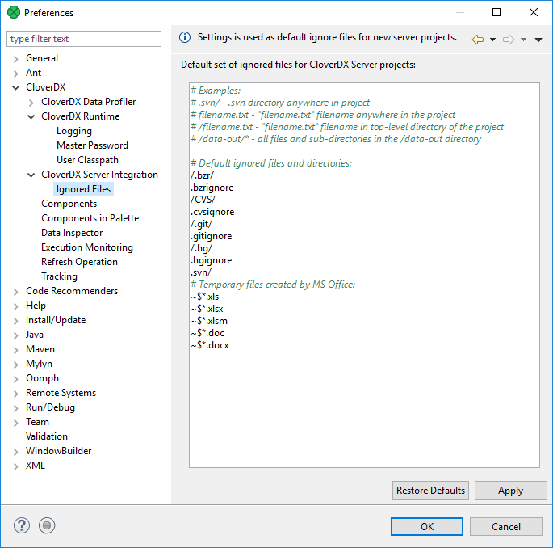
*Figure 70. CloverDX Server Integration*

### Execution monitoring

**Execution Monitoring** lets you set up status and log update intervals.

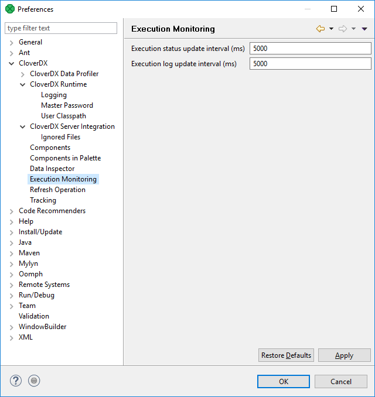
*Figure 71. Execution Monitoring*

Refreshing the `data-out` folder is described in [Refresh operation](designer-configuration.md#refresh-operation).

### Java configuration

The JDK installed during **CloverDX Designer** installation is also used to compile and run your Java and CTL code in local projects. By default, the Designer is installed with the recommended *Eclipse Temurin JDK version 21*.

When running your jobs in a **CloverDX Server** environment, the jobs are run with the Java version configured in the Server environment. If your **CloverDX Server** runs on *Eclipse Temurin JDK 21*, there is no need to add a different JDK. If your Server environment runs on a different JDK (refer to our Compatibility Matrix [here](../admin/system-requirements-for-cloverdx-server.md)), the default *Eclipse Temurin JDK* version should in most cases work without an issue as well. However, if you want to ensure that you are developing your code with the same Java version as is configured on the server, you can add the desired JDK and globally change the Java used during runtime.
> [!NOTE]
> Make sure to add a JDK (Java Development Kit) package. JRE (Java Runtime Environment) packages are not supported.

If you want to switch to a different JDK, perform the steps below:

- Go to **Window** > **Preferences**.
- Navigate to **Java** > **Installed JREs**. By default, you will see the Java version selected during the Designer installation.

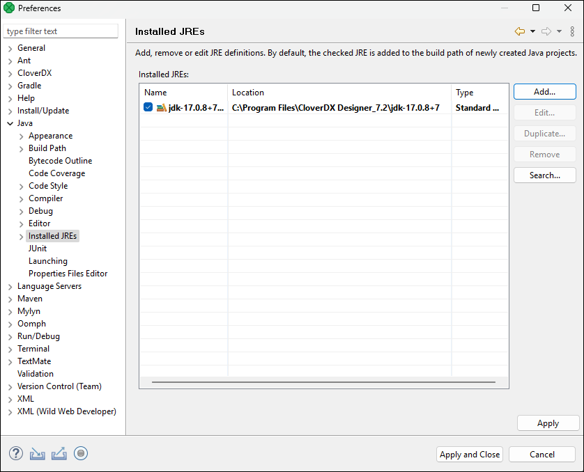
*Figure 72. Installed JREs Wizard*

- To add a new Java installation click on **Add**, select **Standard VM**, and hit **Next**.

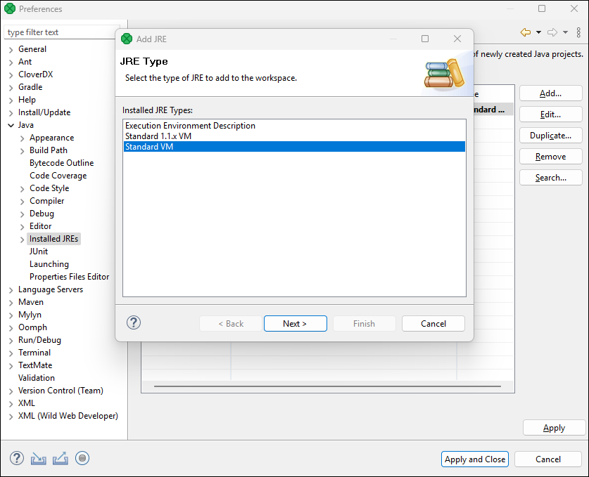
*Figure 73. Adding new JRE*

- Select the directory of the desired JDK and click on **Finish**.

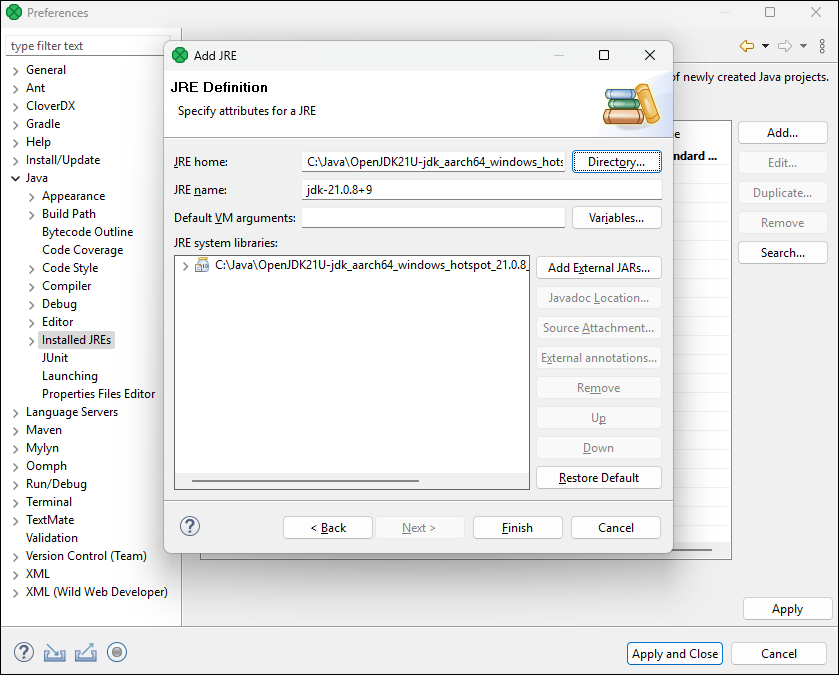

- To start using the JDK, select the checkbox next to it. After saving this change, the JDK is automatically added to the build path of your projects.

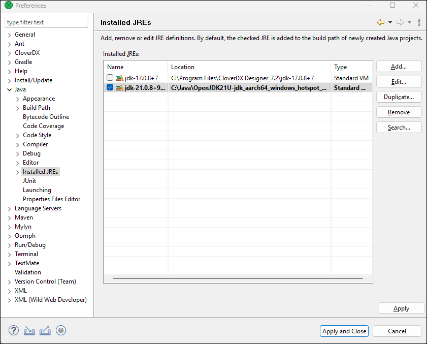
*Figure 74. New default JDK and compliance warning*

### Engine configuration

**CloverDX** internal settings (defaults) are stored in the `defaultProperties` file located in the **CloverDX** engine. This source file contains various parameters that are loaded at run-time and used during transformation execution. We **do not** recommend changing values in this file.

In Designer, the path to the file is `plugins/com.cloveretl.gui/lib/lib/cloveretl.engine.jar`. In Server Core, the path to the file is `WEB-INF/lib/cloveretl.engine.jar`.

If you need to change the default setting, create a local file with only those properties you need to override and place the file in the project directory. To instruct **CloverDX** to retrieve the properties from this local file, go to **Window** ****Preferences** ****CloverDX** ****CloverDX Runtime** and either define the path to the file in the **CloverDX Engine Properties** field or put the following parameter in the **VM parameters** field:

`-Dclover.engine.config.file=/full/path/to/file.properties`

**Note:** engine properties have to be set for each workspace individually.

#### Content of defaultProperties file

Here we present some of the properties and their values as they are presented in the `defaultProperties` file:

- `Record.RECORD_LIMIT_SIZE = 268435456`
  Limits the maximum size of a record. Theoretically, the limit can be set very high, but you should keep it as low as possible for an easier error detection. For more details on memory demands, see [Edge memory allocation](../developer/edge.md#edge-memory-allocation).
- `Record.RECORD_INITIAL_SIZE = 65536`
  Sets the initial amount of memory allocated to each record. The memory can grow dynamically up to `Record.RECORD_LIMIT_SIZE`, depending on how memory-greedy an edge is. See [Edge memory allocation](../developer/edge.md#edge-memory-allocation).
- `Record.FIELD_LIMIT_SIZE = 268435456`
  Limits the maximum size of one field within a record. For more details on memory demands, see [Edge memory allocation](../developer/edge.md#edge-memory-allocation).
- `Record.FIELD_INITIAL_SIZE = 65536`
  Sets the initial amount of memory allocated to each field within a record. The memory can grow dynamically up to `Record.FIELD_LIMIT_SIZE`, depending on how memory-greedy an edge is. See [Edge memory allocation](../developer/edge.md#edge-memory-allocation).
- `Record.DEFAULT_COMPRESSION_LEVEL = 5`
  This sets the compression level for compressed data fields (`cbyte`).
- `DEFAULT_INTERNAL_IO_BUFFER_SIZE = 32768`
  Determines the internal buffer size the components allocate for I/O operations. Increasing this value affects performance negligibly.
- `USE_DIRECT_MEMORY = false`
  The **CloverDX** engine can use direct memory for data records manipulation. For example, underlying memory of CloverBuffer (container for serialized data records) uses direct memory (if the usage is enabled). This attribute is by default `false`.
  Using direct memory can slightly improve performance in some cases. However, direct memory is out of control of a Java Virtual Machine, as the direct memory is allocated outside of the Java heap space in direct memory. If `OutOfMemory` exception occurs and usage of direct memory is enabled, try to turn it off.
  In **CloverDX 4.9.0-M2**, the default value was changed from `true` to `false`.
- `DEFAULT_DATE_FORMAT = yyyy-MM-dd`
- `DEFAULT_TIME_FORMAT = HH:mm:ss`
- `DEFAULT_DATETIME_FORMAT = yyyy-MM-dd HH:mm:ss`
- `DEFAULT_REGEXP_TRUE_STRING = true|T|TRUE|YES|Y|t|1|yes|y`
- `DEFAULT_REGEXP_FALSE_STRING = false|F|FALSE|NO|N|f|0|no|n`
- `DataParser.DEFAULT_CHARSET_DECODER = UTF-8`
- `DataFormatter.DEFAULT_CHARSET_ENCODER = UTF-8`
- `Lookup.LOOKUP_INITIAL_CAPACITY = 512`
  The initial capacity of a lookup table when created without specifying the size.
- `DataFieldMetadata.DECIMAL_LENGTH = 12`
  Determines the default maximum precision of decimal data field metadata. Precision is the number of digits in a number, e.g. the number 123.45 has a precision of 5.
- `DataFieldMetadata.DECIMAL_SCALE = 2`
  Determines the default scale of decimal data field metadata. Scale is the number of digits to the right of the decimal point in a number, e.g. the number 123.45 has a scale of 2.
- `Record.MAX_RECORD_SIZE = 33554432`
  > [!NOTE]
  > This is a deprecated property. Nowadays, you should use `Record.RECORD_LIMIT_SIZE`.
  Limits the maximum size of a record. Theoretically, the limit is tens of MBs, but you should keep it as low as possible for easier error detection.
> [!IMPORTANT]
> You can define locale that should be used as the default one.
>
> The setting is the following:
>
> `# DEFAULT_LOCALE = en.US`
>
> By default, system locale is used by **CloverDX**. If you uncomment this row you can set the `DEFAULT_LOCALE` property to any locale supported by **CloverDX**, see the [List of all locale](../developer/metadata-records-and-fields.md#locale-list-all).
>
> Similarly, the default time zone can be overridden by uncommenting the following entry:
>
> `# DEFAULT_TIME_ZONE = 'java:America/Chicago';'joda:America/Chicago'`
>
> For more information about time zones, see the [Time zone](../developer/metadata-records-and-fields.md#timezone) section.

#### Properties specific for Wrangler

- `CSVAnalyzer.LINES_TO_ANALYZE = 1000`
  Maximum number of lines read during metadata analysis of a CSV data file. This sets the data sample size Wrangler uses to detect columns and their data types for CSV sources.
- `CSVAnalyzer.BYTES_TO_ANALYZE = 524288`
  Maximum number of bytes read during metadata analysis of a CSV data file. This sets the data sample size Wrangler uses to detect columns and their data types for CSV sources.
- `CSVAnalyzer.MAJORITY_TYPE_GUESS_THRESHOLD = 90`
  The confidence needed for CSV data type detection of a column, in percent. With default setting, 90% or more values in a column must contain integer number for Wrangler to detect the column as integer. If only 89% of values are integers Wrangler will attempt to generalize the data type to a larger data type such as decimal or string.
- `XLSAnalyzer.LINES_TO_ANALYZE = 1000`
  Maximum number of lines read during metadata analysis of an Excel file. This sets the data sample size Wrangler uses to detect columns and their data types for Excel sources.
- `Wrangler.MAX_NUMBER_OF_COLUMNS = 1000`
  Maximum number of columns allowed in Wrangler data set. Data sets with more columns are rejected and cannot be worked with.
- `Wrangler.DEFAULT_SORT_LOCALE = en.US`
  Locale used for sorting wrangler data sets. If not specified DEFAULT_LOCALE is used.
> [!NOTE]
> Compatibility
> In **4.4.0-M2**, the default encoding was changed from ISO-8859-1 to UTF-8. Therefore, `DataParser.DEFAULT_CHARSET_DECODER` and `DataFormatter.DEFAULT_CHARSET_ENCODER` were set to UTF-8.
>
> Since **6.0.0**, added Wrangler properties.

### Refresh operation

**Refresh Operation** lets you configure which resources should be refreshed after graph run on a per project basis.

The refresh operation configuration is accessible from the main menu under **Window** ****Preferences**. Choose **CloverDX** ****Refresh Operation** in **Preferences** window.

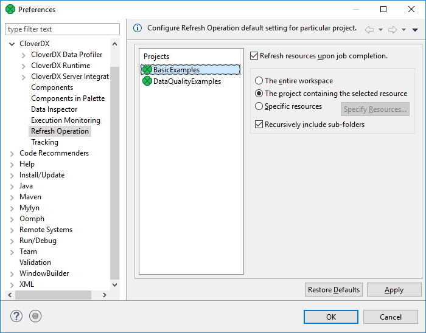
*Figure 75. Refresh Operation*

Choose the project in the middle part of the dialog and specify which resources should be updated.

The **Refresh resources upon job completion** checkbox enables or disables refreshing of resources.

Radio buttons on the right hand side let you choose between refreshing **the entire workspace**, **the project containing the selected resource** or **specific resource**.

The refreshing can be performed in the selected directories or recursively using the **Recursively include sub-folders** option.

Refreshing after graph run can be configured per particular graph, too. See [Run configuration](../developer/running-graphs.md#run-configuration).

### Configuring two-way authentication

To strengthen the security of your CloverDX environment, you can configure two-way authentication between the CloverDX Server and individual Designer instances. This setup involves creating a client keystore with a key pair and server truststore to encrypt data transmission and authenticate communication between the Server and Designers.

#### Configuration overview

The configuration steps in this section build on the [Securing Server with HTTPS](https-server-config.html) chapter and assume that CloverDX Server already has a configured keystore with a keypair and HTTPS enabled. Below is a summary of the steps required to configure secure communication between CloverDX Designer and CloverDX Server using mutual authentication.

1. Create a client keystore with a key pair for CloverDX Designer.
2. If you want to use a certificate signed by a certificate authority (CA):
   1. Create a certificate signing request (CSR).
   2. Send it to your CA for signing.
   3. Import the signed certificate back into its keystore.
> [!NOTE]
> For detailed steps and explanations on keystore, key pair, CSR generation, and certificate import (points 1-2 above), follow the steps in the [Securing Server with HTTPS](https-server-config.html) section.

1. [Export](designer-configuration.md#certificate-export) the self-signed certificate from the client keystore in `.cer` format, or, preferably, obtain the Certificate Authority’s certificate.
2. [Create a server truststore and import the client certificate into it](designer-configuration.md#create-server-truststore-and-import-client-certificate).
3. [Configure your Server’s application server](designer-configuration.md#server-configuration) to use the truststore.
4. [Configure Designer](designer-configuration.md#designer-configuration) to use the client keystore.

This guide describes two options for certificate and keystore/truststore management:

- Using the [**keytool command**](https://docs.oracle.com/en/java/javase/17/docs/specs/man/keytool.html) (CLI): This method requires familiarity with command-line tools. This method offers granular control over the certificate creation process, empowering you to tailor it to your needs.
- Using [**KeyStore Explorer**](https://keystore-explorer.org/) (GUI): This intuitive graphical interface simplifies the complexities of certificate management, allowing you to quickly and easily generate keystores and key pairs.
> [!NOTE]
> - Tomcat supports three truststore types: *JKS, PKCS11*, and *PKCS12*. Although **JKS** is the recommended and thoroughly tested option, other keystore types may also work. However, we cannot ensure full compatibility or functionality of all Tomcat features and configurations with non-standard keystore types. To maintain optimal compatibility and security, it is best to use **JKS**.
> - The behavior of the `keytool` command might differ between JDK providers and versions. This guide is based on the `keytool` utility in Eclipse Temurin JDK 17.

#### Certificate export

Export your client self-signed certificate in the `.cer` format.
> [!NOTE]
> If your key pair is signed by a certificate authority (CA), the industry standard is to use the CA’s certificate instead of exporting the signed certificate. This ensures that all certificates issued by the CA are automatically trusted. Contact your IT team to obtain your certificate authority’s certificate.

| [Keytool command](https-server-config.html#id_https_config_cli) |
| --- |
| [KeyStore Explorer](https-server-config.html#id_https_config_gui) |

##### Keytool command

Run the following command on the client keystore to export your self-signed certificate. Modify the values accordingly. See [Keytool command breakdown](designer-configuration.md#keytool-command-breakdown) for the command options explanation.

```
keytool -exportcert -alias cloverdxdesigner -file cloverdxdesigner.crt -keystore clientKS.jks -storepass p4ssw0rd
```

###### Keytool command breakdown

- **Alias**: the key alias in the keystore.
- **File**: the output file for the exported certificate.
- **Keystore**: the keystore file from which to export the certificate.
- **Storepass**: keystore password.

##### KeyStore Explorer

Open your keystore, right-click your key pair, and navigate to **Export > Export Certificate Chain.**


*Figure 76. Export certificate chain*

Switch to the **Entire Chain** option and select an export path.


*Figure 77. Export certificate chain*

The certificate is exported to the specified path.


*Figure 78. Successful export*

#### Create server truststore and import client certificate

| [Keytool command](designer-configuration.md#keytool-command) |
| --- |
| [KeyStore Explorer](designer-configuration.md#keystore-explorer) |

##### Keytool command

Run the following command to create a server truststore and import your certificate (self-signed certificate or certificate of the certificate authority used to sign your key pair) into it. Modify the values accordingly. See [Keytool command breakdown](designer-configuration.md#keytool-command-breakdown) for the command options explanation.

```
keytool -importcert -alias cloverdxdesigner -file cloverdxdesigner.crt -keystore serverTS.jks -storetype jks -storepass p4ssw0rd
```

##### Keytool command breakdown

- **Importcert**: imports a certificate into the specified keystore.
- **Alias**: specifies the alias for the certificate.
- **File**: specifies the file containing the certificate to import (cloverdxdesigner.crt).
- **Keystore**: specifies the keystore file to store the certificate.
- **Storetype**: specifies the keystore type (jks).
- **Storepass**: sets password for the keystore.

##### KeyStore Explorer

Open the KeyStore Explorer and click on the **New** button or use the Ctrl+N shortcut. You will be prompted to select the keystore type. Select the `JKS` (Java Key Store) type.


*Figure 79. Create new truststore*

Use the **Import Trusted Certificate** button (or press Ctrl+T) and select the `.crt` file to import.


*Figure 80. Select the certificate to import*

Leave the pre-filled alias or modify it as needed. The alias can always be changed by right-clicking on the key pair and selecting the *Rename* option.


*Figure 81. Enter an alias name for the certificate*


*Figure 82. Successful import*

Now save the truststore (click on Save or press Ctrl+S). You will be prompted to enter and confirm a password.


*Figure 83. Creating truststore password*

Save the truststore as a keystore file.


*Figure 84. Saving the .jks file*

#### Server configuration

To configure your application server to use the server truststore, perform the following steps:

1. Move the generated truststore `.jks` file to the `<TOMCAT_INSTALL_DIR>/conf` directory.
2. Edit the `server.xml` file and add the `trustoreFile` and `truststorePass` properties to the SSL connector.

```
<Listener
    className="org.apache.catalina.core.AprLifecycleListener"
    SSLEngine="off"
/>
<Connector
    protocol="org.apache.coyote.http11.Http11NioProtocol"
    port="8443"
    maxThreads="200"
    maxParameterCount="1000"
    SSLEnabled="true">
    <SSLHostConfig
        certificateVerification="required"
        truststoreFile="pathToTomcatDirectory/conf/serverTS.jks"
        truststorePassword="p4ssw0rd">
        <Certificate
            certificateKeystoreFile="pathToTomcatDirectory/conf/serverKS.jks"
            certificateKeystorePassword="p4ssw0rd"
            type="RSA"
         />
    </SSLHostConfig>
</Connector>
```

##### Important notes

- *truststoreFile*: Use forward slashes (/) in the `keystoreFile` path, both on Linux and Windows.
- *truststorePass*: Replace `p4ssw0rd` with your actual keystore password.

After making these changes, restart your CloverDX Server.

#### Designer configuration

Move the keystore `.jks` file to a directory accessible by CloverDX Designer. Locate the `CloverDXDesigner.ini` file in the Designer install directory. Edit it and add the following configuration:

```
-Djavax.net.ssl.keyStore=locationOfClientFiles/clientKS.jks
-Djavax.net.ssl.keyStorePassword=p4ssw0rd
```

##### Important notes

- *keyStore*: Use forward slashes (/) in the `keystoreFile` path.
- *keyStorePassword*: Replace `p4ssw0rd` with your actual keystore password.

After making these changes, restart your CloverDX Designer.
