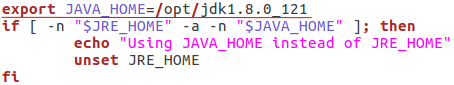
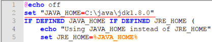

<!-- Administration > Installation > Server installation > Manual installation > Installing Evaluation Server -->

#### Installing Evaluation Server

The default installation of **CloverDX Server** uses embedded Apache Derby DB; therefore, it does not require any external database server or subsequent configuration, as **CloverDX Server** configures itself during the first startup.

Database tables and some necessary records are automatically created on the first startup with an empty database.
> [!IMPORTANT]
> The Apache Derby DB, bundled with the Evaluation Server, is **not** supported for production environment. It is supported for evaluation purposes with Tomcat 10.1 application container only. Please use one of the supported database systems.

By performing a subsequent configuration, you can evaluate other **CloverDX Server** features (e.g. [sending emails](../operations/tasks.md#send-an-email), [LDAP authentication](ldap-authentication.md), [clustering](cluster-setup-index.md), etc.). This way, you can also prepare the Evaluation Server for production environment. However, note that the embedded Apache Derby database is **not** supported for production environment. Therefore, before the subsequent configuration, choose one of the supported external dedicated databases.

If the **CloverDX Server** must be evaluated on application containers other than Tomcat, or you prefer a different database system, proceed with a common installation of [Production Server](production-server.md)
> [!NOTE]
> Default login credentials for **CloverDX Server** Console are:
>
> **Username:** clover
>
> **Password:** clover

##### Installation

1. Make sure you have a compatible Java version:
   Eclipse Temurin JDK 17 or JDK 21 is required.
2. Download and extract the **CloverDX** Evaluation Server.
   1. Log into your CloverDX account and download the Evaluation Server Bundle.
   2. Extract the `.zip` archive. The name of the file is `CloverDX.<version>.Tomcat-<version>.zip`.
   > [!NOTE]
   > It is recommended to place the extracted content on a path that does not contain space character(s).
   >
   > `C:\Program Files` or `/home/user/some dir`
   >
   > `C:\Users\Username` or `/home/user/some_dir`
3. Set the `JAVA_HOME` Environment Variable:
   - **Unix-like systems:**
     - Open the `/bin/setenv.sh` file and define the path at the beginning of the file:
       ```bash
       export JAVA_HOME=/opt/jdk-17.0.18+10
       ```
       
       *Figure 31. setenv.sh edited in Linux.*
   - **Windows system:**
     - Open the `/bin/setenv.bat` file and define the path at the beginning of the file:
       ```bat
       set "JAVA_HOME=C:\java\jdk-17.0.18+10"
       ```
       
       *Figure 32. setenv.bat edited in Windows.*
4. Run Tomcat.
   - **Unix-like systems:** run `/bin/startup.sh`.
   - **Windows system:** run `\bin\startup.bat`.
5. Log in **CloverDX Server**.
   1. Type `http://localhost:8083/clover/` in your browser.
   2. [Activate](production-server.md#activation) the **CloverDX Server**.
   3. Use the **default administrator credentials** to access the web GUI:
      **Username:** clover
      **Password:** clover
6. **CloverDX Server** is now installed and prepared for basic evaluation. There are couple of sandboxes with various demo transformations installed.
   > [!NOTE]
   > To safely stop the server, run `/bin/shutdown.sh` or `\bin\shutdown.bat` on Unix-like or Windows system respectively.
