<!-- Administration > Configuration > Server configuration > Securing Server with HTTPS -->

### Securing Server with HTTPS

This guide explains how to set up HTTPS for your CloverDX Server at the application server level. HTTPS encrypts communication between your server and clients, ensuring data security and user trust.

Before proceeding, consider which **certificate approach** you want to go with. There are two main approaches to securing your CloverDX Server with HTTPS:

1. **Self-signed certificate**: This is a simpler option, but the certificate won’t be trusted by default by web browsers. It’s suitable for testing environments or internal deployments.
2. **Signed certificate from a certificate authority (CA)**: This offers the highest level of trust because the certificate is validated by a trusted authority (internal or external commercial CA). It’s recommended for production environments where you want to avoid browser warnings.

Our guide describes two options for certificate and keystore creation and management:

- Using the [**keytool command**](https://docs.oracle.com/en/java/javase/17/docs/specs/man/keytool.html) (CLI): This method requires familiarity with command-line tools. This method offers granular control over the certificate creation process, empowering you to tailor it to your needs.
- Using [**KeyStore Explorer**](https://keystore-explorer.org/) (GUI): This intuitive graphical interface simplifies the complexities of certificate management, allowing you to quickly and easily generate keystores and key pairs.
> [!NOTE]
> - The provided steps and commands are general guidelines for certificate generation. Always consult your Certificate Authority (CA) and internal security policies for specific requirements and best practices.
> - Tomcat supports three keystore types: *JKS, PKCS11*, and *PKCS12*. Although **JKS** is the recommended and thoroughly tested option, other keystore types may also work. However, we cannot ensure full compatibility or functionality of all Tomcat features and configurations with non-standard keystore types. To maintain optimal compatibility and security, it is best to use **JKS**.
> - The behavior of the `keytool` command might differ between JDK providers and versions. This guide is based on the `keytool` utility in Eclipse Temurin JDK 17.

#### Configuration overview

Here’s a summary of the steps to enable HTTPS for your CloverDX Server:

1. [Create a keystore and key pair](https-server-config.html#id_keystore_key_pair_creation).
2. If you need a CA-signed certificate:
   1. Generate a [certificate signing request (CSR)](https-server-config.html#id_https_csr) and have it signed by a CA.
   2. [Import the signed certificate](https-server-config.html#id_https_ca_reply) into your keystore.
3. [Configure your application server](https-server-config.html#id_https_tomcat_ks) to use the keystore.

#### Creating a keystore and key pair

| [Keytool command](https-server-config.html#id_https_config_cli) |
| --- |
| [Keystore Explorer](https-server-config.html#id_https_config_gui) |

##### Keytool command

The commands below will generate a JKS keystore and keypair with example defaults. See [Keytool command breakdown](https-server-config.html#id_https_config_cli_breakdown) for the command options explanation.

```
keytool -genkeypair -alias cloverdxserver -keyalg RSA -storetype jks -keystore ./serverKS.jks \
        -keypass p4ssw0rd -storepass p4ssw0rd -validity 365 -keysize 3072 \
        -dname "cn=localhost, ou=Support team, o=CloverDX, c=CZ"
        -ext san=dns:test.example.com,ip:127.0.0.1
```

```
keytool -genkeypair -alias cloverdxserver -keyalg RSA -storetype jks -keystore ./serverKS.jks ^
        -keypass p4ssw0rd -storepass p4ssw0rd -validity 365 -keysize 3072 ^
        -dname "cn=localhost, ou=Support team, o=CloverDX, c=CZ" ^
        -ext san=dns:test.example.com,ip:127.0.0.1
```

###### Keytool command breakdown

- **Alias**: specifies an alias for the key.
- **Keyalg**: sets the key algorithm. Only RSA is supported.
- **Storetype**: Specifies the storetype (jks).
- **Keystore**: sets the keystore file name to store the certificate.
- **Storepass**: password for the keystore.
- **Keypass**: password for the private key.
- **Validity**: validity in days.
- **Keysize**: key bit size. For production deployments, at least `3072` is recommended. For non-production deployments, `2048` should suffice. However, always consult your organization’s internal security policies and standards for specific key size requirements.
- **Dname**: sets the Distinguished Name (DN) fields. These fields are especially important when asking a certificate authority (CA) to sign your request. It should uniquely identify your entity. Refer to your CA requirements to see which DN fields they require (e.g. [DigiCert](https://knowledge.digicert.com/general-information/what-is-a-distinguished-name)). In our example below we use 4 values:
  - **Common name** (cn): We use `localhost` as our default hostname. Change it to your desired hostname.
  - **Organizational unit** (ou)
  - **Organization** (o)
  - **Country** (c)
- **Subject alternative name** extension (`-ext san`): allows multiple domain names or IP addresses to be associated with a single certificate.
> [!NOTE]
>  If you’ve chosen the self-signed certificate approach, you can proceed to [Server configuration](https-server-config.html). If you are going with the signed certificate approach, continue with [Certificate signing request (CSR).](https-server-config.html#id_https_csr)

##### KeyStore Explorer

###### Creating a keystore

Open the KeyStore Explorer and click on the **New** button or use the Ctrl+N shortcut. You will be prompted to select the keystore type. Select the `JKS` (Java Key Store) type.

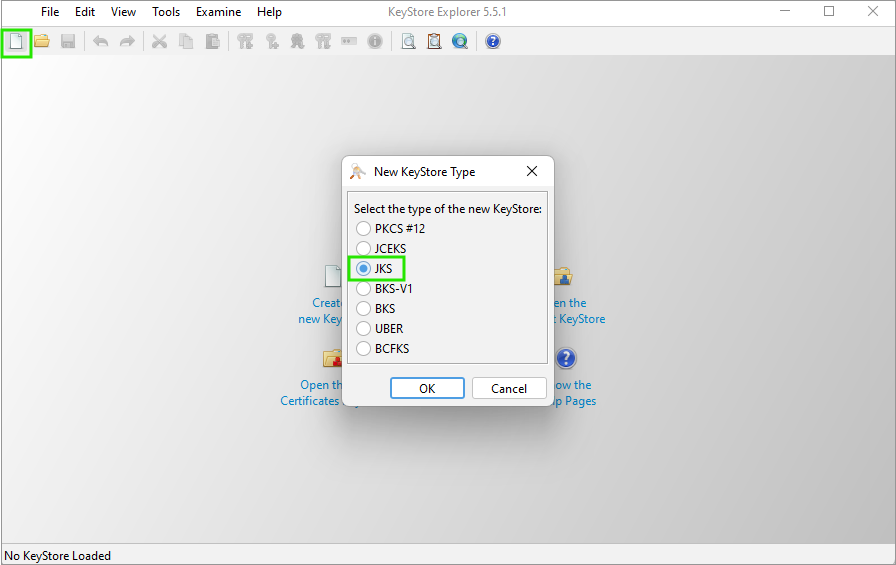
*Figure 105. Create new keystore*

###### Generating a key pair

Click on **Generate Key Pair** or use the Ctrl+G shortcut to generate a key pair. For production deployments, at least `3072` is recommended. For non-production deployments, `2048` should suffice. However, always consult your organization’s internal security policies and standards for specific key size requirements.

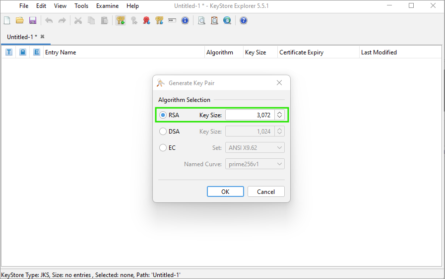
*Figure 106. Algorithm selection*

A new window opens where you can change the **Validity Period**. Then click the **Edit name** button.

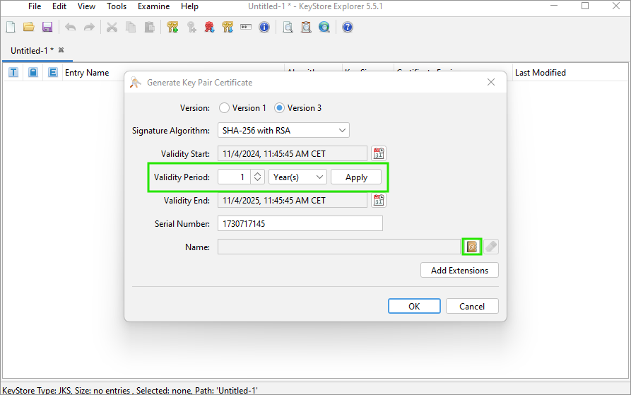
*Figure 107. Validity period and Edit name option*

Fill in the needed Distinguished name fields. For more information, see the [Keytool commands breakdown](https-server-config.html#id_https_config_cli_breakdown) above.

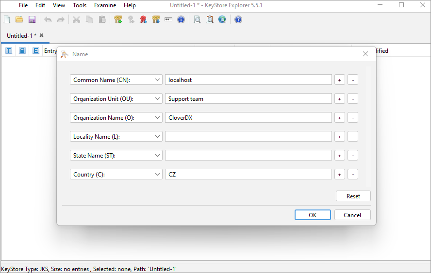
*Figure 108. Distinguished Name options*

Click OK to get to the previous window and click on **Add Extensions**.

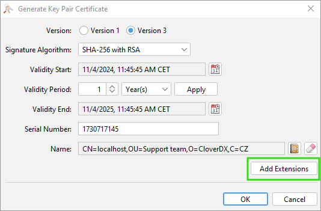
*Figure 109. Add Extensions*

You can display the list of available extensions by clicking on the + button. Add all the extensions required by your certificate authority or by your internal rules. For example, to add the Subject Alternative Name extension, select it from the list, and then add all the alternative IP addresses or DNS names that you need.

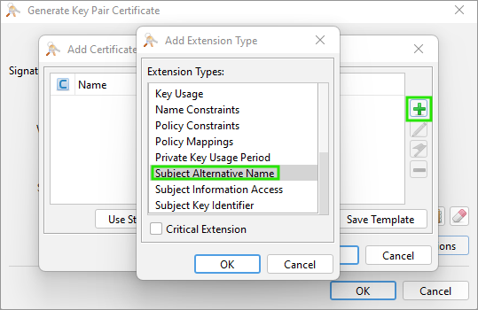
*Figure 110. List of extensions*

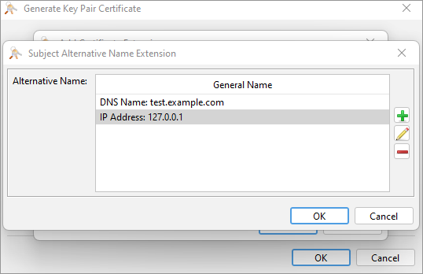
*Figure 111. Subject Alternative Name*

After you fill in all the information that you need and click on the OK button, you will be prompted to enter an alias for your certificate. We will call it “cloverdxserver” in our example. The alias can always be changed by right-clicking on the key pair and selecting the Rename option.

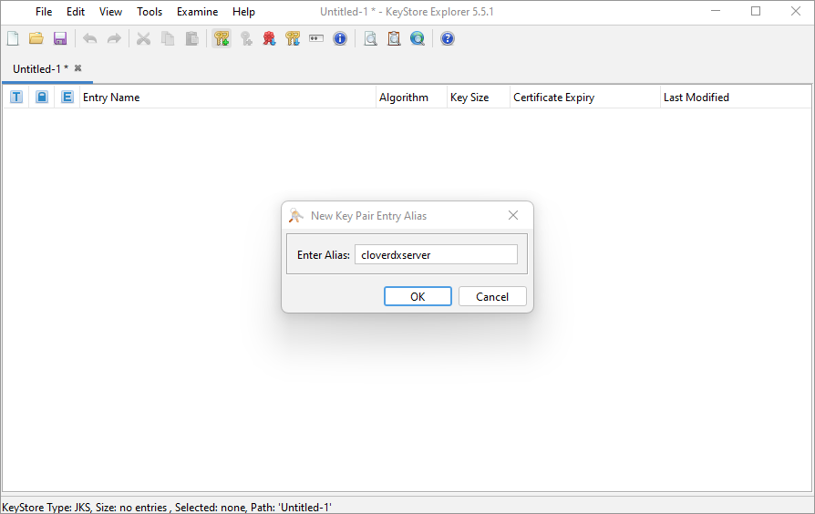
*Figure 112. Enter an alias name for the key pair*

Enter a password for the key pair.

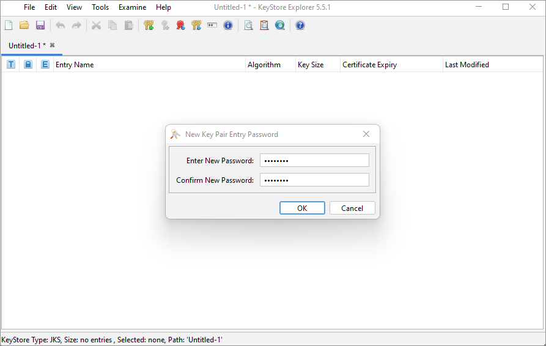
*Figure 113. Password prompt*

You should now see the generated key pair record.

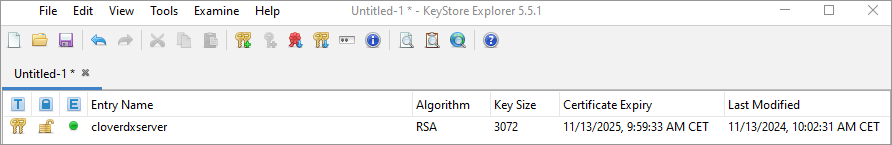
*Figure 114. Successfully generated key pair*

###### Saving the keystore

Now save the keystore (click on Save or press Ctrl+S). You will be prompted to enter and confirm a password - it is recommended to use the same password as used for the key pair.

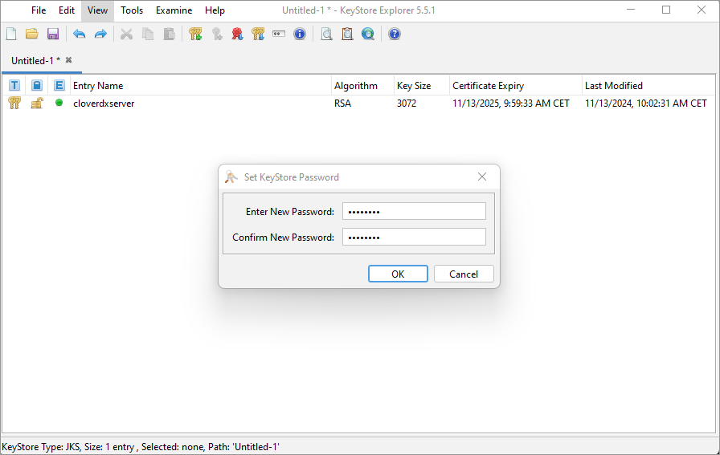
*Figure 115. Creating keystore password*

Save the keystore as a keystore file.

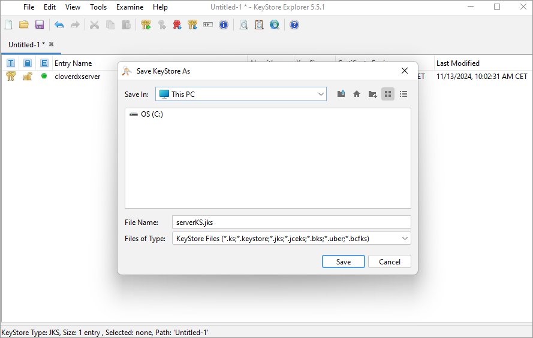
*Figure 116. Saving the .jks file*
> [!NOTE]
>  If you’ve chosen the self-signed certificate approach, you can proceed to [Server configuration](https-server-config.html). If you are going with the signed certificate approach, continue with [Certificate signing request (CSR).](https-server-config.html#id_https_csr)

#### Generating a certificate signing request (CSR)

| [Keytool command](https-server-config.html#id_https_csr_cli) |
| --- |
| [Keystore Explorer](https-server-config.html#id_https_csr_gui) |

To obtain a signed certificate from a certificate authority (CA), you’ll need to generate a certificate signing request (CSR). After generating the CSR, submit it to your chosen certificate authority (CA) for signing. This could be an internal CA within your organization or an external commercial CA. The CA will verify your request and issue a signed certificate.

##### Keytool command

```
keytool -keystore serverKS.jks -certreq -alias cloverdxserver -keyalg rsa \
        -validity 365 \
        -ext san=dns:test.example.com,ip:127.0.0.1 \
        -file server.csr
```

```
keytool -keystore serverKS.jks -certreq -alias cloverdxserver -keyalg rsa ^
        -validity 365 ^
        -ext san=dns:test.example.com,ip:127.0.0.1 ^
        -file server.csr
```

You will be prompted to enter the keystore password.

##### Keytool Explorer

Right-click on your key pair and select **Generate CSR**.

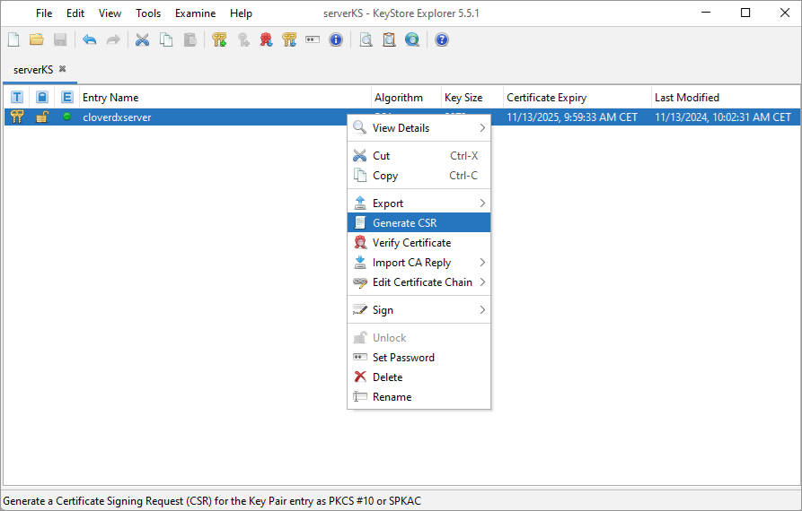
*Figure 117. Generate CSR*

Don’t change any of the defaults, just select the output path and name in the **CSR file** field.

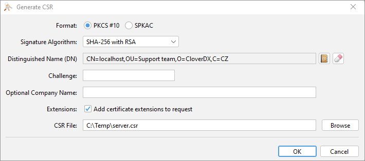
*Figure 118. Export CSR to a file*

#### Importing signed certificate

Once signed, import the signed certificate into your keystore.

| [Keytool command](https-server-config.html#id_https_ca_reply_cli) |
| --- |
| [Keystore Explorer](https-server-config.html#id_https_ca_reply_gui) |

Import the signed certificate into your keystore.

##### Keytool command

Run the following command to import the signed certificate:

```
keytool -importcert -alias cloverdxserver -file careplyfilename.cer -keystore serverKS.jks -trustcacerts
```

##### KeyStore Explorer

Right-click on your key pair, navigate to the **Import CA Reply** option, and select the `.p7r` or `.cer` signature reply file provided by your certificate authority.

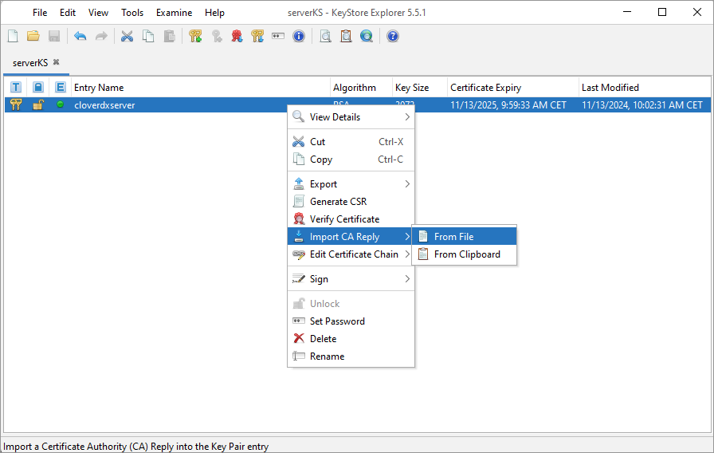
*Figure 119. Import CA reply*

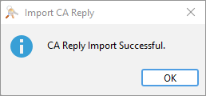
*Figure 120. CA reply was successfully imported*

Make sure to save the keystore changes after importing.

#### Server configuration

To configure your application server to use the keystore and enable HTTPS, follow the steps below:

1. Move the generated `.jks` file to the `<TOMCAT_INSTALL_DIR>/conf` directory.
2. Edit the `server.xml` file and add the following configuration:

```
<!-- Define an SSL Coyote HTTP/1.1 Connector on port 8443 -->
<Connector
    protocol="org.apache.coyote.http11.Http11NioProtocol"
    port="8443"
    maxThreads="200"
    maxParameterCount="1000"
    SSLEnabled="true"
    >
    <SSLHostConfig>
        <Certificate
            certificateKeystoreFile="pathToTomcatDirectory/conf/serverKS.jks"
            certificateKeystorePassword="p4ssw0rd"
            type="RSA"
         />
    </SSLHostConfig>
</Connector>
```

##### Important notes:

- *keystoreFile*: Use forward slashes (/) in the `keystoreFile` path, both on Linux and Windows.
- *keystorePass*: Replace `p4ssw0rd` with your actual keystore password.
- *port number*: Ensure that port 8443 is not blocked by your firewall.

After making these changes, restart your CloverDX Server. Once configured, your CloverDX Server will be accessible via HTTPS on port 8443, e.g., [https://localhost:8443/clover](https://localhost:8443/clover). When connecting for the first time, you will be asked to accept the server certificate. For more information, see [Connecting via HTTPS](../developer/server-projects-usage.md#connecting-via-https).
