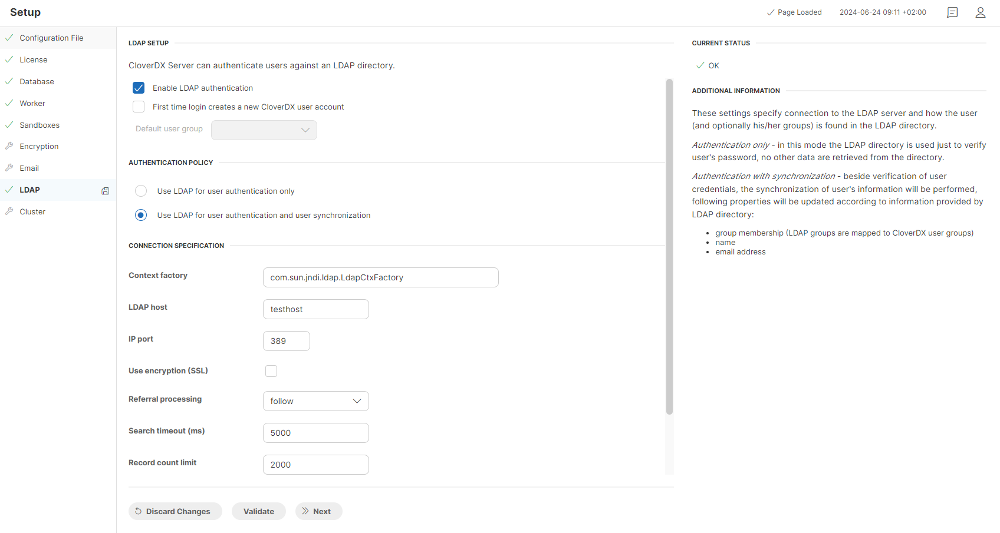
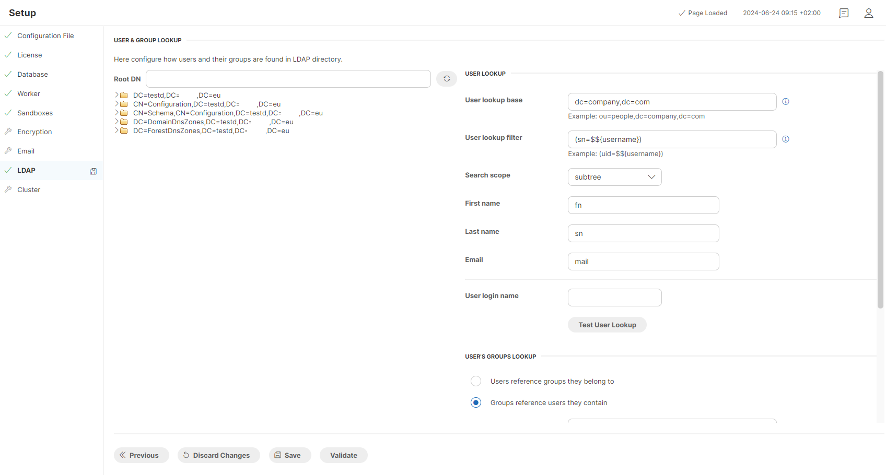

<!-- Administration > Configuration > Server configuration > User management and access control > LDAP authentication -->

#### LDAP authentication

By configuring the **LDAP** section in **CloverDX Server**, credentials of users registered in LDAP can be used for authentication to any **CloverDX Server** interface (API or web console). However, authorization (access levels to sandbox content and privileges for operations) is still handled by the CloverDX security module. Each user, even when authenticated via LDAP, requires a corresponding user record within the CloverDX [Users](users.md) module and assignment to at least one [user group](groups.md) for proper access.

The values and properties you define within this section are reflected not only within the user interface but also persisted in the **CloverDX Server**[configuration file](configuration-sources.md#configuration-file-on-specified-location).

##### LDAP setup

| Attribute | Description | Possible values |
| --- | --- | --- |
| Enable LDAP authentication | Enables authentication with LDAP. By default, **CloverDX Server** allows only its own internal mechanism for authentication. Setting this attribute to true essentially translates to the following server configuration: `security.authentication.allowed_domains = clover,LDAP`  Note: The value of the property is a list of user domains used for authentication. It is recommended to allow both mechanisms together until LDAP is properly configured so that an admin user can still log into **CloverDX Server**. | `false` (default) \| `true` |
| First time login creates a new CloverDX user account | Enables automatic user account creation on their first time login. It translates to the following server configuration property: `security.ldap.user_autocreate` | `false` (default) \| `true` |
| Default user group | The expected value of this attribute is the code of the CloverDX user group you want new users to be assigned to. This attribute is enabled only if “First time login creates a new CloverDX user account” is set to “true”. It translates to the following server configuration property: `security.ldap.default_user_group` | `data_app_users` |
> [!NOTE]
> If a user was created with `LDAP` domain and then switched to `clover` domain, a password needs to be set up for the user in the [Users](users.md) section.
>
> If a user was created with `clover` domain and then switched to `LDAP` domain, the LDAP password will take precedence over the existing password in `clover`. However, even after switching back to `clover` domain, the original password is retained and can be re-used.

##### Authentication policy

- **Use LDAP for user authentication only** - **CloverDX Server** will use LDAP directory to verify the user’s password only.
- **Use LDAP for user authentication and user synchronization** - **CloverDX Server** will verify user’s credentials and will synchronize additional information (such as user group, name, email, etc.) with those stored in LDAP.

##### Connection specification

| Attribute | Description | Possible values |
| --- | --- | --- |
| Context factory | Implementation of the context factory. The default value suffices for most cases. This attribute translates to the following server configuration property: `security.ldap.ctx_factory`. | `com.sun.jndi.ldap.LdapCtxFactory` (default) |
| LDAP host | The hostname of the LDAP server. This attribute is used to build up the value of the following server configuration property: `security.ldap.url`. | `ldap.example.com` |
| IP port | The port of the LDAP server. This attribute is used to build up the value of the following server configuration property: `security.ldap.url`. | `389` |
| Use encryption (SSL) | When set to true this attribute will configure the connection to LDAPS (LDAP over SSL). This attribute is used to build up the value of the following server configuration property: `security.ldap.url`. | `false` (default) \| `true` |
| Referral | This attribute affects how LDAP referrals are processed. Possible values are: `follow`, `ignore` and `throw`. The default value depends on the context provider. This attribute translates to the following server configuration property: `security.ldap.referral`. | `follow` \| `ignore` \| `throw` |
| The following attributes are available only when the **Use LDAP for user authentication and user synchronization** option is selected. |  |  |
| Search timeout (ms) | This attribute sets timeout for queries searching the LDAP directory. It translates to the following server configuration property: `security.ldap.timeout`. | `5000` (default) |
| Record count limit | This attribute sets the maximal number of records that the query can return. It translates to the following server configuration property: `security.ldap.records_limit`. | `2000` (default) |
| User DN | This attribute allows for specifying User DN of a user that has sufficient privileges to search LDAP for users and groups. It translates to the following server configuration property: `security.ldap.userDN`. | `cn=Manager,dc=company,dc=com` |
| Password | This attribute allow for specifying the password for logging into LDAP with the given User DN. It translates to the following server configuration property: `security.ldap.password`. | `mysecretpassword` |

##### User authentication

This section is available only when the **Use LDAP for user authentication only** option is selected.

| Attribute | Description | Possible values |
| --- | --- | --- |
| User DN pattern | This attribute is used as a pattern that contains a placeholder for the User DN. It is utilized to construct the LDAP user DN from login name. Depending on the LDAP server configuration, this attribute can be the pattern for user’s actual distinguished name in the LDAP directory, or just the login name - in such a case just set the property to $${username}. This attribute translates to the following server configuration property: `security.ldap.user_dn_pattern`. | `uid=$${username},dc=company,dc=com`  Note: Depending on the LDAP server configuration, this attribute can be a pattern of the user’s actual distinguished name in the LDAP directory, or just the login name. If the latter is the case, the value can be as simple as `$${username}`. |
> [!NOTE]
> To be able to synchronize the CloverDX groups with those defined in LDAP directory, the `security.ldap.user_dn_pattern` attribute has to be left unspecified.

##### Login test

This section is available only when the **Use LDAP for user authentication only** option is selected. This section is not part of the LDAP connection configuration as it only serves as a test login interface. Fill in the username and password and click on the **Test Login** button to verify that the above LDAP configuration is correct.

##### User & Group Lookup

This page is available only when the **Use LDAP for user authentication and user synchronization** option is selected.

The left side of this page visualizes your LDAP tree and allows you to search it by expanding the collapsible items. You can also specify the Root DN to search a specific inner part of the tree. Finally, you can drag individual LDAP entries and drop them in the desired user lookup attributes on the right side of the page to configure the user lookup.

Example LDAP tree:

- dc=company,dc=com
  - ou=groups
    - cn=admins (objectClass=groupOfNames,member=(uid=smith,dc=company,dc=com),member=(uid=jones,dc=company,dc=com))
    - cn=developers (objectClass=groupOfNames,member=(uid=smith,dc=company,dc=com))
    - cn=consultants (objectClass=groupOfNames,member=(uid=jones,dc=company,dc=com))
  - ou=people
    - uid=smith (fn=John,sn=Smith,mail=smith@company.com)
    - uid=jones (fn=Bob,sn=Jones,mail=jones@company.com)

###### User lookup

| Attribute | Description | Possible values |
| --- | --- | --- |
| User lookup base | This attribute specifies the node of LDAP tree where the user search will start. This attribute translates to the following server configuration property: `security.ldap.user_search.base`. | `dc=company,dc=eu` |
| User lookup filter | This attribute specifies a filter expression for searching the user by username. This search query must return just a single record. The `$${username}` placeholder will be replaced by username specified by the logging user. This attribute translates to the following server configuration property: `security.ldap.user_search.filter`. | `(uid=$${username})` |
| Search scope | This attribute specifies the type of search in the search base. There are three possible values: `SUBTREE` \| `ONELEVEL` \| `OBJECT`. More information can be found here: [http://download.oracle.com/javase/8/docs/api/javax/naming/directory/SearchControls.html](http://download.oracle.com/javase/8/docs/api/javax/naming/directory/SearchControls.html) This attribute translates to the following server configuration property: `security.ldap.user_search.scope`. | `SUBTREE` \| `ONELEVEL` \| `OBJECT` |
| First name | This attribute specifies user’s first name in the search defined above. It is used for getting basic information about the LDAP user in case the user record has to be created/updated by CloverDX security module. This attribute translates to the following server configuration property: `security.ldap.user_search.attribute.firstname`. | `fn` |
| Last Name | This attribute specifies user’s last name in the search defined above. It is used for getting basic information about the LDAP user in case the user record has to be created/updated by CloverDX security module. This attribute translates to the following server configuration property: `security.ldap.user_search.attribute.lastname`. | `ln` |
| Email | This attribute specifies user’s email address in the search defined above. It is used for getting basic information about the LDAP user in case the user record has to be created/updated by CloverDX security module. This attribute translates to the following server configuration property: `security.ldap.user_search.attribute.email`. | `mail` |
User login name
This section is not part of the LDAP connection configuration as it only serves as a test login interface. Fill in the username and click on the **Test User Lookup** button to verify that the above search configuration works.

###### User’s groups lookup

**CloverDX** tries to find groups which the user is assigned to. There are two ways how to get list of groups which the user is assigned to. The user-groups relation is specified on the *user* side (the user record has some attribute with list of group, for example, the *memberOf* attribute) or the relation is specified on the *group* side (the group record has an attribute with list of assigned users, for example, the *member* attribute). These two options translate to the following radio button choices:

- **Users reference groups they belong to**
- **Groups reference users they contain**

In both cases, **CloverDX** user record will be assigned to the clover groups according to the LDAP groups found by the search. Groups synchronization is performed during each login.

These attributes are available when the **Users reference groups they belong to** option is selected.

| Attribute | Description | Possible values |
| --- | --- | --- |
| Group reference attributes | This property specifies the user’s LDAP attribute that contains references to the user group that the user belongs to. This attribute translates to the following server configuration property: `security.ldap.user_search.attribute.groups` | `memberOf` |
| Group code attribute | The value of this property will be used for the lookup of the CloverDX user group by its code. The user will be assigned to the CloverDX group(s) with matching codes. This attribute translates to the following server configuration property: `security.ldap.group_search.attribute.group_code` | `cn` |

These attributes are available when the **Groups reference users they contain** option is selected.

| Attribute | Description | Possible values |
| --- | --- | --- |
| Group lookup base | This attribute specifies the node of LDAP tree where the group search will start. This attribute translates to the following server configuration property: `security.ldap.group_search.base`. | `dc=company,dc=com` |
| Group lookup filter | This attribute specifies a filter expression for searching the group by group code. This attribute translates to the following server configuration property: security.ldap.group_search.filter | `(&(objectClass=groupOfNames)(member=$${userDN}))`  Note: The `${userDN}` placeholder gets replaced by user DN found by the search above. |
| Group code attribute | The value of this property will be used for the lookup of the CloverDX user group by its code. The user will be assigned to the CloverDX group(s) with matching codes. This attribute translates to the following server configuration property: `security.ldap.group_search.attribute.group_code`. | `cn` |
| Search scope | This attribute specifies the type of search in the search base. There are three possible values: SUBTREE \| ONELEVEL \| OBJECT. More information can be found here: [http://download.oracle.com/javase/8/docs/api/javax/naming/directory/SearchControls.html](http://download.oracle.com/javase/8/docs/api/javax/naming/directory/SearchControls.html) This attribute translates to the following server configuration property: `security.ldap.group_search.scope`. | `SUBTREE` \| `ONELEVEL` \| `OBJECT` |

**User login name**

This section is not part of the LDAP connection configuration as it only serves as a test login interface. Fill in the username and click on the **Test Group Lookup** button to verify that the above search configuration works.

##### Active directory

**CloverDX Server** uses **User Principal Name (UPN)**`username@domainname` for user authentication with Active Directory.

If the domain name is the same for all **CloverDX Server** users, you can set `security.ldap.user_dn_pattern` to contain the name of the domain and then log in just using the user name, e.g. john.doe: `security.ldap.user_dn_pattern=$${username}@mydomain`

If you need to use multiple domain names, use `security.ldap.user_dn_pattern=$${username}` instead and then enter the full UPN as the user name on the login page, e.g. `john.doe@mydomain`.

##### LDAP logic explained

###### Use LDAP for user authentication only

1. The user specifies the LDAP credentials in the login form to the **CloverDX Server**.
2. **CloverDX Server** looks up the user’s record and checks whether it has the `LDAP` domain set. Note: If there is no existing user account and `security.ldap.user_autocreate` is set to true, the login process continues, otherwise it fails.
3. The Server attempts to connect to the LDAP server using the user’s credentials.
4. If it succeeds and the user has an existing account, the login into **CloverDX Server** will succeed. If there is no existing user account, it will be created in **CloverDX** and the user account will be assigned to the group specified using the `security.ldap.default_user_group property`.
5. User is logged in the **CloverDX Server**.

###### Use LDAP for user authentication and user synchronization

1. The user specifies the LDAP credentials in the login form to the **CloverDX Server**.
2. **CloverDX Server** looks up the user’s record and checks whether it has the `LDAP` domain set.
3. If so **CloverDX Server** will connect to the LDAP server and will check whether the user exists (it uses specified search to look up the user in LDAP).
4. If the user exists in LDAP, **CloverDX Server** performs authentication.
5. If the authentication is successful, **CloverDX Server** searches LDAP for user’s groups.
6. CloverDX user is assigned to the CloverDX groups according to his current assignment to the user groups in LDAP.
7. If no matching groups are found, user is assigned to the group defined in the `security.ldap.default_user_group` property.
8. User is logged in the **CloverDX Server**.
