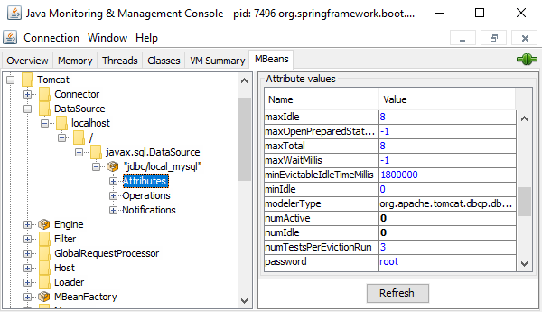

<!-- Administration > Configuration > Server configuration > Configuration properties and sources > List of configuration properties -->

#### List of configuration properties

| [General configuration properties](list-of-properties.md#general-configuration-properties) |
| --- |
| [Worker - configuration properties](list-of-properties.md#worker-configuration-properties) |
| [Worker health-related properties](list-of-properties.md#worker-health-related-properties) |
| [Worker - JNDI properties](list-of-properties.md#worker-jndi-properties) |
| [SSL properties for Worker](list-of-properties.md#worker-ssl-properties) |
| [Properties on Worker’s command line](list-of-properties.md#properties-on-workers-command-line) |
| [Job execution properties](list-of-properties.md#job-execution-properties) |
| [Data Manager properties](list-of-properties.md#data-manager-properties) |
| [AI-related properties](list-of-properties.md#ai-related-properties) |
| [Clover AI Assistant properties](list-of-properties.md#clover-ai-assistant-properties) |

Below you can find the configuration properties available in **CloverDX Server**. The properties can be configured using the *[Setup GUI](setup.md)* or by directly editing one of the several [configuration sources](configuration-sources.md).

In **CloverDX Server** UI, you can view the properties and their values in Configuration > CloverDX Info > Server Properties.

Additional properties used for Cluster configuration can be found in [Cluster configuration](cluster-setup-index.md#cluster-configuration).
> [!IMPORTANT]
> *Configuration property* and *system property* are not the same. *Configuration properties* can be configured in **Setup** section or in `cloverdx.properties` file. *System properties* serve to configure the JVM. E.g. in Apache Tomcat, they are configured in `bin/setenv.[bat|sh]` file using `-D` prefix.

##### General configuration properties

| [Configuration file](list-of-properties.md#lop-configuration-file) |
| --- |
| [License](list-of-properties.md#lop-license) |
| [Engine](list-of-properties.md#lop-engine) |
| [Sandboxes](list-of-properties.md#lop-sandboxes) |
| [Libraries](list-of-properties.md#lop-libraries) |
| [Wrangler](list-of-properties.md#lop-wrangler) |
| [Database connection](list-of-properties.md#lop-database-connection) |
| [Job queue](list-of-properties.md#lop-job-queue) |
| [Security](list-of-properties.md#lop-security) |
| [SMTP](list-of-properties.md#lop-smtp) |
| [Logging](list-of-properties.md#lop-logging) |
| [Thread Manager](list-of-properties.md#lop-threadmanager) |
| [Archivator](list-of-properties.md#lop-archivator) |
| [Properties resolver](list-of-properties.md#lop-properties-resolver) |
| [Data Services](list-of-properties.md#lop-data-services) |
| [Data Apps](list-of-properties.md#lop-data-app) |
| [Alerts and Notifications](list-of-properties.md#lop-alerts-and-notifications) |
| [API](list-of-properties.md#lop-api) |
| [JVM](list-of-properties.md#lop-jvm) |
| [Misc](list-of-properties.md#lop-misc) |
| [Clover AI Assistant properties](list-of-properties.md#clover-ai-assistant-properties) |
| [MCP Support properties](list-of-properties.md#mcp-support-properties) |

| Key | Description | Default Value |
| --- | --- | --- |
| **Configuration** |  |  |
| clover.config.file | Absolute path to location of a CloverDX Server configuration file | /absolute/path/to/cloverServer.properties |
| configuration.autoimport.file | Absolute path to an XML file containing [exported CloverDX Server configuration](server-config.md) (users, schedulers, event listeners, data services, etc.). If the property is set and the target file exists, it is automatically imported during the first startup with an empty database. Moreover, an absolute path to the appropriate version of Server license file(s) matching the version of CloverDX Server you are deploying must be set as well (license.file or license.dir property). Any error during the import causes CloverDX Server startup to fail. The property is not set by default. | empty |
| masterpassword.autoimport.file | Absolute path to an import file containing a master password. The import is launched only during the first startup with an empty database. If the property is set and the target file exists, it is automatically imported. If the property is set and the target file does not exist, a warning will be written into the log file and the startup will continue. Any error during the import causes CloverDX Server startup to fail. The property is not set by default. | empty |
| clover.home | By default, this property is commented out and has a dynamically computed value: path containing `CloverETL` value for pre 5.0 installations and `CloverDX` for 5.0 and newer installations.  If defined by the user, value has a higher priority. In such a case, this directory might be used as the log file directory. See [Logs directory](../operations/logging.md#server-logs-directory) for more information.  The property can be overridden using:  environment variable `clover.clover.home`  context parameter `<Parameter name="clover.home">`  or system property `-Dclover.clover.home=` | ${user.data.home}/CloverETL or ${user.data.home}/CloverDX |
| **License** |  |  |
| license.file | Absolute path to location of a CloverDX Server license file (license.dat) |  |
| license.dir | Absolute path to directory containing CloverDX Server license files |  |
| **Engine** |  |  |
| engine.config.file | location of a **CloverDX** engine configuration properties file | properties file packed with **CloverDX** |
| engine.plugins.additional.src | This property may contain an absolute path to some "source" of additional **CloverDX** engine plugins. These plugins are not a substitute for plugins packed in WAR. "Source" may be a directory or a zip file. Both, a directory and a zip, must contain a subdirectory for each plugin. Changes in the directory or the ZIP file apply only when the server is restarted. For details see [Extensibility - CloverDX Engine Plugins](pluginability-engine-plugins.md). | empty |
| **Sandboxes** |  |  |
| sandboxes.home | This property is primarily intended to be used as a placeholder in the sandbox root path specification. So the sandbox path is specified with the placeholder and it’s resolved to the real path just before it’s used. The sandbox path may still be specified as an absolute path, but placeholder has some significant advantages:  * sandbox definition may be exported/imported to another environment with a different directory structure  * user creating sandboxes doesn’t have to care about physical location on the filesystem  * each node in Cluster environment may have a different "sandboxes.home" value, so the directory structure doesn’t have to be identical  For backward compatibility, the default value uses the content of the [clover.home](list-of-properties.md#lop-clover-home) configuration property. | ${clover.home}/sandboxes |
| sandboxes.access.check.boundaries.enabled | true \| false If it is set to false, then the path relative to a sandbox root may point out of the sandbox. No file/folder outside of the sandbox is accessible by the relative path otherwise. | true |
| sandboxes.autoimport | If enabled, the Server scans the `${sandboxes.home}` directory during the first start with an empty database and imports all subdirectories as shared sandboxes. It skips hidden directories (e.g. `.git`). | false |
| **Libraries** |  |  |
| libraries.home | The storage for unpacked [Libraries](../operations/libraries.md).  It must be accessible from all cluster nodes, so by default, it is a sub-directory of `${sandboxes.home}`, which contains shared Sandboxes. | ${sandboxes.home}/libraries |
| **Wrangler** |  |  |
| workspaces.home | The storage for [Wrangler](wrangler-administration.md) workspaces.  It must be accessible from all cluster nodes, so by default, it is same as `${sandboxes.home}`, which contains shared Sandboxes. | ${sandboxes.home} |
| wrangler.sourceCache.maxAge | Time (in seconds) before the Source data cache expires. | 3600 |
| wrangler.tempSubgraph.maxAge | Time (in seconds) before temporary subgraphs generated by the [WranglerJob](../developer/wranglerjob.md) component are deleted from the `<wrangler_home>/graph/temp` directory. | 86400 |
| **Database connection** |  |  |
| datasource.type | Set this explicitly to JNDI if you need **CloverDX Server** to connect to a DB using JNDI datasource. In such case, "datasource.jndiName" and "jdbc.dialect" parameters must be set properly. Possible values: JNDI \| JDBC | JDBC |
| datasource.jndiName | JNDI location of a DB DataSource. It is applied only if "datasource.type" is set to "JNDI". | java:comp/env/jdbc/clover_server |
| jdbc.driverClassName | class name for JDBC driver name |  |
| jdbc.url | JDBC URL used by **CloverDX Server** to store data |  |
| jdbc.username | JDBC database user name |  |
| jdbc.password | JDBC database password |  |
| jdbc.dialect | hibernate dialect to use in ORM |  |
| quartz.driverDelegateClass | SQL dialect for quartz. Value is automatically derived from "jdbc.dialect" property value. |  |
| **Job queue** |  |  |
| jobqueue.enabled | Enables/disables the job queue. See [Job queue](../operations/job-queue.md) for more details about job queue. | true |
| jobqueue.dataservice.enabled | Enables/disables processing of **Data Services** by the job queue. By default **Data Services** are not processed by the job queue, see [Job queue impact](../operations/job-queue.md#impact) for more details. | false |
| jobqueue.systemCpuLimit | System CPU load that is considered high and job queue will start enqueuing jobs, see [Job queue load metrics](../operations/job-queue.md#load-metrics) for more details. The value 0.85 means 85% system CPU load. This property can be used to tweak the CPU load threshold from which jobs will be enqueued. | 0.85 |
| jobqueue.coreHeapUsageLimit | Usage of JVM heap memory in **Server Core** that is considered high and job queue will enter emergency mode, see [Job queue emergency mode](../operations/job-queue.md#emergency-mode) for more details. The value 0.9 means 90% use of heap memory. This property can be used to tweak the **Server Core** heap memory usage threshold from which job queue will enter emergency mode. | 0.9 |
| jobqueue.workerHeapUsageLimit | Usage of JVM heap memory in **Worker** that is considered high and job queue will enter emergency mode, see [Job queue emergency mode](../operations/job-queue.md#emergency-mode) for more details. The value 0.9 means 90% use of heap memory. This property can be used to tweak the **Worker** heap memory usage threshold from which job queue will enter emergency mode. | 0.9 |
| jobqueue.cpuLoadDetectionToleranceDuration | Time duration (in milliseconds) how long job queue tolerates non-working CPU load detection. If CPU load cannot be detected for this amount of time job queue stops using CPU load in its metrics, see [Job queue CPU load detection](../operations/job-queue.md#cpu-load-detection) for more details. | 60000 |
| jobqueue.maxQueueSize | Maximum number of jobs that can be enqueued at one time - i.e. the maximum size of the queue. Each enqueued job consumes a small amount of memory, this property protects the **CloverDX Server** from running out of memory. | 100000 |
| jobqueue.checkInterval | Time interval (in milliseconds) between each evaluation of job queue. This property defines how often the job queue processes enqueued jobs to be started, checks performance metrics etc. See [Job queue algorithm](../operations/job-queue.md#job-queue-algorithm) for more details. | 100 |
| jobqueue.initialLoadStep | The job queue starts enqueued jobs in batches, and load step defines the size of the batch (i.e. number of jobs started at the same time). The load step is automatically adjusted by the job queue, and the `jobqueue.initialLoadStep` property defines the initial value of the load step. See [Job queue algorithm](../operations/job-queue.md#job-queue-algorithm) for more details. | 20 |
| jobqueue.minLoadStep | The job queue starts enqueued jobs in batches, and load step defines the size of the batch (i.e. number of jobs started at the same time). The load step is automatically adjusted by the job queue, and the `jobqueue.minLoadStep` property defines the minimum value of the load step. See [Job queue algorithm](../operations/job-queue.md#job-queue-algorithm) for more details. | 5 |
| jobqueue.maxLoadStep | The job queue starts enqueued jobs in batches, and load step defines the size of the batch (i.e. number of jobs started at the same time). The load step is automatically adjusted by the job queue, and the `jobqueue.maxLoadStep` property defines the maximum value of the load step. See [Job queue algorithm](../operations/job-queue.md#job-queue-algorithm) for more details. | 300 |
| **Security** |  |  |
| openssh.config.file | Specifies the location of the OpenSSH configuration file which allows you to define SSH access outside of **CloverDX Server**. The path to the file is `~/path/to/.ssh/ssh_config` There is no default file; therefore, without proper specification, no configuration file is loaded. |  |
| openssh.key.passphrase.[username]@[hostname] | Specifies passphrase for SSH private key. Each used key can have its own passphrase specified by its specific property. The property name contains at the end an identity of the key. Either `[username]@[hostname]` or just `[hostname]`. If the key is stored in project’s `ssh-keys` directory the identity has to match the name of the file without the `.key` suffix. If OpenSSH configuration file is used the identity has to match the infomation stored in the configuration. Also in this case the `[username]` is optional. Full example: `openssh.key.passphrase.john@my-sftp-server.com=changeit` |  |
| private.properties | List of properties and environment variables to be masked in the web UI, because they contain secrets. `*` and `?` wildcards are supported.  Note that the properties are also masked when accessed via the ServerFacade (e.g. from Groovy code). Changes in this list may cause unexpected behavior of server APIs that use the facade internally. | *password*, security.secure_passwd.table.secure_passwd, cluster.jgroups.protocol.AUTH.value |
| security.session.validity | Session validity in milliseconds. When the request of logged-in user/client is detected, validity is automatically prolonged. | 3000000 |
| security.session.exchange.limit | Interval for exchange of invalid tokens in milliseconds. | 360000 |
| security.authentication.allowed_domains | Used to specify allowed domains for user logins. The only allowed values are: `clover`, `LDAP`, `SAML`. See [User management and access control](users-groups-index.md) for more information. | clover |
| security.default_domain | Sets the only domain that users can use to log in. Users with other domains will be blocked. Be careful when changing this setting, as it might prevent users from logging into their accounts. | clover |
| security.basic_authentication.features_list | List of features which are accessible using HTTP and which should be protected by Basic HTTP Authentication. The list has form of semicolon separated items; Each feature is specified by its servlet path. | /request_processor;/simpleHttpApi;/downloadStorage;​/downloadFile;/uploadSandboxFile;/downloadLog;/webdav |
| security.basic_authentication.realm | Realm string for HTTP Basic Authentication. | CloverDX Server |
| security.digest_authentication.features_list | List of features which are accessible using HTTP and which should be protected by HTTP Digest Authentication. The list has form of semi-colon separated items. Each feature is specified by its servlet path.  Please keep in mind that HTTP Digest Authentication is feature added to the version 3.1. If you upgraded your older **CloverDX Server** distribution, users created before the upgrade cannot use the HTTP Digest Authentication until they reset their passwords. So when they reset their passwords (or the admin does it for them), they can use Digest Authentication as well as new users. |  |
| security.digest_authentication.storeA1.enabled | Switch whether the A1 Digest for HTTP Digest Authentication should be generated and stored or not. Since there is no **CloverDX Server** API using the HTTP Digest Authentication by default, it’s recommended to keep it disabled. This option is not automatically enabled when any feature is specified in the security.digest_authentication.features_list property. | false |
| security.digest_authentication.realm | Realm string for HTTP Digest Authentication. If it is changed, all users have to reset their passwords, otherwise they won’t be able to access the server features protected by HTTP digest Authentication. | CloverDX Server |
| security.digest_authentication.nonce_validity | Interval of validity for HTTP Digest Authentication specified in seconds. When the interval passes, server requires new authentication from the client. Most of the HTTP clients do it automatically. | 300 |
| security.lockout.login.attempts | The number of failed login attempts after which a next failed login attempt will lock the user. Set the value to 0 to disable the function. Since 4.8.0M1. | 5 |
| security.lockout.reset.period | Period of time in seconds during which the failed login attempts are counted. Since 4.8.0M1. | 300 |
| security.lockout.unlock.period | Period of time in seconds after which a successful login attempt will unlock the previously locked user. Since 4.8.0M1. | 300 |
| security.lockout.notification.email | Comma separated list of emails which will be notified when a user is locked out. |  |
| security.csrf.protection.enabled | Enable/disable protection of [Simple HTTP API](../operations/simple-http-api.md) and [REST API](../operations/rest-api.md) against CSRF attacks, enabled by default. The CSRF protection requires presence of the `X-Requested-By` header in the requests.  For more details, see [CSRF protection](../operations/simple-http-api.md#csrf-protection). | true |
| security.password.policy | Enables or disables the password policy. When set to `true` (default), the password rules defined by the related policy properties are enforced. When set to `false`, the policy is disabled and no password rules are applied.  The following additional properties are used when the password policy is enabled:  - [security.password.policy.min_length](list-of-properties.md#lop-security-password-policy-min-length) - [security.password.policy.min_character_types](list-of-properties.md#lop-security-password-policy-min-character-types) - [security.password.policy.min_age](list-of-properties.md#lop-security-password-policy-min-age) - [security.password.policy.max_age](list-of-properties.md#lop-security-password-policy-max-age)  For more information on password policy, see [Password policy configuration](user-password-policy.md). | true |
| security.password.policy.min_length | Specifies the minimum number of characters required in a user’s password.  The minimum accepted value is `0` (no length requirement).  This property is only used if [security.password.policy](list-of-properties.md#lop-security-password-policy) is set to `true`. | 8 |
| security.password.policy.min_character_types | Specifies the minimum number of character types required in a password.  Character types include *lowercase letters* (`a–z`), *uppercase letters* (`A–Z`), *digits* (`0–9`), and *special characters* (such as `!@#$%^&*())`.  Possible property values with examples:  - **0** - No complexity requirements - the passwords can contain any characters. - **1** - At least one character class must be present (e.g. *abcdef*). - **2** - At least two different character classes must be present (e.g. *abc123*). - **3** - At least three different character classes must be present (e.g. *abCD12*). - **4** - All four character classes must be present (e.g. *abCD1!*).  This property is only used if [security.password.policy](list-of-properties.md#lop-security-password-policy) is set to `true`. | 2 |
| security.password.policy.min_age | Specifies the minimum number of days a user must wait before changing their password again after setting it.  This property is only used if [security.password.policy](list-of-properties.md#lop-security-password-policy) is set to `true`. | 0 (no restriction) |
| security.password.policy.max_age | Specifies the maximum number of days a password is valid. After this period, the user will be required to change their password.  This property is only used if [security.password.policy](list-of-properties.md#lop-security-password-policy) is set to `true`. | 0 (no expiration) |
| **SMTP** |  |  |
| clover.smtp.transport.security | SMTP server security protocol. Possible values are **NONE**, **STARTTLS** or **SSL**. | NONE |
| clover.smtp.host | SMTP server hostname or IP address |  |
| clover.smtp.port | SMTP server port |  |
| clover.smtp.authentication.method | Method of SMTP authentication. Possible values are **NONE** (no athentication), **BASIC** (username and password) or **OAUTH2** (OAuth2 connection) | NONE |
| clover.smtp.username | SMTP server username |  |
| clover.smtp.password | SMTP server password |  |
| clover.smtp.sender | Email address of sender |  |
| clover.smtp.oauth2.provider | Provider of an OAuth2 connection (GENERIC/AZURE/GOOGLE) |  |
| clover.smtp.oauth2.clientId | Client ID defined in application registration. |  |
| clover.smtp.oauth2.clientSecret | Client secret defined in application registration. |  |
| clover.smtp.oauth2.scopes | Scopes are permissions of the OAuth2 connection. Their values depend on the application provider. |  |
| clover.smtp.oauth2.tenantId | Only applies for Azure provider. Tenant ID is identifier of Azure Subscription. |  |
| clover.smtp.oauth2.usePKCE | PKCE is an extension to the authorization flow to prevent code injection attacks. |  |
| clover.smtp.oauth2.promptConsent | Consent screen will have to be approved by user during every authorization. It’s recommended to keep this enabled because some providers (google) do not provide refresh tokens otherwise. This adds 'prompt=consent' parameter to the OAuth2 authorization flow. Disabling this property might help in Azure when 'Admin consent' is enabled on the OAuth2 app. |  |
| clover.smtp.oauth2.authorizationServerUrl | An URL used for sending authorization request. |  |
| clover.smtp.oauth2.tokenServerUrl | An URL used for obtaining OAuth2 access token. |  |
| clover.smtp.oauth2.redirectUrl | An URL registered together with client application. |  |
| clover.smtp.additional.* | Properties with the `clover.smtp.additional.` prefix are automatically added (without the prefix) to the Properties instance passed to the Mailer. May be useful for some protocol specific parameters. The prefix is removed. |  |
| **Logging** |  |  |
| logging.dir | Used to change the default log file directory. See [Logs directory](../operations/logging.md#server-logs-directory) for more information. It must be set as a [system property](configuration-sources.md#alternative-configuration-sources), i.e., use `-Dclover.logging.dir=` to change the directory. |  |
| logging.logger.performance.enabled | Enables logging of informations about server performance, e.g. memory and CPU usage. The name of the output file is "performance.log". It is stored in the same directory as other **CloverDX Server** log files by default. See [Performance log](../operations/logging.md#performance-log) for more details. | true |
| logging.project_name | Used in log messages where it is necessary to name the product name. | CloverDX |
| logging.logger.server_audit.enabled | Enables logging of operations called on ServerFacade and JDBC proxy interfaces. The name of the output file is "server-audit.log". It is stored in the same directory as other **CloverDX Server** log files by default. The default logging level is DEBUG so it logs all operations which may process any change. | false |
| logging.logger.server_integration.enabled | Enables logging of Designer-Server calls. The name of the output file is "server-integration.log". It is stored in the same directory as other **CloverDX Server** log files by default. The default logging level is INFO. Username is logged, if available. JDBC and CTL debugging is not logged. | true |
| graph.logs_path | Location, where server should store Graph run logs. See [Logging](../operations/logging.md) for details. | ${java.io.tmpdir}/[logging. default_subdir]/graph where ${java.io.tmpdir} is system property |
| logging.appender.jobs.pattern_layout | Pattern of the jobs' log messages | %d %-5p %-3X{runId} [%t] %m%n |
| logging.appender.jobs.encoding | Encoding of the jobs' log files | UTF-8 |
| logging.mem_appender.WORKER.pattern_layout | Format of log that can be seen in **Monitoring** > **Logs** > **Worker**. |  |
| logging.mem_appender.WORKER.size_limit | Size of log that can be seen in **Monitoring** > **Logs** > **Worker**. |  |
| logging.connector.container.showReport | Enables logging of full error report in data service response. | true |
| logging.connector.container.showServerInfo | Enables logging of server information in data service response. | true |
| **Thread Manager** |  |  |
| threadManager.pool.corePoolSize | Number of threads which are always active (running or idling). Related to a thread pool for processing server events. | 4 |
| threadManager.pool.queueCapacity | Max size of the queue (FIFO) which contains tasks waiting for an available thread. Related to a thread pool for processing server events. For queueCapacity=0, there are no waiting tasks, each task is immediately executed in an available thread or in a new thread. | 0 |
| threadManager.pool.maxPoolSize | Max number of active threads. If no thread from a core pool is available, the pool creates new threads up to "maxPoolSize" threads. If there are more concurrent tasks then maxPoolSize, thread manager refuses to execute it. | 8192 |
| threadManager.pool.allowCoreThreadTimeOut | Switch for idling threads timeout. If true, the "corePoolSize" is ignored so all idling threads may be time-outed | false |
| threadManager.pool.keepAliveSeconds | timeout for idling threads in seconds | 20 |
| **Archivator** |  |  |
| task.archivator.batch_size | Max number of records deleted in one batch. It is used for deleting of archived run records. | 50 |
| task.archivator.archive_file_prefix | Prefix of archive files created by the archivator. | cloverArchive_ |
| **Properties resolver** |  |  |
| properties_resolver.placeholders.server_props_list_default | A list of properties from a subset of properties, that may be used as placeholders and shall be resolved if used in paths. The properties can be used if you define a path to the root of a sandbox, or to locations of local or partitioned sandboxes, or path to a script, or path in archiver job. Users are strongly discouraged from modification of the property. The property name changed since **CloverDX 4.2**, however the obsolete name is also still accepted to maintain backwards compatibility. | clover.home, sandboxes.home, sandboxes.home.local, sandboxes.home.partitioned, user.data.home |
| **Data Services** |  |  |
| dataservice.invocation.record.max.age | It sets the maximal age in minutes before the record is removed from the database. The default is 1440 min = 24 h. | 1440 |
| dataservice.default.response.encoding | Optional default character encoding for Data Service responses. When empty, CloverDX does not explicitly set the response encoding; supported servlet containers use UTF-8 by default. Set it to `ISO-8859-1` for compatibility with legacy Data Service jobs that relied on ISO-8859-1 as the servlet container’s default response encoding. | empty |
| dataservice.https.connector.session.timeout | Used for Data Services jobs accessed through an HTTPS connector. It configures HTTP session inactivity timeout before the session is invalidated. The value is in minutes and its default is the same as HTTP session timeout for **CloverDX Server** web application. | 50 |
| dataservice.cors.allowed | Enables or disables CORS filter. | true |
| dataservice.access.control.allow.origin | A comma separated list of origins that are allowed to access Data Service endpoints. |  |
| dataservice.access.control.allow.methods | A comma separated list of HTTP methods that are allowed to access Data Service endpoints. |  |
| dataservice.access.control.allow.headers | A comma separated list of HTTP request headers that are allowed to access Data Service endpoints. |  |
| dataservice.access.control.expose.headers | A comma separated list of HTTP response headers that are allowed to be exposed on the client. |  |
| dataservice.access.control.allow.credentials | A boolean indicating if the resource allows requests with credentials. | false |
| dataservice.access.control.max.age | The number of seconds that preflight requests can be cached for by the client. |  |
| **Data App** |  |  |
| dataapp.request.timeout | Timeout for HTTP requests related to the Data App life-cycle such as login, retrieval of the model, etc. The value is in seconds. | 30 |
| dataapp.execution.timeout | Timeout for the execution of the Data App (call of the Data Service). The value is in seconds. | 1800 |
| webapps.branding.resourceFilePath | Path to the branding resource ZIP file. See [Branding of Data Apps](data-apps-branding.md). |  |
| webapps.branding.useCache | If `true`, contents of the branding ZIP file are cached in the memory of the **CloverDX Server**. If `false`, contents of the branding ZIP file are loaded from the disk every time they are needed. | true |
| webapps.branding.clientCacheMaxAge | Time period (in seconds) after which the branding resources expire on the client (web browser). Sent to the client as the `max-age` directive of the `Cache-Control` HTTP header. | 604800 |
| dataapp.response.csv.maxPreviewSize | Limits the size of the data shown in the Data App response preview table for CSV format. The value is in MiB. | 100 |
| dataapp.response.csv.maxPreviewCells | Limits the number of table cells shown in the Data App response preview for CSV format. | 100000 |
| dataapp.response.csv.maxMetadataSize | Limits the size of metadata that can be used in the Data App response preview for CSV format. Metadata is sent to the client in an HTTP header. Most web servers have their own limitation on headers size. Make sure the limit is higher than the value of this property. | 6144 |
| **Job Inspector** |  |  |
| job.inspector.refreshing.interval | How often the Job Inspector refreshes job status (graph tracking) when the job is running, in milliseconds. | 5000 |
| job.inspector.request.timeout | Timeout for HTTP requests from the Job Inspector to the REST API in milliseconds. | 30000 |
| **Alerts and Notifications** |  |  |
| trigger.failure.ratio.min.record.count | Used for failure indication of triggers (*[Schedule](../operations/scheduling.md)*, *[Data Service endpoint](../operations/data-services.md)* or *[Event Listeners](../operations/listeners.md)*) It represents the minimum number of invocations required to evaluate whether the percentage of failures is over the threshold. Ensures that during periods of low traffic the trigger does not switch to failing state. | 3 |
| **API** |  |  |
| http.api.enabled | Enables or disables [Simple HTTP API](../operations/simple-http-api.md).  Simple HTTP API is deprecated and disabled by default. Use [REST API](../operations/rest-api.md) instead.  If the HTTP API is disabled, there is no link to HTTP API operations in login page and the HTTP API, the `/clover/httpapi.jsp` and HTTP API servlet are not accessible. | false |
| webDav.method.propfind.maxDepth | Maximum depth for webDAV method PROPFIND. When the depth is not specified, the default is supposed to be infinite (according to the rfc2518), however it’s necessary to set some limit, otherwise the webDav client might overload the server filesystem.  Also if the depth value specified by webDAV client in the request is higher than the pre-configured max depth, only the pre-configured maximum is used. | 40 |
| **JVM** |  |  |
| server.env.min_heap_memory | Sets the required minimal heap memory threshold. If the configuration of **CloverDX Server** is set to less heap memory, a warning is displayed. Experienced users can change the default value to avoid the warning when running the server on a system with lower memory. The threshold is in megabytes. | 900 |
| server.env.min_nonheap_memory | Sets the required minimal non-heap memory threshold. If the configuration of **CloverDX Server** is set to less non-heap memory, a warning is displayed. Experienced users can change the default value to avoid the warning when running the server on a system with lower memory. The threshold is in megabytes. | 256 |
| **Miscellaneous** |  |  |
| temp.default_subdir | Name of a default subdirectory for server tmp files; it is relative to the path specified by system property "java.io.tmpdir". | clovertmp |
| graph.pass_event_params_to_graph_in_old_style | Since 3.0. It is a switch for backwards compatibility of passing parameters to the graph executed by a graph event. In versions prior to 3.0, all parameters are passed to executed graph. Since 3.0, just specified parameters are passed. Please see [Start a Graph](../operations/tasks.md#start-a-graph) for details. | false |
| clover.event.fileCheckMinInterval | Interval of the timer, running file event listener checks (in milliseconds). See [File Event Listeners (remote and local)](../operations/listeners.md#file-event-listeners-remote-and-local) for details. | 1000 |
| clover.event.groovyCheckMinInterval | The periodicity of Groovy checks for Groovy event listeners (in milliseconds). | 1000 |
| clover.event.kafkaPollInterval | The periodicity of Kafka consumer poll operation (in milliseconds). | 60000 |
| clover.inDevelopment | Displays/hides the debug window. | false |
| cluster.node.sendinfo.stats.interval | The maximum time interval (in hours) for which the data in [Performance tab](../operations/monitoring.md#performance-panel) is recorded.  **Note:** longer time intervals increase Server memory consumption and may increase latency when using Server GUI. | 24 |
| grpc.maxInboundMessageSize | The maximum gRPC message size allowed to be received by gRPC server (request) or gRPC channel (response). This property affects all inter-process gRPC communications between Server Core and Worker, and between Cluster nodes. The value is in MiB. | 20 |
| task.jms.callback.timeout | A [JMS Message Listener](../operations/listeners.md#jms-message-listeners) property. Sets the time (in milliseconds) for which a JMS message listener waits for a triggered task to finish. After this time, the listener continues in processing the next message from the source queue/topic. | 3600000 (1 hour) |
| webGui.instance.color | Sets the background color of the [Instance indicator](server-instance-indicator.md).  Possible values are: `green`, `blue`, `yellow` and `red`. If a wrong value is set, the color is inherited from the GUI’s header.  For the changes to take effect, you must log out and then back in the Server. |  |
| webGui.instance.label | Sets the label of the [Instance indicator](server-instance-indicator.md). Note that too long label will be cropped in the GUI.  For the changes to take effect, you must log out and then back in the Server. |  |
| autoapply.sys.db.patches | Value of the property is a version number. If the version of CloverDX Server you are upgrading to is equal or less than the version, database patching will be started automatically. Otherwise a user approval is required. Example: `autoapply_sys_db_patches=5.7` or `autoapply.sys.db.patches=99.9.` |  |
| operations.dashboard.refreshing.interval | How often the [Operations Dashboard](../operations/ops-dashboard.md) refreshes its content, in milliseconds. | 3000 |
| operations.dashboard.request.timeout | Timeout for HTTP requests from the [Operations Dashboard](../operations/ops-dashboard.md) to the [REST API](../operations/rest-api.md), in milliseconds. | 30000 |

##### Worker - configuration properties

| Key | Description | Default Value |
| --- | --- | --- |
| worker.initialWorkers | Enable/disable the Worker. To enable Worker, set to 1 (this is the default). **To disable Worker and run all jobs in Core Server, set to 0.**  Starting more than one Worker is currently (in 4.9.0) not supported. | 1 |
| worker.portRange | Port range used for communication between Server Core and Worker and between Workers on different Cluster nodes. Communication between Server Core and Worker is done on localhost. Workers on different Cluster nodes communicate directly with each other over these ports - in Cluster setup, this port range should be open in firewall for other Cluster nodes.  This property can be easily configured in the [Worker](setup.md#worker) tab of [Setup](setup.md).  `worker.portRange` should contain at least 7 ports for 1 node (depending on other options, a node takes at most 7 ports from the range). We recommend to use `portRange` of at least 10 ports to avoid possible problems with occupied ports after restart of Worker.  If more Cluster nodes run on the same machine, make sure that there are enough free ports for Workers of all Cluster nodes on the machine. The default configuration of `worker.portRange` is sufficient for that. | 10500-10599 |
| worker.startupTimeout | Timeout before Worker startup is considered unsuccessful, after which Worker is stopped and restarted again. The timeout is in milliseconds. | 90000 |
| worker.restartDelay | Delay after Worker startup attempt ended with a failure, or a timeout, before another restart is attempted. The value is in milliseconds. | 3000 |
| worker.connectTimeout | Timeout for connection initialization between Worker and Server Core, in both directions. The timeout is in milliseconds.  This setting can be useful when handling communication issues between Server Core and Worker, typically under high load you might want to increase the timeout. | 60000 |
| worker.readTimeout | Read timeout for communication requests between Worker and Server Core, in both directions. If a request is not completely served before reaching this limit, the connection is terminated. The timeout is in milliseconds.  This setting can be useful when handling communication issues between Server Core and Worker, typically under high load you might want to increase the timeout. | 600000 |
| worker.classpath | A directory with additional `.jar` files to be added to the Worker’s classpath. The `.jar` files would typically be libraries used by graphs (e.g. JDBC drivers for database connections) or JDBC drivers used in JNDI connections defined in Worker (see [Worker - JNDI properties](list-of-properties.md#worker-jndi-properties)).  The Worker’s classpath is separate from Server Core (i.e. application container classpath). Any libraries needed by jobs executed on Worker need to be added on the Worker’s classpath.  For backward compatibility, the default value uses the content of the [clover.home](list-of-properties.md#lop-clover-home) configuration property.  The property can contain paths to multiple directories. The separator between the directories can be a colon (on Linux and Mac) or semicolon (Linux, Mac and Windows), e.g.:  `worker.classpath=/home/clover/worker-lib;/opt/worker-lib-2`  Some basic wildcards are supported: `directory-*` and `directory-?`. | ${clover.home}/worker-lib |
| worker.maxHeapSize | The maximum Java heap size of Worker in MB, it will be translated to the `-Xmx` option for the Worker’s JVM. Jobs executed in the Worker require heap memory based on their complexity, dataset size, etc.  See our [recommendations](postinstallation-configuration.md#recommended-server-core-and-worker-heap-memory-configuration) for heap sizes of Worker and Server Core.  This property can be easily configured in the [Worker](setup.md#worker) tab of [Setup](setup.md).  Setting to 0 uses Java default heap size (automatically determined by Java). This setting is not recommended for production usage. | 0 |
| worker.initHeapSize | The initial Java heap size of Worker in MB, it will be translated to the `-Xms` option for the Worker’s JVM. We recommend to set this to the same value as `worker.maxHeapSize`  This property can be easily configured in the [Worker](setup.md#worker) tab of [Setup](setup.md).  Setting to 0 uses Java default initial heap size (automatically determined by Java). This setting is not recommended for production usage. | 0 |
| worker.jvmOptions | Adds Java command line options for the Worker’s JVM. This property is useful to tweak the configuration of the Worker’s JVM, e.g. to tune garbage collector settings. These command line options override default options of the JVM.  For example to enable parallel garbage collector: `-XX:+UseParallelGC`.  See [Additional diagnostic tools](../operations/diagnostics.md#additional-diagnostic-tools) section for useful options for troubleshooting and debugging Worker.  This property can be easily configured in the [Worker](setup.md#worker) tab of [Setup](setup.md). |  |
| worker.enableDebug | Remote Java debugging of Worker. Enabling this allows you to connect a Java debugger remotely to the running Worker process, to debug your Java transformations, investigate issues, etc. The port used by the debugger is determined dynamically and can be seen in the Worker section in [Resources](../operations/monitoring.md) or [Setup](setup.md) page. | false |
| worker.inheritSystemProperties | Sets whether system Java properties are inherited from the Server Core process to the Worker process. We automatically inherit some system properties to simplify the Worker configuration.  For the list of system Java properties inherited from the Server Core to Worker, see [properties passed from Server Core if worker.inheritSystemProperties is true](list-of-properties.md#wclp-passed-from-core-inherit-true).  This functionality is enabled by default. Use this property to disable this behavior in case some of the inherited properties would cause issues. | true |
| worker.javaExecutable | Absolute path to the Java binary for Worker process, e.g. `/user/local/java/bin/java`.  Use this property if you need to use a specific Java binary for running the Worker.  **Note:** Make sure that Worker uses the same major Java version as the Server Core (e.g. Java 11). Using different major Java versions is not supported. | Value is automatically determined based on $JAVA_HOME environment variable. |

##### Worker health-related properties

Below is a list of properties defining timeouts and limits related to the Worker’s health.
> [!WARNING]
> For Expert Users Only
> These properties are for expert users only. Default values should be sufficient. Modification of the values could conceal the real cause of the problem; therefore, we **strongly discourage** users from changing the values.

| Key | Description | Default Value |
| --- | --- | --- |
| worker.health.heartbeatTimeout | Time before Worker is pronounced unresponsive because of a missing heartbeat (in milliseconds). | 120000 |
| worker.health.workerToCoreTimeout | Time before Worker is pronounced unresponsive because it is not sending any information to Server Core (in milliseconds). | 60000 |
| worker.health.coreToWorkerTimeout | Time before Worker is pronounced unresponsive because all requests are failing (i.e. throwing exceptions) (in milliseconds). | 60000 |
| worker.health.coreToWorkerErrorThreshold | Number of requests in a row which must fail to pronounce Worker unresponsive (amount of failures). | 30 |
| worker.heartbeat.connectTimeout | Timeout for connection initialization from Worker to Server Core. Connection is used to send Worker heartbeat. The timeout is in milliseconds. | 5000 |
| worker.heartbeat.readTimeout | Read timeout for communication requests from Worker to Server Core. Connection is used to send Worker heartbeat. The timeout is in milliseconds. | 5000 |

##### Worker - JNDI properties

The Worker has its own JNDI pool separate from the application container JNDI pool. If your jobs use JNDI resources (to obtain JDBC or JMS connections), you have to configure the Worker’s JNDI pool and its resources.

The worker JNDI properties must be configured using the `clover.properties` configuration file. Libraries used by the JNDI resources must be added to the Worker’s classpath, see [worker.classpath](list-of-properties.md#lop-worker-classpath).

It is possible to define multiple datasources pointing to different databases or JMS queues, see examples below. The datasources are indexed in configuration, their properties have suffix [0], [1], etc. Even a single datasource must have the [0] index.

###### JDBC Datasources

Worker uses the Apache DBCP2 pool for its JNDI functionality. Any DBCP2 configuration attribute is supported; see section *4. Configure Tomcat’s Resource Factory* on [Apache’s website](https://tomcat.apache.org/tomcat-9.0-doc/jndi-resources-howto.html#JDBC_Data_Sources) for more information. The only mandatory properties are `jndiName` and `url`.

See table below for basic JNDI properties.

You can monitor the state of the datasources via JMX. See [Additional diagnostic tools](../operations/diagnostics.md#additional-diagnostic-tools) for details on how to enable JMX on Worker. Then you can connect to the Worker’s JMX interface with tools like `jconsole` and monitor the JNDI datasources, e.g. for the number of currently open connections. The related MBeans are under the `Tomcat/DataSource/localhost///javax.sql.DataSource` path:


*Figure 87. MBean for a JNDI datasource in jconsole*

| Key | Description | Example |
| --- | --- | --- |
| worker.jndi.datasource[0].jndiName | The name of the JNDI datasource. Mandatory. | jdbc/database_name |
| worker.jndi.datasource[0].url | The JDBC connection URL. Mandatory. | jdbc:postgresql://hostname:5432/database_name |
| worker.jndi.datasource[0].username | The user name for a database connection. | clover |
| worker.jndi.datasource[0].password | The password for a database connection. The password value can be encrypted using the secure configuration tool, see [Securing configuration properties](secure-configuration-properties.md). | clover |
| worker.jndi.datasource[0].driverClassName | The database driver classname. The database driver must be on the Worker classpath, see [worker.classpath](list-of-properties.md#lop-worker-classpath). | org.postgresql.Driver |
| worker.jndi.datasource[0].maxIdle | The maximum number of idle database connections in a pool. Set to -1 for no limit. | 10 |
| worker.jndi.datasource[0].maxTotal | The maximum number of database connections in a pool. Set to -1 for no limit. | 20 |
| worker.jndi.datasource[0].maxWaitMillis | The maximum time Worker waits for a database connection to become available. In milliseconds, set to -1 for no limit. | 30000 |
| worker.jndi.datasource[0].defaultReadOnly | If a connection is used both for reading and writing from and to the database set the property defaultReadOnly to false. Otherwise the connection reused from a pool could refuse to execute SQL statement writing data. |  |
| worker.jndi.datasource[0].dbcpAttribute | Any DBCP2 attribute, e.g. `worker.jndi.datasource[0].connectionInitSqls`. See section *4. Configure Tomcat’s Resource Factory* on [Apache’s website](https://tomcat.apache.org/tomcat-9.0-doc/jndi-resources-howto.html#JDBC_Data_Sources) for more information. |  |

The following example shows configuration of two JDBC Datasources.

```properties
worker.jndi.datasource[0].jndiName=jdbc/postgresql_finance
worker.jndi.datasource[0].url=jdbc:postgresql://finance.example.com:5432/finance
worker.jndi.datasource[0].maxIdle=5
worker.jndi.datasource[0].maxTotal=10
worker.jndi.datasource[0].maxWaitMillis=-1
worker.jndi.datasource[0].username=finance_user
worker.jndi.datasource[0].password=conf#eCflGDlDtKSJjh9VyDlRh7IftAbI/vsH
worker.jndi.datasource[0].defaultReadOnly=false
worker.jndi.datasource[0].driverClassName=org.postgresql.Driver

worker.jndi.datasource[1].jndiName=jdbc/MysqlDB
worker.jndi.datasource[1].url=jdbc:mysql://marketing.example.com:3306/marketing?useUnicode=true&amp;characterEncoding=utf8
worker.jndi.datasource[1].maxIdle=10
worker.jndi.datasource[1].maxTotal=20
worker.jndi.datasource[1].maxWaitMillis=-1
worker.jndi.datasource[1].username=marketing_user
worker.jndi.datasource[1].password=conf#JWsMa2okg7Dq2gtLBM84sE==
worker.jndi.datasource[1].defaultReadOnly=false
worker.jndi.datasource[1].driverClassName=com.mysql.cj.jdbc.Driver
```

###### JMS connections

Worker can use any JMS broker to define JMS connections in JNDI. Any JMS broker configuration attribute is supported. The mandatory properties are `jndiName`, `factory` and `type`. See table below for basic JNDI properties for JMS resources.

| Key | Description | Example |
| --- | --- | --- |
| worker.jndi.jms[0].jndiName | The name of the JNDI JMS resource. Mandatory. | `jms/jms_queue` |
| worker.jndi.jms[0].factory | Factory class for creating the JMS resource. This is JMS broker specific. Mandatory. | `org.apache.activemq.jndi.JNDIReferenceFactory` |
| worker.jndi.jms[0].type | Implementation class of the JMS resource. This is JMS broker specific. Mandatory. | `org.apache.activemq.command.ActiveMQQueue` |
| worker.jndi.jms[0].jmsProperty | Configuration property for the JMS resource. Any configuration property supported by the JMS broker can be used. | `worker.jndi.jms[0].brokerUrl`. |

The following example shows configuration of several JMS resources.

```properties
worker.jndi.jms[0].jndiName=jms/CloverConnectionFactory
worker.jndi.jms[0].type=org.apache.activemq.ActiveMQConnectionFactory
worker.jndi.jms[0].factory=org.apache.activemq.jndi.JNDIReferenceFactory
worker.jndi.jms[0].brokerUrl=tcp://localhost:61616?jms.prefetchPolicy.queuePrefetch=1
worker.jndi.jms[0].brokerName=LocalActiveMQBroker

worker.jndi.jms[1].jndiName=jms/CloverQueue
worker.jndi.jms[1].type=org.apache.activemq.command.ActiveMQQueue
worker.jndi.jms[1].factory=org.apache.activemq.jndi.JNDIReferenceFactory
worker.jndi.jms[1].physicalName=TestQueue
```

##### Worker - SSL Properties

In Cluster, Workers of each node communicate with each other directly for increased performance. This communication is used to transport data of Cluster remote edges in Clustered jobs between the nodes. For increased security, it is possible to use SSL for the remote edge communication.

SSL communication between Workers needs to be enabled and configured separately from SSL of the application container that runs Server Core. The `worker.ssl.enabled` property is used to enable/disable SSL. If a Cluster node’s "self" URL is using HTTPS, we automatically set the property to true. Configuration of SSL consists of setting paths and passwords of KeyStore and TrustStore, see the table below for details.

Note that if the standard SSL related system properties (`javax.net.ssl.keyStore`, `javax.net.ssl.keyStorePassword`, `javax.net.ssl.keyAlias`, `javax.net.ssl.trustStore` and `javax.net.ssl.trustStorePassword`) are used to configure KeyStore/TrustStore for the Server Core, they are propagated to Worker; therefore, their respective `worker.ssl` properties do not need to be configured. The properties containing passwords to the keystore and truststore files are encrypted before adding to Worker’s command line. To avoid having the encrypted password properties on Worker’s command line completely, you may also specify path to a file which will be created on Worker’s start and these encrypted passwords will be stored in it (via the `worker.ssl.passwordFile property`).

Recommended steps to enable SSL for inter-worker communication are:

- Enable SSL for each Cluster node, via the application container settings. Configure TrustStore and KeyStore via the standard `javax.net.ssl.*` properties.
- Set `cluster.http.url` for each node to point to its own HTTPS URL
- Check that communication between Cluster nodes over SSL works and that the nodes can correctly see each other. The Monitoring page of Server Console should show the whole Cluster group and its nodes correctly.
- Worker should automatically inherit the above SSL configuration.
- Run a Clustered job on Worker

| Key | Description | Example |
| --- | --- | --- |
| worker.ssl.enabled | Enables or disables an SSL connection for Worker. Note that if the Server runs on HTTPS, SSL is enabled automatically; however, this property has a higher priority. | `true`/`false` |
| worker.ssl.keyStore | Absolute path to the KeyStore file. | path/to/keyStore.file |
| worker.ssl.keyStorePassword | The KeyStore password. |  |
| worker.ssl.keyAlias | The alias of the key in keyStore. **Optional** - the property does not have to be specified if there is only one key in the KeyStore. |  |
| worker.ssl.passwordFile | The absolute path to a file containing encrypted keystore and truststore passwords for Worker. **Optional:** by default this is not set, and the keystore and trusstore passwords are passed to Worker as command line arguments with encrypted values. Use this property to avoid having the encrypted passwords on Worker command line, but instead passed via the file. |  |
| worker.ssl.port | The port for SSL communication with Worker. The property is configured automatically and the value is set from [worker.portRange](list-of-properties.md#lop-worker-portrange). |  |
| cluster.ssl.disableCertificateValidation | Disables validation of certificates in HTTPS connections of remote edges. Disabling the validation affects jobs run on both Worker and Server Core. | `true`/`false` |

##### Properties on Worker’s command line

To ensure proper functionality of CloverDX Worker, there is a number of parameters which can appear on its command line. These can be hard-coded, passed from the configuration file, propagated from Server Core or added manually for a specific purpose, see the list below.

**Note** that the list does not include internal system parameters not configurable by the user.

| Property | Note |
| --- | --- |
| **Passed from Server Core if [worker.inheritSystemProperties](list-of-properties.md#lop-worker-inheritsystemproperties) is true** |  |
| -Djavax.net.ssl.​trustStorePassword | Standard SSL related properties.  Values of the properties containing passwords are encrypted.  `javax.net.ssl.keyStore` is passed only if `javax.net.ssl.keyStorePassword` is not empty.  See also [SSL properties for Worker](list-of-properties.md#worker-ssl-properties). |
| -Djavax.net.ssl.​keyStorePassword |  |
| -Djavax.net.ssl.keyStore |  |
| -Djavax.net.ssl.trustStore |  |
| -Djavax.net.ssl.keyAlias |  |
| -Djava.library.path | Standard Java properties |
| -Djava.io.tmpdir |  |
| -Dhttps.protocols |  |
| -XX:MaxMetaspaceSize |  |
| -Djava.rmi.server.hostname |  |
| -Dfile.encoding | The charset for file contents. |
| -DsocksProxyHost | Properties for proxy configuration.  The properties with * are passed for http, https and ftp. |
| -DsocksProxyPort |  |
| -DsocksProxyVersion |  |
| -Djava.net.socks.username |  |
| -Djava.net.socks.password |  |
| -Djava.net.useSystemProxies |  |
| -D*.proxyHost |  |
| -D*.proxyPort |  |
| -D*.proxyUser |  |
| -D*.proxyPassword |  |
| -D*.nonProxyHosts |  |
| -Duser.timezone |  |
| -Duser.language |  |
| -Duser.region |  |
| -Duser.country |  |
| -Duser.variant |  |
| **Hard-coded Properties** |  |
| -Djdk.nio.maxCachedBufferSize | Limits the memory used by the temporary buffer cache. Prevents memory leaks. |
| -Xss | Limits the maximum stack size of application threads. Reduces memory requirements. |
| -XX:SoftRefLRUPolicyMSPerMB | Hints garbage collector to free softly referenced objects earlier. Improves garbage collector performance and reduces observable heap size. |
| **Added from `config.properties`/`clover.properties`** |  |
| -Xms*m | From the `worker.initHeapSize` property; * is the property value. |
| -Xmx*m | From the `worker.maxHeapSize` property; * is the property value. |
| -agentlib:jdwp=transport=dt_socket,server=y,address=*,suspend=n | From the [worker.enableDebug](list-of-properties.md#lop-worker-enabledebug) property; * is a dynamically determined port used by the debugger. The port can be seen in the Worker section of the Monitoring or Setup page. |
| -Dworker.ssl.passwordFile | The absolute path to a file containing encrypted keystore and truststore passwords for Worker. See also [SSL properties for Worker](list-of-properties.md#worker-ssl-properties). |
| -Dsecurity.config_properties.encryptor.providerClassName | Encryption provider and algorithm for secure configuration properties. See [Configuring application server](secure-configuration-properties.md#configuring-an-application-server). |
| -Dsecurity.config_properties.encryptor.algorithm |  |
| -Dgrpc.maxInboundMessageSize | From the `grpc.maxInboundMessageSize` property. Forwards the setting of maximum gRPC message size to Worker. |
| **Added if SSL is enabled (see [worker.ssl.enabled](list-of-properties.md#lop-worker-ssl-enabled))** |  |
| -Dworker.ssl.port | The port for SSL communication with Worker is taken from the port range set by the [worker.portRange](list-of-properties.md#lop-worker-portrange) property. |
| **Added from `config.properties`/`clover.properties` if SSL is enabled (see [worker.ssl.enabled](list-of-properties.md#lop-worker-ssl-enabled))** |  |
| -Dworker.ssl.keyStore | Worker-specific SSL configuration properties.  Values of the properties containing passwords are encrypted.  If the standard SSL properties are used (see above), the Worker-specific properties don’t have to be configured. See also [SSL properties for Worker](list-of-properties.md#worker-ssl-properties). |
| -Dworker.ssl.​keyStorePassword |  |
| -Dworker.ssl.keyAlias |  |
| -Dworker.ssl.trustStore |  |
| -Dworker.ssl.trustStorePassword |  |

##### Job execution properties

| Key | Description | Default Value |
| --- | --- | --- |
| executor.tracking_interval | An interval in milliseconds for scanning of a current status of a running graph. The shorter interval, the bigger log file. | 2000 |
| executor.log_level | Log level of graph runs. TRACE \| DEBUG \| INFO \| WARN \| ERROR | INFO |
| executor.max_job_tree_depth | Defines maximal depth of the job execution tree, e.g. for recursive job it defines the maximal level of recursion (counting from root job). | 32 |
| executor.max_running_concurrently | Amount of graph instances which may exist (or run) concurrently. 0 means no limits. | 0 |
| executor.classpath | Classpath for transformation/processor classes used in the graph. Directory [Sandbox_root]/trans/ does not have to be listed here, since it is automatically added to a graph run classpath. |  |
| executor.skip_check_config | Disables check of graph configuration. Increases performance of a graph execution; however, it may be useful during graph development. | true |
| executor.verbose_mode | If true, more descriptive logs of graph runs are generated. | true |
| executor.use_jmx | If true, the graph executor registers JMX mBean of the running graph. | true |
| executor.debug_mode | If true, edges with enabled debug store data into files in debug directory. | false |

##### Data Manager properties

Local or Remote Data Manager can be configured in the Server Console under **Configuration > Setup > Data Manager**. See [Data Manager configuration](data-manager-administration.md#data-manager-configuration) for more information.

| Key | Description | Default Value |
| --- | --- | --- |
| datamanager.datasource.type | Specifies the connection datasource type to the Data Manager. Possible values: `JNDI` or `JDBC` for local Data Manager instances. `Remote` for remote Data Manager instances. |  |
| datamanager.datasource.remote.url | Data Manager host URL. |  |
| datamanager.datasource.remote.username | Username of a dedicated technical account on the CloverDX Server running the local Data Manager. This account should be used exclusively for this purpose and does not require any assigned permissions. Any job history and log entries related to this connection will be logged under this user. |  |
| datamanager.datasource.remote.password | Password for the username used in remote connections. |  |
| datamanager.datasource.remote.clientId | Unique client name to identify the remote Server. This name appears in logs, and data set change history. Make sure each remote Server has a distinct name to avoid confusion. |  |
| datamanager.jdbc.driverClassName | Class name for JDBC driver name. |  |
| datamanager.jdbc.url | JDBC connection URL to the Data Manager database. |  |
| datamanager.jdbc.username | User name for the database connection. |  |
| datamanager.jdbc.password | Password for the database connection. |  |
| datamanager.datasource.jndiName | JNDI location of a database DataSource. It is applied only if `datamanager.datasource.type` is set to `JNDI`. |  |
| datamanager.lookup.home | Name of a sandbox used for storing lookup data. This sandbox needs to be created manually. | DataManagerReferenceData |
| datamanager.request.timeout | Specifies the timeout in milliseconds for HTTP requests made by the Data Manager web application to the Data Manager API. If a request does not complete within this time, it times out. | 30000 |

##### AI-related properties

These configuration properties control the performance and resource usage of [AI components](../developer/ai-components.md) in CloverDX.

| Key | Description | Default Value |
| --- | --- | --- |
| cloverdx.ai.caching | When set to `true` (default), models are cached and remain in memory for the duration of the JVM to avoid native memory leaks and improve performance. | true |
| cloverdx.ai.pool | Enables a dedicated thread pool for running predictions. When disabled, predictions run in the component thread. | true |
| cloverdx.ai.pool.size | Maximum number of threads in the prediction thread pool, limiting how many AI components can run in parallel. If more AI components attempt to run in parallel, the components that do not fit into the pool will wait for their slot in the pool (i.e., for one of the components that occupy the pool to finish processing). | 4 |
| DJL_CACHE_DIR | Can be used as a system property or environment variable to change the global cache location. Changing this directory will change the location for both the model and engine native files. | User’s home directory [[1]](list-of-properties.md#lop-ai-fn01)  - `$HOME/.djl.ai` on Linux/macOS - `%USERPROFILE%\.djl.ai` on Windows |
| ENGINE_CACHE_DIR | Can be used as a system property or environment variable to change the [DJL Engine](https://docs.djl.ai/master/docs/engine.html) cache location. | User’s home directory [[1]](list-of-properties.md#lop-ai-fn01)  - `$HOME/.djl.ai` on Linux/macOS - `%USERPROFILE%\.djl.ai` on Windows |

| 1 | For models loaded in a CloverDX Server environment, this refers to the home directory of the operating system user under which the Server is running. For models loaded locally in CloverDX Designer, it refers to the home directory of the user currently running the Designer. For more information, refer [here](https://djl.ai/docs/development/cache_management.html). |
| --- | --- |

##### Clover AI Assistant properties

These configuration properties control how the CloverDX Assistant connects to AI providers, manages data sampling, and configures its overall behavior.

| Key | Description | Default Value |
| --- | --- | --- |
| clover.assistant.connection.apiKey | API key used to authenticate with the configured AI provider (OpenAI, Azure OpenAI, Azure AI Gateway, or another provider). This property is required when the selected provider requires API key authentication. | (no default – must be provided) |
| clover.assistant.connection.azure.deploymentName | Name of the Azure deployment used for model calls. Only applicable when either Azure OpenAI or Azure AI Gateway provider is selected. | (no default – must be provided for Azure provider) |
| clover.assistant.connection.azure.endpoint | The base URL (endpoint) of the Azure service or AI Gateway. All Assistant model calls are routed to this URL. Required for both Azure OpenAI (e.g. [https://myazure-openai.openai.azure.com](https://myazure-openai.openai.azure.com)) and Azure AI Gateway (e.g. [https://my-gateway.azure-api.net/assistant-path](https://my-gateway.azure-api.net/assistant-path)) providers. | (no default – must be provided for Azure provider) |
| clover.assistant.connection.azure.apiKeyHeaderName | Name of the HTTP header used to pass your API / Subscription key to Azure AI Gateway, e.g. Ocp-Apim-Subscription-Key. | api-key |
| clover.assistant.connection.azure.apiVersion | Azure REST API version to use in requests to the Azure AI Gateway. | 2025-03-01-preview |
| clover.assistant.dataSample.enabled | Controls whether the Assistant generates data samples used for suggesting transformations. When set to true, the Assistant may load a subset of incoming records to understand their structure. | true |
| clover.assistant.dataSample.dataset.size | Maximum number of records loaded from each dataset when building a data sample. This limits memory usage and processing overhead. | 50 |
| clover.assistant.dataSample.lookups.size | Maximum number of records loaded from lookup datasets during sampling. | 50 |
| clover.assistant.provider | Defines which AI provider is used by the Assistant. Typical values: openai, azure, or other custom providers. | openai |

##### MCP Support properties

These configuration properties control how the CloverDX Server integrates with the MCP layer, connects to a remote MCP instance, and accesses the CloverDX Customer Support Portal.

| Key | Description | Default Value |
| --- | --- | --- |
| clover.mcp.enabled | Enables or disables the MCP functionality on the CloverDX Server. When set to true, MCP functionality features are activated and MCP endpoints become available. | true |
| clover.mcp.anonymous.access.enabled | Allows anonymous access to MCP using the built-in clover user. Useful when OAuth2 is not enabled. | false |
| clover.mcp.remote.enabled | Determines whether the server should connect to a remote MCP instance instead of using its local MCP services. | false |
| clover.mcp.remote.url | URL of the remote MCP server. Example: [http://my-server.com:8080/clover](http://my-server.com:8080/clover) Used only when clover.mcp.remote.enabled=true. | (no default) |
| clover.mcp.remote.user | Username used when authenticating to the remote MCP server. | (no default) |
| clover.mcp.remote.password | Password for authenticating to the remote MCP server. | (no default) |
| clover.mcp.customer.portal.rate.limit | Minimum delay (in milliseconds) between consecutive API requests to the CloverDX Support Portal. Prevents excessive request volume. | 60000 |
| clover.mcp.read.only | When set to `true`, write MCP tools are blocked and only read-only tools are exposed to AI agents. Individual tool overrides (`clover.mcp.tools.individual.enabled`, `clover.mcp.tools.individual.disabled`) take priority over this setting. Changing this property requires a Server restart to take effect. | false |
| clover.mcp.tools.individual.enabled | Comma-separated list of individual tool names to enable. A tool listed here is always enabled, even if read-only mode is on. | (no default) |
| clover.mcp.tools.individual.disabled | Comma-separated list of individual tool names to disable. A tool listed here is always disabled, even if read-only mode is off. | (no default) |

##### List of all properties

| [autoapply.sys.db.patches](list-of-properties.md#lop-autoapply-sys-db-patches) |
| --- |
| [clover.assistant.connection.apiKey](list-of-properties.md#lop-clover-assistant-connection-apikey) |
| [clover.assistant.connection.azure.apiKeyHeaderName](list-of-properties.md#lop-clover-assistant-connection-azure-apikeyheadername) |
| [clover.assistant.connection.azure.apiVersion](list-of-properties.md#lop-clover-assistant-connection-azure-apiversion) |
| [clover.assistant.connection.azure.deploymentName](list-of-properties.md#lop-clover-assistant-connection-azure-deploymentname) |
| [clover.assistant.connection.azure.endpoint](list-of-properties.md#lop-clover-assistant-connection-azure-endpoint) |
| [clover.assistant.dataSample.enabled](list-of-properties.md#lop-clover-assistant-datasample-enabled) |
| [clover.assistant.dataSample.dataset.size](list-of-properties.md#lop-clover-assistant-datasample-dataset-size) |
| [clover.assistant.dataSample.lookups.size](list-of-properties.md#lop-clover-assistant-datasample-lookups-size) |
| [clover.assistant.provider](list-of-properties.md#lop-clover-assistant-provider) |
| [clover.config.file](list-of-properties.md#lop-config-file) |
| [clover.event.fileCheckMinInterval](list-of-properties.md#lop-clover-event-filecheckmininterval) |
| [clover.event.groovyCheckMinInterval](list-of-properties.md#lop-clover-event-groovycheckmininterval) |
| [clover.event.kafkaPollInterval](list-of-properties.md#lop-clover-event-kafkapollinterval) |
| [clover.home](list-of-properties.md#lop-clover-home) |
| [clover.inDevelopment](list-of-properties.md#lop-clover-indevelopment) |
| [clover.mcp.enabled](list-of-properties.md#lop-clover-mcp-enabled) |
| [clover.mcp.anonymous.access.enabled](list-of-properties.md#lop-clover-mcp-anonymous-access-enabled) |
| [clover.mcp.remote.enabled](list-of-properties.md#lop-clover-mcp-remote-enabled) |
| [clover.mcp.remote.url](list-of-properties.md#lop-clover-mcp-remote-url) |
| [clover.mcp.remote.user](list-of-properties.md#lop-clover-mcp-remote-user) |
| [clover.mcp.remote.password](list-of-properties.md#lop-clover-mcp-remote-password) |
| [clover.mcp.customer.portal.rate.limit](list-of-properties.md#lop-clover-mcp-customer-portal-rate-limit) |
| [clover.mcp.read.only](list-of-properties.md#lop-clover-mcp-read-only) |
| [clover.mcp.tools.individual.disabled](list-of-properties.md#lop-clover-mcp-tools-individual-disabled) |
| [clover.mcp.tools.individual.enabled](list-of-properties.md#lop-clover-mcp-tools-individual-enabled) |
| [clover.smtp.additional.*](list-of-properties.md#lop-clover-smtp-additional) |
| [clover.smtp.authentication.method](list-of-properties.md#lop-clover-smtp-authentication-method) |
| [clover.smtp.host](list-of-properties.md#lop-clover-smtp-host) |
| [clover.smtp.oauth2.authorizationServerUrl](list-of-properties.md#lop-clover-smtp-oauth2-authorization-server-url) |
| [clover.smtp.oauth2.clientId](list-of-properties.md#lop-clover-smtp-oauth2-client-id) |
| [clover.smtp.oauth2.clientSecret](list-of-properties.md#lop-clover-smtp-oauth2-client-secret) |
| [clover.smtp.oauth2.provider](list-of-properties.md#lop-clover-smtp-oauth2-provider) |
| [clover.smtp.oauth2.redirectUrl](list-of-properties.md#lop-clover-smtp-oauth2-redirect-url) |
| [clover.smtp.oauth2.scopes](list-of-properties.md#lop-clover-smtp-oauth2-scopes) |
| [clover.smtp.oauth2.tenantId](list-of-properties.md#lop-clover-smtp-oauth2-tenant-id) |
| [clover.smtp.oauth2.usePKCE](list-of-properties.md#lop-clover-smtp-oauth2-usepkce) |
| [clover.smtp.oauth2.tokenServerUrl](list-of-properties.md#lop-clover-smtp-oauth2-token-server-url) |
| [clover.smtp.password](list-of-properties.md#lop-clover-smtp-password) |
| [clover.smtp.port](list-of-properties.md#lop-clover-smtp-port) |
| [clover.smtp.sender](list-of-properties.md#lop-clover-smtp-sender) |
| [clover.smtp.transport.security](list-of-properties.md#lop-clover-smtp-transport-security) |
| [clover.smtp.username](list-of-properties.md#lop-clover-smtp-username) |
| [cloverdx.ai.caching](list-of-properties.md#lop-ai-caching) |
| [cloverdx.ai.pool](list-of-properties.md#lop-ai-pool) |
| [cloverdx.ai.pool.size](list-of-properties.md#lop-ai-pool-size) |
| [cluster.node.sendinfo.stats.interval](list-of-properties.md#lop-cluster-node-sendinfo-stats-interval) |
| [cluster.ssl.disableCertificateValidation](list-of-properties.md#lop-cluster-ssl-disablecertificatevalidation) |
| [configuration.autoimport.file](list-of-properties.md#lop-configuration-autoimport-file) |
| [dataapp.execution.timeout](list-of-properties.md#lop-dataapp-execution-timeout) |
| [dataapp.request.timeout](list-of-properties.md#lop-dataapp-request-timeout) |
| [dataapp.response.csv.maxMetadataSize](list-of-properties.md#lop-dataapp-response-csv-maxmetadatasize) |
| [dataapp.response.csv.maxPreviewCells](list-of-properties.md#lop-dataapp-response-csv-maxpreviewcells) |
| [dataapp.response.csv.maxPreviewSize](list-of-properties.md#lop-dataapp-response-csv-maxpreviewsize) |
| [datamanager.datasource.jndiName](list-of-properties.md#lop-datamanager-datasource-jndiname) |
| [datamanager.datasource.remote.url](list-of-properties.md#lop-datasource-remote-url) |
| [datamanager.datasource.remote.username](list-of-properties.md#lop-datasource-remote-username) |
| [datamanager.datasource.remote.password](list-of-properties.md#lop-datasource-remote-password) |
| [datamanager.datasource.remote.clientId](list-of-properties.md#lop-datasource-remote-clientid) |
| [datamanager.datasource.type](list-of-properties.md#lop-datamanager-datasource-type) |
| [datamanager.jdbc.driverClassName](list-of-properties.md#lop-datamanager-jdbc-driverclassname) |
| [datamanager.jdbc.password](list-of-properties.md#lop-datamanager-jdbc-password) |
| [datamanager.jdbc.url](list-of-properties.md#lop-datamanager-jdbc-url) |
| [datamanager.jdbc.username](list-of-properties.md#lop-datamanager-jdbc-username) |
| [datamanager.lookup.home](list-of-properties.md#lop-datamanager-lookup-home) |
| [datamanager.request.timeout](list-of-properties.md#lop-datamanager-request-timeout) |
| [dataservice.access.control.allow.credentials](list-of-properties.md#lop-dataservice-access-control-allow-credentials) |
| [dataservice.access.control.allow.headers](list-of-properties.md#lop-dataservice-access-control-allow-headers) |
| [dataservice.access.control.allow.methods](list-of-properties.md#lop-dataservice-access-control-allow-methods) |
| [dataservice.access.control.allow.origin](list-of-properties.md#lop-dataservice-access-control-allow-origin) |
| [dataservice.access.control.expose.headers](list-of-properties.md#lop-dataservice-access-control-expose-headers) |
| [dataservice.access.control.max.age](list-of-properties.md#lop-dataservice-access-control-max-age) |
| [dataservice.cors.allowed](list-of-properties.md#lop-dataservice-cors-filter-enabled) |
| [dataservice.default.response.encoding](list-of-properties.md#lop-dataservice-default-response-encoding) |
| [dataservice.https.connector.session.timeout](list-of-properties.md#lop-dataservice-https-connector-session-timeout) |
| [dataservice.invocation.record.max.age](list-of-properties.md#lop-dataservice-invocation-record-max-age) |
| [datasource.jndiName](list-of-properties.md#lop-datasource-jndiname) |
| [datasource.type](list-of-properties.md#lop-data-source-type) |
| [DJL_CACHE_DIR](list-of-properties.md#lop-ai-djl-cache-dir) |
| [ENGINE_CACHE_DIR](list-of-properties.md#lop-ai-engine-cache-dir) |
| [engine.config.file](list-of-properties.md#lop-engine-config-file) |
| [engine.plugins.additional.src](list-of-properties.md#lop-engine-plugins-additional-src) |
| [executor.classpath](list-of-properties.md#lop-executor-classpath) |
| [executor.debug_mode](list-of-properties.md#lop-executor-debug-mode) |
| [executor.log_level](list-of-properties.md#lop-executor-log-level) |
| [executor.max_job_tree_depth](list-of-properties.md#lop-executor-max-job-tree-depth) |
| [executor.max_running_concurrently](list-of-properties.md#lop-executor-max-running-concurrently) |
| [executor.skip_check_config](list-of-properties.md#lop-executor-skip-check-config) |
| [executor.tracking_interval](list-of-properties.md#lop-executor-tracking-interval) |
| [executor.use_jmx](list-of-properties.md#lop-executor-use-jmx) |
| [executor.verbose_mode](list-of-properties.md#lop-executor-verbose-mode) |
| [graph.logs_path](list-of-properties.md#lop-graph-logs-path) |
| [graph.pass_event_params_to_graph_in_old_style](list-of-properties.md#lop-graph-pass-event-params-to-graph-in-old-style) |
| [grpc.maxInboundMessageSize](list-of-properties.md#lop-grpc-maxinboundmessagesize) |
| [http.api.enabled](list-of-properties.md#lop-http-api-enabled) |
| [jdbc.dialect](list-of-properties.md#lop-jdbc-dialect) |
| [jdbc.driverClassName](list-of-properties.md#lop-jdbc-driverclassname) |
| [jdbc.password](list-of-properties.md#lop-jdbc-password) |
| [jdbc.url](list-of-properties.md#lop-jdbc-url) |
| [jdbc.username](list-of-properties.md#lop-jdbc-username) |
| [job.inspector.refreshing.interval](list-of-properties.md#lop-job-inspector-refreshing-interval) |
| [job.inspector.request.timeout](list-of-properties.md#lop-job-inspector-request-timeout) |
| [jobqueue.checkInterval](list-of-properties.md#lop-jobqueue-checkinterval) |
| [jobqueue.coreHeapUsageLimit](list-of-properties.md#lop-jobqueue-coreheapusagelimit) |
| [jobqueue.dataservice.enabled](list-of-properties.md#lop-jobqueue-dataservice-enabled) |
| [jobqueue.enabled](list-of-properties.md#lop-jobqueue-enabled) |
| [jobqueue.initialLoadStep](list-of-properties.md#lop-jobqueue-initialloadstep) |
| [jobqueue.maxLoadStep](list-of-properties.md#lop-jobqueue-maxloadstep) |
| [jobqueue.maxQueueSize](list-of-properties.md#lop-jobqueue-maxqueuesize) |
| [jobqueue.minLoadStep](list-of-properties.md#lop-jobqueue-minloadstep) |
| [jobqueue.systemCpuLimit](list-of-properties.md#lop-jobqueue-systemcpulimit) |
| [jobqueue.workerHeapUsageLimit](list-of-properties.md#lop-jobqueue-workerheapusagelimit) |
| [libraries.home](list-of-properties.md#lop-libraries-home) |
| [license.file](list-of-properties.md#lop-license-file) |
| [license.dir](list-of-properties.md#lop-license-dir) |
| [logging.appender.jobs.encoding](list-of-properties.md#lop-logging-appender-jobs-encoding) |
| [logging.appender.jobs.pattern_layout](list-of-properties.md#lop-logging-appender-jobs-pattern-layout) |
| [logging.dir](list-of-properties.md#lop-logging-dir) |
| [logging.logger.server_audit.enabled](list-of-properties.md#lop-logging-logger-server-audit-enabled) |
| [logging.logger.server_integration.enabled](list-of-properties.md#lop-logging-logger-server-integration-enabled) |
| [logging.mem_appender.WORKER.pattern_layout](list-of-properties.md#lop-logging-mem-appender-worker-pattern-layout) |
| [logging.mem_appender.WORKER.size_limit](list-of-properties.md#lop-logging-mem-appender-worker-size-limit) |
| [logging.project_name](list-of-properties.md#lop-logging-project-name) |
| [masterpassword.autoimport.file](list-of-properties.md#lop-masterpassword-autoimport-file) |
| [openssh.config.file](list-of-properties.md#lop-openssh-config-file) |
| [openssh.key.passphrase](list-of-properties.md#opensshkeypassphrase) |
| [operations.dashboard.refreshing.interval](list-of-properties.md#lop-operations-dashboard-refreshing-interval) |
| [operations.dashboard.request.timeout](list-of-properties.md#lop-operations-dashboard-request-timeout) |
| [private.properties](list-of-properties.md#lop-private-properties) |
| [properties_resolver.placeholders.server_props_list_default](list-of-properties.md#lop-properties-resolver-placeholders-server-props-list-default) |
| [quartz.driverDelegateClass](list-of-properties.md#lop-quartz-driverdelegateclass) |
| [sandboxes.access.check.boundaries.enabled](list-of-properties.md#lop-sandboxes-access-check-boundaries-enabled) |
| [sandboxes.autoimport](list-of-properties.md#lop-sandboxes-autoimport) |
| [sandboxes.home](list-of-properties.md#lop-sandboxes-home) |
| [security.basic_authentication.features_list](list-of-properties.md#lop-security-basic-authentication-features-list) |
| [security.basic_authentication.realm](list-of-properties.md#lop-security-basic-authentication-realm) |
| [security.csrf.protection.enabled](list-of-properties.md#lop-security-csrf-protection-enabled) |
| [security.authentication_allowed_domains](list-of-properties.md#lop-security-authentication-allowed-domains) |
| [security.default_domain](list-of-properties.md#lop-security-default-domain) |
| [security.digest_authentication.features_list](list-of-properties.md#lop-security-digest-authentication-features-list) |
| [security.digest_authentication.nonce_validity](list-of-properties.md#lop-security-digest-authentication-nonce-validity) |
| [security.digest_authentication.realm](list-of-properties.md#lop-security-digest-authentication-realm) |
| [security.digest_authentication.storeA1.enabled](list-of-properties.md#lop-security-digest-authentication-storea1-enabled) |
| [security.lockout.login.attempts](list-of-properties.md#lop-security-lockout-login-attempts) |
| [security.lockout.reset.period](list-of-properties.md#lop-security-lockout-reset-period) |
| [security.lockout.unlock.period](list-of-properties.md#lop-security-lockout-unlock-period) |
| [security.lockout.notification.email](list-of-properties.md#lop-security-lockout-notification-email) |
| [security.password.policy](list-of-properties.md#lop-security-password-policy) |
| [security.password.policy.max_age](list-of-properties.md#lop-security-password-policy-max-age) |
| [security.password.policy.min_age](list-of-properties.md#lop-security-password-policy-min-age) |
| [security.password.policy.min_character_types](list-of-properties.md#lop-security-password-policy-min-character-types) |
| [security.password.policy.min_length](list-of-properties.md#lop-security-password-policy-min-length) |
| [security.session.exchange.limit](list-of-properties.md#lop-security-session-exchange-limit) |
| [security.session.validity](list-of-properties.md#lop-security-session-validity) |
| [server.env.min_heap_memory](list-of-properties.md#lop-server-env-min-heap-memory) |
| [server.env.min_nonheap_memory](list-of-properties.md#lop-server-env-min-nonheap-memory) |
| [task.archivator.archive_file_prefix](list-of-properties.md#lop-task-archivator-archive-file-prefix) |
| [task.archivator.batch_size](list-of-properties.md#lop-task-archivator-batch-size) |
| [task.jms.callback.timeout](list-of-properties.md#lop-task-jms-callback-timeout) |
| [temp.default_subdir](list-of-properties.md#lop-temp-default-subdir) |
| [threadManager.pool.allowCoreThreadTimeOut](list-of-properties.md#lop-threadmanager-pool-allowcorethreadtimeout) |
| [threadManager.pool.corePoolSize](list-of-properties.md#lop-threadmanager-pool-corepoolsize) |
| [threadManager.pool.keepAliveSeconds](list-of-properties.md#lop-threadmanager-pool-keepaliveseconds) |
| [threadManager.pool.maxPoolSize](list-of-properties.md#lop-threadmanager-pool-maxpoolsize) |
| [threadManager.pool.queueCapacity](list-of-properties.md#lop-threadmanager-pool-queuecapacity) |
| [trigger.failure.ratio.min.record.count](list-of-properties.md#lop-trigger-failure-ratio-min-record-count) |
| [webapps.branding.clientCacheMaxAge](list-of-properties.md#lop-dataapp-branding-clientcachemaxage) |
| [webapps.branding.resourceFilePath](list-of-properties.md#lop-dataapp-branding-resourcefilepath) |
| [webapps.branding.useCache](list-of-properties.md#lop-dataapp-branding-usecache) |
| [webDav.method.propfind.maxDepth](list-of-properties.md#lop-webdav-method-propfind-maxdepth) |
| [worker.classpath](list-of-properties.md#lop-worker-classpath) |
| [worker.connectTimeout](list-of-properties.md#lop-worker-connecttimeout) |
| [worker.enableDebug](list-of-properties.md#lop-worker-enabledebug) |
| [worker.health.coreToWorkerErrorThreshold](list-of-properties.md#lop-worker-health-coretoworkererrorthreshold) |
| [worker.health.coreToWorkerTimeout](list-of-properties.md#lop-worker-health-coretoworkertimeout) |
| [worker.health.heartbeatTimeout](list-of-properties.md#lop-worker-health-heartbeattimeout) |
| [worker.health.workerToCoreTimeout](list-of-properties.md#lop-worker-health-workertocoretimeout) |
| [worker.heartbeat.connectTimeout](list-of-properties.md#lop-worker-heartbeat-connecttimeout) |
| [worker.heartbeat.readTimeout](list-of-properties.md#lop-worker-heartbeat-readtimeout) |
| [worker.inheritSystemProperties](list-of-properties.md#lop-worker-inheritsystemproperties) |
| [worker.initHeapSize](list-of-properties.md#lop-worker-initheapsize) |
| [worker.initialWorkers](list-of-properties.md#lop-worker-initialworkers) |
| [worker.javaExecutable](list-of-properties.md#lop-worker-javaexecutable) |
| [worker.jndi.datasource[0].dbcpAttribute](list-of-properties.md#lop-worker-jndi-datasource-dbcp) |
| [worker.jndi.datasource[0].defaultReadOnly](list-of-properties.md#lop-worker-jndi-datasource-defaultreadonly) |
| [worker.jndi.datasource[0].driverClassName](list-of-properties.md#lop-worker-jndi-datasource-driverclassname) |
| [worker.jndi.datasource[0].jndiName](list-of-properties.md#lop-worker-jndi-datasource-jndiname) |
| [worker.jndi.datasource[0].maxIdle](list-of-properties.md#lop-worker-jndi-datasource-maxidle) |
| [worker.jndi.datasource[0].maxTotal](list-of-properties.md#lop-worker-jndi-datasource-maxtotal) |
| [worker.jndi.datasource[0].maxWaitMillis](list-of-properties.md#lop-worker-jndi-datasource-maxwaitmillis) |
| [worker.jndi.datasource[0].password](list-of-properties.md#lop-worker-jndi-datasource-password) |
| [worker.jndi.datasource[0].url](list-of-properties.md#lop-worker-jndi-datasource-url) |
| [worker.jndi.datasource[0].username](list-of-properties.md#lop-worker-jndi-datasource-username) |
| [worker.jndi.jms[0].factory](list-of-properties.md#lop-worker-jndi-jms-factory) |
| [worker.jndi.jms[0].jmsProperty](list-of-properties.md#lop-worker-jndi-jms-jmsproperty) |
| [worker.jndi.jms[0].jndiName](list-of-properties.md#lop-worker-jndi-jms-jndiname) |
| [worker.jndi.jms[0].type](list-of-properties.md#lop-worker-jndi-jms-type) |
| [worker.jvmOptions](list-of-properties.md#lop-worker-jvmoptions) |
| [worker.maxHeapSize](list-of-properties.md#lop-worker-maxheapsize) |
| [worker.portRange](list-of-properties.md#lop-worker-portrange) |
| [worker.readTimeout](list-of-properties.md#lop-worker-readtimeout) |
| [worker.restartDelay](list-of-properties.md#lop-worker-restartdelay) |
| [worker.ssl.enabled](list-of-properties.md#lop-worker-ssl-enabled) |
| [worker.ssl.keyAlias](list-of-properties.md#lop-worker-ssl-keyalias) |
| [worker.ssl.keyStore](list-of-properties.md#lop-worker-ssl-keystore) |
| [worker.ssl.keyStorePassword](list-of-properties.md#lop-worker-ssl-keystorepassword) |
| [worker.ssl.passwordFile](list-of-properties.md#lop-worker-ssl-passwordfile) |
| [worker.ssl.port](list-of-properties.md#lop-worker-ssl-port) |
| [worker.startupTimeout](list-of-properties.md#lop-worker-startuptimeout) |
| [wrangler.sourceCache.maxAge](list-of-properties.md#wrangler-sourcecache-maxage) |
| [workspaces.home](list-of-properties.md#lop-workspaces-home) |
