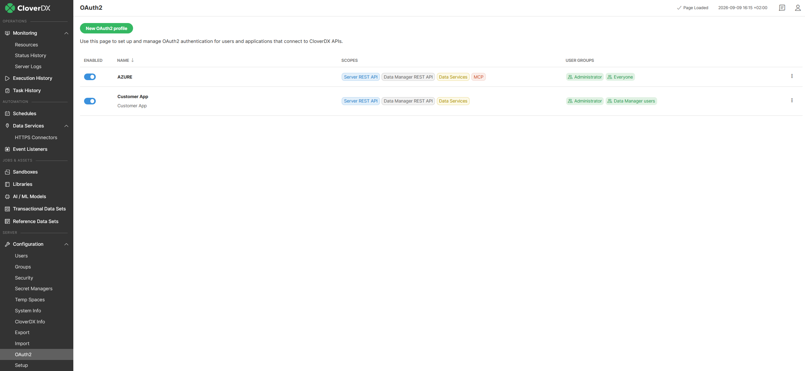
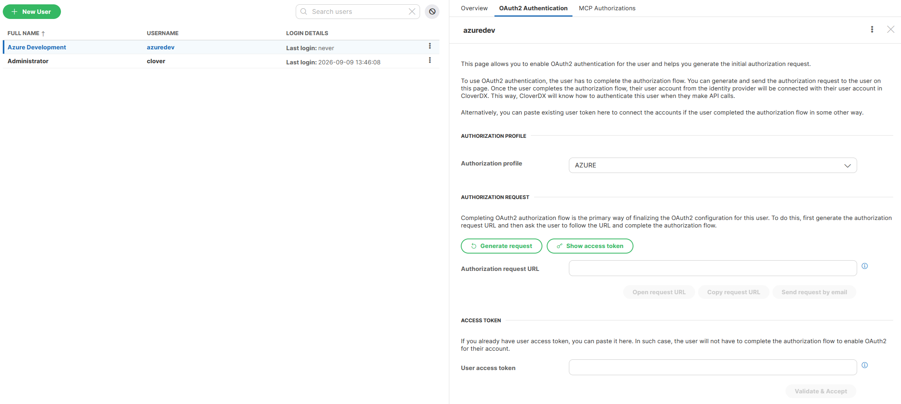

<!-- Administration > Configuration > Server configuration > User management and access control > OAuth2 authentication -->

#### OAuth2 authentication

By configuring the **OAuth2 Authentication** section in **CloverDX Server**, server **REST API** and **Data services** become accessible only via **OAuth2 access token** and authentication via **HTTP Basic** is disabled. However, authorization (access levels to sandbox content and privileges for operations) is still handled by the CloverDX security module. Each user, even when authenticated via OAuth2, requires a corresponding user record within the CloverDX [Users](users.md) module and assignment to at least one [user group](groups.md) for proper access. Also each user has to have its **CloverDX Server** user record linked to its **Identity provider** account.

You have to register your **client application** with your **Identity provider** first and then copy its properties here. Each HTTP request on server **REST API** or **Data services** has to contain **OAuth2 access token** so server can verify this token with the **Identity Provider**. As a result server obtains external user account identity ID and can determine which **CloverDX Server** user record is linked to this external ID.

*Figure 94. OAuth2 authentication*

##### OAuth2 setup

| Attribute | Description | Possible values |
| --- | --- | --- |
| Enable OAuth2 authentication | Enables OAuth2 authentication for Apis and Data Services. By default, **CloverDX Server** allows only **HTTP Basic** for authentication. Setting this attribute to true essentially forces **OAuth2** authentication. | `false` (default) \| `true` |
| Provider | Your identity provider. You have to select from a list of supported providers. | Azure (Microsoft), Google |
| Client ID | Application/Client ID as defined by the provider. |  |
| Client secret | Application/Client secret as defined by the provider. Its optional unless you need to link user accounts by completing the authorization flow. |  |
| Tennant ID | Tennant ID is available only for Azure (Microsoft) defined applications. |  |
| Authorization endpoint | Authorization URL needed when you link user accounts by completing the authorization flow. You don’t need to change its default value unless there is a specific network setup preventing usage of default hostname etc. |  |
| Token endpoint | Token URL needed when you link user accounts by completing the authorization flow. You don’t need to change its default value unless there is a specific network setup preventing usage of default hostname etc. |  |
| Use PKCE | Use Proof Key for Code Exchange (PKCE) with you provider’s application. | `false` (default) \| `true` |
| Redirect endpoint | Redirect URL needed when you link user accounts by completing the authorization flow. You don’t need to change its default value unless there is a specific network setup preventing usage of your server hostname from outside etc. This URL has to be registered with you provider’s application. |  |

##### OAuth2 provider setup
> [!NOTE]
> **Identity provider** can have specific requirements when registering **OAuth2** client application with them.
>
> If you want to link user accounts by completing authorization flow you have to register **Redirect URL** with your application. The **CloverDX server** redirect URL is 'https://[server-hostname]:[server-port]/clover/oauth2'.

###### Microsoft Azure

When registering application used for authentication of external APIs you have to create and connect 'API ID' with your application. For **CloverDX server** this 'API ID' has to contain 'Application (client) ID'. By default it should be 'api://[Application (client) ID]'.

You have to also create at least one 'scope' for you provider’s application. The **CloverDX server** is using only default scope so the name of the scope is not important. The value should be like this 'api://[Application (client) ID]/SomeName'.

###### Google

When registering application you have to assign 'scope' with name **'openid'** to your provider’s application.

##### Linking user account with OAuth2 provider’s account
> [!NOTE]
> The section **OAuth2 Authentication** is available only of OAuth2 authentication is configured on server.

Before user can use **OAuth2 authentication** its **CloverDX** user account has to be linked with **Identity provider** user account ID. This can be done by completing standard authorization flow or by using already existing acces token.

###### Authorization request

By clicking on **Generate request** server with create standard authorization URL. Administrator may use this URL directly or send it to particular user via email or othe communication tool. When used the providers loggin and accept screen is displayed in browser. By completing this flow the **access token** is send to server which allows server to obtain user provider’s account ID.

###### Access token

If your administrator already has a valid **access token** it can be paste directly to server UI. This token is validated by server which allows server to obtain user provider’s account ID.

*Figure 95. Linking user account*
