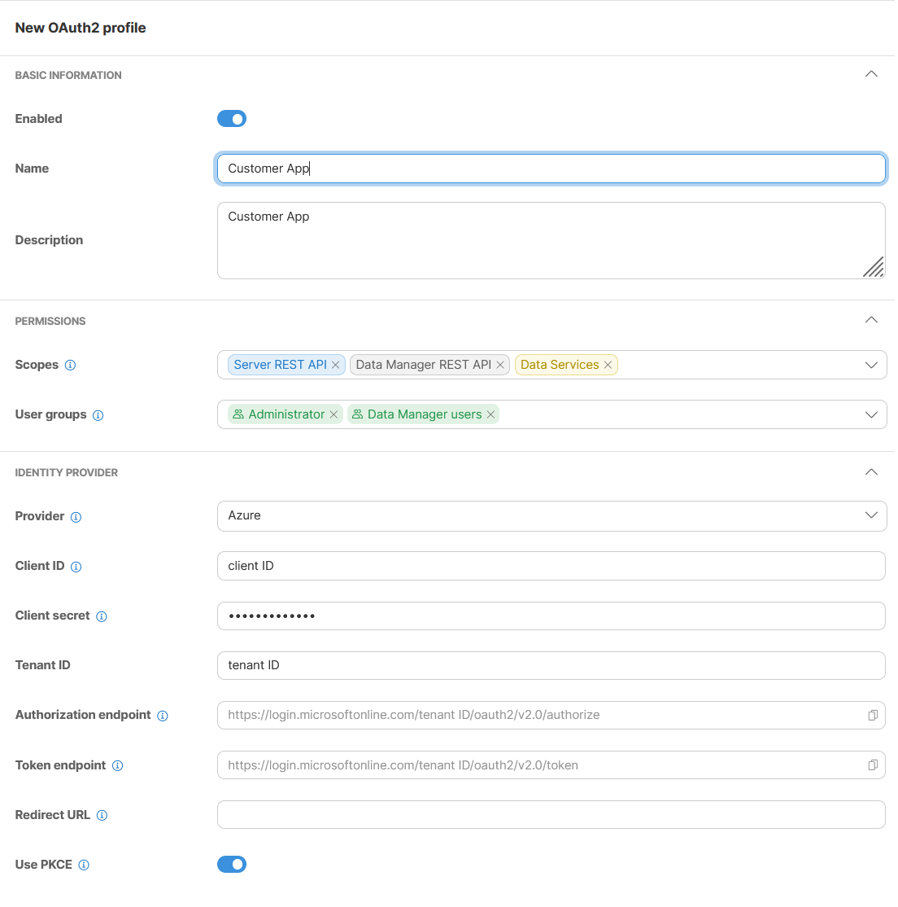
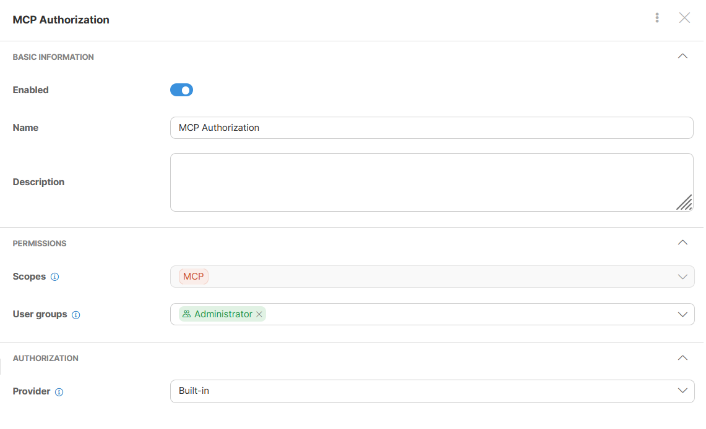

<!-- Administration > Configuration > Server configuration > User management and access control > OAuth2 authentication -->

#### OAuth2 authentication

With **OAuth2**, a client reaches the **CloverDX Server** APIs with an **access token** instead of a CloverDX password. It is configured in **Configuration** ****OAuth2**, which takes the [Setup and OAuth2](groups.md#permission-server-setup) permission. Four parts of the Server can be covered: the **Server REST API**, the **Data Manager REST API**, **Data services** and the [**MCP Server**](server-config-mcp.md). Each is covered on its own – authentication via **HTTP Basic** is disabled for the parts an enabled profile names among its **Server scopes**, and stays in place for the rest. Configuring OAuth2 for the **MCP** scope alone therefore changes nothing about how the other three are reached.

What a client authorizes against is an **OAuth2 profile**: one client application at one **Identity provider**, together with the scopes it covers and the user groups whose members may use it. A deployment can hold as many profiles as it needs, and more than one profile may carry the same scope.

OAuth2 decides authentication only. Authorization – access levels to sandbox content and privileges for operations – is still handled by the CloverDX security module. With an **Identity provider**, the user’s **CloverDX Server** record has to be [linked](oauth2-authentication.md#linking-user-account-with-oauth2-providers-account) to their account there: the Server reads the account identity from the token it verifies and looks the CloverDX user up by it. With the [Built-in provider](oauth2-authentication.md#built-in) there is no external account to link, so this step falls away.

The page lists every profile with its scopes and user groups. The toggle in the **Enabled** column turns a profile on and off without deleting it, **New OAuth2 profile** creates one, and the menu at the end of each row duplicates or deletes it. Click a profile to open its settings.

*Figure 95. The OAuth2 module*

##### OAuth2 profile setup

| Attribute | Description | Possible values |
| --- | --- | --- |
| Enabled | Enables/disables OAuth2 profile usage. | `true` (default) \| `false` |
| Name | Unique name of the **OAuth2 profile**. This name is shown in the list of available profiles in **OAuth2 Authentication**. |  |
| Description | Optional description of the **OAuth2 profile**. |  |
| Scopes | Scopes define the parts of the **REST API** that can be accessed by a user authorized against the **OAuth2 profile**. | Server REST API, Data Manager REST API, Data Services, MCP |
| User groups | List of user groups whose members have access to the **OAuth2 profile**. |  |
| Provider | Your identity provider. You have to select from a list of supported providers. | Azure (Microsoft), Google, Built-in |
| Client ID | Application/Client ID as defined by the provider. |  |
| Client secret | Application/Client secret as defined by the provider. Its optional unless you need to link user accounts by completing the authorization flow. |  |
| Tenant ID | Tenant ID is available only for Azure (Microsoft) defined applications. |  |
| Authorization endpoint | Authorization URL needed when you link user accounts by completing the authorization flow. You don’t need to change its default value unless there is a specific network setup preventing usage of default hostname etc. |  |
| Token endpoint | Token URL needed when you link user accounts by completing the authorization flow. You don’t need to change its default value unless there is a specific network setup preventing usage of default hostname etc. |  |
| Use PKCE | Use Proof Key for Code Exchange (PKCE) with you provider’s application. Required on a profile that carries the **MCP** scope – without it, MCP authorization requests are refused. | `false` (default) \| `true` |
| Redirect endpoint | Redirect URL needed when you link user accounts by completing the authorization flow. You don’t need to change its default value unless there is a specific network setup preventing usage of your server hostname from outside etc. This URL has to be registered with you provider’s application. |  |

*Figure 96. OAuth2 profile*

##### Server scopes

Server scope is a part of the **CloverDX Server REST API** which can be accessed by an **OAuth2 profile**. There are four available scopes.

**Server REST API** - see 'https://[server-hostname]:[server-port]/clover/api/rest/v1/docs.html'

**Data Manager REST API** - see 'https://[server-hostname]:[server-port]/clover/api/rest/data-manager/v1/docs.html'

**Data Services** - all published [Data Services](../operations/data-services.md)

**MCP** - [CloverDX MCP Server](server-config-mcp.md)
> [!NOTE]
> Only one **OAuth2 profile** can have the MCP scope assigned.

##### Providers

A profile’s **Provider** is one of three: **Azure (Microsoft)**, **Google**, or **Built-in**, which is the **CloverDX Server** itself.

With an identity provider, register **CloverDX Server** as a client application there first; the profile is then filled in from that registration.
> [!NOTE]
> **Identity provider** can have specific requirements when registering **OAuth2** client application with them.
>
> If you want to link user accounts by completing authorization flow you have to register **Redirect URL** with your application. The **CloverDX server** redirect URL is 'https://[server-hostname]:[server-port]/clover/oauth2'.

###### Microsoft Azure

When registering application used for authentication of external APIs you have to create and connect 'API ID' with your application. For **CloverDX server** this 'API ID' has to contain 'Application (client) ID'. By default it should be 'api://[Application (client) ID]'.

You have to also create at least one 'scope' for you provider’s application. The **CloverDX server** is using only default scope so the name of the scope is not important. The value should be like this 'api://[Application (client) ID]/SomeName'.

###### Google

When registering application you have to assign 'scope' with name **'openid'** to your provider’s application.

###### Built-in

The Built-in provider is a special case of an **OAuth2 profile**. It can be used only with the MCP scope. There are no **Identity provider** parameters because this provider is the **CloverDX Server** itself.

*Figure 97. OAuth2 with built in provider*

With this provider, **CloverDX Server** authorizes MCP clients on its own: nothing is registered at Entra or Google, no client secret is kept in the Server configuration, and no user account is linked by hand. The user signs in on a CloverDX page with their own credentials and approves the client there. Everything on the client side stays the same – see [Authorizing MCP clients with the built-in provider](server-config-mcp.md#with-the-built-in-provider).

Two limits apply to such a profile:

- **MCP only.** A profile with this provider carries the **MCP** scope and nothing else, so the **REST API**, **Data services** and the **Data Manager REST API** still need an **Identity provider** profile.
- **Password security domains only.** An account in the CloverDX domain or in an [LDAP](ldap-authentication.md) domain can complete the flow. An account in a [SAML](saml-authentication.md) domain cannot, and is refused with the same message a wrong password gives.

Users are checked against the profile’s **User groups**, and every renewal of a client’s session re-checks the CloverDX account. A user who is disabled, deleted, or taken out of those groups loses access at the next renewal.

##### Linking user account with OAuth2 provider’s account
> [!NOTE]
> The section **OAuth2 Authentication** is available only if OAuth2 authentication is configured on server. At least one **OAuth2 profile** has to be enabled. A profile with the [Built-in provider](oauth2-authentication.md#built-in) is not offered here – it has no external identity to link an account to.

Before user can use **OAuth2 authentication** its **CloverDX** user account has to be linked with **Identity provider** user account ID. This can be done by completing standard authorization flow or by using already existing acces token.

###### Authorization profile

There can be multiple **OAuth2 profiles** configured. Select which profile the user should be authorized against. The important limitation here is that, for each **OAuth2 profile**, each **Identity provider** user account ID can be used only once.

###### Authorization request

By clicking on **Generate request** server with create standard authorization URL. Administrator may use this URL directly or send it to particular user via email or othe communication tool. When used the providers loggin and accept screen is displayed in browser. By completing this flow the **access token** is send to server which allows server to obtain user provider’s account ID.

###### Access token

If your administrator already has a valid **access token** it can be paste directly to server UI. This token is validated by server which allows server to obtain user provider’s account ID.

*Figure 98. Linking user account*
