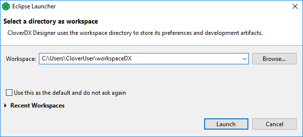
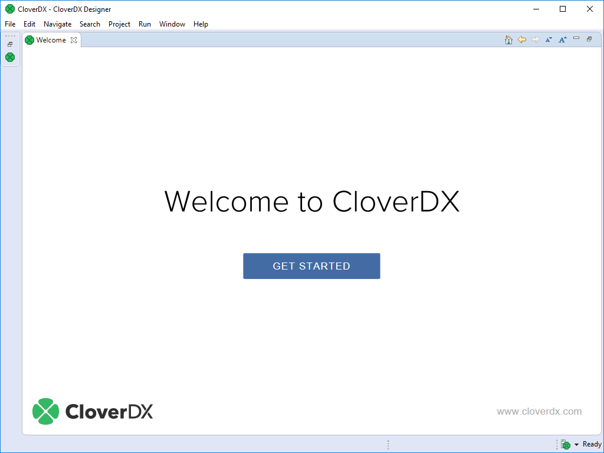
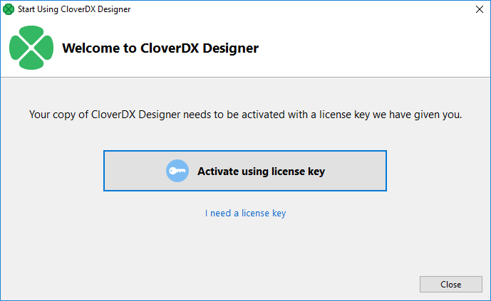
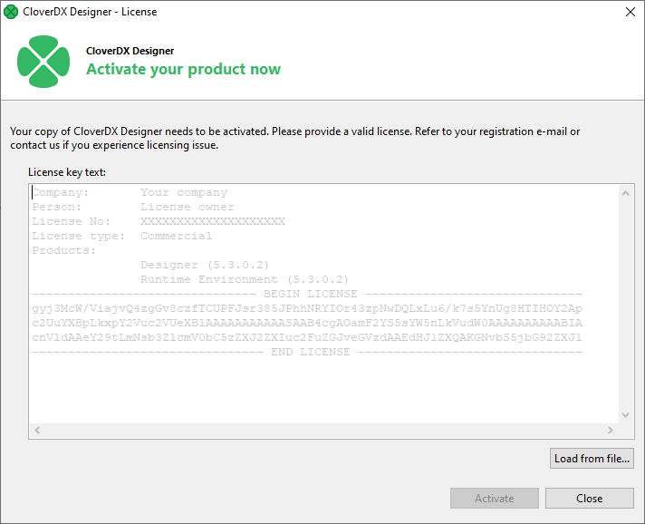
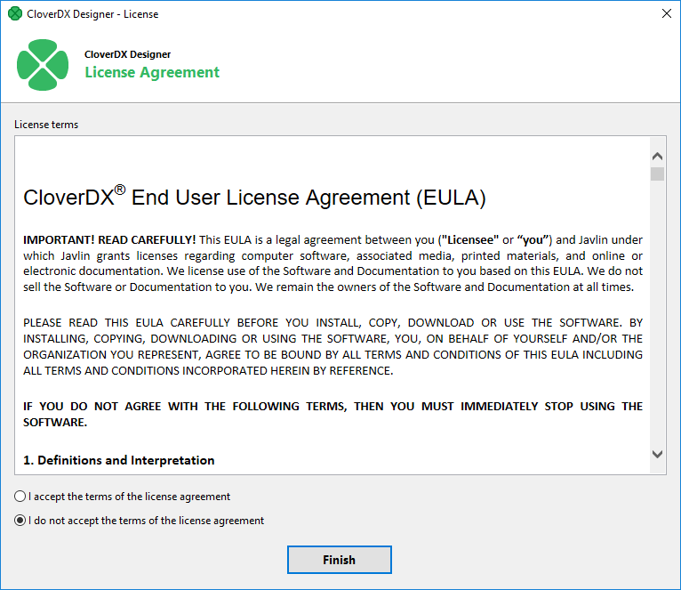
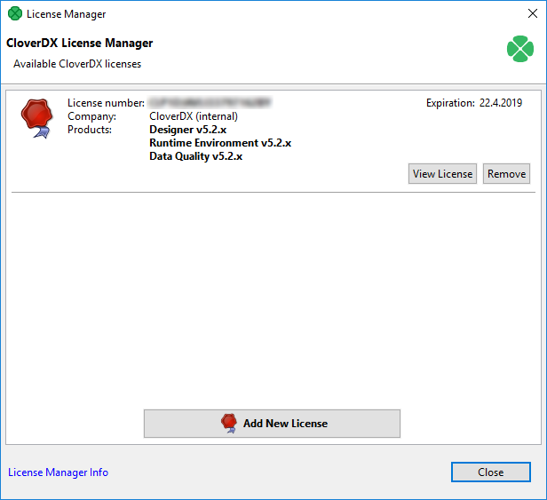
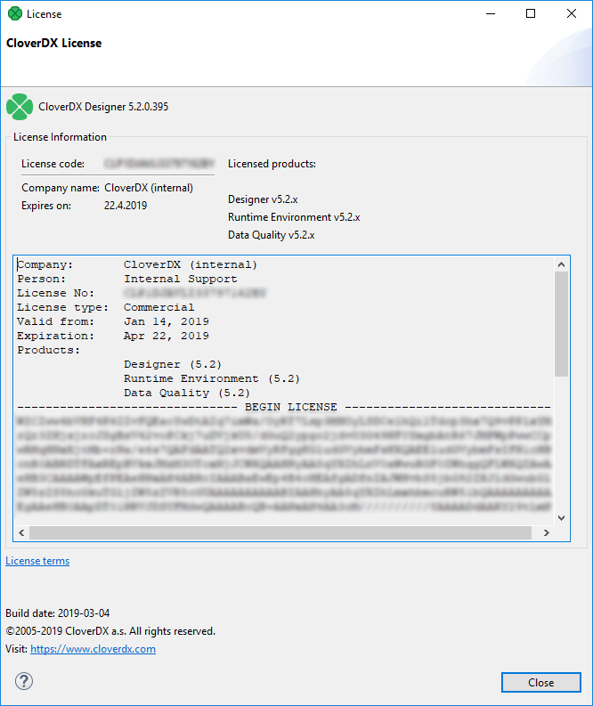
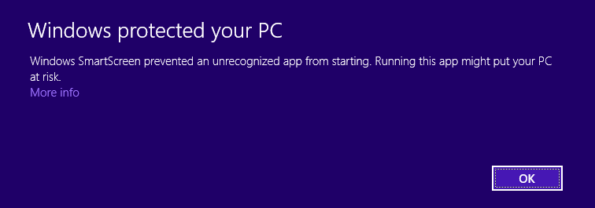
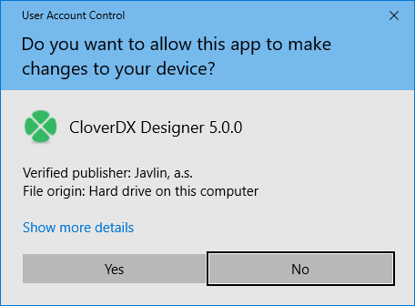

<!-- Administration > Installation > Designer installation -->

## 1. Designer installation

### System requirements

#### Hardware

This section outlines the hardware resources needed to run **CloverDX Designer**. The listed specifications provide a baseline for functionality, with recommendations for optimal performance.

| Resource | Requirements |
| --- | --- |
| RAM | 4 GB; 8 GB or more for optimal performance |
| Processors | Dual-core CPU; quad core CPU for optimal performance |
| Disk space (installation) | 1 GB |
| Disk space (data) | 1 GB (minimum; depending on data) |
| Screen resolution | Best on Full HD |

#### Software

This section details the operating systems and Java versions supported by CloverDX Designer.

| Operating system | Note |
| --- | --- |
| **Microsoft Windows** | MS Windows 10 or 11, 64-bit. |
| **macOS** | *macOS 13 (Ventura) or newer*, running on *Apple Silicon* (M1, M2 or M3 CPUs). *Intel CPUs* are not supported since CloverDX 7.0. |
| **Linux** | Linux 64-bit with GTK+ 3.22.0 or newer. While we primarily test on Ubuntu, the Designer should work on all modern Linux distributions. |

| Java | Notes |
| --- | --- |
| **Eclipse Temurin JDK**[[1]](part-installation-instructions.md#sys-req-fn-01) | **Eclipse Temurin JDK 21**, 64-bit (formerly AdoptOpenJDK), which can be downloaded from the following site: [https://adoptium.net](https://adoptium.net). |

| 1 | CloverDX Designer requires a Java Development Kit (JDK). Running with just JRE is not supported. |
| --- | --- |
> [!NOTE]
> Windows and macOS installers include all the needed dependencies. When installing the Designer on a Linux OS, Eclipse Temurin JDK 21 needs to be downloaded separately, and the JAVA_HOME path set to point to it.

### Downloading

To download **CloverDX Designer** perform the following steps:

1. Log into your account in our *[CloverDX Customer Portal](https://support.cloverdx.com/login)*.
2. Click on **Product Downloads**.
3. In the **CloverDX Designer** section click on one of the download links based on the desired operating system (Windows, Linux or macOS). The download process should start automatically.

**Continue with:**[Installing](part-installation-instructions.md#installing)

### Installing

#### Windows

The installation of **CloverDX Designer** is done using an installation wizard.

The installation wizard helps you to set up the directory to which **CloverDX** will be installed and to choose the instance of Java that will be used.

##### Installation steps

1. Allow installer to run by clicking on **Yes** to the question: *Do you want to allow this app to make changes to your device?*
2. On the welcome page of the **CloverDX Designer** installation, click on **Next**.
3. Accept license agreement using the **I Agree** button.
4. Choose an installation location and continue using the **Next** button.
5. Choose an installation location for shortcuts: *Create desktop shortcut* or *Do not create shortcut*.
6. Accept the Java Development Kit License agreement by clicking on **I Agree**.
7. Choose a Start menu folder and click on **Install**.
8. Installation of the program is done. Close the wizard by clicking on **Finish**.

#### Mac OS

Install the program in the same way as other `.dmg` applications.

##### Installation steps

1. Double click the downloaded `.dmg` file.
2. Agree with the license.
3. Drag and drop the **CloverDX Designer** to **Application** or to the place you would like to place it.

#### Linux

The **CloverDX Designer** for Linux is distributed as a `.tar.gz` file.

##### Installation steps

Extract the archive.

`tar xvzf cloverdx-designer-linux-gtk-x86_64.tar.gz`

The executable to run is `CloverDXDesigner/CloverDXDesigner`.
> [!TIP]
> For more comfortable running, add the binary to the `$PATH` or create a **Launcher**.
> [!NOTE]
> We recommend you install `webkitgtk` to see the welcome page. **CloverDX Designer** is able to run without this library. The library is necessary for the welcome page and for context info on edges.
>
> On rpm-based distributions, run
>
> `yum install webkitgtk`
>
> On deb-based distributions, run
>
> `apt-get install libwebkitgtk-1.0-0` (for GTK+ 2)

**Continue with:**[Starting](part-installation-instructions.md#starting)

### Starting

The first thing you will be prompted to define after the **CloverDX Designer** launches, is the **workspace** folder. **Workspace** is a place your projects will be stored at; usually a folder in the user’s `home` directory (e.g., `C:\Users\your_name\workspace` or `/home/your_name/CloverDX/workspace` )


*Figure 1. Workspace Selection Dialog*

Note that the **workspace** can be located anywhere. Make sure you have proper permissions to the location. If a non-existing folder is specified, it will be created.

When the **workspace** is set, the welcome screen is displayed.


*Figure 2. CloverDX Designer Introductory Screen*

When you have started for the first time, you are asked to activate the product.

The first steps with **CloverDX Designer** are described in [Creating CloverDX projects](../developer/first-cloverdx-project.md).

The documentation is accessible from the main menu under **Help** ****Help Contents**.


*Figure 3. CloverDX Help*
> [!NOTE]
> Eclipse secure storage
> Eclipse secure storage stores passwords used in Eclipse. If you have a clean installation of Eclipse, the first time you enter a password, you will be prompted to specify a master password for Eclipse secure storage. You can specify secure storage options in **Window** ****Preferences** ****General** ****Security** ****Secure Storage**.
>
> For more information about secure storage, see [Eclipse User Guide](https://help.eclipse.org/kepler/index.jsp?topic=%2Forg.eclipse.platform.doc.user%2Freference%2Fref-securestorage-start.htm).

### Activating

**CloverDX Designer** needs activating before you can use it. If **Designer** without a valid license starts, you are instructed to activate it.

Click **Activate using license key** to activate the **Designer**.

If you do not have a license key, the **I need a license key** button opens a web page where you can get a trial license.


*Figure 4. Choose licensing*

#### Activation using license key

The license can be activated using a license key. Internet connection isn’t necessary for this choice. Following pictures illustrates the process of new license activation.

Copy and paste the license text, or specify the path to the license file with **Load from File** button.


*Figure 5. Dialog for specifying license*

Confirm you accept the license agreement and click **Finish** button.


*Figure 6. License agreement*

The license has been applied, the **CloverDX Designer** has been activated.

Already activated license can be deleted with the help of [*License Manager*](part-installation-instructions.md#license-manager).
> [!NOTE]
> You should have received the license key by an email.
>
> If you are installing a trial version of **CloverDX Designer** you got the license key after the registration.
>
> The license key can be also acquired on your **CloverDX Account**: log in at [www.cloverdx.com/login](https://support.cloverdx.com/login) and under the section **Download** you see a **View license key** button.

### License manager

This chapter describes how you can add or remove **licenses** at CloverDX Designer.

**License Manager** is designed to easily add new licenses and remove or view existing licenses. The manager is accessible in the main menu - select **Help** ****CloverDX** ****License Manager**.


*Figure 7. License Manager showing installed licenses.*

License manager allows you to:

- Browse all available licenses and it’s details:
  - **License number** - number of installed license.
  - **Company**
  - **Products** - list of licensed products.
  - **Expiration** - expiration date of the license.
- Open [CloverDX License dialog](part-installation-instructions.md#cloverdx-license-dialog) to view all available information about the license.
- Check available license sources. The license sources are shown after clicking on **License Manager Info**.
- Open **Add New License** dialog. New license can be added with the help of this wizard. Click **Add New License** button to start the process of license activation. See [Activating](part-installation-instructions.md#activating).
- Delete existing license. **Remove** button is shown if it is possible to remove activated license. Confirmation is required when deleting license.

#### CloverDX license dialog

**CloverDX** License dialog shows all available information about the license. **License terms** are available from this place. It can be opened from **License Manager** ([License Manager](part-installation-instructions.md#license-manager))


*Figure 8. CloverDX License dialog*
> [!NOTE]
> License Terms needn’t to be accessible for some licenses.

### Troubleshooting

This chapter contains some infrequent errors you may encounter and solutions to them.

#### Windows

##### Windows SmartScreen

In the case of installation of **CloverDX Designer** on Microsoft Windows 8 the installer may be prevented from starting by SmartScreen.


*Figure 9. SmartScreen warning*

To start the **CloverDX Designer** installer, click on **More info**, check that the publisher is **CloverDX a.s.** and then click on **Run anyway**.

More information about SmartScreen:

- *[http://www.howtogeek.com/123938/htg-explains-how-the-smartscreen-filter-works-in-windows-8/](http://www.howtogeek.com/123938/htg-explains-how-the-smartscreen-filter-works-in-windows-8/)*
- *[http://en.wikipedia.org/wiki/Microsoft_SmartScreen](http://en.wikipedia.org/wiki/Microsoft_SmartScreen)*

##### User account control

On **Microsoft Windows**, the **User Account Control** can prevent the installer of **CloverDX Designer** from running. Click **YES** to allow the installer to run.


*Figure 10. User Account Control Preventing the Installation*

##### Windows 10 firewall

Windows 10 shows security warning when Designer’s Runtime is starting.

**CloverDX Designer** application starts as two processes: **CloverDX Designer GUI** and **CloverDX Runtime**. These processes need to communicate with each other over TCP protocol. You should allow the mutual communication with **Allow access** button.

#### Linux

##### Designer stops responding

Due to bug in Linux/GTK+, Designer runs out of number of open files as the backend opens the file `/etc/cups/client.cont` many times.

As workaround, you can configure the printers in `/etc/cups/client.conf` file, or add `-Dorg.eclipse.swt.internal.gtk.disablePrinting` to `CloverDX.ini` file. See [https://wiki.eclipse.org/IRC_FAQ#Why_does_Eclipse_hang_for_an_extended_period_of_time_after_opening_an_editor_in_Linux.2Fgtk.2B.3F](https://wiki.eclipse.org/IRC_FAQ#Why_does_Eclipse_hang_for_an_extended_period_of_time_after_opening_an_editor_in_Linux.2Fgtk.2B.3F), [https://bugs.eclipse.org/bugs/show_bug.cgi?id=215234](https://bugs.eclipse.org/bugs/show_bug.cgi?id=215234) or [https://bugzilla.gnome.org/show_bug.cgi?id=346903](https://bugzilla.gnome.org/show_bug.cgi?id=346903).

##### Welcome page not displayed

Welcome page requires `webkitgtk` library to be present on your system. Install `webkitgtk` version 1.

See [https://bugs.eclipse.org/bugs/show_bug.cgi?id=492379](https://bugs.eclipse.org/bugs/show_bug.cgi?id=492379)

##### Hints on edges have no content

If hints on edges contain only the frame but no content, you should install `webkitgtk`.

##### Component editor not working

In older Linux versions (e.g. Ubuntu 16.04 MATE or Linux Mint 18 Cinnamon), Eclipse platform may experience some problems related to the system’s GTK version. For example, when using GTK 2, the component editor in **CloverDX Designer** may not work properly.

In such a case, add the following parameter to `CloverDXDesigner.ini` located in the root folder of your **CloverDX Designer** installation:
--launcher.GTK_version 2
This parameter forces **CloverDX Designer** to run using GTK 2 which may fix the problem.

**Note:** do not use the parameter on systems using GTK 3 (e.g. Manjaro with KDE Plasma 5), as it may cause other problems (e.g. non-functional tooltips in the graph editor).

#### Others

##### Subclipse

If you use **CloverDX Designer** with **Subclipse** plugin, and perform the following steps: In a project, create a directory `aaa`, create a file `bbb`, delete the directory `aaa`, and rename file `bbb` to `aaa`; you may encounter the message:

```
An exception has been caught while processing the refactoring 'Rename resource'.
Reason:
Problems encountered while moving resources.

Error deleting markers for resource bbb.
Resource aaa does not exist.
```

This problem is caused by caching resources by the **Subclipse** plugin and is not related to **CloverDX**.

If this message appears, refresh the project in **Project Explorer**.

#### Online activity

**CloverDX Designer** by default accesses the following internet addresses:

- Eclipse (198.41.30.198, 198.41.30.200) - automated check for Eclipse updates.

Designer is fully functional when used offline.

#### Logs

**CloverDX Designer** logs provide valuable information for troubleshooting purposes. These logs are stored in your *workspace directory > .metadata folder*. To find your current workspace directory go to **File > Switch Workspace > Other…​**. The displayed path is your current workspace directory.

Within the *.metadata* folder, you’ll find three log files:

1. **.log**: This file contains messages related to the underlying Eclipse platform that CloverDX Designer is built upon.
2. **CloverDX.log** files: These files capture all messages specific to CloverDX Designer’s functionality, including transformation execution and application events.
3. **runtime.log** files: These files capture all messages specific to CloverDX Designer Runtime’s functionality, including Runtime configuration.
> [!NOTE]
> Including all sets of logs will provide a comprehensive view of your CloverDX Designer session and aid the CloverDX Support team in pinpointing the root cause of the issue.


### IBM InfoSphere MDM plugin installation

**CloverDX IBM InfoSphere MDM Components** is an extension of CloverDX for connectivity to **IBM InfoSphere MDM** technology. The extension can be installed and used with **CloverDX Designer** and **CloverDX Server**. For installation steps into CloverDX Server, refer [here](server-virtual-mdm-plugin-installation.md).

**CloverDX** supports IBM InfoSphere MDM 11.6 and 12.0 since version 5.11.0.

#### Downloading

**IBM InfoSphere MDM Components** for **CloverDX Designer** are downloaded and installed from an online update-site. The update site is used in Eclipse (or Designer) to install the extension, see [Installation into Designer](part-installation-instructions.md#installation) for details.

The update site locations are:

- *[https://download.cloverdx.com/ibm-mdm-11-6-update](https://download.cloverdx.com/ibm-mdm-11-6-update)* for IBM InfoSphere MDM 11.6
- *[https://download.cloverdx.com/ibm-mdm-12-0-update](https://download.cloverdx.com/ibm-mdm-12-0-update)* for IBM InfoSphere MDM 12.0
> [!TIP]
> In case you need an older version, add the slash and the version number to the end of the URL, for example a link for version 5.11.0 is:
>
> *[https://download.cloverdx.com/ibm-mdm-12-0-update/5.11.0](https://download.cloverdx.com/ibm-mdm-12-0-update/5.11.0)*

#### Installation

The following steps are needed to install **IBM InfoSphere MDM Components** into **CloverDX Designer**:

1. Start Designer and open the **Install** wizard via the **Help** > **Install New Software** menu.
2. In the **Work with:** text box, enter the update site location for **IBM InfoSphere MDM Components**, e.g. [https://download.cloverdx.com/ibm-mdm-12-0-update](https://download.cloverdx.com/ibm-mdm-12-0-update). See [Downloading](part-installation-instructions.md#downloading) for update site locations.
   
3. Select all **IBM InfoSphere MDM Components** plugins by enabling the checkbox to the left of **IBM InfoSphere MDM xx.y**, click on **Next** button and proceed with the wizard.
4. After finishing the **Install** wizard and installing the plugins, you will be asked to restart Eclipse. After restarting, the **IBM InfoSphere MDM Components** are available for use.
   To verify that **IBM InfoSphere MDM Components** plugin was successfully installed, you can look into the **Palette** of an opened CloverDX graph and see IBM InfoSphere MDM components:
   
> [!IMPORTANT]
> If the **Designer** is reinstalled then it’s necessary also to reinstall the IBM InfoSphere MDM plugin. It is not possible to install multiple versions of IBM InfoSphere MDM plugin into one **CloverDX Designer**.

##### Troubleshooting

If you get an `Unknown component` or `Unknown connection` error when running a graph with IBM InfoSphere MDM components, it means that the **IBM InfoSphere MDM Components** plugin was not installed successfully. Please check the above steps to install the plugin. Example of the error:


