<!-- Administration > Installation > Designer installation -->

## 1. Designer installation

### System requirements

#### Hardware

This section outlines the hardware resources needed to run **CloverDX Designer**. The listed specifications provide a baseline for functionality, with recommendations for optimal performance.

| Resource | Requirements |
| --- | --- |
| RAM | 4 GB; 8 GB or more for optimal performance |
| Processors | Dual-core CPU; quad core CPU for optimal performance |
| Disk space (installation) | 2 GB |
| Disk space (data) | 1 GB (minimum; depending on data) |
| Screen resolution | Best on FullHD or 4K |

#### Software

This section details the operating systems and Java versions supported by CloverDX Designer.

| Operating system | Note |
| --- | --- |
| **Microsoft Windows** | MS Windows 10 or 11, 64-bit. |
| **macOS** | *macOS 14 (Sonoma) or newer*, running on *Apple Silicon* (M1 or newer CPU). Intel CPUs are not supported since CloverDX 7.0. |
| **Linux** | Linux 64-bit with GTK+ 3.22.0 or newer. While we primarily test on Ubuntu, the Designer should work on all modern Linux distributions. |

| Java | Notes |
| --- | --- |
| **Eclipse Temurin JDK**[[1]](part-installation-instructions.md#sys-req-fn-01) | **Eclipse Temurin JDK 21**, 64-bit (formerly AdoptOpenJDK), which can be downloaded from [Eclipse Temurin project site](https://adoptium.net/temurin). |

| 1 | CloverDX Designer requires a Java Development Kit (JDK). Running with just JRE is not supported. |
| --- | --- |
> [!NOTE]
> Windows and macOS installers include all the needed dependencies. When installing the Designer on a Linux OS, Eclipse Temurin JDK 21 needs to be downloaded separately, and the JAVA_HOME path set to point to it.

### Downloading

To download **CloverDX Designer** perform the following steps:

1. Log into your account in our *[CloverDX Customer Portal](https://support.cloverdx.com/login)*.
2. Click on **Product Downloads**.
3. In the **CloverDX Designer** section click on one of the download links based on the desired operating system (Windows, Linux or macOS). The download process should start automatically.

**Continue with:**[Installing](part-installation-instructions.md#installing)

### Installing

#### Windows

The installation of **CloverDX Designer** is done using an installation wizard.

The installation wizard helps you to set up the directory to which **CloverDX** will be installed and to choose the instance of Java that will be used.

##### Installation steps

1. Allow installer to run by clicking on **Yes** to the question: *Do you want to allow this app to make changes to your device?*
2. On the welcome page of the **CloverDX Designer** installation, click on **Next**.
3. Accept license agreement using the **I Agree** button.
4. Choose an installation location and continue using the **Next** button.
5. Choose an installation location for shortcuts: *Create desktop shortcut* or *Do not create shortcut*.
6. Accept the Java Development Kit License agreement by clicking on **I Agree**.
7. Choose a Start menu folder and click on **Install**.
8. Installation of the program is done. Close the wizard by clicking on **Finish**.

#### Mac OS

Install the program in the same way as other `.dmg` applications.

##### Installation steps

1. Double click the downloaded `.dmg` file.
2. Agree with the license.
3. Drag and drop the **CloverDX Designer** to **Application** or to the place you would like to place it.

#### Linux

The **CloverDX Designer** for Linux is distributed as a `.tar.gz` file.

##### Installation steps

Extract the archive.

`tar xvzf cloverdx-designer-linux-gtk-x86_64.tar.gz`

The executable to run is `CloverDXDesigner/CloverDXDesigner`.
> [!TIP]
> For more comfortable running, add the binary to the `$PATH` or create a **Launcher**.
> [!NOTE]
> We recommend you install `webkitgtk` to see the welcome page. **CloverDX Designer** is able to run without this library. The library is necessary for the welcome page and for context info on edges.
>
> On rpm-based distributions, run
>
> `yum install webkitgtk`
>
> On deb-based distributions, run
>
> `apt-get install libwebkitgtk-1.0-0` (for GTK+ 2)

**Continue with:**[Starting](part-installation-instructions.md#starting)

### Starting

The first thing you will be prompted to define after the **CloverDX Designer** launches, is the **workspace** folder. **Workspace** is a place your projects will be stored at; usually a folder in the user’s `home` directory (e.g., `C:\Users\your_name\workspace` or `/home/your_name/CloverDX/workspace` )

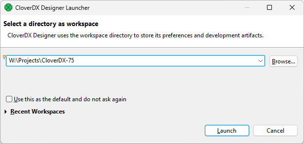
*Figure 1. Workspace selection shown during CloverDX Designer start-up.*

The **workspace** can be located anywhere. We do, however, recommend using path that does not contain any spaces as it makes it easier to use scripts within such location. If you specify a folder that does not exist, it will be created for you.

If you only plan to use a single workspace, you can check the **Use this as the default…​** checkbox and the Designer will not longer ask during startup. If desired, you can then switch workspace using **File** ****Switch Workspace**.

Note that workspaces can be quite large as they will by default contain various temporary files and logs needed by the Designer. An empty workspace can be easily more than 300 MB and can grow to multiple of that size if you are processing larger data volumes in the Designer.

When the **workspace** is set, the welcome screen is displayed.

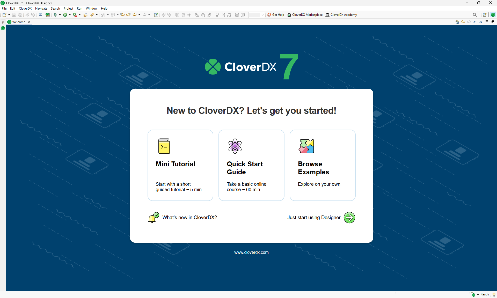
*Figure 2. CloverDX Designer welcome page shown on first start.*

When you have started for the first time, you are asked to activate the product.

The first steps with **CloverDX Designer** are described in [Creating CloverDX projects](../developer/first-cloverdx-project.md).

The documentation is accessible from the main menu under **Help** ****Help Contents**.

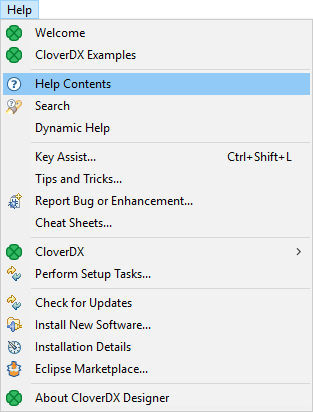
*Figure 3. CloverDX Help*
> [!NOTE]
> Eclipse secure storage
> Eclipse secure storage stores passwords used in Eclipse. If you have a clean installation of Eclipse, the first time you enter a password, you will be prompted to specify a master password for Eclipse secure storage. You can specify secure storage options in **Window** ****Preferences** ****General** ****Security** ****Secure Storage**.
>
> For more information about secure storage, see [Eclipse User Guide](https://help.eclipse.org/kepler/index.jsp?topic=%2Forg.eclipse.platform.doc.user%2Freference%2Fref-securestorage-start.htm).

### Activating Designer

**CloverDX Designer** must be activated before you can use it. If the **Designer** starts without a valid license, you will be instructed to activate it.

The activation is done via Activation wizard.

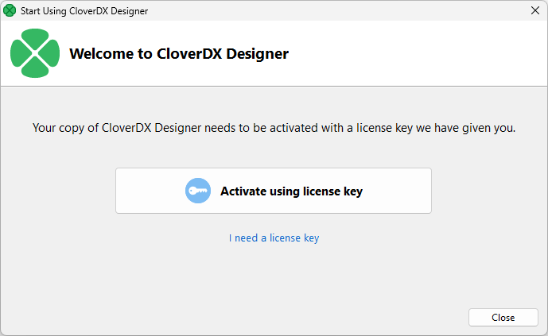
*Figure 4. Choose whether to activate the Designer or to get a new trial key.*

If you already have your license, you can select You can either load the license **Activate using license key** to activate the **Designer**. If you do not have a license key yet, the **I need a license key** button opens a web page where you can get a trial license.

#### Activation using license key

The license can be activated using a license key. Internet connection isn’t necessary for this choice, but you will have to have the license key ready. The license key itself is a long string of letters and numbers which encodes the licensing details (which parts of the product you can use and so on).

You can either copy-paste the license key or load if from a file:

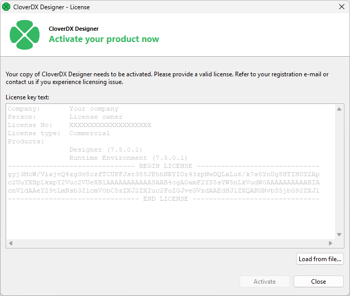
*Figure 5. Add license dialog allows you to either copy-paste the license or load if from a file.*

Once you add the license, the *End User License Agreement* (EULA) for CloverDX products is shown. If you wish to use the Designer, you’ll have to accept the EULA.

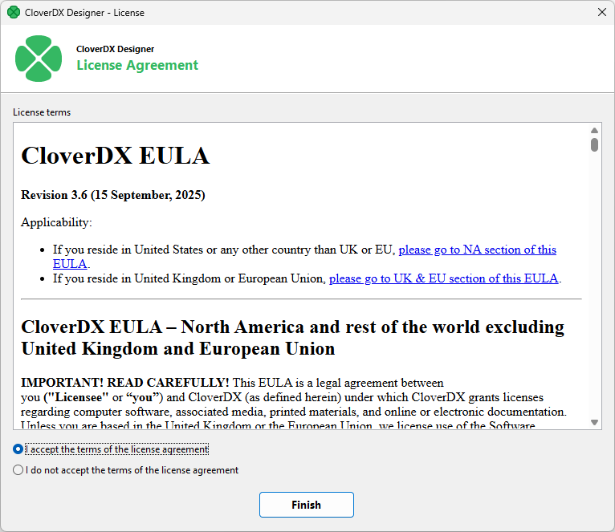
*Figure 6. License agreement shown after the license has been added.*

Once you confirm the EULA, your license will be applied and your instance of **CloverDX Designer** will be activated.

You can see details about your license in [*License Manager*](part-installation-instructions.md#license-manager) dialog.
> [!NOTE]
> You should have received the license key by an email.
>
> If you are installing a trial version of **CloverDX Designer** you got the license key after the registration.
>
> The license key can be also acquired on your **CloverDX Account**: log in at [www.cloverdx.com/login](https://support.cloverdx.com/login) and under the section **Download** you see a **View license key** button.

### Activating CloverDX AI Assistant

**CloverDX AI Assistant** requires its own separate license. If you wish to use it, you’ll have to load the Assistant’s license into your CloverDX Designer after you’ve activated your Designer. To get your Assistant license, please visit [License keys](https://support.cloverdx.com/license-keys) on [CloverDX Customer Portal](https://support.cloverdx.com/myaccount).

When you first start CloverDX if the Assistant is not yet activated, it will show you a welcome screen which will guide you through the activation process via a simple wizard.

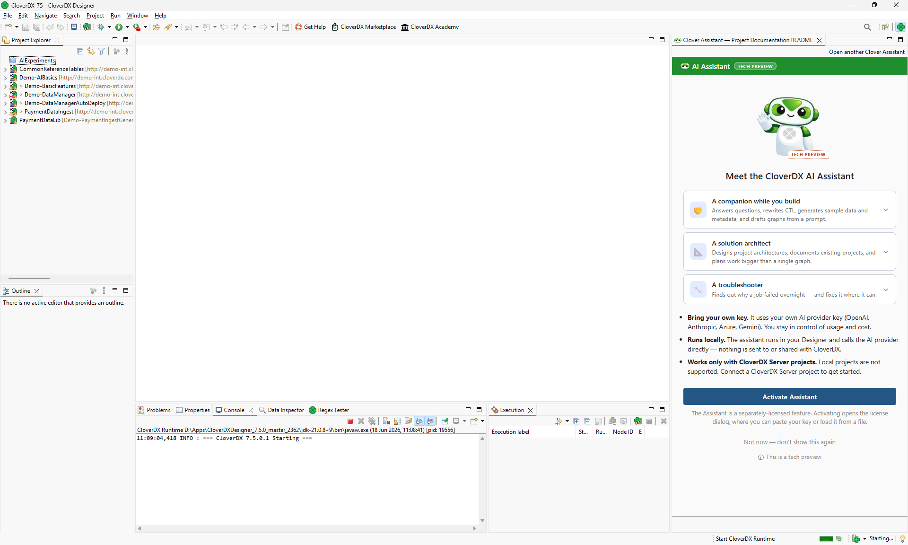
*Figure 7. First start of CloverDX AI Assistant will show you a welcome screen where you can easily add your Assistant license by clicking on the Activate Assistant button.*

Alternatively, you can also add the license via [License Manager dialog](part-installation-instructions.md#license-manager).

Once your Assistant is activated, you’ll have to configure the API keys so that it can access Large Language Model – the Assistant is a Bring-your-own-key experience (BYOK). See more details about the Assistant’s LLM configuration in [CloverDX AI Assistant configuration](designer-configuration.md#cloverdx-ai-assistant-configuration).

### License manager

**License Manager** is a dialog that allows you to manage all licenses that have been loaded into your **CloverDX Designer**. Multiple licenses can be loaded at any time – some of them may be older, inactive licenses; or you can have a separate license that unlocks **CloverDX AI Assistant**, etc.

The manager is accessible in the main menu – select **Help** ****CloverDX** ****License Manager**.

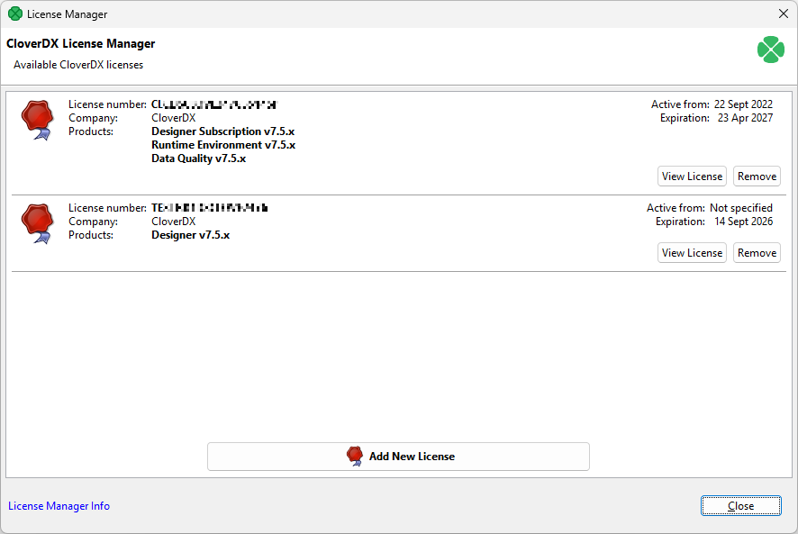
*Figure 8. License Manager showing two installed and active licenses – the first one activates the Designer itself while the second one is for CloverDX AI Assistant.*

License manager allows you to:

- Browse all available licenses and it’s details:
  - **License number** - number of installed license.
  - **Company**
  - **Products** - list of licensed products.
  - **Expiration** - expiration date of the license.
- Open [CloverDX License dialog](part-installation-instructions.md#cloverdx-license-dialog) to view all available information about the license.
- Check available license sources. The license sources are shown after clicking on **License Manager Info**.
- Open **Add New License** dialog. New license can be added with the help of this wizard. Click **Add New License** button to start the process of license activation. See [Activating](part-installation-instructions.md#activating-designer).
- Delete existing license. **Remove** button is shown if it is possible to remove activated license. Confirmation is required when deleting license.

#### CloverDX license dialog

**CloverDX** License dialog shows all available information about the license. **License terms** are available from this place. It can be opened from **License Manager** ([License Manager](part-installation-instructions.md#license-manager))

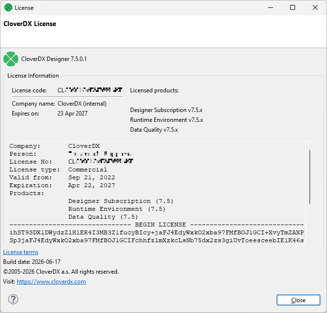
*Figure 9. CloverDX License dialog*

### Troubleshooting

This chapter provides information about some common issues you may encounter while installing CloverDX Designer on your computer. If you cannot resolve your issues, please contact CloverDX Support via [Customer Portal](https://support.cloverdx.com/myaccount).

#### Windows

##### Windows SmartScreen

In the case of installation of **CloverDX Designer** on Microsoft Windows, the installer may be prevented from starting by SmartScreen. Microsoft Defender SmartScreen is a security feature built into Windows that is designed to protect you from malware. It picks up CloverDX since it uses exe-based installer rather than msi-based one.

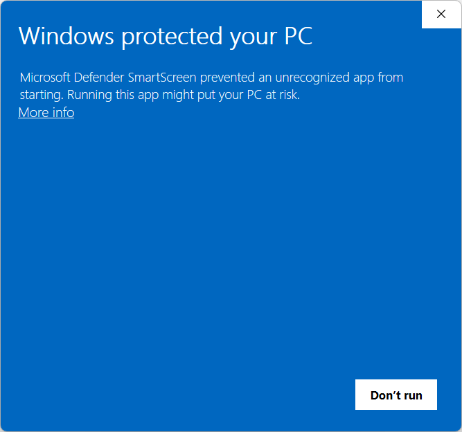
*Figure 10. SmartScreen warning.*

To run the Designer installer, you must click on **More info** button in the bottom right corner. This will show you additional information about the installer – its signature (certificate) overview and a **Run**.

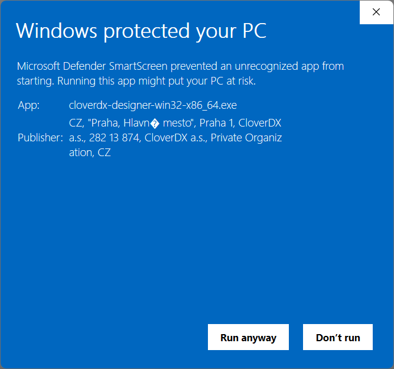
*Figure 11. SmartScreen showing additional information about the installer. Note the "funny" characters are OK - SmartScreen warning does not support Czech characters which appear in the address on the certificate.*

Click on the **Run** button to proceed with the installation.

##### User account control

Installing CloverDX Designer on Microsoft Windows may require administrator privileges. As a security measure against automated installers, Windows will show a User Account Control prompt asking you to confirm that CloverDX Designer installer may make changes to your computer.

Click **YES** to allow the installer to run.

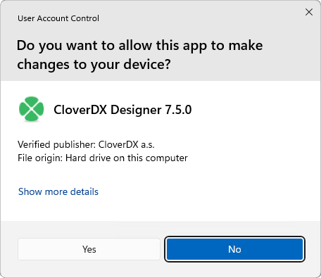
*Figure 12. User Account Control asking for confirmation to continue with the installation.*

##### Windows firewall

Windows shows security warning when Designer’s Runtime is starting.

**CloverDX Designer** application starts as two processes: **CloverDX Designer GUI** and **CloverDX Runtime**. These processes need to communicate with each other over TCP protocol. You should allow the mutual communication with **Allow access** button.

#### Linux

##### Designer stops responding

Due to bug in Linux/GTK+, Designer runs out of number of open files as the backend opens the file `/etc/cups/client.cont` many times.

As workaround, you can configure the printers in `/etc/cups/client.conf` file, or add `-Dorg.eclipse.swt.internal.gtk.disablePrinting` to `CloverDX.ini` file. See [https://wiki.eclipse.org/IRC_FAQ#Why_does_Eclipse_hang_for_an_extended_period_of_time_after_opening_an_editor_in_Linux.2Fgtk.2B.3F](https://wiki.eclipse.org/IRC_FAQ#Why_does_Eclipse_hang_for_an_extended_period_of_time_after_opening_an_editor_in_Linux.2Fgtk.2B.3F), [https://bugs.eclipse.org/bugs/show_bug.cgi?id=215234](https://bugs.eclipse.org/bugs/show_bug.cgi?id=215234) or [https://bugzilla.gnome.org/show_bug.cgi?id=346903](https://bugzilla.gnome.org/show_bug.cgi?id=346903).

##### Welcome page not displayed

Welcome page requires `webkitgtk` library to be present on your system. Install `webkitgtk` version 1.

See [https://bugs.eclipse.org/bugs/show_bug.cgi?id=492379](https://bugs.eclipse.org/bugs/show_bug.cgi?id=492379)

##### Hints on edges have no content

If hints on edges contain only the frame but no content, you should install `webkitgtk`.

##### Component editor not working

In older Linux versions (e.g. Ubuntu 16.04 MATE or Linux Mint 18 Cinnamon), Eclipse platform may experience some problems related to the system’s GTK version. For example, when using GTK 2, the component editor in **CloverDX Designer** may not work properly.

In such a case, add the following parameter to `CloverDXDesigner.ini` located in the root folder of your **CloverDX Designer** installation:
--launcher.GTK_version 2
This parameter forces **CloverDX Designer** to run using GTK 2 which may fix the problem.

**Note:** do not use the parameter on systems using GTK 3 (e.g. Manjaro with KDE Plasma 5), as it may cause other problems (e.g. non-functional tooltips in the graph editor).

#### Others

#### Online activity

**CloverDX Designer** by default accesses the following internet addresses:

- Eclipse (198.41.30.198, 198.41.30.200) - automated check for Eclipse updates.

Designer is fully functional when used offline.

#### Logs

**CloverDX Designer** logs provide valuable information for troubleshooting purposes. These logs are stored in your *workspace directory > .metadata folder*. To find your current workspace directory go to **File > Switch Workspace > Other…​**. The displayed path is your current workspace directory.

Within the *.metadata* folder, you’ll find three log files:

1. **.log**: This file contains messages related to the underlying Eclipse platform that CloverDX Designer is built upon.
2. **CloverDX.log** files: These files capture all messages specific to CloverDX Designer’s functionality, including transformation execution and application events.
3. **runtime.log** files: These files capture all messages specific to CloverDX Designer Runtime’s functionality, including Runtime configuration.
> [!NOTE]
> Including all sets of logs will provide a comprehensive view of your CloverDX Designer session and aid the CloverDX Support team in pinpointing the root cause of the issue.

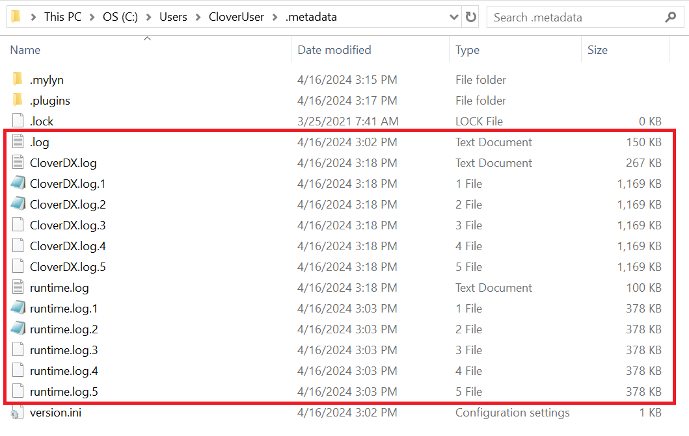

### IBM InfoSphere MDM plugin installation

**CloverDX IBM InfoSphere MDM Components** is an extension of CloverDX for connectivity to **IBM InfoSphere MDM** technology. The extension can be installed and used with **CloverDX Designer** and **CloverDX Server**. For installation steps into CloverDX Server, refer [here](server-virtual-mdm-plugin-installation.md).

**CloverDX** supports IBM InfoSphere MDM 11.6 and 12.0 since version 5.11.0.

#### Downloading

**IBM InfoSphere MDM Components** for **CloverDX Designer** are downloaded and installed from an online update-site. The update site is used in Eclipse (or Designer) to install the extension, see [Installation into Designer](part-installation-instructions.md#installation) for details.

The update site locations are:

- *[https://download.cloverdx.com/ibm-mdm-11-6-update](https://download.cloverdx.com/ibm-mdm-11-6-update)* for IBM InfoSphere MDM 11.6
- *[https://download.cloverdx.com/ibm-mdm-12-0-update](https://download.cloverdx.com/ibm-mdm-12-0-update)* for IBM InfoSphere MDM 12.0
> [!TIP]
> In case you need an older version, add the slash and the version number to the end of the URL, for example a link for version 5.11.0 is:
>
> *[https://download.cloverdx.com/ibm-mdm-12-0-update/5.11.0](https://download.cloverdx.com/ibm-mdm-12-0-update/5.11.0)*

#### Installation

The following steps are needed to install **IBM InfoSphere MDM Components** into **CloverDX Designer**:

1. Start Designer and open the **Install** wizard via the **Help** > **Install New Software** menu.
2. In the **Work with:** text box, enter the update site location for **IBM InfoSphere MDM Components**, e.g. [https://download.cloverdx.com/ibm-mdm-12-0-update](https://download.cloverdx.com/ibm-mdm-12-0-update). See [Downloading](part-installation-instructions.md#downloading) for update site locations.
   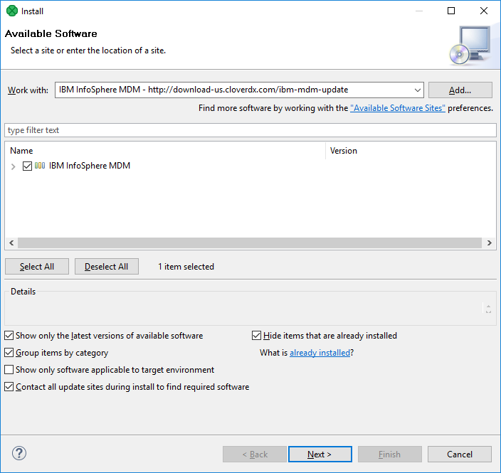
3. Select all **IBM InfoSphere MDM Components** plugins by enabling the checkbox to the left of **IBM InfoSphere MDM xx.y**, click on **Next** button and proceed with the wizard.
4. After finishing the **Install** wizard and installing the plugins, you will be asked to restart Eclipse. After restarting, the **IBM InfoSphere MDM Components** are available for use.
   To verify that **IBM InfoSphere MDM Components** plugin was successfully installed, you can look into the **Palette** of an opened CloverDX graph and see IBM InfoSphere MDM components:
   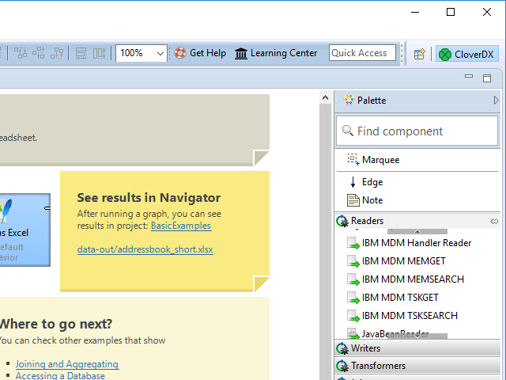
> [!IMPORTANT]
> If the **Designer** is reinstalled then it’s necessary also to reinstall the IBM InfoSphere MDM plugin. It is not possible to install multiple versions of IBM InfoSphere MDM plugin into one **CloverDX Designer**.

##### Troubleshooting

If you get an `Unknown component` or `Unknown connection` error when running a graph with IBM InfoSphere MDM components, it means that the **IBM InfoSphere MDM Components** plugin was not installed successfully. Please check the above steps to install the plugin. Example of the error:

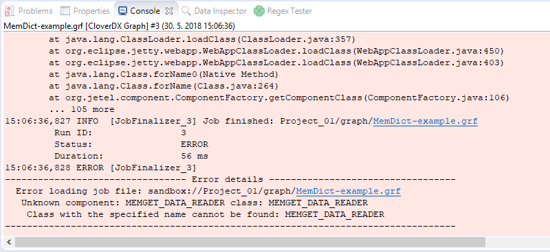
