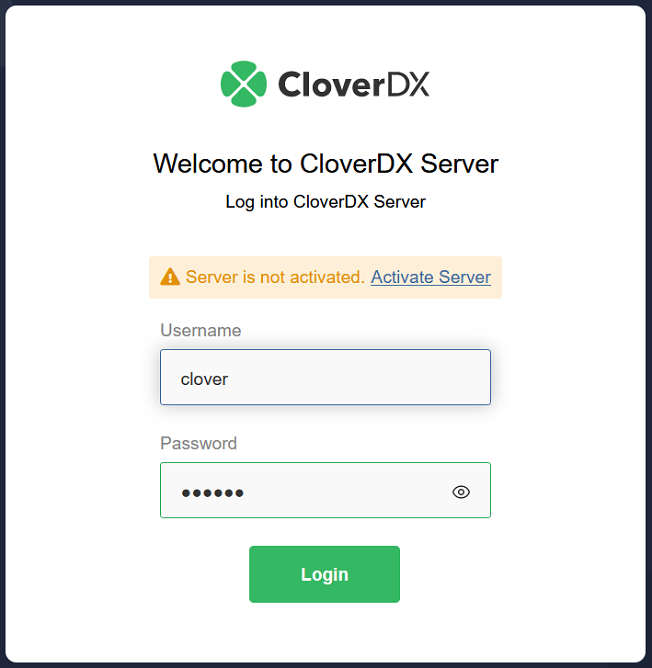
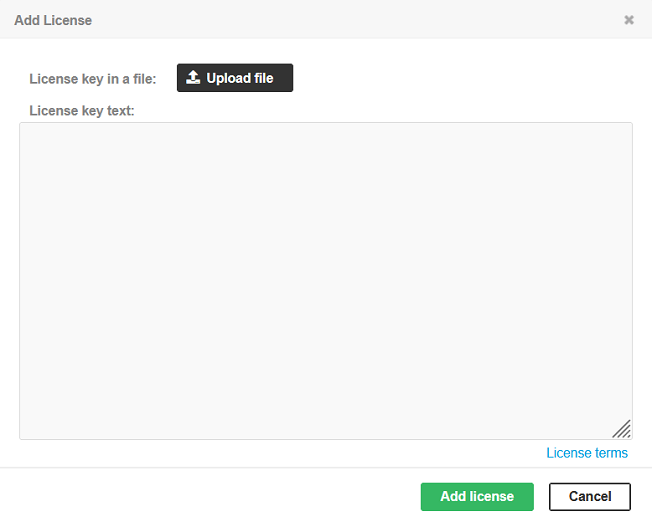
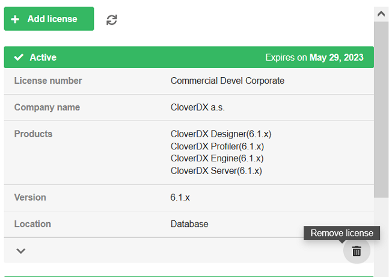

<!-- Administration > Installation > Server installation > Manual installation > Installing Production Server -->

#### Installing Production Server

This section describes in detail the installation of **CloverDX Server** on various application containers and its subsequent configuration required for production environment. For simple evaluation of **CloverDX Server** features, use [Evaluation Server](evaluation-server.md) (note that CloverDX Evaluation Server can also be configured for production use).

**CloverDX Server** for production environment is shipped as a *Web application archive* (WAR file) and uses an external, dedicated database, so standard methods for deploying a web application on your application server may be used. However, each application server has specific behavior and features. Detailed information about their installation and configuration can be found in the following chapters.

##### List of suitable containers

- [Apache Tomcat](production-server.md#apache-tomcat)
- Red Hat JBoss Web Server 6.0

In the case of problems during the installation, see [Troubleshooting](possible-installation-problems.md).
> [!IMPORTANT]
> **Eclipse Temurin JDK 17** or **JDK 21** (for Tomcat) or **Red Hat OpenJDK 17** or **OpenJDK 21** (for JBoss Web Server) is required.

###### Installation and Configuration Procedure

To create a fully working instance of Production CloverDX Server, you should:

1. **Install an application server**
   **CloverDX Server** is compatible with several application containers. Following subsections offer detailed instructions on installation of the respective application servers and their subsequent configuration.
2. **Set up limits on a number of opened files, memory allocation and firewall exceptions**
   **CloverDX Server**'s graph transformations and evaluations may require more memory than the default limit set in the database as well as higher number of simultaneously opened files. Moreover, some components require firewall exceptions to be set. These instructions provide recommendation on adjusting both the [Memory settings](postinstallation-configuration.md#memory-settings) and the [Maximum number of open files](postinstallation-configuration.md#maximum-number-of-open-files), as well as [Firewall exceptions](postinstallation-configuration.md#firewall-exceptions).
3. **Install CloverDX Server into the application server**
   **CloverDX Server** is provided as a web archive (`.war`) file for an easy deployment.
4. **Create a database dedicated to CloverDX Server**
   Unlike the Evaluation Server, the Production Server requires that you have created a dedicated database for **CloverDX Server**. In the configuration phase of this manual, you will be guided to [System database configuration](examples-db-connection-configuration.md) with instructions on how to properly configure the properties file of various databases.
5. **Set up a connection to the database**
   You can set up the connection to the database via Server’s GUI in **Configuration** ****Setup** ****Database**. Alternatively, you can set up the connection in the properties file before starting **CloverDX Server**.
6. **Install a license**
   To be able to execute graphs, you need to install a valid license. There are three options for [Activation](production-server.md#activation).
7. **Perform additional Server configuration**
   - **Set up a master password for secure parameters**
     When handling sensitive information (e.g. passwords), it is advised to define secure graph parameters. This action requires a master password (see [Secure parameters](secure-parameters.md)).
   - **Set up SMTP server connection**
     **CloverDX Server** lets you configure an [SMTP](setup.md#e-mail) connection for reporting events on the Server via emails.
   - **Configure temp space**
     **CloverDX Server** works with temporary directories and files. To ensure components work correctly, you should configure the `Temp space` location on the file system. For details, see [Temp space management](tempspace.md).
   - **Configure sandboxes**
     Lastly, you should set the content security and user’s permissions for sandboxes. For details and instructions, see [Sandboxes](../operations/sandboxes.md).

###### Apache Tomcat

| [Installation of Apache Tomcat](production-server.md#tomcat-installation) |
| --- |
| [Apache Tomcat as a Windows service](production-server.md#tomcat-as-service) |
| [Installation of CloverDX Server](production-server.md#server-installation-on-tomcat) |
| [Configuration of CloverDX Server on Apache Tomcat](production-server.md#server-config-on-tomcat) |
> [!IMPORTANT]
> Before installation, check the software requirements, currently supported Apache Tomcat version and required Java version in the [Software requirements](system-requirements-for-cloverdx-server.md#software-requirements) section.
>
> If you encounter any problems during the installation, see [Troubleshooting](possible-installation-problems.md) for a possible solution.
Installation of Apache Tomcat
1. Download the binary distribution: [Tomcat 10.1](https://tomcat.apache.org/download-10.cgi).
2. Extract the downloaded archive (`zip` or `tar.gz`).
3. Set up `JAVA_HOME` to point to the correct Java version:
   - **Unix-like systems:**
     Setup the path in `/etc/profile` or `/etc/bash.bashrc`:
     `export JAVA_HOME=/path/to/JDK`
   - **Windows system:**
     Under **System Variables** in **Advanced System Settings**, create a new variable named `JAVA_HOME`. The value should contain the path to the JDK installation directory.
4. Run Tomcat:
   - **Unix-like systems:**
     Run the `[Tomcat_home]/bin/startup.sh` file.
   - **Windows system:**
     Run the `[Tomcat_home]\bin\startup.bat` file.

**Continue with:**[Installation of CloverDX Server](production-server.md#server-installation-on-tomcat).
Apache Tomcat as a Windows Service
1. Download the **64-bit Windows Service Installer** file in the **Binary Distributions** section on the *[Tomcat 10.1](https://tomcat.apache.org/download-10.cgi)* download page.
2. Use the standard installation wizard to install Apache Tomcat.
3. When Tomcat is installed as a Windows service, **CloverDX** is configured by one of the following options:
   1. **Graphical configuration utility**
      - Run the `[Tomcat_home]\bin\Tomcat10w.exe` file.
      - In the **Apache Tomcat Properties** dialog box, select the **Java** tab and set the initial and maximum heap size in **Initial memory pool** and **Maximum memory pool** fields to 512MB and 1024MB respectively. Other configuration parameters can be defined in **Java Options** field, being separated by new line.
      - Click on **Apply** and restart the service.
        > [!NOTE]
        > The **Java** tab allows you to use alternative JVM by setup of path to `jvm.dll` file.
   2. **Command Prompt tool**
      - Run the `[Tomcat_home]\bin\Tomcat10.exe` file.
      - If Tomcat is running, navigate to `[Tomcat_home]\bin` and stop the service by typing:
        `.\Tomcat10.exe //SS//Tomcat10`
        in the Command Prompt. (When using different version of Tomcat, change the number in the command to reflect the installed version.)
      - Configure the service by typing the command:
        `.\Tomcat10.exe //US//Tomcat10 --JvmMs=512 --JvmMx=1024 --JvmOptions=-Dclover.config.file=C:\path\to\clover-config.properties#-XX:MaxMetaspaceSize=256m`
        The parameter JvmMs is the initial and JvmMx is the maximum heap size in MB; `JvmOptions` are separated by '#' or ';'.
      - Start the service from Windows administration console or by typing the following command in the Command Prompt:
        `.\Tomcat10.exe //TS//Tomcat10`
> [!TIP]
> By default, when Apache Tomcat is run as a Windows service, it is **not available** for Java process monitoring tools (e.g., **JConsole** or **JVisualVM**). However, these tools can still connect to the process via **JMX**. See [JMX Configuration](jmx-configuration.md) for more information.

More information about running Java applications as Windows Service can be found at [Apache Commons](http://commons.apache.org/proper/commons-daemon/procrun.html).

**Continue with:**[Installation of CloverDX Server](production-server.md#server-installation-on-tomcat).
Installation of CloverDX Server
1. Check if you meet the prerequisites:
   - **Eclipse Temurin JDK 17** or **JDK 21** is installed (See [Supported stacks](system-requirements-for-cloverdx-server.md#software-requirements) for required Java version.)
   - `JAVA_HOME` environment variable is set (see [Setting up JAVA_HOME](production-server.md#java-home-setup)).
   - A [supported version](system-requirements-for-cloverdx-server.md#software-requirements) of Apache Tomcat is installed.
2. It is strongly recommended to adjust the default limits for **Memory allocation** (see the [Memory settings](postinstallation-configuration.md#memory-settings) section).
   You can set the **initial** and **maximum memory heap size** by adjusting the **Xms** and **Xmx** JVM parameters:
   - **Unix-like systems:**
     - Create the `[Tomcat_home]/bin/setenv.sh` file.
     - Type or paste in the following lines:
       ```bash
       export CATALINA_OPTS="$CATALINA_OPTS -XX:MaxMetaspaceSize=512m -Xms128m -Xmx1024m"
       export CATALINA_OPTS="$CATALINA_OPTS -Dderby.system.home=$CATALINA_HOME/temp"
       echo "Using CATALINA_OPTS: $CATALINA_OPTS"
       ```
   - **Windows systems:**
     - Create the `[Tomcat_home]\bin\setenv.bat` file.
     - Type or paste in the following lines:
       ```bat
       set "CATALINA_OPTS=%CATALINA_OPTS% -XX:MaxMetaspaceSize=512m -Xms128m -Xmx1024m"
       set "CATALINA_OPTS=%CATALINA_OPTS% -Dderby.system.home=%CATALINA_HOME%/temp"
       echo "Using CATALINA_OPTS: %CATALINA_OPTS%"
       ```
3. Go to the download section of your CloverDX account and download the `clover.war` (web archive) file containing **CloverDX Server** for Apache Tomcat.
4. Copy `clover.war` to the `[Tomcat_home]/webapps` directory.
5. Tomcat should automatically detect and deploy the `clover.war` file.
6. Check whether **CloverDX Server** is running:
   - Run Tomcat.
   - Open a new tab in your browser and type `http://localhost:8080/clover/` in the address bar.
   - Use the **default administrator credentials** to access the web GUI:
     **username:** clover
     **password:** clover

**Continue with:**[Configuration of CloverDX Server on Apache Tomcat](production-server.md#server-config-on-tomcat)
Configuration of CloverDX Server on Apache Tomcat> [!TIP]
> Default installation (without any configuration) is only recommended for evaluation purposes. For production use, at least a dedicated, system database and SMTP server configuration is recommended.

For easy configuration of **CloverDX Server**, use [Setup GUI](setup.md), where you can configure various properties including the connection to the database, username and password, path to the license file, private properties, Clusters and much more (see [List of configuration properties](list-of-properties.md) and [Cluster configuration](cluster-setup-index.md#cluster-configuration)). We recommend you place the file in a [specified](configuration-sources.md#configuration-file-on-specified-location) location and define the path to the file with a system property.

The content of such a file (an example with a PostgreSQL database):

```properties
jdbc.driverClassName=org.postgresql.Driver
jdbc.url=jdbc:postgresql://127.0.0.1/clover_db?charSet=UTF-8
jdbc.username=yourUsername
jdbc.password=yourPassword
jdbc.dialect=org.hibernate.dialect.PostgreSQLDialect
```

If the Server will serve the [CloverDX MCP Server](server-config-mcp.md), it also needs the OAuth2 discovery rules placed in this Tomcat – see [Redirecting the OAuth2 discovery documents](postinstallation-configuration.md#redirecting-the-oauth2-discovery-documents). A Server installed from the CloverDX Tomcat bundle or from an installer has them already.
Properties File in Specified Location
The properties file is loaded from a location specified by a system property or by an environment variable `clover_config_file` or `clover.config.file`.

1. Create the `cloverServer.properties` file in a directory readable by Apache Tomcat. (If you need an example of connection to any of the supported database systems, see [System database configuration](examples-db-connection-configuration.md).)
2. Edit the `[Tomcat_home]/bin/setenv.sh` file (if it does not exist, you can create it).
3. Set the system property by adding the following line into the file:
   ```bash
   JAVA_OPTS="$JAVA_OPTS -Dclover_config_file=/path/to/cloverServer.properties"
   ```
> [!NOTE]
>  Continue with: [Post-installation configuration](postinstallation-configuration.md)

##### Activation

To be able to execute graphs, **CloverDX Server** requires a valid license. You can install and run **CloverDX Server** without any license, but no graph will be executed.

There are three ways of installing the license. They work on all application servers and can be used at the same time, but **only the most recent valid license is used**.

We recommend using the first and easiest option (for other options, see [CloverDX Server activation alternatives](production-server.md#cloverdx-server-activation-alternatives)):

###### CloverDX Server Activation using Web Form

If the **CloverDX Server** has been started without assigning any license, click the **Activate server** link on the welcome page. You will be redirected to the **Add New License** form where you can upload the license file using the **Browse** button, or simply copy the license from the file and paste it into the **License key text** field.


*Figure 33. Login page of CloverDX Server without license*

After clicking the **Update** button, the license is validated and saved to the database. If the license is valid, a table with license’s description appears. To proceed to **CloverDX Server** console click **Continue to server console**.

You can skip adding a license by clicking the **Cancel** button.


*Figure 34. Add new license form*

###### Add CloverDX Server License in the Configuration Section

If the license has been already installed, you can still change it or add a new one by using form in the Server web GUI.

- Go to **server web GUI** ****Configuration** ****Setup** ****License**
- Click **Add license**

You can paste a license text into a **License key** text area or use the **Browse** button to search for a license file in the filesystem. To skip adding a license, click the **Cancel** button.

After clicking the **Add license** button, the license is saved to the database and all licenses are reloaded.


*Figure 35. Update license form*

###### Remove CloverDX Server License in the Configuration Section

License can be removed from **CloverDX Server** if its stored in the server database.

- Go to **server web GUI** ****Configuration** ****Setup** ****License**
- Remove unwanted license by clicking on trash tray icon under the detail of the license.


*Figure 36. Remove license*
> [!TIP]
> The **CloverDX** license can be **changed** at any time by replacing `license.dat` file. Afterwards, you have to let **CloverDX Server** know the license has changed.
>
> - Go to **server web GUI** ****Configuration** ****Setup** ****License**
> - Click **Reload license** icon.
> - Alternatively, you can restart the **CloverDX Server** application.
> [!NOTE]
> The license in the database is common for all nodes in the Cluster. Reloading of the license occurs on each node in the Cluster.
>
>  Continue with: [Setup](setup.md)

###### CloverDX Server Activation Alternatives

If, for any reason, you decide to not use the recommended way of installing the server license, you can choose one of the following options:
Activation Using license.file Property
1. Download the `license.dat` file.
2. Set the **CloverDX Server**`license.file` parameter to the full path of the `license.dat` file.
   For list of properties, see [List of configuration properties](list-of-properties.md).
3. Restart the application server.
Activation Using license.dir Property
1. Download the `license.dat` file(s).
2. Set the **CloverDX Server**`license.dir` parameter to the full path of a directory.
   For list of properties, see [List of configuration properties](list-of-properties.md).
3. Copy the `license.dat` file(s) to the directory.
4. Restart the application server.
> [!NOTE]
>  Continue with: [Setup](setup.md)
