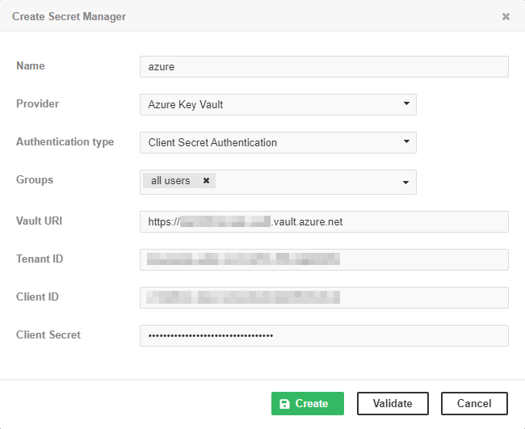
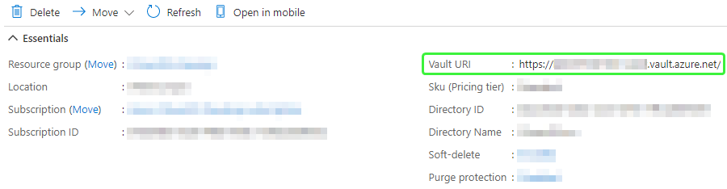
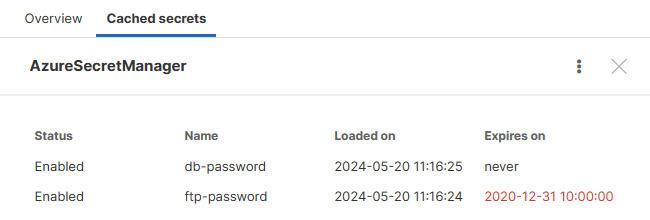
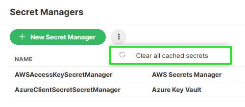

<!-- Administration > Configuration > Server configuration > Securing sensitive data > Secret Managers -->

#### Secret Managers

| [Usage](secret-managers.md#usage) |
| --- |
| [Access Control](secret-managers.md#access-control) |
| [Azure Key Vault](secret-managers.md#azure-key-vault) |
| [AWS Secrets Manager](secret-managers.md#aws-secrets-manager) |
| [Viewing cached secrets](secret-managers.md#viewing-cached-secrets) |
| [Secret revocation](secret-managers.md#secret-revocation) |

The Secret Managers feature allows jobs running in **CloverDX Server** to retrieve passwords, tokens and other secrets from a third-party secret management service. These services generally provide a secure storage for passwords and other types of secrets and allow setting up expiration dates and rotation policies.

We support **Azure Key Vault** and **AWS Secrets Manager**.

##### Usage

The usage of secrets is similar to graph parameters. You first configure the connection via **Configuration** > **Secret Managers** > **New Secret Manager**.

*Figure 97. Secret Manager Configuration*

Then you use a placeholder in your job file. At runtime, the placeholder is replaced with the value of the secret.

The placeholder has the following format:

`${secret:<secretManagerName>/<secretName>}`

- `<secretManagerName>` is the **Name** of the secret manager assigned when configuring the connection, as shown in the picture above. It must be unique.
- `<secretName>` is the name of the secret, as configured in the third-party service.

**Example:**

`${secret:azure/oracle-password}`

##### Access control

[Unlimited access to Secret Managers permission](groups.md#permission-secret-managers-administration) is required for adding, editing or removing secret managers.

When creating a new secret manager, you need to assign it to the user groups that will be able to use it in jobs.

##### Azure Key Vault

Azure Key Vault is a secret management service available in the Microsoft Azure cloud. Two authentication schemes are supported for Azure Key Vault:

- [Implicit authentication](https://docs.microsoft.com/en-us/java/api/com.azure.identity.defaultazurecredential) – uses credentials from the system running CloverDX Server. It can use environment variables, [managed identity](https://docs.microsoft.com/en-us/azure/active-directory/managed-identities-azure-resources/overview) when deployed to a host in Azure cloud, or saved credentials from the Azure CLI.
- Client Secret authentication – uses **Tenant ID**, **Client ID** (also called **Application ID**) and **Client Secret**.

Both these schemes also require a **Vault URI** in the form `https://<your-unique-keyvault-name>.vault.azure.net/`. The URI can be found in the Overview section of the selected Key Vault.

*Figure 98. Azure Key Vault Overview*

##### AWS Secrets Manager

AWS Secrets Manager is a secret management service available in the Amazon AWS cloud. The main difference from [Azure Key Vault](secret-managers.md#azure-key-vault) is that the secrets contain multiple values.

Two authentication schemes are supported for AWS Secrets Manager:

- [Implicit authentication](https://sdk.amazonaws.com/java/api/latest/software/amazon/awssdk/auth/credentials/DefaultCredentialsProvider.html) – uses credentials from the system running CloverDX Server. It can get the credentials from system properties, environment variables, saved credentials from AWS CLI, EC2 instance, etc.
- Access Key authentication – uses **Access Key ID** and **Secret Access Key**.

Both these schemes also require selecting an AWS **Region**.

In AWS Secrets Manager, each secret contains one or more key/value pairs. For example, a secret that stores a DB connection usually contains the following keys:

- username
- password
- engine
- host
- port
- dbname

Therefore, the placeholder for a secret in AWS Secrets Manager has the following format:

`${secret:<secretManagerName>/<secretName>/<key>}`

Note that the `<secretName>` may also contain slashes. The `<key>` is always the last part of the "path" (the part after the last slash).

**Example:**

`${secret:aws/db/oracle/password}`

##### Viewing cached secrets

As said, the secrets are loaded on demand, at the moment they are used. You can view the currently stored data on the **Cached secrets** tab. Intentionally no values are shown, only names.

*Figure 99. List of secrets cached by particular manager, the second one being expired*

##### Secret revocation

For performance reasons, secrets retrieved from a secret manager are stored in a cache. If the secret has an expiration date set, it will be automatically refreshed when it expires.

But if the value of a secret changes before its expiration date, for example when a password is compromised, it may be necessary to manually clear the cache, so that the new value is retrieved.

You can **Clear all cached secrets** via the top context menu.

*Figure 100. Clearing of the cached secrets*
