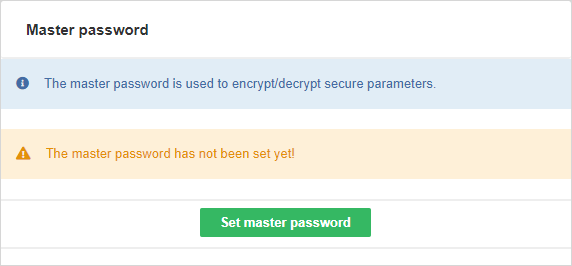
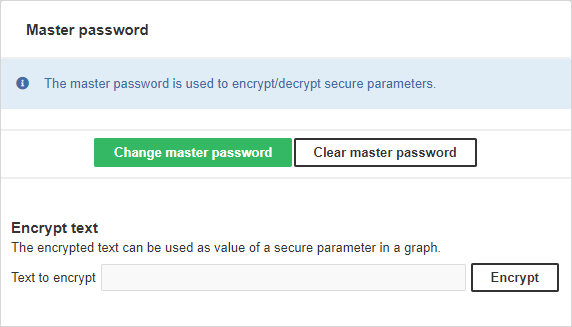

<!-- Administration > Configuration > Server configuration > Securing sensitive data > Securing job parameters in Server -->

#### Securing job parameters in Server

Transformation graphs in **CloverDX Server** environment allow you to define secure graph parameters. Secure graph parameters are regular graph parameters, either internal or external (in a `*.prm` file), but the values of the graph parameters are not stored in plain text on the file system - encrypted values are persisted instead. This allows you to use graph parameters to handle sensitive information, typically credentials such as passwords to databases.

Secure parameters are only available in **CloverDX Server** environment, including working with **CloverDX Server** Projects in **CloverDX Designer**.

The encryption algorithm must be initialized with a **master password**. The master password can either be set during the very first start of the Server with an empty database via import from a file (to do so use the masterpassword.autoimport.file parameter in the Server configuration file, see [List of configuration properties](list-of-properties.md)) or can be set manually at any time after the Server installation - in **Configuration** ****Security**. Secure parameters cannot be used before the master password is set.

The maximum length of the master password is 255 characters; there are no other restrictions or complexity requirements.


*Figure 96. Master password initialization*

After setting the master password, secure parameters are fully available in **Graph Parameters Editor** in **CloverDX Designer**. When setting value of a secure parameter, it will be automatically encrypted using the master password. Secure parameters are automatically decrypted by the Server in graph runtime. A parameter value can also be encrypted in the **CloverDX Server** Console in the *Configuration > Security > Secure Parameters* page - use the **Encrypt text** section.


*Figure 97. Graph parameters tab with initialized master password*

If you change the master password, the secure parameters encrypted using the old master password cannot be decrypted correctly anymore. In that case existing secure parameters need to be encrypted again with the new master password. That can be accomplished simply by setting their value (non-encrypted) again in the **Graph Parameters Editor**. Similar master password inconsistency issue can occur if you move a transformation graph with some secure parameters to another Server with a different master password. So it is highly recommended to use an identical master password for all your **CloverDX Server** installations.

For more details, see [Secure graph parameters](../developer/parameters.md#secure-graph-parameters).

##### Secure parameters configuration

Encryption of secure parameters can be further customized via Server configuration parameters.

| Property name | Default value | Description |
| --- | --- | --- |
| security.job_parameters.encryptor.algorithm | PBEWithHMACSHA512AndAES_256 | The algorithm to be used for encryption. This algorithm has to be supported by your JCE provider (if you specify a custom one, or the default JVM provider if you don’t). The name of algorithm should start with *PBE* prefix.  The list of available algorithms depends on your JCE provider, e.g. for the default *SunJCE* provider you can find them on [SunJCEProvider](https://docs.oracle.com/en/java/javase/17/security/oracle-providers.html#GUID-A47B1249-593C-4C38-A0D0-68FA7681E0A7) or for the *Bouncy Castle* provider on [Bouncy Castle Specifications](http://www.bouncycastle.org/specifications.html) (section *Algorithms/PBE*)). |
| security.job_parameters.encryptor.master_password_encryption.password | clover | The password used to encrypt values persisted in the database table *secure_param_passwd* (the master password is persisted there). |
| security.job_parameters.encryptor.providerClassName | Empty string. The default JVM provider is used | The name of the security provider to be asked for the encryption algorithm. It must implement *java.security.Provider* interface. For example set to *org.bouncycastle.jce.provider.BouncyCastleProvider* for the *Bouncy Castle* JCE provider, see below. |

##### Installing Bouncy Castle JCE provider

Algorithms provided by JVM could be too weak to satisfy an adequate security. Therefore it is recommended to install a third-party JCE provider. Following example demonstrates installation of one concrete provider, *Bouncy Castle* JCE provider. Another provider would be installed similarly.

1. Download Bouncy Castle provider jar (e.g. bcprov-jdk18on-<version>.jar) from [http://bouncycastle.org/latest_releases.html](http://bouncycastle.org/latest_releases.html).
2. Add the jar to the classpath of your application container running **CloverDX Server**, e.g., `<TOMCAT_INSTALL_DIR>/lib`.
3. Set value of the *security.job_parameters.encryptor.providerClassName* attribute to *org.bouncycastle.jce.provider.BouncyCastleProvider* in the `config.properties` file.
4. Set value of the *security.job_parameters.encryptor.algorithm* attribute to the desired algorithm (e.g. *PBEWITHSHA256AND256BITAES-CBC-BC*).

Example of configuration using Bouncy Castle:

```properties
security.job_parameters.encryptor.algorithm=PBEWITHSHA256AND256BITAES-CBC-BC
security.job_parameters.encryptor.providerClassName=org.bouncycastle.jce.provider.BouncyCastleProvider
```
