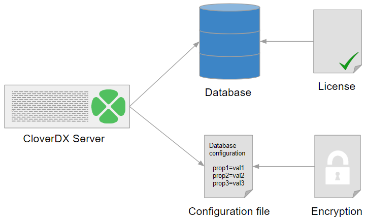

<!-- Administration > Configuration > Server configuration -->

## 9. Server configuration

### Configuration introduction

This part describes in detail the configuration options for **CloverDX Server** used in a production environment. In the following chapters, you will find information on setting required properties and parameters, description of **CloverDX Server**'s Setup GUI elements, parameters for specific database configuration, list of properties used in general configuration, instructions on encrypting confidential properties and log files setting.
> [!NOTE]
> We recommend the default installation (without any configuration) only for evaluation purposes. For production use, you should configure a dedicated, system database and set up an SMTP server for sending notifications.

### CloverDX Server configuration procedure

For initial configuration after the installation of **CloverDX Server**, follow these steps:

- **Choose a configuration source**
  Choose a source of configuration data for **CloverDX Server**. There are several options for configuration sources; however, we recommend using a property file on specified location. For more information, see [Configuration sources](configuration-sources.md).
- **Set up a database dedicated to CloverDX Server**
  Now, you should set up a **CloverDX Server**'s database and configure a connection to the database. Choose a supported *[database system](system-requirements-for-cloverdx-server.md#software-requirements)* and read [System database configuration](examples-db-connection-configuration.md) for information and examples on how to create a database, add user/role for Clover, grant it required rights/privileges, etc.
  Once you have set up the database, configure **CloverDX Server**'s connection to the database using the *[Setup GUI](setup.md)*.
- **Activate the server with a license**
  After you have set up the database, configured the connection to it and specified the source for configuration data, you can activate the Server with your license. While it is possible to activate the Server immediately after installation, we do not recommend this, since after the activation, the license information is stored in the database. To activate the Server, follow the information in the [Activation](production-server.md#activation) section.
- **Configure the server**
  Finally, you can configure the server features. The Setup with a user friendly GUI allows you to configure the basic, most important features including, encryption of sensitive data, SMTP for email notifications, etc. For more information, see [Setup](setup.md).
- **Configure Worker**
  Worker is the executor of jobs, all jobs run in the Worker by default. It runs in a separate process (JVM), so it requires configuration in addition to the Server Core.
  Basic configuration of the Worker can be done in the [Worker](setup.md#worker) page of the [Setup](setup.md). For all configuration properties of Worker, see [Worker - configuration properties](list-of-properties.md#worker-configuration-properties). Useful tips for solving issues can be found in the [Troubleshooting worker](../operations/administration-troubleshooting-worker.md) section.
  The following are the typical areas that need to be configured for Worker:
  - **Heap memory size** - required heap size for Server Core and Worker depends on the nature of executed jobs. In general, Worker should have higher heap allocated, as it runs the jobs which represent the bulk of memory consumption.
    See our [recommendations](postinstallation-configuration.md#recommended-server-core-and-worker-heap-memory-configuration) for heap sizes of Worker and Server Core.
    Heap size of Worker can be easily configured in the [Worker](setup.md#worker) tab of [Setup](setup.md), or via the [worker.maxHeapSize](list-of-properties.md#lop-worker-maxheapsize) configuration property.
  - **Classpath** - the Worker’s classpath is separate from Server Core (i.e. application container classpath). Any libraries needed by jobs executed on Worker need to be added on the Worker’s classpath.
    See the [worker.classpath](list-of-properties.md#lop-worker-classpath) configuration property for more details.
  - **Command line options** - Worker is started as a separate process with its own JVM. If you need to set JVM command line options, e.g. for [garbage collector](postinstallation-configuration.md#garbage-collector-for-worker) tweaking, better diagnostics, etc., then you need to set them on the Worker’s JVM. See [Additional diagnostic tools](../operations/diagnostics.md#additional-diagnostic-tools) section for useful options for troubleshooting and debugging Worker.
    Command line options of Worker can be easily customized in the [Worker](setup.md#worker) tab of [Setup](setup.md), or via the [worker.jvmOptions](list-of-properties.md#lop-worker-jvmoptions) configuration property.
  - **JNDI** - Worker has its own JNDI pool separate from the application container JNDI pool. If your jobs use JNDI resources (to obtain JDBC or JMS connections), you have to configure the Worker’s JNDI pool and its resources.
    See the [*JNDI in worker*](list-of-properties.md#worker-jndi-properties) section for more details.
- **Encrypt the configuration**
  As the last step, we strongly recommend you to encrypt the configuration file to protect your sensitive data.
  For more information, see the [Encryption](setup.md#encryption) section.

*Figure 85. CloverDX Server’s System database configuration*
