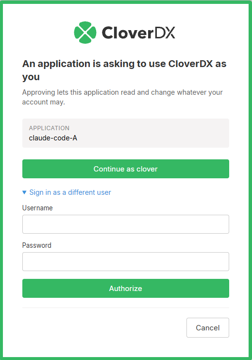
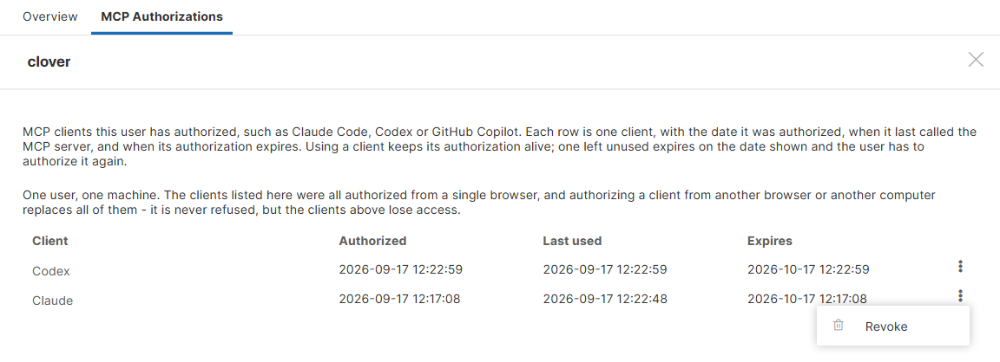

<!-- Administration > Configuration > Server configuration > CloverDX MCP Server -->

### CloverDX MCP Server

#### What is MCP?

MCP (Model Context Protocol) is an emerging standard that enables AI agents to interact with external services and data sources. It provides a standardized way for AI models to access tools, resources, and context from various applications, allowing them to perform tasks beyond their base capabilities.

CloverDX provides MCP out of the box starting with CloverDX 7.3.0 and also allows exposing MCP on older instances (version 6.0 to 7.2) via [CloverDX MCP proxy](server-config-mcp.md#configuration-for-cloverdx-60-to-72). The ability to expose older versions of CloverDX as MCP servers via MCP proxy is especially useful for production instances where the upgrades to newer versions may not be that simple while MCP proxy only requires minimal configuration. This allows you to take advantage of the MCP integration for all Server instances newer than CloverDX 6.0 which was released in April 2023.
> [!NOTE]
> MCP gives an AI agent the means to edit files, run jobs and read the data flowing through them. Configure what the Server exposes with the [tool permissions](server-config-mcp.md#mcp-tools-permissions) and who may use it with the [MCP permissions](server-config-mcp.md#mcp-permissions-and-ai-authoring-seats), and review what an agent produces before you rely on it.

CloverDX MCP Server exposes a comprehensive set of tools that enable AI agents to fully interact with CloverDX:

- **Sandbox Management**: browse, read, write, and organize files within CloverDX sandboxes.
- **Job Execution**: run graphs and jobflows, wait for results, monitor status, and abort running jobs.
- **Graph Editing**: create and modify CloverDX graphs and jobflows using structured XML operations.
- **Server Diagnostics**: access server logs, performance metrics, and internal system database.
- **Component Reference**: discover and configure CloverDX component types.
- **Knowledge Base**: access the CloverDX knowledge library and manage project-scoped knowledge entries.
- **External Databases**: query and inspect databases accessible via JDBC.
- **Support**: report issues directly to the CloverDX Support Portal.

For the complete list of available tools, see [MCP Tools Reference](../operations/server-mcp-api.md#mcp-tools-reference).

This allows AI agents to help with common development and maintenance tasks such as:

- Building and editing CloverDX integration graphs and jobflows
- Troubleshooting failed jobs by analyzing logs and tracking data
- Monitoring server health and performance metrics
- Automating routine administrative queries
- Generating reports on job execution patterns

#### Setting up MCP on CloverDX Server

When setting up MCP, you will need to enable it on CloverDX Server and then also in your AI client. The following sections provide quick instructions to guide you through the configuration process.

Configuration of CloverDX MCP Server depends on the version of CloverDX you are working with. If you would like to expose CloverDX 7.3 or newer via MCP, you can use built-in functionality - see [Configuration for CloverDX 7.3 and Newer](server-config-mcp.md#configuration-for-cloverdx-73-and-newer) section below for more details. For older CloverDX version you will have to set-up additional proxy instance of CloverDX Server with special free license to provide the MCP-compatible API. Follow the instructions in [Configuration for CloverDX 6.0 to 7.2](server-config-mcp.md#configuration-for-cloverdx-60-to-72) below for more details.

To configure the client, please follow the instructions in [Client Setup](server-config-mcp.md#client-setup) section.

#### Configuration for CloverDX 7.3 and Newer

CloverDX 7.3 and newer expose MCP-compatible APIs out of the box and only require minimal configuration to enable it. The following diagram provides overview of the architecture.


The configuration for CloverDX 7.3 has two parts - you need to enable the MCP Server and then configure access to it. To enable the MCP Server, set value of `clover.mcp.enabled` configuration property to `true`. Since this needs to be done in CloverDX configuration file, it will require Server restart.

Before any client can reach the Server, the deployment has to meet the [deployment requirements](server-config-mcp.md#deployment-requirements). Who may then use MCP, and how they sign in, is decided by an OAuth2 profile – see [Authorizing MCP clients](server-config-mcp.md#authorizing-mcp-clients).

An MCP user account also has to hold an MCP permission and the ordinary permissions needed to reach the data exposed through MCP. The simplest way is to add the account to the **AI Authoring** group, which carries both – see [MCP permissions and AI Authoring seats](server-config-mcp.md#mcp-permissions-and-ai-authoring-seats). Setting the Server up takes administrator permissions, but the administrator should not be the same user as the one the AI client connects as.

##### Deployment requirements

Two things have to hold on the deployment before an MCP client can authorize at all.

###### Master password

The [master password](secure-parameters.md) has to be set. CloverDX signs the access tokens it issues for MCP with a secret kept among the secure parameters, so that every node of a cluster signs and verifies with the same one, and that secret can be neither created nor read before the master password exists.

###### OAuth2 discovery documents at the root of the host

An MCP client works out where to authenticate from the endpoint URL alone. It looks for the authorization server metadata at the **root of the host**, above the servlet context CloverDX is deployed under, where a web application cannot answer, so the deployment has to redirect such a request into the context. Without that redirect, discovery stops at the first step and no client connects.

A Server installed from the CloverDX Tomcat bundle or from the Designer+Server installer, and a Server run from the CloverDX Docker image, answer there with nothing configured by hand. If you deploy `clover.war` into a container of your own, or run CloverDX behind a reverse proxy, see [Redirecting the OAuth2 discovery documents](postinstallation-configuration.md#redirecting-the-oauth2-discovery-documents) for the rules to put in place.

Running behind a reverse proxy, have it overwrite the forwarded headers – see [Overwriting the headers at the proxy](postinstallation-configuration.md#overwriting-the-headers-at-the-proxy). The Server takes the public address of the MCP endpoint from them, and that address identifies the endpoint in the tokens it issues.

##### Authorizing MCP clients

An MCP client is configured with the endpoint URL and a client ID. From the URL the client finds the authorization server by itself, opens a browser for the user to sign in, and renews the session on its own from then on. CloverDX does not register clients dynamically, so every client asks for a client ID of its own; a string naming the client, `claude-desktop` or `chatgpt`, is the usual choice.

Who may authorize is decided by the OAuth2 profile that carries the **MCP** scope. Only one profile may carry it, and it takes one of two forms.

###### With the built-in provider

A profile whose provider is **Built-in** makes CloverDX its own authorization server. Nothing is registered at Entra or Google, the profile holds no client ID, client secret, tenant or endpoints, and no user account is linked by hand. Create it in **Configuration** ****OAuth2** like any other profile and give it the user groups whose members may authorize – see [Built-in provider](oauth2-authentication.md#built-in).

The user signs in on a CloverDX page and approves the client there. Where the browser already holds a Console session, the page leads with **Continue as** and keeps the credential form behind **Sign in as a different user**.


*Figure 141. Authorizing an MCP client against the built-in provider*

An account in the CloverDX security domain or in an [LDAP](ldap-authentication.md) domain can complete this flow. An account in a [SAML](saml-authentication.md) domain cannot, and is refused with the same message a wrong password gives.

###### With an identity provider

A profile whose provider is **Azure (Microsoft)** or **Google** sends the user to sign in there instead. Every CloverDX user who will use MCP has to have their account linked to an identity at that provider, in **Configuration** ****Users** on the **OAuth2 Authentication** tab – see [Linking user account with OAuth2 provider’s account](oauth2-authentication.md#linking-user-account-with-oauth2-providers-account).
> [!IMPORTANT]
> **Use PKCE** has to be enabled on a profile that carries the MCP scope. Without it, every authorization request is refused with `invalid_request` and the message *"MCP OAuth2 authentication is not configured to use code challenge"*.

Only the Server’s own callback, `https://your-server.example.com/clover/oauth2`, has to be registered with the provider application – the same one the Console already uses. The callbacks of the MCP clients themselves are never sent to the provider.

###### Allowed redirect URLs

Where an authorization sends the browser back is checked by CloverDX itself.

- A client running on the user’s own machine – Claude Code, an editor extension – calls back to a loopback address. Those are accepted as they are, on any port, and need no configuration.
- A client whose connector runs in a browser calls back to a public address. Those are accepted only when listed in [`clover.mcp.oauth2.redirect.allowed`](list-of-properties.md#lop-clover-mcp-oauth2-redirect-allowed), which you can edit as **Allowed redirect URLs** on the [**MCP Server**](setup.md#mcp-server) tab of the Setup module.

The property comes preset with the callbacks of the hosted Claude and ChatGPT clients, so those need no entry either. Add an entry for any other client of this kind, copying the callback URL exactly as the client shows it – each entry is matched in full, without wildcards. Clearing the value leaves loopback callbacks as the only ones accepted.
> [!NOTE]
> Changes made on the **MCP Server** tab take effect after a Server restart.
> [!NOTE]
> The [AI Assistant in the Designer](part-installation-instructions.md#enabling-cloverdx-ai-assistant) does not go through this flow. It reaches the Server with the session token of the project connection, so a deployment that serves only the Assistant needs no OAuth2 profile at all.

With the profile in place, continue with the [Client Setup](server-config-mcp.md#client-setup).

##### Upgrading from CloverDX 7.5 or earlier

**A pasted access token no longer works.** CloverDX 7.6 issues its own access tokens for MCP and accepts nothing else at the MCP endpoints. A token issued by your identity provider is refused there, however valid that provider considers it, and no configuration property restores the previous behaviour. A client that was configured by hand with such a token is set up again as described above, with the endpoint URL and a client ID. Every other CloverDX endpoint is unchanged and still accepts a provider token.

**The non-standard metadata path is gone.**`/clover/mcp/mcp/.well-known/oauth-authorization-server` is no longer served. The metadata is published at `/clover/mcp/.well-known/oauth-authorization-server` and reached from the root of the host through the redirect described above. A connector still configured against the old path has to be pointed at the canonical one.

#### Configuration for CloverDX 6.0 to 7.2

Versions of CloverDX older than CloverDX 7.3 do not have built-in support for MCP. However, for versions 6.0 to 7.2 you can still take advantage of MCP by configuring CloverDX MCP proxy. This will allow you to use MCP for example on production instances where the upgrade process may be lengthy since the proxy requires minimal configuration.

To configure the proxy, you will need to deploy additional instance of CloverDX Server 7.3 which will serve as the proxy server. This instance can be very small (it will never run any jobs) and will use a special free MCP-only license (i.e., you do not have to get additional DXUs to for this instance). In the end you will be running two CloverDX Servers:

- **Target (legacy) server**: this is the server you wish to work with - for example your production instance. This can be any CloverDX version starting with CloverDX 6.0.x up to CloverDX 7.2.x.
- **MCP proxy server**: this is a small instance of CloverDX Server that only translates API requests between MCP client and the target CloverDX Server. This instance does not require any significant resources (you can even run it on your machine) and will use free MCP-only license and therefore does not incur any additional licensing cost. It can also be configured with just Derby backend database since it will never be running any jobs and will not require any clustering functionality. This further reduces the footprint of the proxy instance.

A proxy serves the diagnostic tools only – the authoring tools work against the local runtime and are not exposed in remote mode. Its users therefore need the [*Use AI Diagnostic MCP tools* permission](groups.md#permission-mcp-diagnostic) and occupy no [AI Authoring seats](server-config-mcp.md#ai-authoring-seats).

The following diagram provides overview of this architecture:


##### Step 1: Configure the Proxy Server (7.3+)

The proxy server needs standard MCP configuration plus remote connection settings.

1. Enable MCP on the proxy setting `clover.mcp.enabled` to `true`.
2. Configure OAuth2 on the proxy server. Clients connect to the proxy, not to the older target server, so the target does not need OAuth2. You must also configure a user with sufficient permissions with OAuth2 - this is the same as the non-proxy setup described above. See [Authorizing MCP clients](server-config-mcp.md#authorizing-mcp-clients) for more details.
   The proxy is itself a CloverDX 7.3 or newer Server, so the [deployment requirements](server-config-mcp.md#deployment-requirements) apply to it in full.
3. Enable the "remote MCP" by setting `clover.mcp.remote.enabled` to true`.
4. Configure access to your target server. This requires three properties in your CloverDX configuration file: `clover.mcp.remote.url`, `clover.mcp.remote.user` and `clover.mcp.remote.password`.

The complete configuration may look like this:

```properties
# Enable MCP functionality.
clover.mcp.enabled = true

# Turn this Server into MCP proxy by enabling remote MCP.
clover.mcp.remote.enabled = true

# URL of the remote MCP server (your 6.0 to 7.2 target server).
clover.mcp.remote.url = https://your-target-server.example.com/clover

# Username for authentication to the remote MCP server.
clover.mcp.remote.user = mcp-bridge-user

# Password for authentication to the remote MCP server.
clover.mcp.remote.password = your-secure-password
```

> [!TIP]
> For best security and control, create a dedicated user account on the target Server. In the configuration example above, this is the `mcp-bridge-user` configured in `clover.mcp.remote.user`. This user will require permissions to access data available through MCP - it is enough for this user to belong to **All users** group when using MCP, but the user may temporarily need admin permissions during installation (see library installation below).
>
> Additionally, we also recommend encrypting access credentials to this user by using [CloverDX secure-cfg-tool](secure-configuration-properties.md).

##### Step 2: Configure the Target Server (6.0 to 7.2)

The target server needs the CloverDX MCP Bridge Library installed and initialized. This library exposes the API needed by the MCP proxy server.

1. Log in to your **target server** as administrator.
2. Open the **Libraries** module, click on **Install library from repository** and select **CloverDX Marketplace** from the **Repository** drop-down.
3. Find the latest version of **CloverDXMCPBridgeLib** and install it (use the default name for installation).
4. Wait for the installation to complete.
5. Once the library is installed, it needs to be configured and initialized. Follow the installation instructions for the library in [CloverDX Marketplace](https://marketplace.cloverdx.com/) (these instructions may differ depending on the library version).

Once the library is installed and configured, you will be able to connect your client to the target server via MCP proxy.

#### Client Setup

The CloverDX MCP Server follows the MCP standard for authorizing clients over OAuth2, so any MCP client can connect to it – Claude, ChatGPT, GitHub Copilot and others. The clients described below are examples; any other client is set up the same way.
> [!NOTE]
> An OAuth2 profile carrying the MCP scope has to be enabled on the Server – see [Authorizing MCP clients](server-config-mcp.md#authorizing-mcp-clients). The deployment also has to meet the [deployment requirements](server-config-mcp.md#deployment-requirements).

The MCP endpoint URL is `https://your-server.example.com:port/clover/mcp/all/v1`. To give a client one tool group only, use `/clover/mcp/diagnostic/v1` or `/clover/mcp/authoring/v1` instead – see [MCP API](../operations/server-mcp-api.md#14-cloverdx-model-context-protocol-mcp-api).

The client ID is always set by hand. CloverDX supports neither Dynamic Client Registration (DCR) nor Client ID Metadata Documents (CIMD), so no client can obtain one by itself. Any value is accepted; a string naming the client, `claude-desktop` or `chatgpt`, is the usual choice.

In an AI application with a chat, asking for the connection usually does the whole setup:

```ctl
Connect to the CloverDX MCP server at https://<host>/clover/mcp/all/v1 and explicitly set client_id = "<name of client application>".
```

##### Claude Desktop

1. Open the Claude desktop app, installed from [https://www.claude.com/download](https://www.claude.com/download).
2. Navigate to **Settings → Connectors** and click **Add**.
3. Fill in a name of your choice and the MCP endpoint URL of your Server, then click **Continue**.
4. Leave **Authentication** on **Sign in now**.
5. Under **OAuth client**, select **Use your own OAuth client**, type `claude-desktop` as the client ID and leave the secret blank. Neither of the other two options works here: **Use Claude’s published identity** relies on CIMD and **Register automatically** on DCR.
6. Click **Add**, then **Connect**.
7. Confirm **Continue connecting** on the page Claude shows, then sign in and click **Authorize** on the CloverDX page that opens.
8. Verify that the connector is listed as connected.

##### Claude Code

Claude Code sets the connection up in one command:

```bash
claude mcp add --transport http cloverdx https://your-server.example.com:port/clover/mcp/all/v1 --client-id claude-code -s user
```

Then run `/mcp` in a Claude Code session and authorize; the CloverDX sign-in page opens in the browser.

##### ChatGPT

The web application and the desktop application are set up differently, because only the web one lets you type the client ID in.

###### Web application

1. Open [https://chatgpt.com/](https://chatgpt.com/) and click **Plugins** in the menu on the left.
2. Click the **+** button next to the plugin search field.
3. In the **New Plugin** dialog, fill in a **Name** of your choice, put the MCP endpoint URL of your Server under **Server URL**, and set **Authentication** to **OAuth**.
4. Open **Advanced OAuth settings** and set **Registration method** to **User-Defined OAuth Client**. Type `chatgpt` as the **OAuth Client ID** and leave **OAuth Client Secret** empty.
5. Tick **I understand and want to continue** and click **Create**.
6. Click the sign-in button that carries the plugin’s name, then sign in and click **Authorize** on the CloverDX page that opens.
7. Start a new chat, click **+** and pick the plugin to work with your Server.

The ChatGPT callback URL is among the [allowed redirect URLs](server-config-mcp.md#allowed-redirect-urls) by default, so there is nothing to copy anywhere.

###### Desktop application

The desktop application offers no field for the client ID. Ask for the connection in the chat instead:

```ctl
Connect to the CloverDX MCP server at https://<host>/clover/mcp/all/v1 and explicitly set client_id = "chatgpt".
```

Sign in on the CloverDX page that opens in the browser, then restart the application; the connection works from then on.

#### MCP permissions and AI Authoring seats

Every MCP call is answered against the identity of the caller. Two independent things decide what that identity may do: the permissions the user holds and the AI Authoring seats the license grants.

##### Permissions

The MCP permissions live in the [AI branch](groups.md#permission-ai) of the permission tree:

```
AI
├── ...
└── Use all MCP tools
    ├── Use AI Diagnostic MCP tools (no seat)
    └── Use AI Authoring MCP tools  (one AI Authoring seat per user)
```

The two MCP permissions are independent siblings. Granting the **Use all MCP tools** node is the usual case, and it is the simplest way to cover the [AI Assistant in the Designer](part-installation-instructions.md#enabling-cloverdx-ai-assistant), which needs both groups.

##### AI Authoring seats

AI development in CloverDX is licensed per named user, as an **AI Authoring seat**. One seat covers both front doors of the same capability: the [AI Assistant in the Designer](part-installation-instructions.md#enabling-cloverdx-ai-assistant) and the authoring tools of the MCP Server used from another AI client (Claude Code, Cursor, Codex and the like). The choice of client does not change what is licensed – the seat is for the person, not the tool.

The number of seats comes from the CloverDX Server license and is additive across all loaded licenses, in the same way as the Wrangler and Data Manager seats. A seat is occupied by every user holding the [*Use AI Authoring MCP tools* permission](groups.md#permission-mcp-authoring) – granted directly or through a permission above it – whether or not they ever use it. The diagnostic tools need no seat: asking the Server why a job failed is free for every user allowed to use them.

To see how many seats your license allows and how many are used, open **Configuration** → **Setup** → [**License**](setup.md#license) and find **Max allowed AI Authoring users** in the **Summary of licensed features** panel.

When more users hold the permission than there are seats:

- the authoring tools stop for everyone holding it, not only for the user added last, and the Assistant in the Designer is locked with *"All AI Authoring seats on this CloverDX Server are currently in use. Ask your CloverDX Server administrator to free a seat or add more."*;
- the diagnostic tools keep working.

To get back under the limit, either add seats or take the authoring permission away from the users who do not need it.

##### One place at a time

A single user account may use the AI authoring tools from one *place* at a time, across the whole cluster. The two channels are counted separately, so one person running the Designer Assistant and an MCP client side by side is never in conflict with themselves. Diagnostic calls do not take part in this at all.

###### MCP clients

For an **MCP client**, a *place* is the device the authorization was made from – the browser it passed through; a private window or a second browser is another device. Every client authorized in one browser on one machine therefore counts as that one device: Claude Code, Claude Desktop and a ChatGPT connector of the same person are one place.

Authorizing is never refused. When the user authorizes a client from another device, every authorization made from the previous one ends. What a user currently holds is on the [MCP Authorizations](server-config-mcp.md#mcp-authorizations-of-a-user) tab.

###### The AI Assistant in the Designer

For the **AI Assistant in the Designer**, a *place* is the Designer installation, identified per user and machine. Several server projects and several Assistant views on one machine are one place.

Whoever starts working with the Assistant gets the account at once, and the installation that held it is refused for the next hour:

*Your CloverDX account was used for AI from another workstation. This workstation can use it again in 60 minutes.*

While that hour runs, a third machine is refused as well:

*Your CloverDX account has been used for AI from too many workstations within the last hour. This workstation cannot use it until that settles down.*

Neither message means that the Server or the network is down.

##### MCP authorizations of a user

Where a user’s MCP clients are authorized from is shown in **Configuration** → **Users** → the user → **MCP Authorizations**. The tab is there only when OAuth2 is enabled on the Server, and it covers MCP clients only; the [AI Assistant in the Designer](part-installation-instructions.md#enabling-cloverdx-ai-assistant) holds no authorization and never appears here.

The menu at the end of a row offers **Revoke**, which ends every MCP authorization the user holds from that device, not only the one on the row. The clients stop being served on their next call and have to sign in again. This is how the access of a machine that was lost or handed over is ended without touching the user’s account or permissions.


*Figure 142. MCP authorizations of a user*

Seeing the tab needs the [*List users* permission](groups.md#permission-list-users). Revoking needs [*Edit user*](groups.md#permission-edit-user) as well, or [*Edit own profile and password*](groups.md#permission-edit-own-profile-and-password) for one’s own account.

#### MCP tools permissions

Permissions decide who may use MCP; the settings below decide what the Server exposes at all. A tool a user is allowed to use is still unavailable when the configuration withdraws it. They are configured with the following properties in the CloverDX configuration file; the group switches and read-only mode are also on the [**MCP Server**](setup.md#mcp-server) tab of the Setup module.

**Tool groups** (`clover.mcp.diagnostic.enabled`, `clover.mcp.authoring.enabled`): each switch exposes or withdraws a whole group – its tools, prompts and resources. Both default to `true`. Switching a group off hides it from everybody, whatever permissions they hold.

```properties
# Expose the diagnostic group only.
clover.mcp.diagnostic.enabled = true
clover.mcp.authoring.enabled = false
```

**Read-only mode** (`clover.mcp.read.only`): when set to `true`, write tools are blocked and only read-only tools are exposed to AI agents. This is the simplest way to limit AI agent access and is suitable for production environments where you want to allow monitoring and diagnostics without permitting write operations. Individual tool overrides take priority over this setting.

```properties
# Block all write tools. Only read-only tools are exposed.
clover.mcp.read.only = true
```

**Individual tool control**: for fine-grained control, you can enable or disable specific tools by name regardless of the read-only mode and the group switches:

```properties
# Comma-separated list of tool names to enable regardless of other settings.
clover.mcp.tools.individual.enabled = sandbox_write_file,job_run

# Comma-separated list of tool names to always disable.
clover.mcp.tools.individual.disabled = db_execute_query,sandbox_delete_file
```

Tool names used in these properties must match exactly the names in the [MCP Tools Reference](../operations/server-mcp-api.md#mcp-tools-reference) table.

A Server restart is required for permission changes to take effect.

#### Sandbox file access

By default, MCP file tools can access every file in a sandbox. Two configuration properties restrict them by file patterns:

```properties
# Only matching files are accessible. Empty means every file is allowed.
clover.mcp.sandbox.allowedFiles = *.grf, *.jbf, *.txt

# Applied last, always wins over the allow list.
clover.mcp.sandbox.deniedFiles = *.csv, hidden_dir/*
```

Both lists are comma-separated wildcard patterns matched case-insensitively against the whole sandbox-relative path: `*` matches any characters including `/`, `?` matches exactly one character. Patterns are taken as written — `*.csv` matches CSV files anywhere in the sandbox, while `csv` matches only a file literally named `csv`. A denied pattern such as `hidden_dir/*` hides the directory itself and everything under it.

A blocked file is hidden from listing tools (`sandbox_list_files`, `sandbox_find_file`, `sandbox_grep_files`, `sandbox_list_assets`, `sandbox_git status`) as if it did not exist, and refused by every tool that would read, write, create, delete or execute it — including the graph editing tools, `job_run`, `job_validate`, `sandbox_git show`/`diff`/`restore` and `sandbox_get_workspace_parameters`. Tools that take a path only as a run-history filter (`job_list`, `job_get_status`, `job_await`) are not affected, and neither are the knowledge base, database and notes tools. In `sandbox_git`, a `path` given to `diff` or `log` is a pathspec that may name a directory, so only the deny list applies to it — the allow list never restricts a directory, and the diff body is filtered file by file instead. A `log` therefore reports that commits exist for a path the allow list excludes, without naming any file; when the very existence of a file must stay hidden, put it on the deny list.
> [!CAUTION]
> The AI Assistant’s checkpoint and rollback (`sandbox_git commit`, `reset`, and a `restore` scoped to a directory) always cover the whole scope, including blocked files. This is deliberate: a rollback must restore a state that really existed, and a checkpoint that skipped hidden files would restore a mixture that never did. As a result, a manual change to a blocked file is committed into the Assistant’s history without being reported, and a rollback discards it. Do not keep unfinished manual work in a blocked file of a sandbox the Assistant checkpoints.
> [!CAUTION]
> A non-empty allow list must match the CloverDX job files (`*.grf`, `*.jbf`, `*.sgrf`, `*.sjbf`, `*.rjob`), otherwise graph and job tools refuse to work with them. The MCP setup page warns when the allow list omits them.
> [!NOTE]
> This restriction applies to MCP tools only. A job the AI agent is allowed to run still reads and writes whatever its own configuration says, and file names may still appear inside allowed files (e.g. component attributes in a graph) or in job logs. Tools that work with the local Designer workspace instead of the Server sandbox — for example opening a file in an editor — are outside this policy as well, because they run on the user’s own machine under the user’s own permissions. To keep the agent away from graphs and logs entirely, disable the corresponding tools with `clover.mcp.tools.individual.disabled`.

#### Company knowledge store

Company knowledge is the customer’s own set of rules and reference material for AI agents – naming conventions, connection standards, whatever the agents have to respect. The entries are Markdown files in a sandbox, and an entry marked as pinned is copied into the agent’s prompt in full. Writing the entries is described in [Assistant company knowledge](../developer/assistant-company-knowledge.md); this section is about switching the store on.

There is no company knowledge until you name the sandbox that holds it:

```properties
# Sandbox holding the entries, optionally followed by the folder inside it.
# Empty (the default) means there is no company knowledge store.
clover.mcp.knowledge.company.sandbox = sandbox://company_knowledge/knowledge_company

# How long the entries stay in memory before the sandbox is read again.
clover.mcp.knowledge.company.cache.ttl.seconds = 60
```

The first segment of the value is the sandbox code and the rest is the folder inside it. The `sandbox://` prefix may be left out, and a value naming the sandbox alone reads its `knowledge_company` folder. The Server reads the store as the system user, so every caller of the knowledge tools gets the same entries whatever their own sandbox permissions are, and it never writes into the folder.

Both fields are also on the [**MCP Server**](setup.md#mcp-server) tab of the Setup module, in the **Company Knowledge** section. The page reads the configured store when it is opened and again when it is saved, and keeps a warning under the field for as long as the store cannot serve anything – the value names no sandbox, the sandbox does not exist or cannot be read, or the folder is empty. The value is saved either way, because the sandbox is often created after the setting.
> [!CAUTION]
> Use a sandbox of its own. A sandbox the Server re-provisions on startup – the demo sandbox, for instance – loses the entries on every restart.

Changing either property takes effect after a Server restart. Adding, editing and deleting entries does not: the store is read again when the cache expires. Set the cache lifetime to `0` while the rules are being written, so that every call reads the sandbox.
