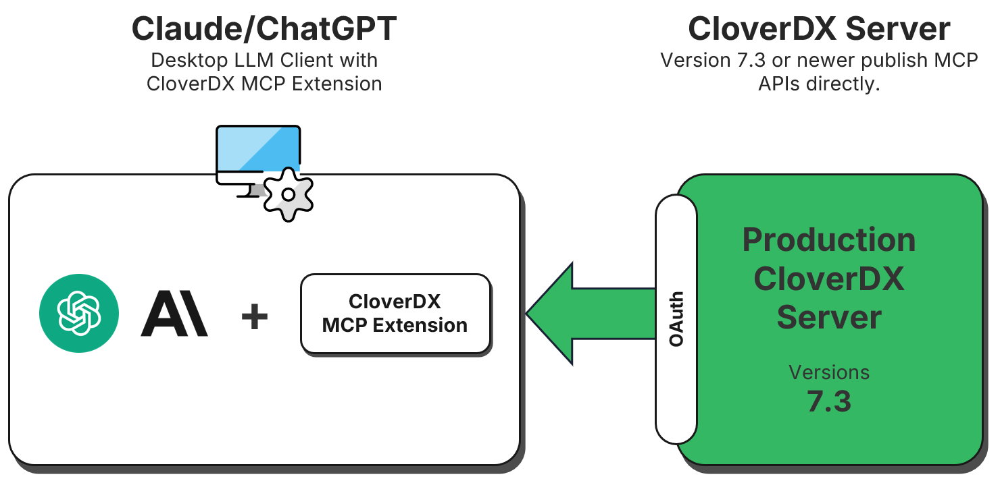
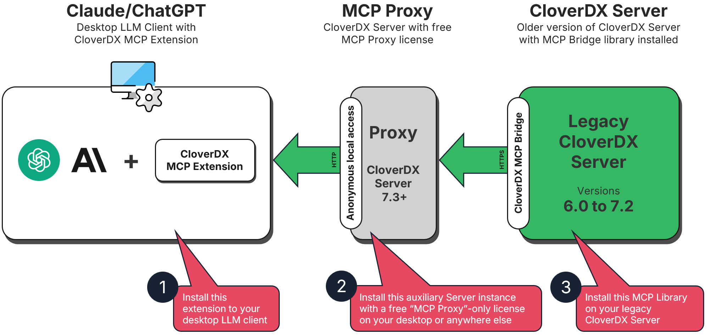
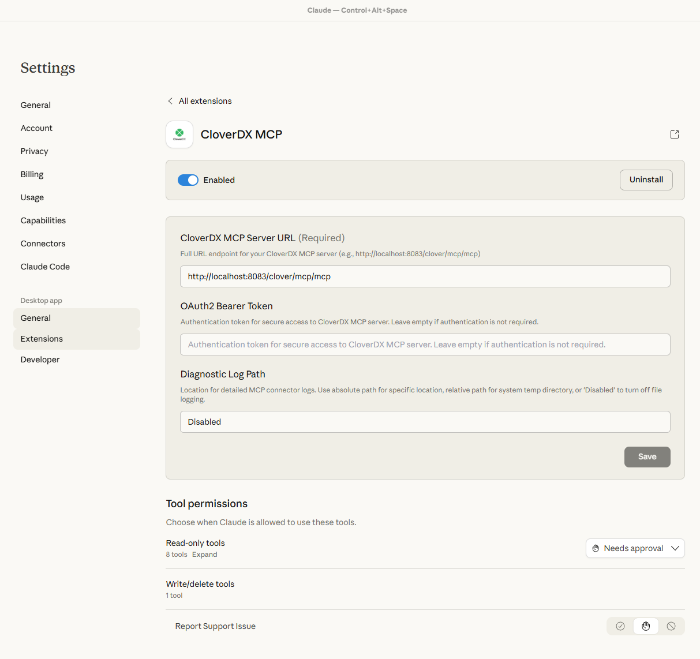
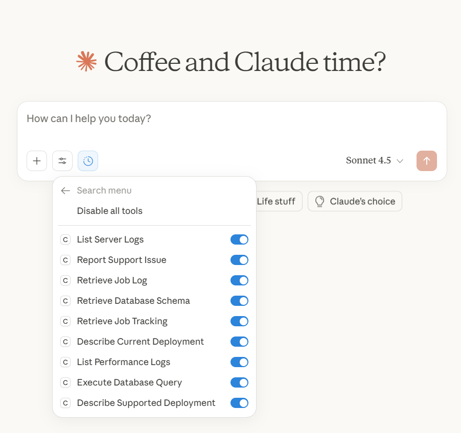
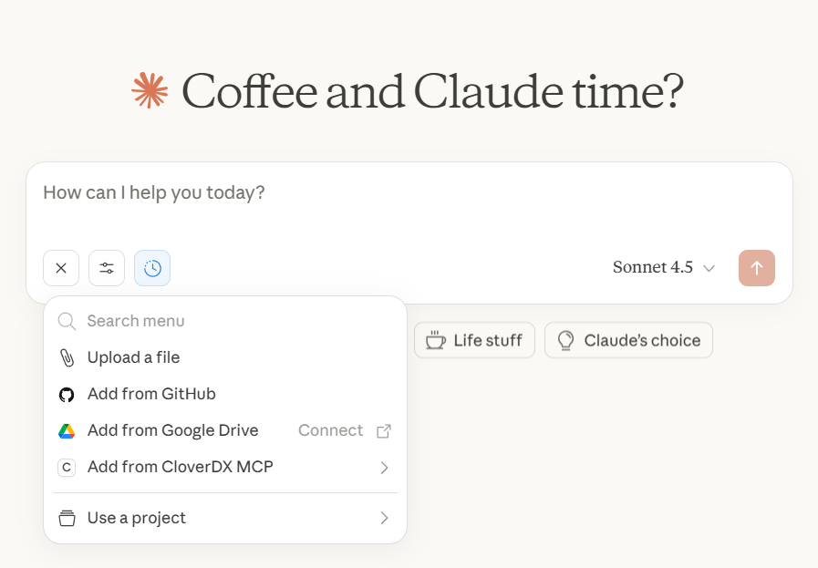
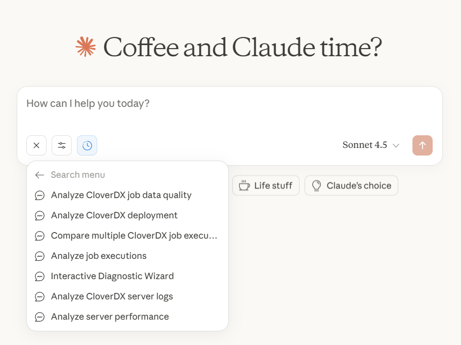

<!-- Administration > Configuration > Server configuration > CloverDX MCP Server -->

### CloverDX MCP Server

#### What is MCP?

MCP (Model Context Protocol) is an emerging standard that enables AI agents to interact with external services and data sources. It provides a standardized way for AI models to access tools, resources, and context from various applications, allowing them to perform tasks beyond their base capabilities.

CloverDX provides MCP out of the box starting with CloverDX 7.3.0 and also allows exposing MCP on older instances (version 6.0 to 7.2) via [CloverDX MCP proxy](server-config-mcp.md#configuration-for-cloverdx-60-to-72). The ability to expose older versions of CloverDX as MCP servers via MCP proxy is especially useful for production instances where the upgrades to newer versions may not be that simple while MCP proxy only requires minimal configuration. This allows you to take advantage of the MCP integration for all Server instances newer than CloverDX 6.0 which was released in April 2023.

CloverDX MCP Server exposes large amount of diagnostic functionality from CloverDX to AI agents:

- **Server Info**: get current server status, version, and configuration details.
- **CloverDX Info**: access CloverDX-specific system information.
- **CloverDX Server Logs**: access general server logs for troubleshooting.
- **Performance Logs**: monitor server performance metrics and bottlenecks.
- **Access Logs**: review user access and authentication events.
- **Job Run Logs**: examine detailed execution logs for specific jobs.
- **Job Tracking Info**: query job execution history, status, and runtime details.
- **CloverDX database SQL Select**: execute SELECT queries on CloverDX database.
- **Report Support Issue**: report problem to CloverDx customer portal.

This allows AI agents to help with common maintenance and development tasks such as:

- Troubleshooting failed jobs by analyzing logs
- Monitoring server health and performance
- Automating routine administrative queries
- Generating reports on job execution patterns

#### Setting up MCP on CloverDX Server

When setting up MCP, you will need to enable it on CloverDX Server and then also in your AI client. The following sections provide quick instructions to guide you through the configuration process.

Configuration of CloverDX MCP Server depends on the version of CloverDX you are working with. If you would like to expose CloverDX 7.3 or newer via MCP, you can use built-in functionality - see [Configuration for CloverDX 7.3 and Newer](server-config-mcp.md#configuration-for-cloverdx-73-and-newer) section below for more details. For older CloverDX version you will have to set-up additional proxy instance of CloverDX Server with special free license to provide the MCP-compatible API. Follow the instructions in [Configuration for CloverDX 6.0 to 7.2](server-config-mcp.md#configuration-for-cloverdx-60-to-72) below for more details.

To configure the client, please follow the instructions in [Client Setup](server-config-mcp.md#client-setup) section.

#### Configuration for CloverDX 7.3 and Newer

CloverDX 7.3 and newer expose MCP-compatible APIs out of the box and only require minimal configuration to enable it. The following diagram provides overview of the architecture.



The configuration for CloverDX 7.3 has two parts - you need to enable the MCP Server and then configure access to it. To enable the MCP Server, set value of `clover.mcp.enabled` configuration property to `true`. Since this needs to be done in CloverDX configuration file, it will require Server restart.

The access can be configured in two different ways:

- **Access with OAuth2 authentication**: fully secured access which requires setting up OAuth2 user authentication on CloverDX Server. This is suitable for production deployments where security is important.
- **Anonymous access**: simpler set-up that does not provide any account security and is therefore **not suitable for production deployments**. This is most useful in development or test environments where there is no risk of exposing production data or secrets.

##### Authentication with OAuth2 (Default & Recommended)

By default, MCP requires OAuth2 authentication between the client application (the AI client) and CloverDX Server.

**Prerequisites:**

- OAuth2 must be configured in CloverDX Server (**Configuration → Setup → OAuth2 Authentication**).
- User account used for MCP must have OAuth2 authentication enabled.
- MCP user account must have sufficient permissions to access data exposed via MCP. By default, it is enough for the user to belong to **All users** group. Note that for installation you will need administrator permissions, however, the administrator should not be the same user as the one used for actual MCP communication.

**Configuration:**

1. Enable MCP by setting `clover.mcp.enabled` to `true`.
2. Configure OAuth2 in CloverDX Server, see [OAuth2 Authentication](oauth2-authentication.md) for more details.
3. Configure your client application with valid OAuth2 Bearer token.

Once this is done, please follow with the [Client Setup](server-config-mcp.md#client-setup).

##### Anonymous Access (Testing Only)

For testing or development environments, you can enable anonymous access to bypass authentication. This is much simpler to configure but does not provide any security and anyone will be able to access your CloverDX Server via MCP.

Anonymous access requires `clover` user on the Server to be enabled.
> [!WARNING]
> Anonymous access must only be used in secure, non-production environments. When anonymous access is enabled, anyone can connect to your CloverDX Server via MCP without any authentication.

**Configuration:**

Configure the following in CloverDX configuration file:

1. Enable MCP by setting `clover.mcp.enabled` to `true`.
2. Enable anonymous access by setting `clover.mcp.anonymous.access.enabled` to `true`

Given the above, the complete set-up for anonymous access looks like this:

```properties
# Enable MCP functionality.
clover.mcp.enabled = true

# Enable anonymous access.
clover.mcp.anonymous.access.enabled = true
```

Once this is done, please follow with the [Client Setup](server-config-mcp.md#client-setup).

#### Configuration for CloverDX 6.0 to 7.2

Versions of CloverDX older than CloverDX 7.3 do not have built-in support for MCP. However, for versions 6.0 to 7.2 you can still take advantage of MCP by configuring CloverDX MCP proxy. This will allow you to use MCP for example on production instances where the upgrade process may be lengthy since the proxy requires minimal configuration.

To configure the proxy, you will need to deploy additional instance of CloverDX Server 7.3 which will serve as the proxy server. This instance can be very small (it will never run any jobs) and will use a special free MCP-only license (i.e., you do not have to get additional DXUs to for this instance). In the end you will be running two CloverDX Servers:

- **Target (legacy) server**: this is the server you wish to work with - for example your production instance. This can be any CloverDX version starting with CloverDX 6.0.x up to CloverDX 7.2.x.
- **MCP proxy server**: this is a small instance of CloverDX Server that only translates API requests between MCP client and the target CloverDX Server. This instance does not require any significant resources (you can even run it on your machine) and will use free MCP-only license and therefore does not incur any additional licensing cost. It can also be configured with just Derby backend database since it will never be running any jobs and will not require any clustering functionality. This further reduces the footprint of the proxy instance.

The following diagram provides overview of this architecture:



##### Step 1: Configure the Proxy Server (7.3+)

The proxy server needs standard MCP configuration plus remote connection settings.

1. Enable MCP on the proxy setting `clover.mcp.enabled` to `true`.
2. For the proxy instance (especially if you set it up on your machine), you can use anonymous access to simplify the configuration. Enable it by setting `clover.mcp.anonymous.access.enabled` to `true`. However, OAuth2 is available as well for greater security.
3. Enable the "remote MCP" by setting `clover.mcp.remote.enabled` to true`.
4. Configure access to your target server. This requires three properties in your CloverDX configuration file: `clover.mcp.remote.url`, `clover.mcp.remote.user` and `clover.mcp.remote.password`.

Complete configuration when using anonymous access may look like this:

```properties
# Enable MCP functionality.
clover.mcp.enabled = true

# Enable anonymous access.
clover.mcp.anonymous.access.enabled = true

# Turn this Server into MCP proxy by enabling remote MCP.
clover.mcp.remote.enabled = true

# URL of the remote MCP server (your 6.0 to 7.2 target server).
clover.mcp.remote.url = https://your-target-server.example.com/clover

# Username for authentication to the remote MCP server.
clover.mcp.remote.user = mcp-bridge-user

# Password for authentication to the remote MCP server.
clover.mcp.remote.password = your-secure-password
```

If you want to use OAuth2 when using proxy, you must configure OAuth2 on the proxy server (clients connect to proxy, not to the older target server, so the target does not need OAuth2). To do this, enable and configure OAuth2 on the proxy server. You must also configure a user with sufficient permissions with OAuth2 (this is the same as the non-proxy setup as described above). When using OAuth2, also make sure you set `clover.mcp.anonymous.access.enabled = false` in the configuration file.
> [!TIP]
> For best security and control, create a dedicated user account on the target Server. In the configuration example above, this is the `mcp-bridge-user` configured in `clover.mcp.remote.user`. This user will require permissions to access data available through MCP - it is enough for this user to belong to **All users** group when using MCP, but the user may temporarily need admin permissions during installation (see library installation below).
>
> Additionally, we also recommend encrypting access credentials to this user by using [CloverDX secure-cfg-tool](secure-configuration-properties.md).

##### Step 2: Configure the Target Server (6.0 to 7.2)

The target server needs the CloverDX MCP Bridge Library installed and initialized. This library exposes the API needed by the MCP proxy server.

1. Log in to your **target server** as administrator.
2. Open the **Libraries** module, click on **Install library from repository** and select **CloverDX Marketplace** from the **Repository** drop-down.
3. Find the latest version of **CloverDXMCPBridgeLib** and install it (use the default name for installation).
4. Wait for the installation to complete.
5. Once the library is installed, it needs to be configured and initialized. Follow the installation instructions for the library in [CloverDX Marketplace](https://marketplace.cloverdx.com/) (these instructions may differ depending on the library version).

Once the library is installed and configured, you will be able to connect your client to the target server via MCP proxy.

#### Client Setup

This section describes how to connect AI desktop applications to your CloverDX Server using MCP. Currently supported clients include Claude Desktop and ChatGPT Desktop applications.
> [!NOTE]
> **Authentication Requirements:**
>
> - If OAuth2 is **not** configured in CloverDX Server (*Configuration → Setup → OAuth2 Authentication*), you must set `clover.mcp.anonymous.access.enabled = true` on the server.
> - If OAuth2 **is** configured, clients must provide a valid Bearer token when connecting.

##### Claude Desktop Application

To use CloverDX MCP Server with Claude, you will need:

- Claude desktop app installed - [https://www.claude.com/download](https://www.claude.com/download).
- CloverDX MCP Extension file (`CloverDX-MCP.mcpb`) you can download from [Customer Portal → Downloads page](https://support.cloverdx.com/downloads).

To correctly the Claude client to use CloverDX Server MCP, follow these steps:

1. Open the Claude desktop app
2. Navigate to **Settings → Extensions**
3. Install the CloverDX MCP Extension
   - If you already have some extensions installed, you can drag the `CloverDX-MCP.mcpb` file into the Extensions area.
   - If you do not have any extensions yet, click on **Advanced Settings**, then scroll down **Extension Developer** and click on the **Install Extension** button. Now you can navigate to the `CloverDX-MCP.mcpb` file and click **Install**.
4. Fill in the following configuration fields:
   - **CloverDX MCP Server URL**: this is the URL of your CloverDX Server. Write as `https://your-server.example.com:port/clover/mcp/mcp` - make sure to include the `/clover/mcp/mcp` suffix since that is the complete lociiton of the MCP API.
   - **OAuth2 Bearer Token**: this is only required with you use OAuth2 authentication on your CloverDX Server. Leave empty if using anonymous access.
   - **Diagnostic Log Path**: optional location for log files that can be useful for troubleshooting and debugging. You can leave this empty.
5. Click **Save**.
6. Toggle the extension switch to **Enabled**.



###### Usage

1. Start a new chat in the Claude desktop app
2. You can choose which MCP prompt to use from the available options, or leave it unselected.


*Figure 137. CloverDX MCP tools available in Claude client.*


*Figure 138. Add from CloverDX MCP menu provides access to example prompts provided by CloverDX MCP extension.*


*Figure 139. Example prompts provided by CloverDX MCP extension in Claude client.*

##### ChatGPT Desktop Application

To use CloverDX MCP Server from OpenAI ChatGPT client, you will need the following:

- ChatGPT subscription: a premium ChatGPT plan (Plus or above) is required since connectors are not supported in the Free and Go subscriptions plans.
- Authentication requirements: OAuth2 is not supported for ChatGPT so you must use MCP with anonymous access only.
- CloverDX Server must use the HTTPS protocol, HTTP-only is not supported by OpenAI/ChatGPT.
  > [!TIP]
  > For local test environments, you can use a tunneling application such as ngrok ([https://ngrok.com/](https://ngrok.com/)) to expose your local HTTP server via HTTPS.

To configure the ChatGPT client, follow these steps:

1. Click on your profile name in the ChatGPT desktop app
2. Select **Settings → Apps**
3. Scroll down to **Advanced settings** and expand it
4. Enable **Developer mode**
5. Click the **Back** button to return to the Apps view
6. Click the **Create app** button next to Advanced settings
7. Fill in the connector configuration:
   - **Name**: `CloverDX Server` (or any descriptive name)
   - **MCP Server URL**: Your CloverDX MCP endpoint
     - Format: `https://your-server.example.com:port/clover/mcp/mcp`
   - **Authentication**: Select "No Auth" option (OAuth2 is not supported)
8. Click **Create**
