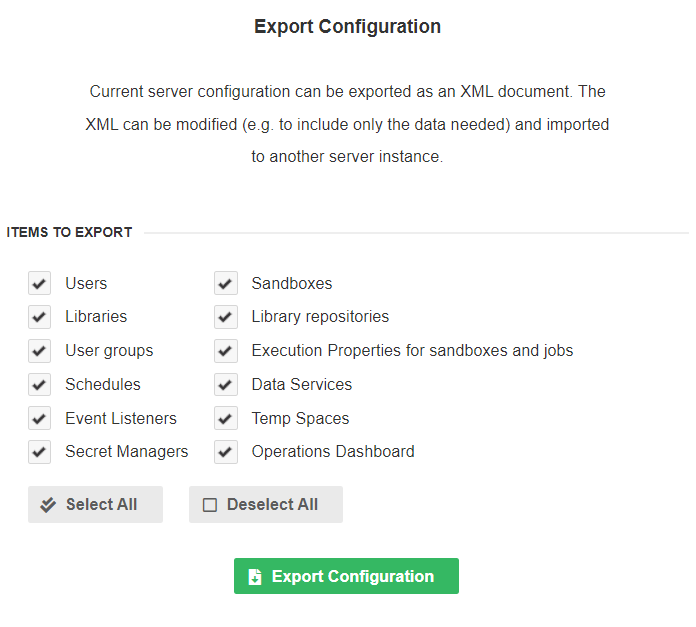
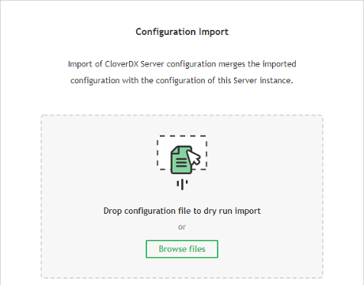
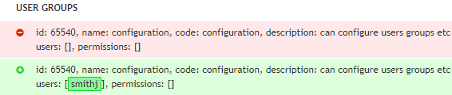

<!-- Administration > Configuration > Server configuration > Server configuration export/import -->

### Server configuration export/import

**CloverDX Server** provides means to migrate its configuration (e.g. event listeners, schedules, etc.) or parts of the configuration between separate instances of the Server. A typical use case is deployment from test environment to production - this involves not only deployment of graphs, but also copying parts of the configuration, such as file event listeners, etc.

Configuration migration is performed in 2 steps - export of the configuration from the source Server, followed by import of the configuration at the destination Server. After exporting, the configuration is stored as an XML file. The file can be modified manually before import, for example to migrate only parts of the configuration. Additionally, the configuration file can be stored in a versioning system (such as Subversion or Git) for versioning of the **CloverDX Server** configuration.

Configuration is automatically imported from `sandbox_configuration.xml` files when creating a new sandbox. For more details see [Sandbox configuration import](../operations/sandboxes.md#sandbox-configuration-import).

It is recommended to perform import of configuration on a suspended **CloverDX Server** and to plan for maintenance. Additionally, it is recommended to backup the **CloverDX Server** configuration database before the import.

The following items are parts of the *Server Configuration* and can be migrated between servers:

- [Operations Dashboard](../operations/ops-dashboard.md)
- [Users & Groups](users-groups-index.md)
- [Sandboxes](../operations/sandboxes.md)
- [Job parameters](../developer/parameters.md#built-in-execution-parameters)
- [Schedules](../operations/scheduling.md)
- [Graph Event Listeners](../operations/listeners.md#graph-event-listeners), [Jobflow Event Listeners](../operations/listeners.md#jobflow-event-listeners), [JMS Message Listeners](../operations/listeners.md#jms-message-listeners), [File Event Listeners (remote and local)](../operations/listeners.md#file-event-listeners-remote-and-local)
- [Temp Spaces](tempspace.md)
- [Secret Managers](secret-managers.md)
- [Libraries](../operations/libraries.md#library-and-library-repository-configuration-import)
- [Library repositories](../operations/libraries.md#library-repository)

#### Permissions for configuration migration

Whether a user is entitled to perform a configuration migration is determined by *Server Configuration Management* permission; this permission has two sub-permissions: *Export Server Configuration* and *Import Server Configuration* (see [Group permissions](groups.md#group-permissions) for further information on permissions). These permissions are of higher priority than permissions related to a particular migrated item type - so even if the user does not have a permission, for example to list Server’s schedules, with *Export Server Configuration* he will be allowed to export all of defined schedules. The same is true for adding and changing items with the *Import Server Configuration* permission.

See [Server Configuration permission](groups.md#permission-server-configuration-management).

#### Server configuration export

Export of Server configuration is performed in the **Configuration** > **Export** section. You can choose which items will be exported (see [Server Configuration Export screen](server-config.md#server-config-export-screen)). Click the **Export Configuration** button to save an XML file with the configuration. The name of the XML file includes current timestamp.

If you manually edit the file, make sure that the content is valid. This can be done by validation against XSD schema. The schema for a configuration XML document can be found at `http://[host]:[port]/[contextPath]/schemas/clover-server-config.xsd`.

The XML file contains selected items of the **CloverDX Server** instance. The file can by modified before [importing](server-config.md#server-configuration-import) to another Server instance - for example to import schedules only.

If you want to automate the process of configuration export, use the [REST HTTP API](../operations/rest-api.md)..


*Figure 118. Server Configuration Export screen*

#### Server configuration import

This function merges exported configuration into the Server. The configuration is loaded from an XML file which can be created by the *[Server Configuration Export](server-config.md#server-configuration-export)* function, or automatically generated. The **Import** function is located in **Configuration** > **Import**.

If you want to automate the process of configuration import, use the [REST HTTP API](../operations/rest-api.md).


*Figure 119. Server Configuration Import screen*

The XML file defines configuration items to be imported. The items are matched against current configuration of the destination Server. Depending on result, the items are either added to the destination Server or existing item are updated. Matching of items is based on a key that depends on the item type:

| Item | Code |
| --- | --- |
| monitors | monitor name |
| users | user code |
| user groups | group code |
| sandboxes | sandbox code |
| job parameters | triplet: job parameter name, sandbox code, job file |
| event listeners | event listener name |
| schedule | schedule description |
| data service | pair: sandbox, rjob |
| temp spaces | pair: temp space node ID, temp space path |
| secret managers | secret manager name |
| libraries | pair: library name, version, custom name |
| library repositories | quartet: remote URL, path, username, tenant ID |

##### Environment variables

It is possible to use `${env:VARIABLE_NAME}` placeholders in the imported XML file. The placeholders will be replaced with the values of the referenced environment variables during the import.

##### Passwords

Passwords are encrypted in the exported XML file by default. This is indicated by an optional XML attribute `plainText="false"`. If you want to set the password using an environment variable or simply save the password unencrypted, change the value to `true`:

```xml
<cs:password plainText="true">${env:PASSWORD}</cs:password>
```

##### Configuration import process

###### Uploading configuration

Select the XML file with exported configuration. As the first step, the Server executes a safe *dry run* import, without actually changing your Server’s configuration. Once uploaded, the Server checks the validity of the configuration and displays a dry run log containing added/updated items or errors.

You will be notified if the source and target differ in at least minor version number (e.g. 4.8.1 and 4.9.0). Importing configuration from different version may generate more warnings which will require your attention.

###### Verifying configuration

There are three main states that can occur in a dry run:

1. **The configuration is valid:** no errors have occurred and the configuration can be committed.
2. **The dry run ended with warning(s):** the configuration can be committed, but the warning(s) should be resolved after import.
3. **The dry run ended with error(s):** the configuration cannot be committed until the error(s) are fixed. Consult the dry run log to fix the errors in the XML file and re-upload it.
Dry run log
The **Dry run log** displays changes in the configuration, warns the user about items in configuration that require their attention and notifies them about errors that must be fixed before commit. Changes in the configuration are displayed in a diff view; items before update have a red background while added items or items after update have a green background with changes highlighted:

Below is an example of a log entry indicating a change in the configuration where a user `smithj` is added to a previously empty group `configuration`. The diff view shows the change in two steps (two lines grouped together with no space between them) as 'replacing' the empty group () with the same group with the new user ().


*Figure 120. Updated User Groups - User added to a group*

###### Committing import

Once all errors are resolved and the configuration is valid, you can **Commit Changes**. After confirmation, **Log of committed changes** will display the results. The log can be downloaded, as well.

Some items may not be initialized properly after the import (e.g. their initialization requires presence of a Cluster node that went down in the meantime or someone made changes on the Server between dry run and committing). User is notified about these problems in **Log of committed changes** with link to the affected items. You should check such items in respective sections of the Server Console and change their settings to fix the issue or remove them.
