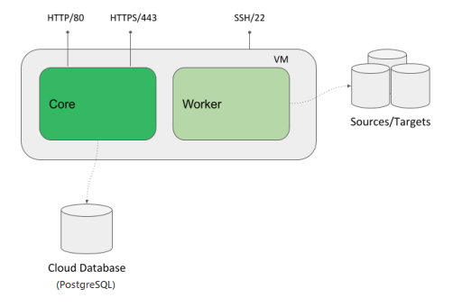

<!-- Administration > Installation > Server installation > Cloud deployments -->

### Cloud deployments

#### Overview

The **CloverDX Server offerings in cloud marketplaces** provide an easy way to create a **CloverDX Server** instance in the cloud infrastructure. The offerings spin-up a recommended cloud architecture that contains a standalone **CloverDX Server** with good defaults and a recommended environment.

Currently, we support [AWS Marketplace](https://aws.amazon.com/marketplace) and [Azure Marketplace](https://azuremarketplace.microsoft.com); see their respective sections for details. This section will describe aspects that are common for all of our cloud offerings - the intent is for the offerings to be as similar as possible.

For details on how to subscribe to and deploy **CloverDX Server** in cloud marketplaces, see the respective sections:

- [AWS Marketplace](aws-marketplace.md)
- [Azure Marketplace](azure-marketplace.md)

##### Architecture

The marketplace offerings consist of virtual machine images and templates. The templates orchestrate creation of all cloud resources necessary for the VM to run and be usable - database, virtual private networks, subnets, virtual firewalls, etc. The templates also provide a simple-to-use UI wizards to deploy the whole solution.

The virtual machine is designed to run a standalone **CloverDX Server** instance:


*Figure 14. Architecture - CloverDX Server in Cloud Marketplaces*

**It has external dependencies:**

- *data sources/data targets* - the data sources/targets to be processed by jobs are expected to be outside of the VM (temporary files will be inside).
- *cloud resources* - network resources such as virtual private networks, subnets, etc. These are created automatically by the offering’s template.

**Environment:**

| Environment details |  |
| --- | --- |
| OS | Ubuntu 24.04 LTS |
| Java | Eclipse Temurin JDK 21 (formerly AdoptOpenJDK) |
| Application server | Tomcat 10.1 - runs under `clover` user |
| System database | PostgreSQL 15 based cloud system database |

**The VM uses 2 disks:**

| Disks |  |
| --- | --- |
| OS disk | Contains operating system, software, installation of Tomcat and CloverDX. Mounted as `/`. |
| Data disk | Contains persistent data such as CloverDX configuration, logs, sandboxes etc. Mounted as `/var/clover`. |

**Internal structure of the VM:**

- `/opt/clover` - installation of Tomcat and CloverDX, home directory of the `clover` user.
- `/var/clover` - persistent data of CloverDX (configuration, logs, sandboxes, etc). Mount point of the data disk. Contains the following subdirectories:
  - `conf/` - configuration of the server, e.g., connection to the system database
  - `sandboxes/` - sandboxes with jobs, metadata, data, etc.
  - `cloverlogs/`- server logs
  - `tomcatlogs/` - Tomcat logs
  - `clover-lib/` - libraries to add to Tomcat, Server Core classpath, and Worker classpath
  - `tomcat-lib/` - libraries to add to Tomcat and Server Core classpath
  - `worker-lib/` - libraries to add to Worker classpath
  - `temp/` - Tomcat’s temporary directory, default location of CloverDX tempspace

**Default exposed ports:**

| Port | Description |
| --- | --- |
| `80` | HTTP port of the Server Console and Server API |
| `443` | HTTPS port of the Server Console and Server API |
| `22` | SSH port for VM administration |

##### Configuration

###### Server configuration

**CloverDX Server** is configured via configuration properties. See [List of configuration properties](list-of-properties.md) for available configuration properties.

Server in cloud comes with a built-in configuration file `/opt/clover/tomcat/conf/default_clover.properties` which contains basic useful configuration for cloud. Do not modify this file; your changes would be lost when updating to newer versions.

The `/var/clover/conf/clover.properties` file contains user-specified server configuration properties and their values. Any properties defined here will override the default built-in configuration. Changes made here will carry over to new versions when updating.

###### System database configuration

By default, **CloverDX Server** uses a PostgreSQL-based cloud database; see the [AWS Marketplace](aws-marketplace.md) and [Azure Marketplace](azure-marketplace.md) sections for more details about the databases. The database connection itself uses a JNDI datasource defined in `/var/clover/conf/server_fragment.xml`. The JNDI resource defines the database URL, credentials (password is encrypted), and additional configuration such as connection pool sizes and timeouts. Communication with the database is done over SSL.

The connection to the system database over JNDI is defined in `/opt/clover/tomcat/conf/default_clover.properties`:

```properties
datasource.type=JNDI
jdbc.dialect=org.hibernate.dialect.PostgreSQLDialect
datasource.jndiName=java:comp/env/jdbc/clover_server
```

To use a different system database or change the connection configuration:

1. Put the JDBC driver in `/var/clover/tomcat-lib`.
2. Modify JNDI resource definition in `/var/clover/conf/server_fragment.xml`.
3. Put database configuration properties into the `/var/clover/conf/clover.properties` configuration file. To see which properties are necessary, see [System database configuration](examples-db-connection-configuration.md).

###### Libraries and classpath

Libraries are added to the classpath of Tomcat (i.e., Server Core) and Worker from directories in the data disk. Place the JARs to the following directories under `/var/clover`:

- `tomcat-lib/` - libraries to add to Tomcat and Server Core classpath (e.g., JDBC drivers)
- `worker-lib/` - libraries to add to Worker classpath (e.g., libraries used by jobs)

###### Sandboxes

Sandboxes are stored by default on the data disk under the `/var/clover/sandboxes` directory.

###### License

CloverDX Server can be activated via the Server Console, typically on the login screen on the first start of the Server.

###### Tomcat configuration

Tomcat is installed in the `/opt/clover/tomcat` directory. You can modify its configuration in a persistent manner in two ways:

- `/var/clover/conf/server_fragment.xml` - this file is included in Tomcat’s `server.xml` configuration file. You can define, e.g., JNDI resources here.
- `/var/clover/conf/setenv_custom.sh` - this bash script is included in Tomcat’s `setenv.sh` script. You can add command-line parameters for Server Core in this script.

Any changes made in the above two files will carry over when upgrading to new versions of the cloud marketplace offer.

###### Memory

Important memory settings are Java heap size for Server Core, Java heap size for Worker, and the sizes of additional Java memory spaces. The memory settings are automatically calculated based on the memory available to the VM instance. If you change the memory size of the VM, the heap memory settings are updated automatically during VM start - for example, if you modify the VM to use an instance type with a larger amount of memory, the heap sizes for Server Core and Worker will increase automatically.

For example, if running the VM with 16 GB of RAM, the Server Core will have 4 GB heap, Worker will have 7 GB heap, and the rest is left for additional Java memory spaces and the OS.

The automatic memory settings can be overridden by modifying the `/var/clover/memory_allocation_config_override` file and setting BOTH properties:

- `CLOVER_SERVER_HEAP_SIZE` - heap size of Server Core (in MB)
- `CLOVER_WORKER_HEAP_SIZE` - heap size of Worker (in MB)

###### CloverDX services

The **CloverDX Server** is started automatically as a `systemd` service on startup of the VM. To manually stop/start/restart the server, use the following commands:

- `sudo systemctl stop clover`
- `sudo systemctl start clover`
- `sudo systemctl restart clover`

To see the stdout logs of the clover service, use `journalctl -u clover | less`. For working with the service, root permissions are required; use `sudo` to obtain them.

The system swap size is configured automatically by the `systemd` service `swap-autosize.service` on startup of the VM. If you want to configure swap yourself, you can disable the service.

###### Server logs

Server logs are collected in the `/var/clover/cloverlogs` directory on the virtual machine. Integration with native cloud logging services is possible, see specific sections:

- [Server logs in AWS CloudWatch](aws-marketplace.md#server-logs)
- [Server logs in Azure Monitor](azure-marketplace.md#server-logs)

###### JMX monitoring

Both Server Core and Worker are configured for JMX monitoring using tools like VisualVM or JConsole. The JMX is configured to use SSL. It needs 2 open ports per process, so 4 ports in total. The ports are NOT exposed on the virtual firewall by default. To successfully connect through JMX, you need to allow inbound connections from your IP to this destination port range: `8686-8689`. In case you want to customize the default JMX configuration, you can modify the following files:

- `/var/clover/conf/jmx-conf-core.properties`
- `/var/clover/conf/jmx-conf-worker.properties`

To connect through JMX, use port `8686` for Server Core and port `8688` for Worker.

For further instructions for using JMX with the default self-signed certificate in AWS, see the AWS-specific section [JMX monitoring in AWS](aws-marketplace.md#jmx-monitoring).
