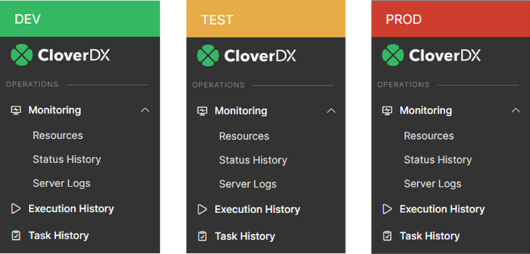

<!-- Administration > Configuration > Server configuration > Instance indicator -->

### Instance indicator

Instance Indicator is a small area located in the upper left corner of the GUI to which you can assign a unique color and label. This way, when working in multiple Server instances, you can easily distinguish between them.

Instance Indicator is shown only when either [webGui.instance.color](list-of-properties.md#webgui-instance-color) or [webGui.instance.label](list-of-properties.md#webgui-instance-label) is set.

*Figure 141. Instance Indicator*
