<!-- Administration > Configuration > Server configuration > Server configuration via Setup module -->

### Server configuration via Setup module

While it is possible to configure **CloverDX Server** by modifying the [configuration file](setup.md#configuration-file) in a text editor, the **Setup** with a user-friendly GUI offers a much easier way of configuring basic properties according to your preferences and requirements. Setup is accessible from **Server Console** under **Configuration > Setup**.
> [!IMPORTANT]
> To access the Setup section, you need the [Setup and OAuth2 permission](groups.md#permission-server-setup).

The Setup module consists of multiple tabs that allow you to configure the following:

| [Configuration file](setup.md#configuration-file) |
| --- |
| [License](setup.md#license) |
| [System database connection](setup.md#system-database) |
| [Data Manager connection](setup.md#data-manager) |
| [Worker](setup.md#worker) |
| [MCP Server](setup.md#mcp-server) |
| [Sandbox paths](setup.md#sandboxes) |
| [Encryption](setup.md#encryption) |
| [E-mail](setup.md#e-mail) |
| [LDAP connection](setup.md#ldap) |
| [Cluster configuration](setup.md#cluster) |
> [!TIP]
> To keep your settings and data in the case of a database migration (e.g., from evaluation to production environment), see [Server Configuration Migration](server-config.md).

#### Before you start

Before using the Setup module, you must specify the path to the configuration file where Setup saves the configuration, and add the required libraries to the classpath.

1. **Specify the path to the configuration file**
   Setup uses the configuration file to save the Server’s settings. The path to the file is specified by the [`clover.config.file`](list-of-properties.md#lop-config-file) system property.
   If you used a CloverDX bundle, one of our [cloud marketplace offerings](server-in-cloud-marketplaces.md), or the [official Docker image](docker-install.md) to build your Server environment, the configuration file is already created and preconfigured with default settings.
   If you used a fresh standalone Tomcat installation, you will need to create the configuration file first and point the Server to it. Until this is done, you will not be able to make any changes in the Setup module.
   If you start the Server without configuration, you will see decorators pointing to the Setup. The decorators mark problems that require your attention. The displayed number corresponds to the number of items.
   The [**Configuration File tab**](setup.md#configuration-file) provides step-by-step instructions for creating and configuring the file.
   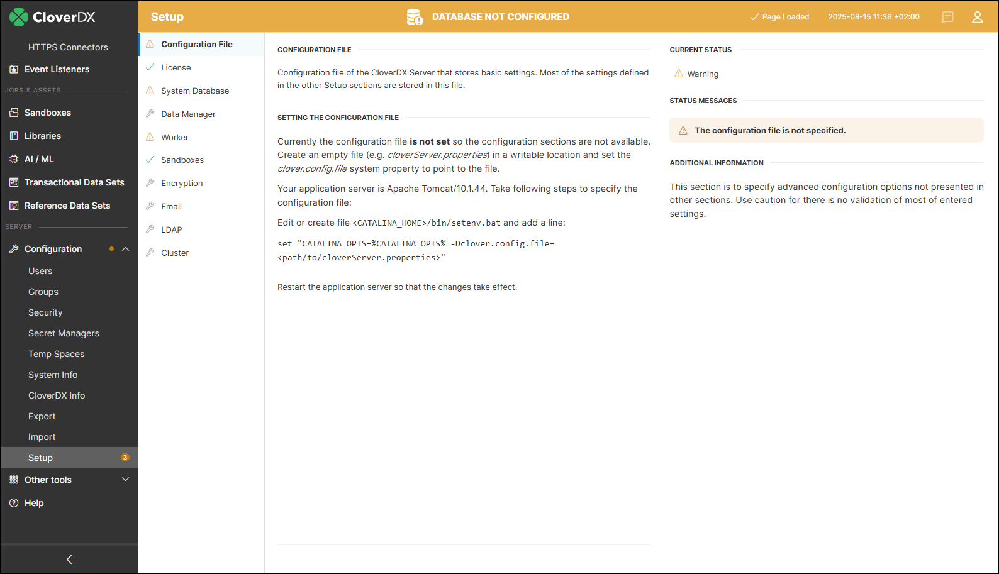
   *Figure 125. Setup GUI with decorators*
2. **Add libraries to the classpath**
   Next, place the libraries required for further configuration in the application server’s classpath. For Tomcat, place the files in the `<TOMCAT_INSTALL_DIR>/lib` directory. You will need:
   - A JDBC driver for the [system database connection](examples-db-connection-configuration.md).
   - If you plan to encrypt sensitive data in the configuration file using a custom encryption provider, add the provider’s `.jar` file to the classpath. See [Encryption](setup.md#encryption) for more information.
     > [!NOTE]
     > Make sure to restart the application server to load the newly added `.jar` files.
3. If you wish to encrypt the sensitive data in your configuration file, turn on the [**Encryption**](setup.md#encryption) feature.
4. **Configure individual features**
   Now, you can use the individual tabs in the Setup module to configure the desired Server features.
5. **Restart the Server (if needed)**
   Some changes require you to restart the Server. These changes are indicated by the  icon. Other changes (e.g., License, Sandboxes, E-mail, LDAP) are applied immediately and do not require a restart.

#### Using Setup

The Setup page consists of a menu with tabs on the left, a main configuration part in the middle, and a section with configuration status and additional information on the right side.

**The main configuration part contains several buttons:**

- **Save** saves changes made to the configuration file. The changes in the configuration must be valid.
- **Save Anyway** saves the configuration even if it is invalid. For example, a database connection is considered invalid if a required library is missing.
- **Validate** validates the configuration on the current tab. If you see the **Save** button disabled, use **Validate** to validate the configuration first.
- **Discard Changes** discards unsaved changes and returns to currently used values.

If an error/warning icon appears, a status message on the right side of the Setup GUI will provide relevant details.

**The following decorators can appear in the Setup GUI:**

| Icon | Description |
| --- | --- |
|  | Configured tab |
|  | Inactive tab |
|  | Error |
|  | Warning |
|  | Restart required |
|  | Pending changes which have not been saved yet |

#### Configuration File

The **Configuration File** tab displays the content of the configuration file. For basic settings, you do not have to edit the content of the file manually. Instead, use the particular Setup tab to configure the corresponding features.

If you want to add advanced configuration properties, see [List of configuration properties](list-of-properties.md).
> [!TIP]
> Refer [here](example-configuration-file.md) for an example configuration file.

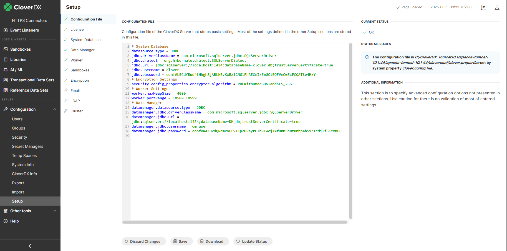
*Figure 126. Example of the Server Configuration file*

#### License

The **License** tab allows you to **view the details** of your currently loaded license(s) and to **add** or **remove** licenses as needed.

To see license details, click on the  dropdown button.

The panel on the right provides a summary of enabled features and their values (e.g., maximum number of [CPU cores](system-requirements-for-cloverdx-server.md#cpu-recommendations) or [Wrangler](wrangler-administration.md#licensing-number-of-allowed-wrangler-seats), [Data Manager](data-manager-administration.md#data-manager-licensing) or [AI Authoring](server-config-mcp.md#ai-authoring-seats) seats) from all loaded licenses. A value that has been exceeded – more users than seats, more CPU cores than allowed – is highlighted in the summary.

The license overview also displays the location of your licenses in the **Location** row:

- **Database**: licenses loaded into Server’s [system database](setup.md#system-database) display **Database**.
- **Directory**: licenses loaded from a license file or license directory display full path to the license file, e.g., `C:\Apache-Tomcat-10.1\Licenses\CLCSXCLOVE11927408SP`. See [`license.file`](list-of-properties.md#lop-license-file) and [`license.dir`](list-of-properties.md#lop-license-dir) configuration properties for more information on how to load licenses from files on a disk.
> [!IMPORTANT]
> If you load your license into the system database, when the database changes (e.g., when switching from the default Derby database used for evaluation purposes to one of the [recommended databases](system-requirements-for-cloverdx-server.md#system-database) for commercial use), you will need to load the license again into the new database.

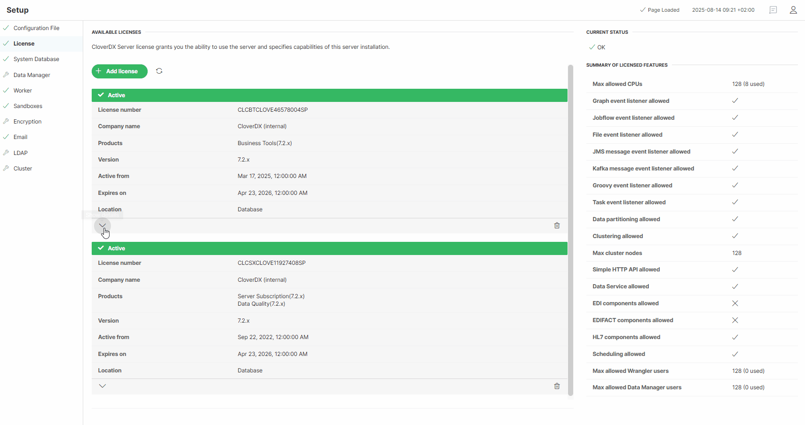
*Figure 127. The License tab*

#### System database

If you used our [cloud marketplace offerings](server-in-cloud-marketplaces.md) to deploy your CloverDX Server environment, it already includes a pre-configured PostgreSQL system database.

For manual deployments, you need to create a database for CloverDX Server and add a user/role with appropriate rights before you set up the connection to the database in the server’s Setup GUI. Refer [here](system-requirements-for-cloverdx-server.md#system-database) for the list of supported databases and versions.
> [!TIP]
> CloverDX Server **requires a working database connection** to store license information. Therefore, it allows you to access the Setup and configure the connection **prior** to the Server **activation** - simply log into the Server Console and click the **Close** button. Otherwise, you would have to activate the server again after switching from the default Derby database to a new system database.

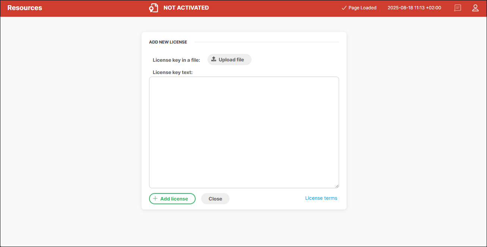
*Figure 128. Server console without an active license*

The **Database** tab lets you configure the connection to the database. You can connect via:

- **JDBC**
  Under JDBC connection, choose your **Database** platfrom from the first drop-down list. This will enable you to choose a **Database URL** template from the second drop-down list. In this template (e.g., `jdbc:postgresql://host:5432/dbname` for PostgreSQL), replace the *host* and *dbname* keywords with proper values.
  Next, enter the **User name** and **Password** for your database.
  > [!NOTE]
  > An Apache Derby JDBC 4-compliant driver is bundled with CloverDX Server. The **Derby database** is intended for **for evaluation purposes only**. For commercial use, switch to one of the supported databases. When switching, add the appropriate JDBC-4 compliant driver to the classpath (i.e., for Tomcat, place the driver in the `<TOMCAT_INSTALL_DIR>/lib` directory) and restart the application server.

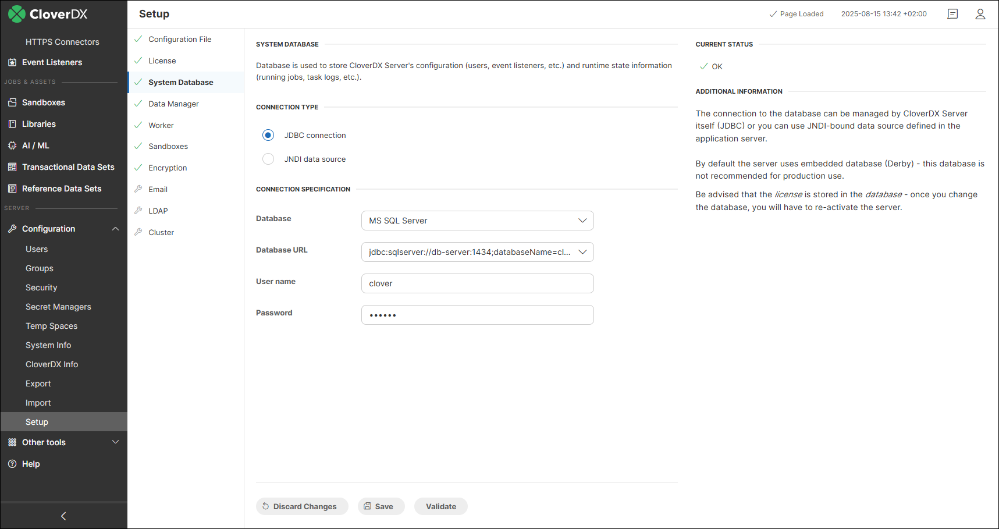
*Figure 129. Database connection configuration for a JDBC connection*

- **JNDI**
  With JNDI, you can access the datasource configured at the application server level. Select your **Database** platform and choose the suitable item from the JNDI tree. For more information on how to enable JNDI connections at the application server level, see [JNDI DB Datasource](jndi-datasource-config.md#jndi-db-datasource).

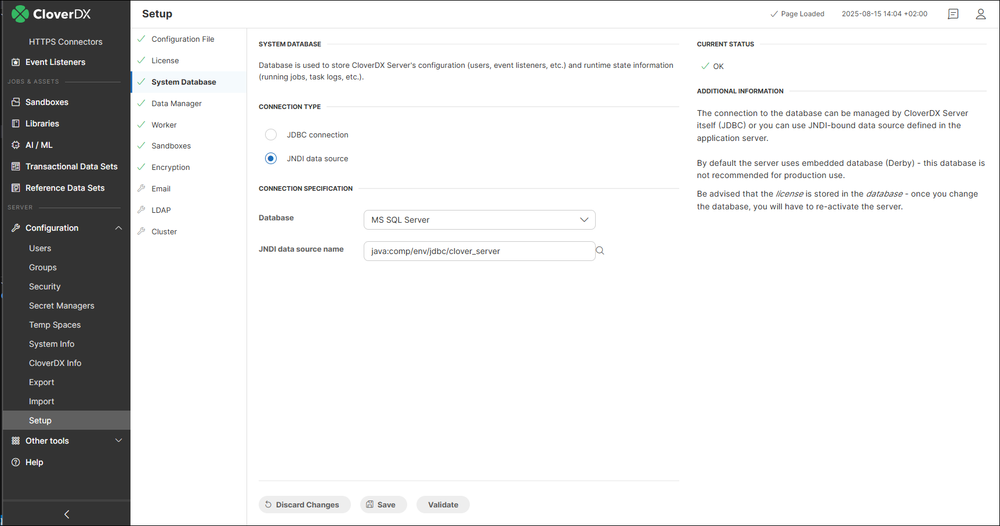
*Figure 130. Database connection configuration for a JNDI connection*

#### Data Manager

In this section, you can configure a Data Manager connection. For detailed instructions, see [Data Manager configuration](data-manager-administration.md#data-manager-configuration).

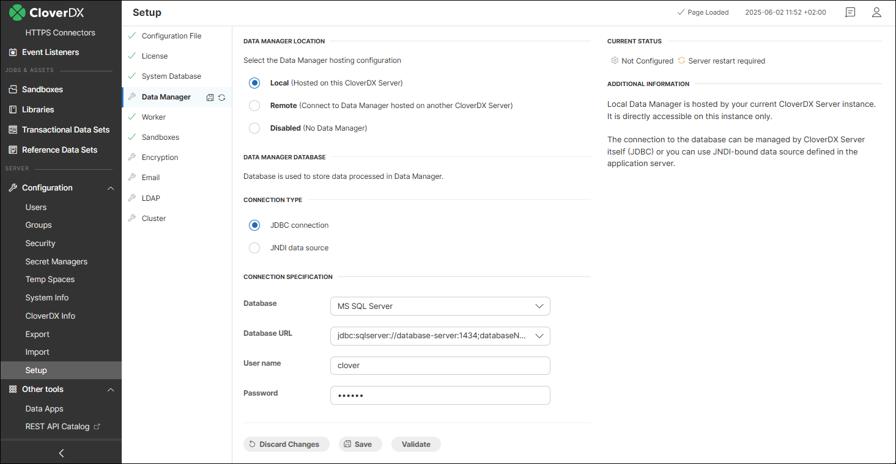

#### Worker

The **Worker** tab lets you configure properties for the Worker process. See [CloverDX Server architecture](architecture.md) for more information on the differences between the Server Core and Worker processes.

You can change the **Initial** and **Maximum heap size** for the Worker process, include additional **JVM arguments**, and set the **Port range** for Worker communication.

Changes in Worker configuration require a restart - click on **Finish jobs & restart** or **Restart now** to do so.

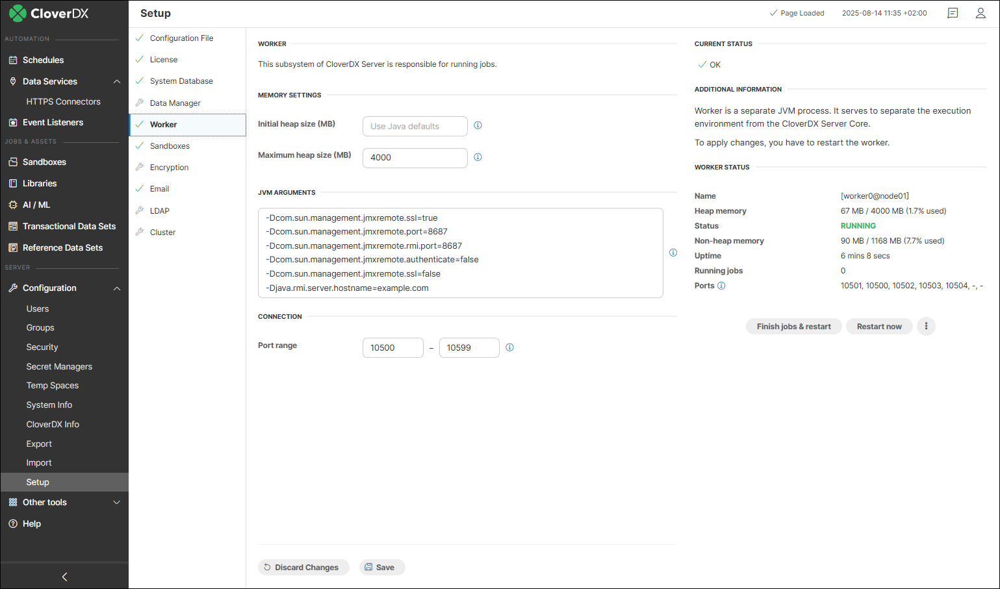
*Figure 131. The Worker tab*

#### MCP Server

The **MCP Server** tab configures the [CloverDX MCP Server](server-config-mcp.md): whether MCP is enabled, whether this instance serves a remote Server instead of its own runtime, where the support tools send a problem report, which client callbacks may be authorized, and which tools are exposed.

Every field on the tab stands for one [MCP configuration property](list-of-properties.md#mcp-support-properties), so the same settings can be made by editing the [configuration file](setup.md#configuration-file) directly.

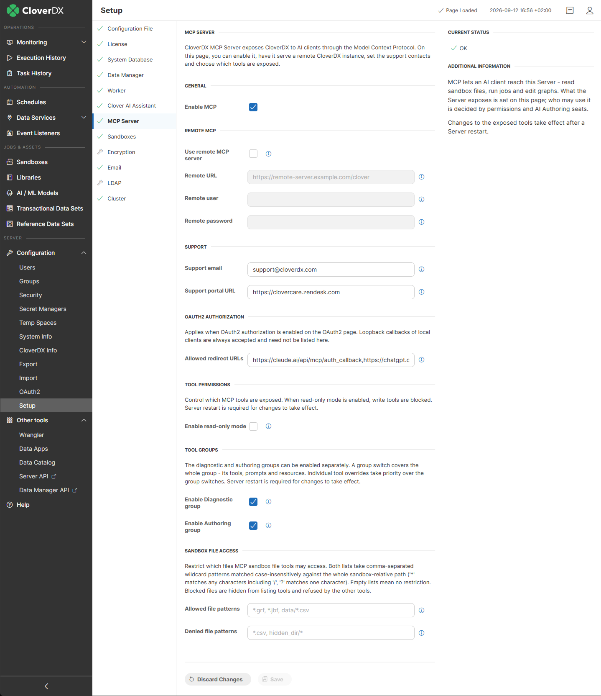
*Figure 132. The MCP Server tab*

| Field | Description | Property |
| --- | --- | --- |
| **General** |  |  |
| Enable MCP | Turns the MCP endpoints of this Server on and off. | [`clover.mcp.enabled`](list-of-properties.md#lop-clover-mcp-enabled) |
| **Remote MCP – a Server that answers with another Server’s runtime, see [Configuration for CloverDX 6.0 to 7.2](server-config-mcp.md#configuration-for-cloverdx-60-to-72)** |  |  |
| Use remote MCP server | Routes MCP tool execution through a remote CloverDX MCP endpoint instead of the local runtime. A proxy serves the diagnostic tools only. | [`clover.mcp.remote.enabled`](list-of-properties.md#lop-clover-mcp-remote-enabled) |
| Remote URL | Base CloverDX Server URL of the remote instance. The MCP path is appended automatically. | [`clover.mcp.remote.url`](list-of-properties.md#lop-clover-mcp-remote-url) |
| Remote user, Remote password | Credentials used for HTTP Basic authentication against the remote Server. Use a dedicated account and consider [encrypting the password](secure-configuration-properties.md). | [`clover.mcp.remote.user`](list-of-properties.md#lop-clover-mcp-remote-user), [`clover.mcp.remote.password`](list-of-properties.md#lop-clover-mcp-remote-password) |
| **Support – where the MCP support tools report a problem** |  |  |
| Support email | Address a problem report is sent to when the user asks for it. The report goes through the Server’s own SMTP connection, so the [E-mail](setup.md#e-mail) tab has to be configured as well. Leaving the address empty disables reporting by email. | [`clover.mcp.support.email`](list-of-properties.md#lop-clover-mcp-support-email) |
| Support portal URL | Base URL of the CloverDX Support Portal used for issue reporting. | [`clover.mcp.customer.portal.api.url`](list-of-properties.md#lop-clover-mcp-customer-portal-api-url) |
| **OAuth2 Authorization – applies when [OAuth2](oauth2-authentication.md) is enabled for the MCP scope** |  |  |
| Allowed redirect URLs | Callback URLs of MCP clients that do not run on the user’s own machine, separated by commas. Each URL is matched in full, so copy it exactly as the client shows it; clients calling back to `localhost` or `127.0.0.1` are accepted without being listed. The preset URLs are the callbacks of the hosted Claude and ChatGPT clients – remove them if clients of those services are not to authorize against this Server. | [`clover.mcp.oauth2.redirect.allowed`](list-of-properties.md#lop-clover-mcp-oauth2-redirect-allowed) |
| **Tool Permissions – see [MCP tools permissions](server-config-mcp.md#mcp-tools-permissions)** |  |  |
| Enable read-only mode | Blocks the write tools, leaving the read-only ones exposed. Individual tool overrides take priority over it. | [`clover.mcp.read.only`](list-of-properties.md#lop-clover-mcp-read-only) |
| **Tool Groups** |  |  |
| Enable Diagnostic group, Enable Authoring group | Each switch covers a whole group – its tools, prompts and resources. Withdrawing a group hides it from everybody, whatever permissions they hold. Individual tool overrides take priority over the group switches. | [`clover.mcp.diagnostic.enabled`](list-of-properties.md#lop-clover-mcp-diagnostic-enabled), [`clover.mcp.authoring.enabled`](list-of-properties.md#lop-clover-mcp-authoring-enabled) |
| **Sandbox File Access – see [Sandbox file access](server-config-mcp.md#sandbox-file-access)** |  |  |
| Allowed file patterns, Denied file patterns | Comma-separated wildcard patterns restricting which files the MCP sandbox file tools may reach. Empty lists mean no restriction; the deny list is applied last and always wins. The page warns when a non-empty allow list omits the CloverDX job files, because graph and job tools then refuse to work. | [`clover.mcp.sandbox.allowedFiles`](list-of-properties.md#lop-clover-mcp-sandbox-allowedfiles), [`clover.mcp.sandbox.deniedFiles`](list-of-properties.md#lop-clover-mcp-sandbox-deniedfiles) |

A Server restart is required for changes to the exposed tools to take effect.

The **Company Knowledge** section names the sandbox holding the customer’s own knowledge entries for AI agents – see [Company knowledge store](server-config-mcp.md#company-knowledge-store).

Who may use the exposed tools is a separate question, answered by permissions and AI Authoring seats – see [MCP permissions and AI Authoring seats](server-config-mcp.md#mcp-permissions-and-ai-authoring-seats).

The properties that have no field on this tab – token lifetimes among them – are listed in [MCP Support properties](list-of-properties.md#mcp-support-properties).

#### Sandboxes

The **Sandboxes** tab lets you configure a path to a directory used to store sandbox data. In a cluster environment, you can configure paths to [shared](../admin/cluster-setup-index.md#shared-sandbox), [local](../admin/cluster-setup-index.md#local-sandbox), and [partitioned](../admin/cluster-setup-index.md#partitioned-sandbox) sandboxes.

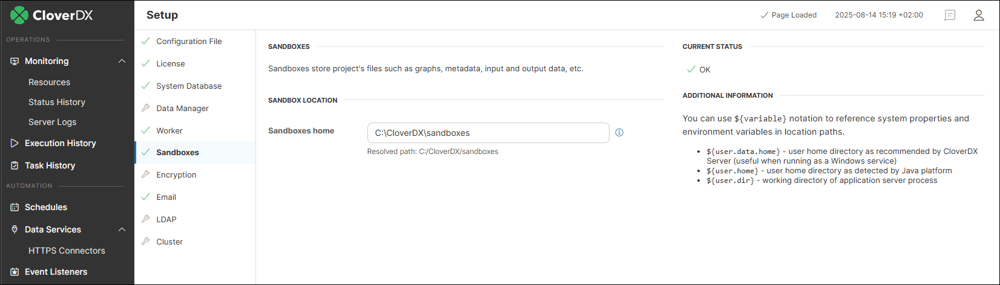
*Figure 133. Sandbox path configuration in a standalone environment*

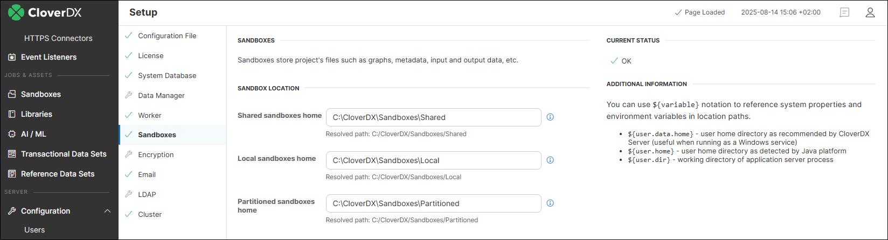
*Figure 134. Sandbox path configuration in a cluster environment*

#### Encryption

To secure sensitive information entered in other Setup tabs, you can use the **Encryption** feature. When enabled, passwords entered in sections like *System Database* or *Email* are automatically saved in an encrypted form in the configuration file.

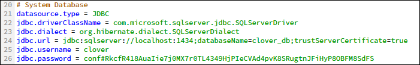
*Figure 135. Configuration file with an encrypted value in jdbc.password.*

To enable encryption, select the **Enable encryption** check box and choose the desired **Encryption provider** (*SunJCE* or *Custom*) and **Encryption algorithm**. Among the default algorithms provided by SunJCE, `PBEWithHmacSHA512AndAES_256` is the strongest one. To encrypt currently unencrypted passwords, use the **Save & Encrypt** button.

Since the default algorithms are generally weaker, we **recommend** using [Bouncy Castle](https://www.bouncycastle.org/) - a free custom JCE (Java Cryptography Extension) provider offering a **higher strength of encryption**.
> [!NOTE]
> If you want to use a custom provider, the related library has to be added to the appserver classpath. For Tomcat, this means adding the file to the `<TOMCAT_INSTALL_DIR>/lib` directory.

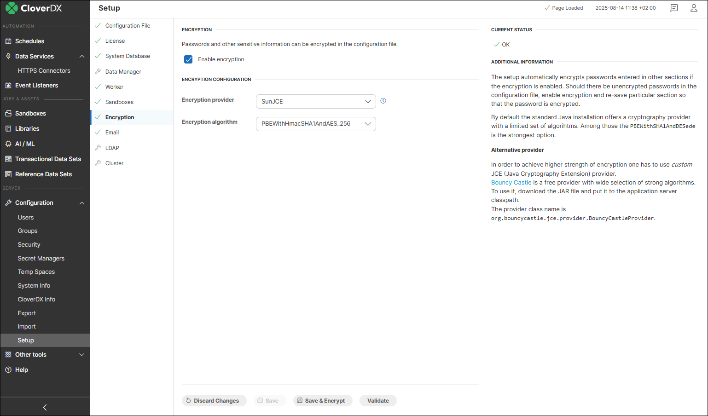
*Figure 136. Encryption configuration*

#### E-Mail

The **E-mail** tab lets you configure a connection to an SMTP server to allow CloverDX Server to [send email](../operations/tasks.md#send-an-email) reporting of the Server status or events on the Server, or send a notification to a newly created user.

You may authenticate the connection to an SMTP server via username and password or OAuth2. For OAuth2, you have to authorize the connection first by using the **Authorize** button.

If OAuth2 authentication is used in a cluster, all nodes must use an identical OAuth2 configuration. After the OAuth2 configuration is authorized by the **Authorize** button on any node, all cluster nodes will share the OAuth2 tokens automatically.
> [!NOTE]
> You can set the default sender address by populating the **Default sender** field.

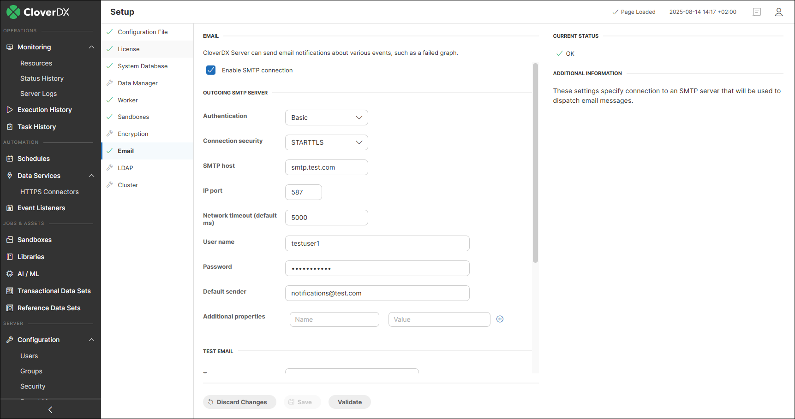
*Figure 137. E-mail configuration*

To make sure the configuration of the **Outgoing SMTP Server** is correct, you can send a **test email** from the **Test email** section at the bottom.

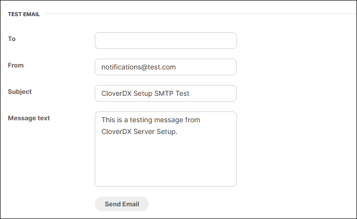
*Figure 138. Test email section*

#### LDAP

The **LDAP** tab lets you use an existing LDAP database for user authentication. For detailed information on how to set up an LDAP connection, see [LDAP authentication](ldap-authentication.md).

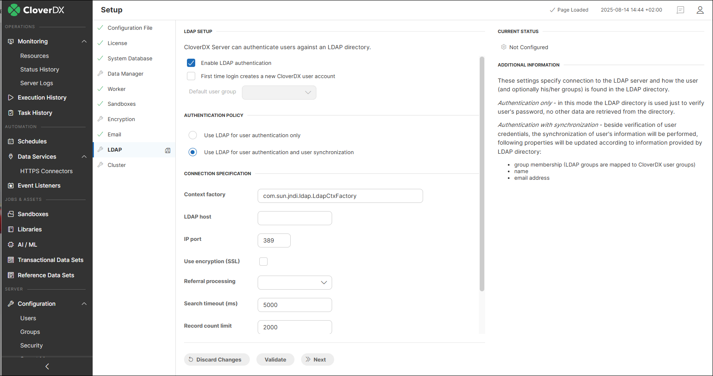
*Figure 139. LDAP configuration*

#### Cluster

The **Cluster** tab lets you configure clustering features. For more information on how to configure a cluster environment, see [Server cluster setup and configuration](cluster-setup-index.md).

In case your license does not allow clustering, the `Enable clustering` checkbox is grayed out, and the note `The license does not allow clustering.` appears at the top.

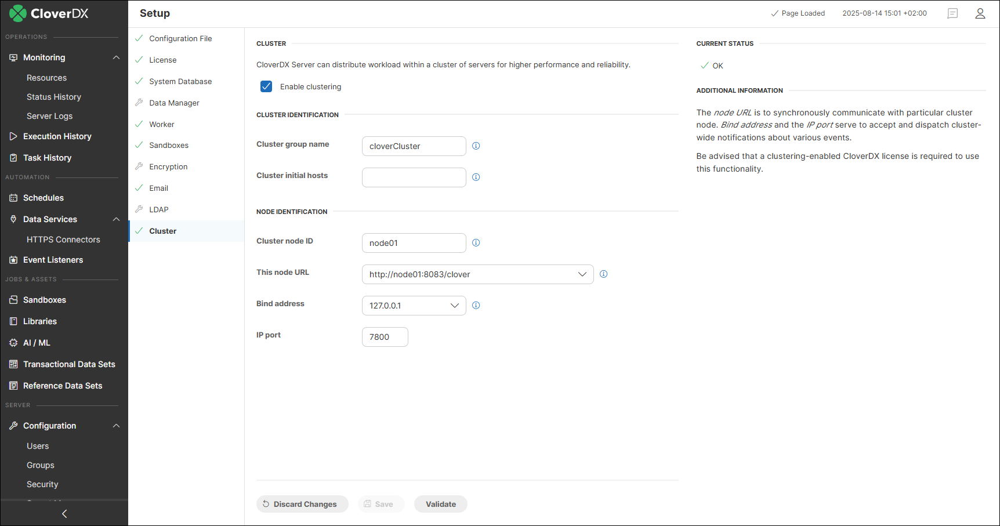
*Figure 140. Cluster configuration*
