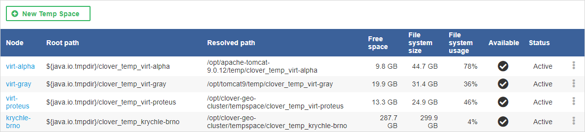

<!-- Administration > Configuration > Server configuration > Temp space management -->

### Temp space management

Components available in **CloverDX Server** often require temporary files or directories in order to work correctly. *Temp space* is a physical location on the file system where these files or directories are created and maintained. **CloverDX Server** allows you to configure and manage temp spaces - you can specify their locations, see usage of the filesystem, etc.

To access this administration section, you need [Temp Space Management permission](groups.md#permission-temp-space-management).

#### Temp space overview

The overview of temp spaces defined in **CloverDX Server** is available under *Configuration > Temp Spaces*.

The overview panel displays a list of temp spaces for each node in a Cluster. These properties are displayed for each temp space:

- **Node** - the name of the node on which the temp space is located (only in Clustered environment)
- **Root path** - the location of the temp space with unresolved placeholders (see note below for placeholders)
- **Resolved path** - the location of the temp space with resolved placeholders (see note below for placeholders)
- **Free space** - the remaining space for the temp space
- **File system size** - all available space for the temp space (the actual size of the filesystem where the temp space resides)
- **File system usage** - the size of used space in percentage
- **Available** - the directory exists and is writable
- **Status** - the current status of a temp space, can be `Active` or `Disabled`
> [!NOTE]
> It is possible to use system properties and environment variables as placeholders. See [Using environment variables and system properties](tempspace.md#using-environment-variables-and-system-properties).

*Figure 117. Configured temp spaces overview - one default temp space on each Cluster node*

#### Management

Temp space management offers an interface with options to add, disable, enable and delete a temp space.

| [Initialization](tempspace.md#initialization) |
| --- |
| [Adding Temp Space](tempspace.md#adding-temp-space) |
| [Using environment variables and system properties](tempspace.md#using-environment-variables-and-system-properties) |
| [Disabling Temp Space](tempspace.md#disabling-temp-space) |
| [Enabling Temp Space](tempspace.md#enabling-temp-space) |
| [Removing Temp Space](tempspace.md#removing-temp-space) |

##### Initialization

When **CloverDX Server** is starting, the system checks temp space configuration: if no temp space is configured, a new default temp space is created in the directory where `java.io.tmpdir` system property points. The directory is named as follows:

- `${java.io.tmpdir}/clover_temp` in the case of a standalone Server
- `${java.io.tmpdir}/clover_temp_<node_id>` in the case of Server Cluster

##### Adding temp space

In order to define a new temp space, click the **New Temp Space** button and specify its path. In Cluster environment, specify the node on which the new temp space should be created. If the selected directory does not exist, it will be created.
> [!TIP]
> The main point of adding additional temp spaces is to enable higher system throughput - therefore the paths entered should point to directories residing on different physical devices to achieve maximal I/O performance.

##### Using environment variables and system properties

Environment variables and system properties can be used in the temp space path as a placeholder; they can be arbitrarily combined and resolved paths for each node may differ in accord with its configuration.
> [!NOTE]
> The environment variables have a higher priority than system properties of the same name. The path with variables is resolved after the system has added new temp space and when the Server is starting. In case the variable value has been changed, it is necessary to restart the Server so that the change takes effect.

###### Examples:

- Given that an environment variable `USERNAME` has a value `cloverdxUser`. and is used as a placeholder in the path `C:\Users\${USERNAME}\tmp`, the resolved path is `C:\Users\cloverdxUser\tmp`.
- Given that Java system property `java.io.tmpdir` has a value `C:\Users\cloverdxUser\AppData\Local\Temp` and the property is used as a placeholder in the path `${java.io.tmpdir}\temp_folder`, the resolved path is `C:\Users\cloverdxUser\AppData\Local\Temp\temp_folder`.
- Node `node01` has been started with `-Dcustom.temporary.dir=C:\tmp_node01` parameter. Node `node02` has been started with `-Dcustom.temporary.dir=C:\tmp_node02` parameter. The declared path is `${custom.temporary.dir}`. The resolved path is different for each node, `C:\tmp_node01` for `node01` and `C:\tmp_node02` for `node02`.
- When the declared path is `${java.io.tmpdir}\${USERNAME}\tmp_folder`, the resolved path is `C:\tmp\cloverdxUser\tmp_folder`.

##### Disabling temp space

To disable a temp space, click on the three vertical dots menu on the right side of the respective temp space and select **Disable**. Once the temp space has been disabled, no new temporary files will be created in it, but the files already created may be still used by running jobs. If there are files left from previous or current job executions a notification is displayed.
> [!NOTE]
> The system ensures that at least one enabled temp space is available.

##### Enabling temp space

To enable a temp space, click on the three vertical dots menu on the right side of the respective disabled temp space and select **Enable**. Enabled temp space is active, i.e. available for temporary files and directories creation.

##### Removing temp space

To remove a temp space, click on the three vertical dots menu on the right side of the respective temp space and select **Delete**. Only disabled temp spaces may be removed. If there are any running jobs using the temp space, the system will not allow its removal.
