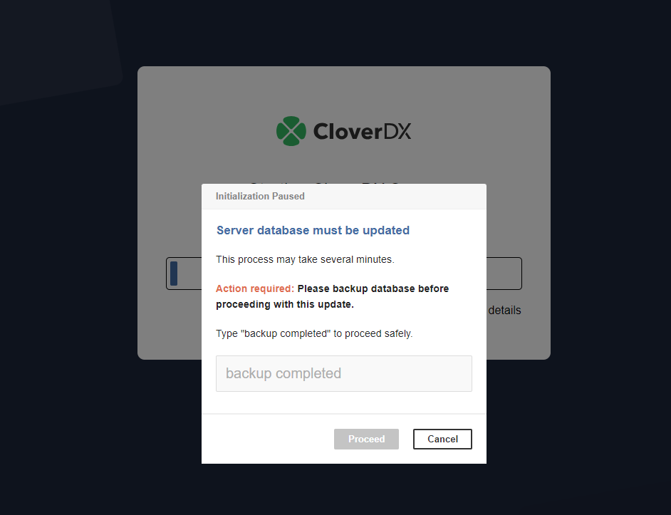
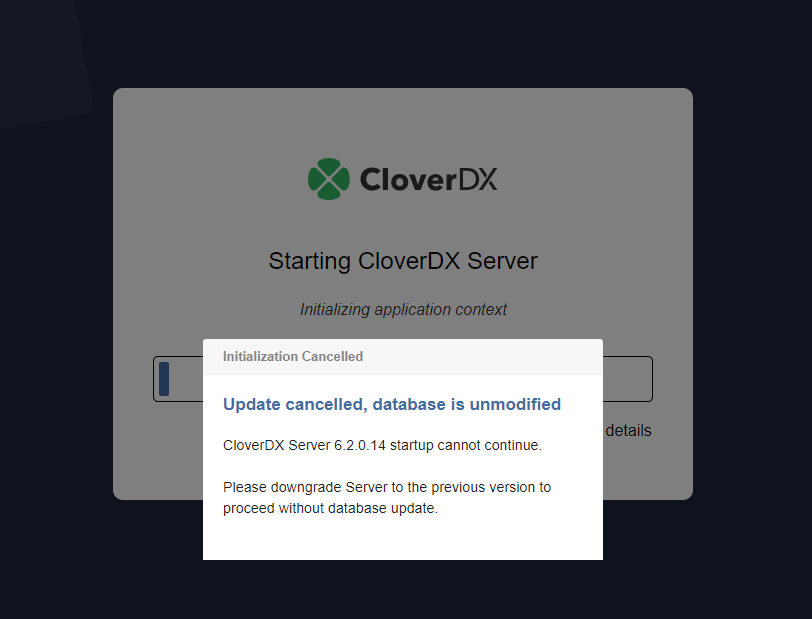

<!-- Administration > Upgrade > Server upgrade in containers -->

## 6. Server upgrade in containers

This section provides detailed instructions for upgrading CloverDX Server running in containerized environments such as Docker and Kubernetes, using the official [CloverDX Server Docker image](https://hub.docker.com/r/cloverdx/cloverdx-server). Upgrading the Server in these environments involves specific steps and considerations to ensure a smooth transition and minimal downtime. Note that if your environment was built using a modified image or you plan to use a modified image for the upgrade, you may need to adjust the steps outlined here.

### General notes on upgrade

- An upgrade of **CloverDX Server** requires downtime; plan a maintenance window.
- A successful upgrade requires about 30 minutes; rollback requires 30 minutes.
- Perform the steps below in a development/testing environment first before moving onto a production environment.

### Upgrade prerequisites

- Having a new [CloverDX Server official Docker image](https://hub.docker.com/r/cloverdx/cloverdx-server) & license files available (licenses for the version you are upgrading to or newer).
- Having [release notes](https://support.cloverdx.com/releases/) for the particular **CloverDX** version available (and all versions between current and intended version to be upgraded to).
- Having the graphs and jobs updated and tested with regards to known issues & compatibility for the particular **CloverDX** version.
- Having the **CloverDX Server** configuration properties file externalized (see [Server Configuration](https://github.com/cloverdx/cloverdx-server-docker#server-configuration)).
- Having the **CloverDX Server** data volume externalized (see [Data Volume](https://github.com/cloverdx/cloverdx-server-docker#data-volume)).
- Standalone database schema where **CloverDX Server** stores configuration, see [System database configuration](examples-db-connection-configuration.md).
- Having a separate sandbox with a test graph that can be run at any time to verify that **CloverDX Server** runs correctly and allows for running jobs.

### Upgrade instructions

1. Suspend all sandboxes, wait for running graphs to finish processing.
2. Stop the **CloverDX Server** container (do not delete the container).
3. Back up the existing **CloverDX** database schema.
4. Back up the existing **CloverDX** image & license file.
5. Back up the existing **CloverDX** sandboxes.
6. Replace old license files with the valid ones (or you can later use the web GUI form to upload new license). The license file is shipped as a text containing a unique set of characters. If you:
   - received the new license as a file (`*.dat`), then simply use it as new license file.
   - have been sent the license text, e.g. inside an email, then copy the license contents (i.e. all text between `Company` and `END LICENSE`) into a new file called `license.dat`. Next, overwrite the old license file with the new one or upload it in the web GUI.
   For details on license installation, see [License in Docker container](https://github.com/cloverdx/cloverdx-server-docker?tab=readme-ov-file#license) and [Activation](production-server.md#activation).
7. Deploy a new CloverDX Server container from the new image. Wait until **CloverDX Server** is accessible (i.e., you can log in).
   - If any changes to the database schema are necessary, the new Server will automatically make them when you start it for the first time. Since this operation could be dangerous as there is a chance the update might fail and damage the system database, the start of the server is suspended and a confirmation dialog is displayed.

*Figure 56. Confirm dialog*

- You are presented with 2 options:
  1. Make a database backup and proceed with the update by typing in "*backup completed*" and clicking on **Proceed**.
  2. Cancel the update. In this case, the database is not modified and the server fails to start. You must stop the new CloverDX Server container and start the previous CloverDX Server image.

*Figure 57. Cancel dialog*
> [!TIP]
> The approval can be skipped by setting the server property [`autoapply.sys.db.patches`](list-of-properties.md#lop-autoapply-sys-db-patches) to the version you are upgrading to or newer.

#### Postupgrade checklist

1. Review the contents of all tabs in the **CloverDX Server** Console, especially scheduling and event listeners.
2. Update graphs to be compatible with the particular version of **CloverDX Server** (this should be prepared and tested in advance).
3. Resume the test sandbox and run a test graph to verify functionality.
4. Resume all sandboxes.

### Rollback instructions

1. Stop the **CloverDX Server** container.
2. Restore the license file.
3. Restore the **CloverDX Server** database schema.
4. Restore the **CloverDX** sandboxes.
5. Start the previous **CloverDX Server** container.
6. Resume the test sandbox and run a test graph to verify functionality.
7. Resume all sandboxes.
> [!IMPORTANT]
> **Evaluation version** - a mere upgrade of your license is not sufficient. When moving from an evaluation to production server, you should not use the default configuration and database. Instead, take some time to configure **CloverDX Server** so that it best fits your production environment.
