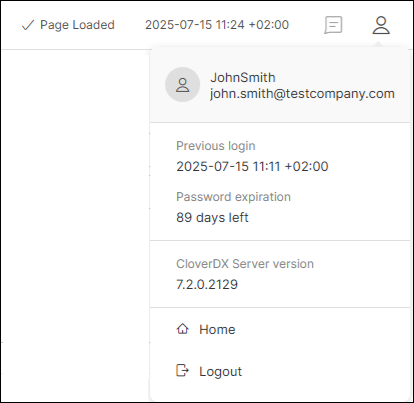
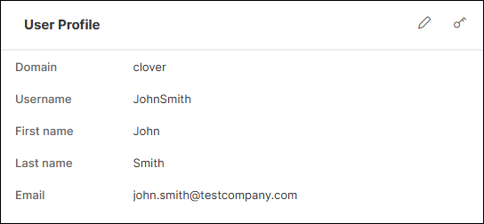
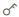
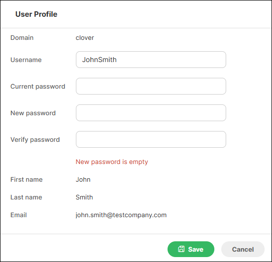

<!-- Administration > Configuration > Server configuration > User management and access control > User profile -->

#### User profile

You can get to your user profile by hovering over the profile icon in the top right corner and clicking on your username.

Users assigned to a [user group](groups.md) that has the [Edit own profile and password](groups.md#permission-edit-own-profile-and-password) permission can edit their profile or change their credentials.

*Figure 91. User profile details*

To update your first name, last name, or email use the  button.

To update your credentials, use the  button. To change your password, you are required to enter your current password. Refer [here](users.md#user-password) for password requirements.

If you want to change your username, you need to set a new password at the same time.
> [!NOTE]
> Users who authenticate using `LDAP` or `SAML` cannot modify their own credentials.

*Figure 92. Change credentials*
