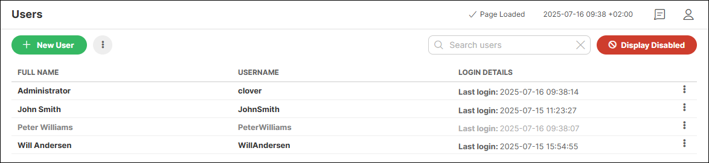
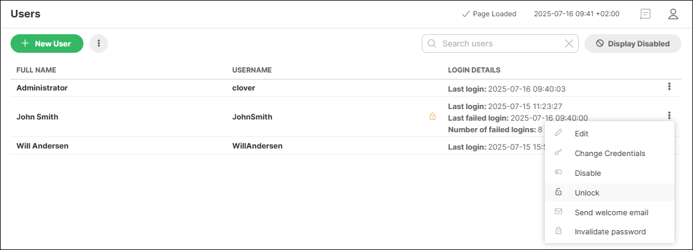
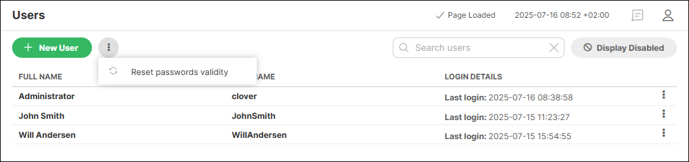
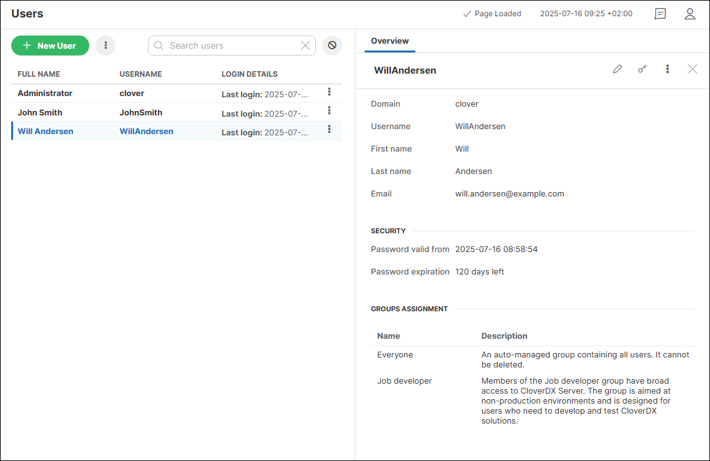

<!-- Administration > Configuration > Server configuration > User management and access control > Users -->

#### Users

In **CloverDX Server** user records can be created or modified in the **Users** section under the **Configuration** menu in the Server Console. The **Users** section is also the core of access control: by assigning users to user groups, administrators can control the level of access the users have. For more information about groups and permissions refer to the **[Groups](groups.md)** chapter.

After default installation with an empty database, the **clover** admin user is created automatically, and is assigned to the internal `clover` domain.

| User name | Password | Note |
| --- | --- | --- |
| clover | clover | Since this user has admin rights, the password should be changed after installation. |

Note that users who should have access to the **Users** section need to be assigned to a user group that has the **List users** permission enabled. Depending on the other user-related rights setup, the **Users** section of the **Configuration** menu allows users to perform the following:

| [Create new user](users.md#create-new-user) |
| --- |
| [Edit user records](users.md#edit-user-records) |
| [Change credentials](users.md#change-credentials) |
| [Disable / enable user](users.md#disable-enable-users) |
| [Unlock user](users.md#unlock-user) |
| [Send welcome email](users.md#send-welcome-email) |
| [Invalidate user’s password](users.md#invalidate-users-password) |
| [Assign users to groups](users.md#assign-users-to-groups) |
| [Reset passwords validity](users.md#reset-passwords-validity) |

##### Create new user

Only users assigned to a user group that has the **Create user** permission enabled can create new users. To create a new user, click on the **New user** button. See below for a list of required and optional user attributes and additional options when creating new user records:

| Attribute | Description | Required |
| --- | --- | --- |
| Username | A common user identifier. Must be unique, should contain only letters and numbers. | Yes |
| Domain | Domain to which the user is assigned. By default, only the internal `clover` domain is available. If [LDAP](ldap-authentication.md) or [SAML](saml-authentication.md)authentication is enabled, `LDAP` and `SAML` domains will be available to be selected. | Yes |
| First name | User’s first name. | No |
| Last name | User’s last name. | No |
| E-mail | Email address which can be used by CloverDX administrator or by CloverDX Server for automatic notifications. See [Send an email](../operations/tasks.md#send-an-email) for details. | No |
| Send welcome email | Sends an email to the newly created user. When SMTP is configured under Configuration > Setup > Email, this option will be turned on by default. If SMTP is not configured, this option will not be available. | No |
| Password | The configured [password policy](user-password-policy.md) is enforced when creating a password.  Passwords are stored in an encrypted form for security reasons, which means that they cannot be retrieved from the system database. If a user forgets their password, it needs to be changed by a user who has the appropriate permissions to perform this action. See the [Change credentials](users.md#change-credentials) section for more information. | Yes |
| Verify password | Verify the entered password. | Yes |
| Require password change | If selected, the newly created user must change their password at the next sign-in. This option is turned on by default. | No |

##### Edit user records

Only users assigned to a user group that has the **Edit user** permission enabled can edit any existing user record. Users with only the **Edit own profile and password** permission can edit just their own user records.

To edit a user record either click on the **⋮** button at the end of the user record that needs to be edited and select the **Edit** option or click on the user record to display the **Overview** tab and click on the **Edit** icon there.

The following can be changed when using the Edit option:

- Domain
- First name
- Last name
- Email address

##### Change credentials

Only users assigned to a user group that has the **Change passwords** permission enabled can perform this action for any user record. Users with only the **Edit own profile and password** permission can change their credentials in their [user profile](user-profile.md).
> [!NOTE]
> Credentials can only be modified for users associated with the `clover` domain. Users with the `LDAP` or `SAML` authentication have this option disabled.

To change credentials of a user either click on the **⋮** button at the end of the user record and select the **Change credentials** option or click on the user record to display the **Overview** tab and click on the **Change credentials** icon there.

The following can be changed when using the **Change credentials** option:

- Username
- Password

Note that when changing a username, a new password must be entered at the same time.
> [!NOTE]
> Changing a user’s credentials will automatically log out the affected user from all their active sessions and force them to log in again.

##### Disable / enable users

Since user records have various relations to the logs and history records, users cannot be deleted but can be disabled. This means that their user record will not be displayed in the list of users by default, and they will not be able to log in. Only users assigned to a user group that has the **Delete user** permission enabled can disable and enable users.

To disable or enable a user either click on the **⋮** button at the end of the user record and select the **Disable** (for enabled users) or **Enable** (for disabled users) option or click on the user record to display the **Overview** tab, then click on the **⋮** button there and select the **Disable** or **Enable** option there. Disabled users are automatically logged out from all their active sessions.

To display disabled users in the list of users, click on the **Display Disabled** button in the right upper corner of the **Users** section. Disabled users come up in grey font in the user list.

*Figure 87. Displaying disabled users*

##### Unlock user

To protect against brute force attacks on users' credentials, **CloverDX Server** enforces a policy that will lock users after a certain number of failed login attempts. To learn more about this feature and how to update its default configuration, refer to the [User lockout configuration](user-lockout.md) section.

Once a user’s account is locked, you will see a little yellow lock icon next to their username in the user list, and you will also see the number of failed login attempts and the last failed attempt.

To unlock a locked user, click on the **⋮** button in the respective row, click on **Unlock** and confirm your action.

*Figure 88. Unlocking a locked user*

##### Send welcome email

Welcome emails can be sent automatically during user creation if SMTP connection is set up under Configuration > Setup > Email. For existing user records, welcome email can be sent manually by clicking on the **⋮** button at the end of the user record and selecting the **Send welcome email** option.

##### Invalidate user’s password

This option will invalidate a user’s current password after logging in and force them to change it. To invalidate a user’s current password, click on the **⋮** button at the end of the user record and select the **Invalidate password** option.
> [!NOTE]
> Invalidating a user’s password will automatically log out the affected user from all their active sessions and force them to log in again.

##### Assign users to groups

Assignment to User groups gives users appropriate permissions. Only users assigned to a user group that has the **Assign groups** permission enabled can access this form and assign users to user groups. To learn more about groups and permissions, see [Groups](groups.md). Note that if your Server environment is configured to use [LDAP for user authentication and user synchronization](ldap-authentication.md), assignment to groups is controlled by the LDAP server and it cannot be overriden manually.
> [!NOTE]
> Any change in user assignment to groups will automatically log out the affected users from all their active sessions and force them to log in again.

##### Reset passwords validity

If your [password policy](user-password-policy.md) is configured to enforce password validity, users with the [Change passwords permission](groups.md#permission-change-password) can reset the password age globally for all users at once. This will extend the validity of each user’s current password by the number of days specified in the [`password.policy.max_age`](list-of-properties.md#lop-security-password-policy-max-age) property.

*Figure 89. Reset passwords validity option*

You can see the current password validity in the **Security** section of a user’s detail. Each user can see their password validity in their [user menu](user-profile.md).

*Figure 90. User detail showing password validity*
