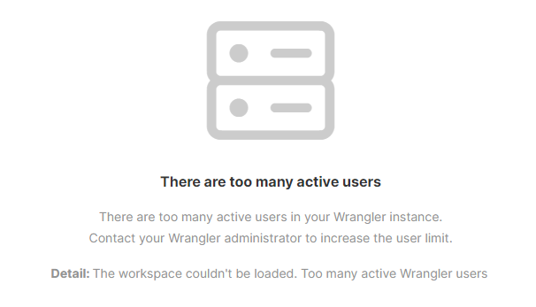
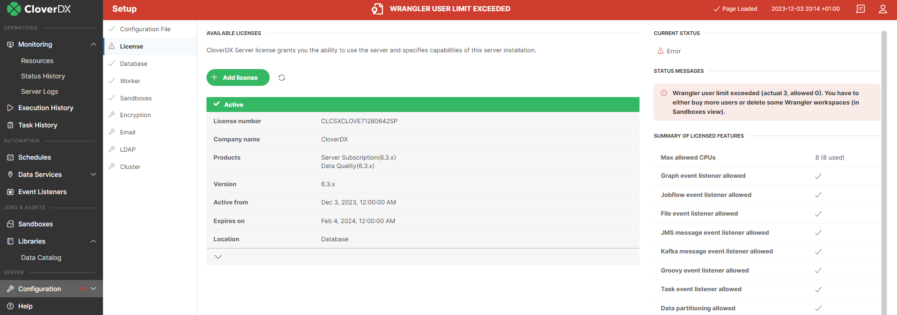
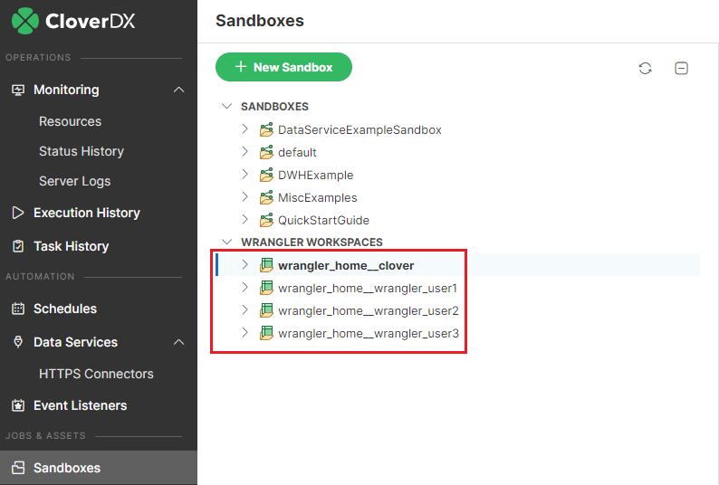

<!-- Administration > Wrangler and Data Manager administration > Wrangler administration -->

## 10. Wrangler administration

The [Wrangler app](../user/wrangler-index.md) is accessible on every running **CloverDX Server** instance at the following URL: `http://[host]:[port]/clover/wrangler`. It can also be easily accessed from the Server’s login page by clicking on the **Business Tools** button and then selecting **Wrangler** from the apps listed on the screen (note that the app may be hidden if the logged-in user does not have permissions to work with Wrangler).

### Wrangler users

To access and use the **Wrangler app**, users must have permissions *Access to Wrangler app* and *Create sandbox*. It is recommended to use the pre-configured user group called `Wrangler`, which already contains all the necessary permissions. See [User groups](groups.md) for more information.

### Wrangler workspaces

**Wrangler workspace** is a special type of sandbox used to store everything related to Wrangler.

Every Wrangler user has their own workspace automatically created when they log into the Wrangler app for the first time. This workspace is private for each Wrangler user and other users cannot get access to it via Wrangler app (but users who can login to the Server Console can see other Wrangler workspaces if they have *Sandboxes - unlimited* permission).

The name of the sandbox which stores the automatically created private workspace for given user is `wrangler_home__[username]` (e.g., `wrangler_home\__clover`).

Additional workspace - called **Shared workspace** - is created automatically on the Server as well. This workspace can be accessed by Wrangler users who are either Wrangler workspace administrators or who have been given access to this workspace by Wrangler workspace administrator. This workspace is stored in sandbox called `wrangler_shared_home`.

Each Wrangler workspace contains the input files users uploaded into Wrangler app, all jobs, sources, targets, and all the output data of the executed Wrangler jobs.

Administrators can manage the Wrangler workspace content in the [Sandboxes module](../operations/sandboxes.md) in the Server Console.

The storage for Wrangler workspaces is by default the directory containing shared Server sandboxes, but the directory can be changed by using the `workspaces.home` server property. See [workspaces.home](list-of-properties.md#lop-workspaces-home) for more information.

### Wrangler permissions

Permissions for Wrangler users are defined in two different places:

- Each Wrangler user must have *Access to Wrangler app* permission to be able to login to the Wrangler app. This is defined in [Groups](groups.md) module.
- Once the user is logged into Wrangler app, their permissions are driven by Wrangler workspace permissions.
  - Each user always has access to their private workspace. This access cannot be removed via Wrangler app. Private workspace also cannot be shared with other users - it is always accessible by its owner only.
  - Users may also have access **to Shared workspace** in Wrangler. This access must be explicitly granted to each user by Wrangler workspace administrator (i.e., a user who has *Wrangler workspace administrator* permission in [Groups](groups.md) module). There are two levels of access to shared workspace - **Viewer** (read-only access) and **Editor** (read-write access). Read more about these permissions in [Workspace permissions](../user/wrangler-workspaces.md#workspace-permissions).

### Wrangler jobs

The jobs users create in Wrangler are called **Wrangler jobs**. They are saved in the **Wrangler workspaces** and can be executed by users.

All executed Wrangler jobs can be viewed similarly to other Server jobs via [Execution history](../operations/execution-history-main.md).

Every execution of a Wrangler job is backed by a generated subgraph which implements all sources, steps, and targets of the job. The jobs themselves do not have any tracking, but the underlying subgraphs track record numbers and other statistics like any other subgraphs.

The jobs are always executed on [Worker](architecture.md#cloverdx-worker), and they are queued in the [Job queue](../operations/job-queue.md) when the load is high.

### Licensing: number of allowed Wrangler seats

The number of available Wrangler seats is specified in the **CloverDX Server** license. The Server counts the number of used Wrangler seats as the number of currently existing private [Wrangler workspaces](wrangler-administration.md#workspaces). To see how many Wrangler seats your license allows and how many are currently used, see [license detail](setup.md#license).

If a new Wrangler user logs in for the first time and there are no available seats, the following warning will appear, and the user will not be able to create any Wrangler jobs.

*Figure 142. Warning message for Wrangler users when too many seats are used.*

If you are interested in purchasing Wrangler seats reach out to your Account Manager or email *[sales@cloverdx.com](mailto:sales@cloverdx.com)*.

### Wrangler user limit exceeded

When the number of existing Wrangler workspaces exceeds the number of available Wrangler seats (e.g., when you load a new Server license with fewer seats, or your Wrangler license expires), a notification appears in the header of the Server Console. If you click on the message in the header, you will be redirected to the **License** section under **Configuration** > **Setup**, where you can see the number of available and used seats.

If there are more used seats than the license allows, users can still log in but no Wrangler jobs can be executed, and users in the Wrangler app cannot see data previews of their jobs.

### Decreasing number of used seats

To decrease the number of used seats to the number of available seats [delete](../operations/sandboxes.md#delete-sandbox) some of the existing Wrangler workspaces (i.e., sandboxes beginning with `wrangler_home__`). At the same time you should make sure to modify user permissions so only users who need access to Wrangler have it so that extra users do not create additional Wrangler workspaces when they login.
> [!WARNING]
> Before deleting a workspace please bear in mind that all the user’s created transformations and sources will be permanently deleted.

### Disabling Wrangler

**CloverDX Wrangler** is an integral part of **CloverDX Server** and as such cannot be disabled. However, you can prevent users from logging in and taking up a seat by removing the [Access to Wrangler app](groups.md#permission-access-wrangler) permission from some or all [user groups](groups.md). By default, this option is enabled only for the *Administrator* and *Wrangler* user groups.
