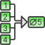
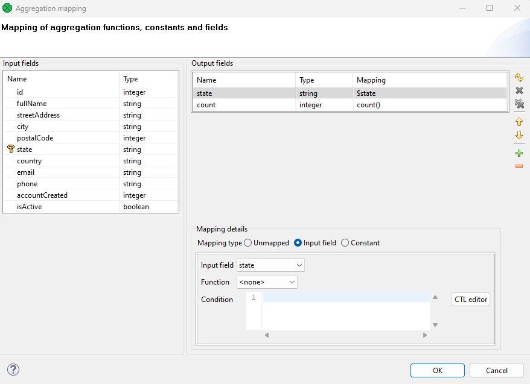
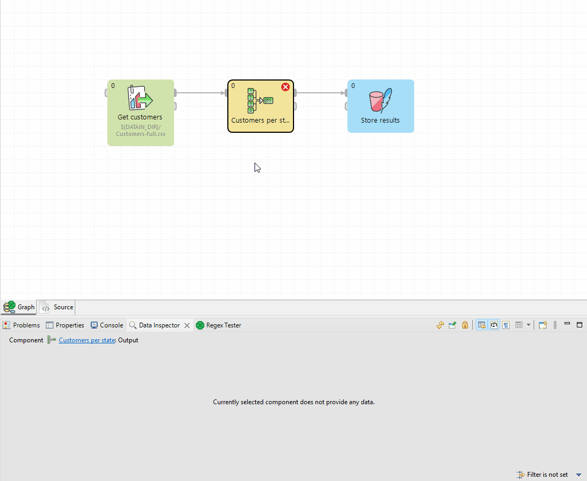
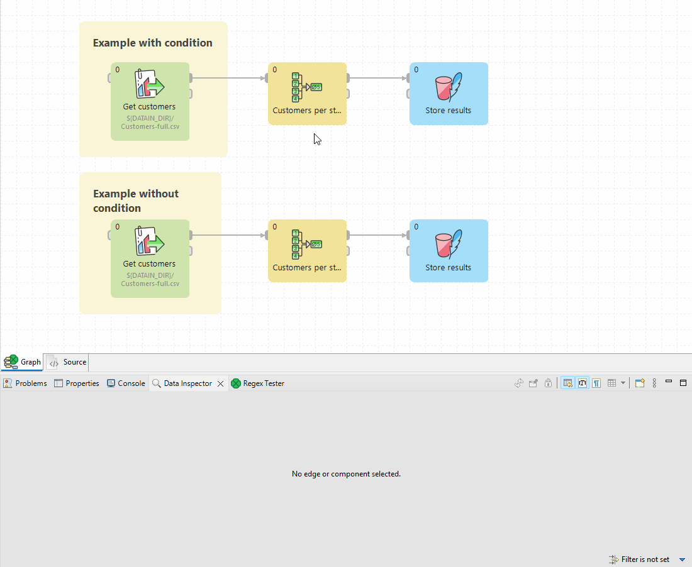
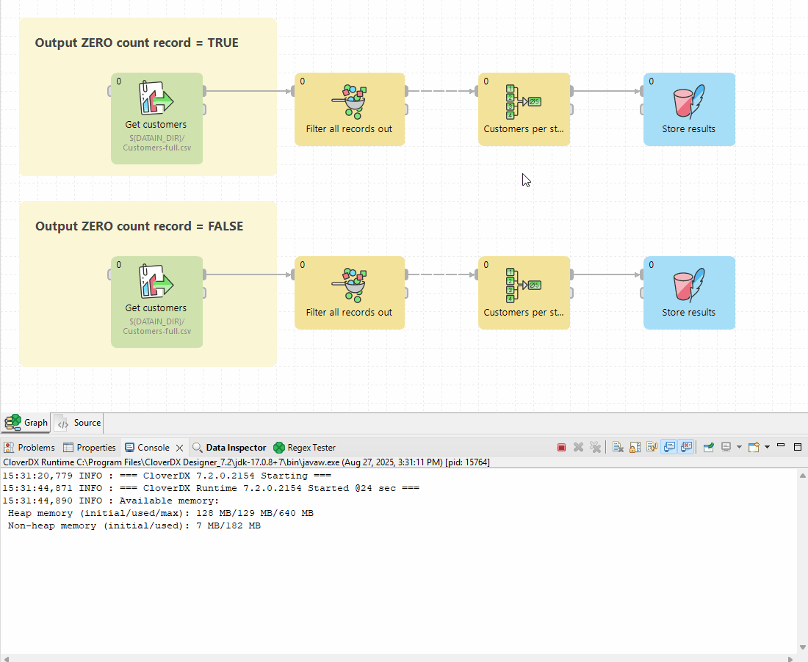

<!-- Development > Component reference > Transformers > Aggregate -->

### Aggregate

| [Short description](aggregate.md#short-description) |
| --- |
| [Ports](aggregate.md#ports) |
| [Metadata](aggregate.md#metadata) |
| [Aggregate attributes](aggregate.md#aggregate-attributes) |
| [Details](aggregate.md#details) |
| [Examples](aggregate.md#examples) |
| [See also](aggregate.md#see-also) |

#### Short description

**Aggregate** computes statistical information about input data records.

| Same input metadata | Sorted inputs | Inputs | Outputs | Java | CTL | Auto-propagated metadata |
| --- | --- | --- | --- | --- | --- | --- |
| - | **⨯** | 1 | 1-n | **⨯** | **⨯** | **⨯** |

#### Ports

| Port type | Number | Required | Description | Metadata |
| --- | --- | --- | --- | --- |
| Input | 0 | **✓** | For input data records | Any1 |
| Output | 0-n | **✓** | For statistical information | Any2 |

This component has one input port and one or more output ports.

#### Metadata

**Aggregate** does not propagate metadata.

**Aggregate** has no metadata template.

Metadata on the output ports must be same.

#### Aggregate attributes

| Attribute | Req | Description | Possible values |
| --- | --- | --- | --- |
| Basic |  |  |  |
| Aggregate key |  | A key according to which records are grouped. For more information, see [Group key](components.md#group-key). | E.g. `first_name` |
| Aggregation mapping |  | Define how data from input fields is transformed and assigned to output fields. Each mapping applies to a single output field. Mappings are separated by semicolons (;). You can create mappings visually using the editor accessible by clicking the **…​** button at the end of the field. Visual mapping is transformed into a mapping string in this field. Mapping can have the following form:  - `$outputField:=somefunction($inputField)`. - `$outputField:=$inputField`   - this must be a field name from the **Aggregate key**   - you can optionally specify a condition to apply the aggregation function to specific data only. - `$outputField:=constant`  The semicolon after the last mapping is optional and may be omitted.  See [Example 1 - simple count function](aggregate.md#example-1-simple-count-function) and [Example 2 - count function with condition](aggregate.md#example-2-count-function-with-condition) for examples of mapping. |  |
| Charset |  | Encoding of incoming data records. | UTF-8 \| other encoding |
| Sorted input |  | By default, input data records are supposed to be sorted according to the **Aggregate key**. If they are not sorted as specified, switch this value to `false`. | true (default) \| false |
| Equal NULL |  | By default, records with null values are considered to be different. If set to `true`, records with null values are considered to be equal. | false (default) \| true |
| Output ZERO count record |  | Determines how the aggregation handles the absence of data for a specific Aggregate key. If set to `true,` one record with 0 count is output. When set to `false,` no record is generated. See [Example 3 - Output ZERO count comparison](aggregate.md#example-3-output-zero-count-comparison) for more information. | false (default) \| true |
| Deprecated |  |  |  |
| Old aggregation mapping |  | A mapping that was used in older versions of **CloverDX**, its use is **deprecated** now. |  |

#### Details

**Aggregate** receives data records through a single input port, computes statistical information about input data records and sends them to all output ports.

##### Aggregation mapping

Aggregate mapping requires metadata on input and output edges of the component. You must assign metadata to the component input and output before you can create the transformation.

Define **Aggregate key**. The key field is necessary for grouping. When left empty, all records are treated as belonging to a single group.

Click the **…​** button at the end of the **Aggregation mapping** row to open the **Aggregation mapping** dialog. In it, you can define both the mapping and aggregation.

*Figure 407. Aggregation mapping editor*

The dialog consists of two panes. You can see the **Input fields** pane on the left and the **Ouput fields** pane on the right.

###### Aggregate field mapping

Each **Aggregate key** field can be mapped to an output field by performing one of the following steps:

1. *Auto Mapping*: Use if the input and output field names are identical.
2. *Drag and Drop*: Drag an input field and drop it onto the desired output field.
3. *Manual mapping*: Click on an output field, change the "Mapping Type" to "Input Field," and choose the desired input field from the list.

After successful mapping, the selected input field appears in the **Mapping** column. It is not possible to apply conditions to mapped fields without an assigned function.

See [Example 1 - simple count function](aggregate.md#example-1-simple-count-function) for example usage.

###### Aggregation functions

Fields that are not part of **Aggregate key** can still be used in aggregate functions, with the result of these functions being included in the output.

- To define a function for a field (either contained in the key or not):
  1. Click on the desired output field row.
  2. Switch the *Mapping type* to "Input field".
  3. Select the desired function from the list. The selected function then appears in the **Mapping** column.
- Note that the function `count()` does not require any input fields, as it operates without parameters.
- You can also add conditions to apply your aggregate functions only to certain records. See [Example 2 - count function with condition](aggregate.md#example-2-count-function-with-condition) for example usage.

###### Constant mapping

For each output field, a constant may be assigned to it. To assign a constant, perform the following:

- Click on the output field row, switch the *Mapping type* to "Constant" and type in your constant. The constant then appears in the **Mapping** column.

##### Aggregate functions

| Function name | Description | Input data type | Output data type | Input can be list |
| --- | --- | --- | --- | --- |
| avg | Returns an average value of numbers. Null values are ignored. If all aggregated values are null, returns null. | numeric data type | numeric data type | no |
| count | Count records, null values are counted as well as other values. | - | numeric data type | yes |
| countnotnull | Counts records, if the field contains null, it is not counted in. | any | numeric data type | yes |
| countunique | Counts unique values. `null` is unique value. The function assumes 1, 2, 2, 2, null, 1, null as 3 unique values. | any | numeric data type | yes |
| crc32 | Calculates crc32 checksum. Crc of null is null. | any | long | no |
| first | Returns the first value of group. If the first value is null, returns null. | any | any | yes |
| firstnotnull | Returns the first value, which is not null. If all received values were null, returns null. | any | any | yes |
| last | Returns the last value of the group. If last value is null, returns null. | any | any | yes |
| lastnotnull | Returns the last not-null value. If all values are null, returns null. | any | any | yes |
| max | Returns the maximum value. If all values are null, returns `null`. | numeric data type | numeric data type | yes |
| md5 | If a group contains one record, returns base64-encoded md5 checksum. If a group contains more records, the particular input records are concatenated together before the calculation of md5 checksum.  If an input is string, it is converted to sequence of bytes using encoding set up in the component first. If an input is integer or long, it is printed to the string first. If an input is null, returns null. Use md5sum instead of md5. | any | string | no |
| md5sum | If a group contains one record, returns md5sum of the field. If a group contains more records, the field values are concatenated first. If an input is null, returns null. | byte | string | no |
| median | Returns median value. Null values are not counted in. If all input values are null, returns null. | numeric data type | numeric data type | no |
| min | Returns minimum value. If all input values are null, returns null. | numeric data type | numeric data type | yes |
| modus | Returns the most frequently used value (null values are not counted in). If there are more candidates, the first one is returned. If all input values are null, returns null. | any | any | yes |
| sha1sum | If a group contains one record, returns sha1sum of the field. If a group contains more records, the field values are concatenated first. If an input field is null, returns null. | byte | string | no |
| sha256sum | If an input group contains one record, returns sha256sum of the field. If a group contains more records, the field values are concatenated first. If all input values are null, returns null. | byte | string | no |
| stddev | Returns a standard deviation. Null values are not counted in. If all input values are null, returns null. | numeric data type | numeric data type | no |
| sum | Returns sum of input values. If all input values are null, returns null. | numeric data type | numeric data type | no |

You can calculate md5sum, sha1sum and sha256sum checksums incrementally: the group of records corresponds to the whole file whereas particular records contain blocks of the file.

For example, there are 3 records grouped together by a value in the field `f1`. The field `f2` contains particular blocks: `a`, `b` and `c` (as bytes). Each value is in the different record. The sha1sum applied on field `f2` returns `sha1sum("abc")`.

#### Examples

##### Example 1 - simple count function

We have a customer file containing address information. We want to determine the number of customers in each state. The output will have two fields:

- `state` (string): Represents the customer’s state
- `count` (integer): Represents the number of customers in that state

###### Aggregate component configuration:

1. **Aggregate key**: select the `state` field.
2. **Aggregation mapping**:
   - There are three ways to map the state input field to the state output field:
     1. *Auto Mapping*: Can be used here as the input and output field names are identical.
     2. *Drag and Drop*: Drag the `state` input field and drop it onto the `state` output field.
     3. *Manual mapping*: Click on the `state` output field, change the "Mapping Type" to "Input Field," and choose the `state` input field from the list.
3. If you used options a. or b. above, click on the `count` output field record and switch the *Mapping type* to "Input field".
4. From the *Function* dropdown menu, select `count`.
5. If your input is not sorted by state, make sure to change the `Sorted input` value to `False`.

##### Example 2 - count function with condition

Building on Example 1, let’s modify it to count only active customers (customers where the `isActive` flag is `true`).

###### Aggregate component configuration

1. Edit **Aggregation mapping**.
2. Click on the `count` output field.
3. Add condition for active customers:
   1. In the *Condition* field, enter your filtering criteria. Here, we want to count only active customers, so the condition is: `isActive = true`.
   2. After specifying the condition, an icon will appear in the mapping field, indicating that there is an active filter.

##### Example 3 - Output ZERO count comparison

This example clarifies the behavior of the **Output ZERO count record** setting when there are no incoming records for aggregation:

- When the value is set to `true`, 1 record with 0 count is output
- When the value is set to `false`, no record is output.

#### See also

| [Common properties of components](components.md#common-properties-of-components) |
| --- |
| [Specific attribute types](components.md#specific-attribute-types) |
| [Common properties of Transformers](common-of-transformers.md) |
| [Transformers comparison](common-of-transformers.md#transformers-comparison) |
