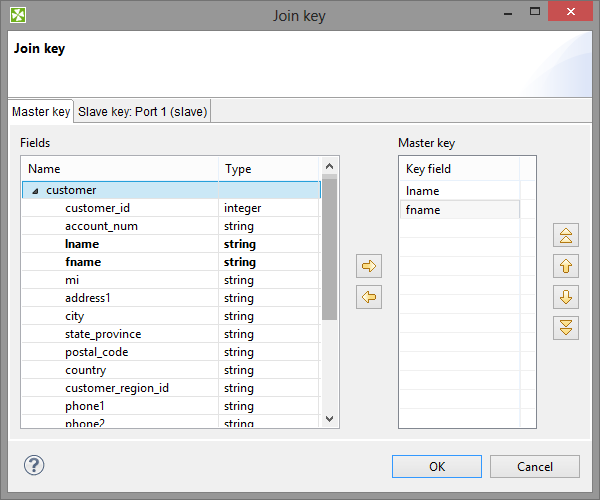
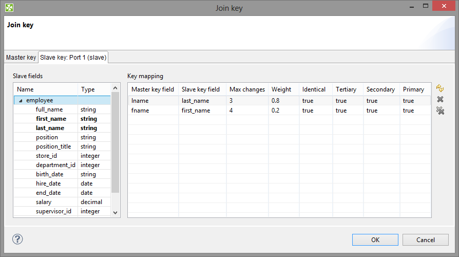
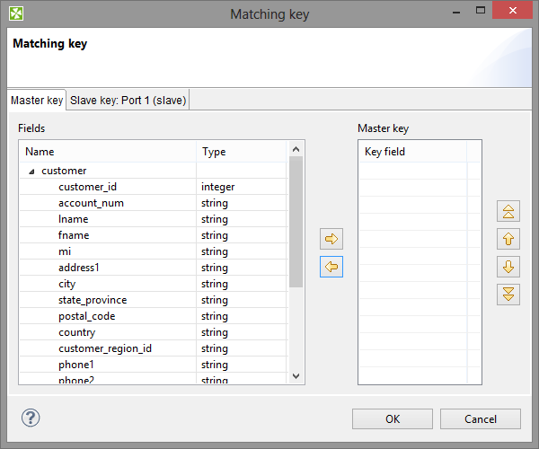
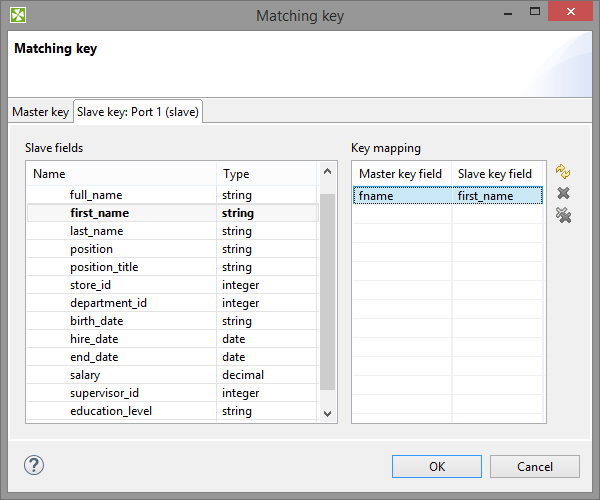
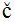
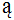

<!-- Development > Component reference > Deprecated > ApproximativeJoin -->

### ApproximativeJoin

Deprecated Component


| [Short description](aproxmergejoin.md#short-description) |
| --- |
| [Ports](aproxmergejoin.md#ports) |
| [Metadata](aproxmergejoin.md#metadata) |
| [ApproximativeJoin attributes](aproxmergejoin.md#approximativejoin-attributes) |
| [Details](aproxmergejoin.md#details) |
| [Best practices](aproxmergejoin.md#best-practices) |
| [Compatibility](aproxmergejoin.md#compatibility) |
| [See also](aproxmergejoin.md#see-also) |

#### Short description

**ApproximativeJoin** merges sorted data from two data sources on a common matching key. Afterwards, it distributes records to the output based on a user-specified **Conformity limit**.

| Same input metadata | Sorted inputs | Slave inputs | Outputs | Output for drivers without slave | Output for slaves without driver | Joining based on equality | Auto-propagated metadata |
| --- | --- | --- | --- | --- | --- | --- | --- |
| **⨯** | **✓** | 1 | 2-4 | **✓** | **✓** | **✓** | **✓** |

#### Ports

ApproximativeJoin receives data through two input ports, each of which may have a different metadata structure.

A conformity is then computed for matched data records. The records with greater conformity are sent to the first output port. Those with lesser conformity are sent to the second output port. The third output port can optionally be used to capture unmatched master records. The fourth output port can optionally be used to capture unmatched slave records.

| Port type | Number | Required | Description | Metadata |
| --- | --- | --- | --- | --- |
| Input | 0 | **✓** | Master input port | Any |
| 1 | **✓** | Slave input port | Any |  |
| Output | 0 | **✓** | The output port for joined data with greater conformity. | Any, optionally including additional fields: `_total_conformity_` and `_keyName_conformity_`. See [Metadata](aproxmergejoin.md#metadata). |
| 1 | **✓** | The output port for joined data with smaller conformity. | Any, optionally including additional fields: `_total_conformity_` and `_keyName_conformity_`. See [Metadata](aproxmergejoin.md#metadata). |  |
| 2 | **⨯** | The optional output port for master data records without slave matches. | Input 0 |  |
| 3 | **⨯** | The optional output port for slave data records without master matches. | Input 1 |  |

#### Metadata

**ApproximativeJoin** propagates metadata from the first input port to the third output port (from left to right) and from the second input port to the fourth output port (from left to right).

##### Additional fields

Metadata on the first and second output ports can contain additional fields of numeric data type. Their names must be the following: `"total_conformity"` and some number of `"keyName_conformity"` fields.

In the last field names, you must use the field names of the **Join key** attribute as the `keyName` in these additional field names. To these additional fields, the values of computed conformity (total or that for `keyName`) will be written.

#### ApproximativeJoin attributes

| Attribute | Req | Description | Possible values |
| --- | --- | --- | --- |
| Basic |  |  |  |
| Join key | yes | A key according to which the incoming data flows with the same value of **Matching key** are compared and distributed between the first and the second output port. Depending on the specified **Conformity limit**. See [Join key](aproxmergejoin.md#join-key). |  |
| Matching key | yes | This key serves to match master and slave records. See [Matching key](aproxmergejoin.md#matching-key). |  |
| Transform | [[1]](aproxmergejoin.md#approxmergejoin-fn01) | A transformation in CTL or Java defined in a graph for records with greater conformity. |  |
| Transform URL | [[1]](aproxmergejoin.md#approxmergejoin-fn01) | An external file defining a transformation in CTL or Java for records with greater conformity. |  |
| Transform class | [[1]](aproxmergejoin.md#approxmergejoin-fn01) | An external transformation class for records with greater conformity. |  |
| Transform for suspicious | [[2]](aproxmergejoin.md#approxmergejoin-fn02) | A transformation in CTL or Java defined in a graph for records with lesser conformity. |  |
| Transform URL for suspicious | [[2]](aproxmergejoin.md#approxmergejoin-fn02) | An external file defining a transformation in CTL or Java for records with lesser conformity. |  |
| Transform class for suspicious | [[2]](aproxmergejoin.md#approxmergejoin-fn02) | An external transformation class for records with lesser conformity. |  |
| Conformity limit (0,1) |  | This attribute defines the limit of conformity for pairs of records. To the records with conformity higher than this value, the transformation is applied. To those with conformity lesser than this value, the transformation for suspicious is applied. See [Conformity limit](aproxmergejoin.md#conformity-limit) | 0.75 (default) \| between 0 and 1 |
| Transform source charset |  | Encoding of an external file defining the transformation.  The default encoding depends on DEFAULT_SOURCE_CODE_CHARSET in defaultProperties. | E.g. UTF-8 |
| Deprecated |  |  |  |
| Locale |  | Locale to be used when internationalization is used. |  |
| Case sensitive |  | If set to `true`, upper and lower cases of characters are considered different. By default, they are processed as if they were equal to each other. | false (default) \| true |
| Error actions |  | The definition of an action that should be performed when the specified transformation returns some **Error code**. See [Return values of transformations](transformations.md#return-values-of-transformations). |  |
| Error log |  | The URL of a file to which error messages for specified **Error actions** should be written. If not set, they are written to **Console**. |  |
| Slave override key |  | In previous versions of **CloverDX**, a slave part of **Join key**. **Join key** was defined as a sequence of individual expressions consisting of master field names each followed by parentheses containing the 6 parameters mentioned below. These individual expressions were separated by a semicolon. The **Slave override key** was a sequence of slave counterparts of the master **Join key** fields. Thus, in the case mentioned above, **Slave override key** would be `fname;lname`, whereas **Join key** would be `first_name(3 0.8 true false false false);last_name(4 0.2 true false false false)`. |  |
| Slave override matching key |  | In previous versions of **CloverDX**, a slave part of **Matching key**. **Matching key** was defined as a master field name. Slave override matching key was its slave counterpart. Thus, in the case mentioned above (`$masterField=$slaveField`), **Slave override matching key** would be this `slaveField` only. And **Matching key** would be this `masterField`. |  |

| 1 |  One of these must be set. These transformation attributes must be specified. Any of these transformation attributes must use a common CTL template for **Joiners** or implement a `RecordTransform` interface. |
| --- | --- |

| 2 |  One of these must be set. These transformation attributes must be specified. Any of these transformation attributes must use a common CTL template for **Joiners** or implement a `RecordTransform` interface. |
| --- | --- |

For more information, see [CTL scripting specifics](aproxmergejoin.md#ctl-scripting-specifics) or [Java interfaces](aproxmergejoin.md#java-interfaces).

For detailed information about transformations, see also [Defining transformations](transformations.md#defining-transformations).

#### Details

**ApproximativeJoin** is a fuzzy joiner that is usually used in special situations. It requires the input to be sorted and is very fast as it processes data in the memory. However, it should be avoided in the case of large inputs as its memory requirements may be proportional to the size of the input.

The data attached to the first input port is called **master** as in the other Joiners. The second input port is called **slave**.

Unlike other joiners, this component uses two keys for joining. First of all, the records are matched in a standard way using **Matching Key**. Each pair of these matched records is then reviewed again and the conformity (similarity) of these two records is computed using **Join key** and a user-defined algorithm. The conformity level is then compared to **Conformity limit** and each record is sent either to the first (greater conformity) or to the second output port (lesser conformity). The rest of the records is sent to the third and fourth output port.

##### Join key

You can define **Join key** with help of the **Join key** wizard. In the wizard, there are two tabs: **Master key** and **Slave key**.


*Figure 450. Join Key Wizard (Master Key Tab)*

In the **Master key** tab, select the driver (master) fields in the **Fields** pane on the left and drag and drop them to the **Master key** pane on the right. (You can also use the arrow buttons.)


*Figure 451. Join Key Wizard (Slave Key Tab)*

In the **Slave key** tab, you can see the **Fields** pane (containing all slave fields) on the left and the **Key mapping** pane on the right.

You must select some of these slave fields and drag and drop them to the **Slave key field** column at the right from the **Master key field** column (containing the master fields selected in the **Master key** tab in the first step). In addition to these two columns, there are other six columns that should be defined: Maximum changes, Weight and the last four representing strength of comparison.

###### Maximum Changes

The `maximum changes` property contains the integer number that is equal to the number of letters that should be changed so as to convert one data value to another value. The `maximum changes` property serves to compute the conformity. The conformity between two strings is 0, if more letters must be changed so as to convert one string to the other.

###### Weight

The `weight` property defines the weight of the field in computing the similarity. Weight of each field difference is computed as a quotient of the weight defined by the user and the sum of the weights defined by the user.

###### Strength of Comparison

The strength of comparison can be identical, tertiary, secondary or primary.
identical
Only identical letters are considered equal.
tertiary
Upper and lower case letters are considered equal.
secondary
Diacritic letters and their Latin equivalents are considered equal.
primary
Letters with additional features such as a peduncle, pink, ring and their Latin equivalents are considered equal.

In the wizard, you can change any boolean value of these columns by clicking. This switches `true` to `false` and vice versa. You can also change any numeric value by clicking and typing the desired value.

When you click **OK**, you will obtain a sequence of assignments of driver (master) fields and slave fields preceded by a dollar sign and separated by a semicolon. Each slave field is followed by parentheses containing six mentioned parameters separated by white spaces. The sequence will look like this:

```ctl
$driver_field1=$slave_field1(parameters);...;$driver_fieldN=$slave_fieldN(parameters)
```


*Figure 452. An Example of the Join Key Attribute in ApproximativeJoin Component*
Example 401. Join Key for ApproximativeJoin
`$first_name=$fname(3 0.8 true false false false);$last_name=$lname(4 0.2 true false false false)`. In this **Join key**, `first_name` and `last_name` are fields from the first (master) data flow and `fname` and `lname` are fields from the second (slave) data flow.

##### Matching key

The **Matching key** is defined using the **Matching key** wizard. You only need to select the desired master (driver) field in the **Master key** pane on the left and drag and drop it to the **Master key** pane on the right in the **Master key** tab. (You can also use the provided arrow buttons.)


*Figure 453. Matching Key Wizard (Master Key Tab)*

In the **Slave key** tab, you must select one of the slave fields in the **Fields** pane on the left and drag and drop it to the **Slave key field** column at the right from the **Master key field** column (containing the master field the **Master key** tab) in the **Key mapping** pane.


*Figure 454. Matching Key Wizard (Slave Key Tab)*
Example 402. Matching Key
**Matching key** looks like this:

```ctl
$master_field=$slave_field
```

##### Conformity limit

You have to define the limit of conformity (**Conformity limit (0,1)**). The defined value distributes incoming records according to their conformity. The conformity can be greater or lesser than the specified limit. You have to define transformations for either group. The records with lesser conformity are marked "suspicious" and sent to port 1, while records with higher conformity go to port 0 ("good match").

For better understanding of the conformity calculation, let us try to explain it at least in basic terms. First, groups of records are made based on **Matching key**. Afterwards, all records in a single group are compared to each other according to the **Join Key** specification. The strength of comparison selected in particular **Join key** fields determines what "penalty" characters get (for comparison strength, see [Join key](aproxmergejoin.md#join-key)):

- **Identical** - is a character-by-character comparison. The penalty is given for each different character (similar to `String.equals()`).
- **Tertiary** - ignores differences in lower/upper case (similar to `String.equalsIgnoreCase()`), if it is the only comparison strength activated. If activated together with **Identical**, then a difference in diacritic (e.g. 'c' vs. '') is a full penalty and a difference in case (e.g. 'a' vs. 'A') is half a penalty.
- **Secondary** - a plain letter and its diacritic derivatives for the same language are considered equal. The language used during comparison is taken from the metadata on the field. When no metadata is set on the field, it is treated as `en` and should work identically to **Primary** (i.e. derivatives are treated as equal).
  Example:
  language=`sk`: 'a', 'á', 'ä' are equal because they are all Slovak characters
  language= `sk`: 'a', '' are different because '' is a Polish (and not Slovak) character
- **Primary** - all diacritic-derivatives are considered equal regardless of language settings.
  Example:
  language=any: 'a', 'á', 'ä', '' are equal because they are all derivatives of 'a'

As the final step, the total conformity is calculated as a weighted average of field conformities.

#### CTL scripting specifics

When you define your join attributes, you must specify a transformation that maps fields from input data sources to the output. This can be done using the **Transformations** tab of the **Transform Editor**. However, you may find that you are unable to specify more advanced transformations using this easiest approach. This is when you need to use CTL scripting.

For detailed information about **CloverDX** Transformation Language, see [CTL2 - CloverDX Transformation Language](part6.md).

CTL scripting allows you to specify a custom field mapping using the simple CTL scripting language.

All **Joiners** share the same transformation template which can be found in [CTL templates for Joiners](ctl-templates-for-joiners.md).

#### Java interfaces

If you define your transformation in Java, it must implement the following interface that is common for all **Joiners**:

[Java interfaces for Joiners](java-interfaces-for-joiners.md)

#### Best practices

If you specify the transformation in an external file (with **Transform URL**), we recommend you to explicitly specify **Transform source charset**.

#### Compatibility

| Version | Compatibility Notice |
| --- | --- |
| 4.1.0-M1 | **ApproximativeJoin** was deprecated. |

#### See also

| [Common properties of components](components.md#common-properties-of-components) |
| --- |
| [Specific attribute types](components.md#specific-attribute-types) |
| [Common properties of Joiners](common-of-joiners.md) |
| [Joiners comparison](common-of-joiners.md#joiners-comparison) |
| [Deprecated](deprecated.md) |
