<!-- Development > Job elements > Metadata > Auto-propagated metadata -->

### Auto-propagated metadata

| [Introduction to auto-propagated metadata](auto-detected-metadata.md#introduction-to-auto-propagated-metadata) |
| --- |
| [Sources of auto-propagated metadata](auto-detected-metadata.md#sources-of-auto-propagated-metadata) |
| [Explicitly propagated metadata](auto-detected-metadata.md#explicitly-propagated-metadata) |
| [Priorities of metadata](auto-detected-metadata.md#priorities-of-metadata) |
| [Jobflow](auto-detected-metadata.md#propagation-of-metadata-in-jobflows) |

#### Introduction to auto-propagated metadata

In many cases, **CloverDX** is able to detect metadata on edges automatically via **metadata propagation**. Metadata propagation is a process which propagates metadata through the graph based on a set of rules. The metadata to propagate is taken from sources such as edges with manually assigned metadata and from components that can inject metadata into the graph.

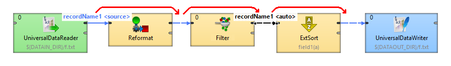
*Figure 216. Metadata propagation: metadata is propagated from the first edge on the left side to all connected edges.*

You do not have to assign metadata manually to each edge in graph as metadata is propagated by default. You can override metadata on edges by manually selecting propagated metadata or by user-defined metadata.

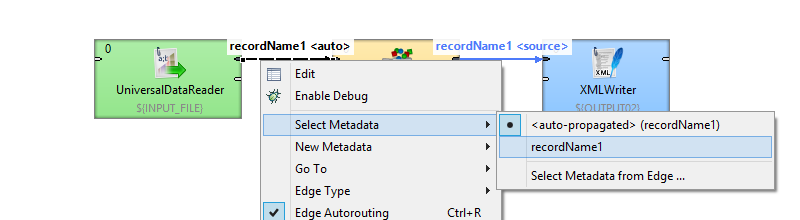
*Figure 217. Changing auto-propagated metadata to user-defined.*

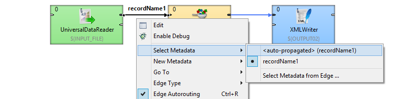
*Figure 218. Changing user-defined metadata to auto-propagated.*

##### Principles of propagation

Metadata propagation depends on a graph layout, priorities of metadata propagation of particular component and manually assigned metadata. Metadata is propagated through directly or indirectly connected components and edges. To propagate metadata to an edge in a separated part of graph, an action from the user is needed.

Components may have different priorities of metadata propagation from both sides or can propagate one way only (e.g. [Map](reformat.md)).

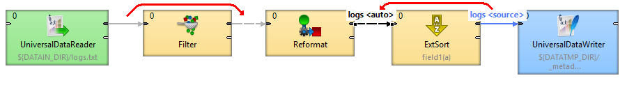
*Figure 219. Different priorities of metadata propagation*

At least some metadata must be known: assigned by the user or propagated from a template on a port of a component.

#### Sources of auto-propagated metadata

| [Component](auto-detected-metadata.md#component) |
| --- |
| [Edge](auto-detected-metadata.md#edge) |

##### Component

Some components have metadata templates assigned to their ports. The metadata from templates propagates from the component to the connected edge.

For example, metadata for error records are auto-propagated on the second output port of **SpreadsheetDataReader**. Another example of a component having metadata assigned on port is **ListFiles**. A Subgraph component can propagate metadata from itself too.

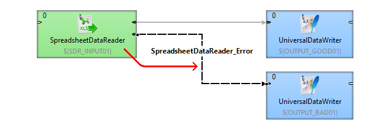
*Figure 220. Metadata propagated from the component*

*Figure 221. Metadata propagated from the component II.*

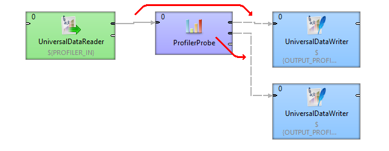
*Figure 222. Metadata propagated from the component, metadata template is defined within the component.*

##### Edge

Some components (e.g. SimpleCopy) propagate metadata from input to output ports. Thus metadata can be auto-propagated on an edge as coming from a different edge, even several components away.

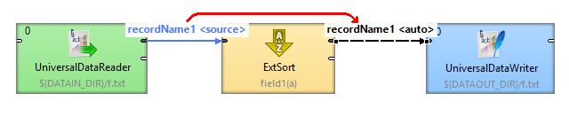
*Figure 223. Metadata propagated from the another edge*

*Figure 224. Metadata propagated from a distant edge*

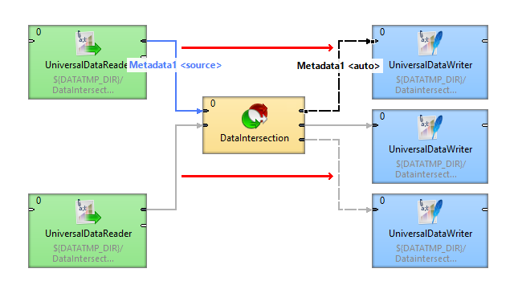
*Figure 225. Advanced metadata propagation - DataIntersection*

Metadata can be propagated from left to right or from right to left. Some components can propagate metadata between ports at the same side of the component using the port on the other side. Components not changing the metadata structure (e.g. Filter, SimpleCopy, etc.) usually propagate metadata from both sides.

The component-specific metadata propagation details can be found in the reference of particular components.

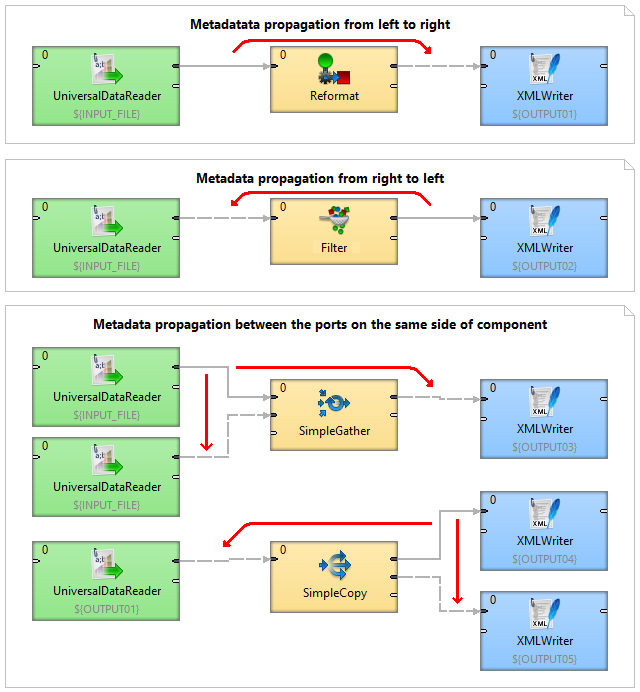
*Figure 226. Overview of directions of metadata propagation*

#### Explicitly propagated metadata

An edge can have explicitly assigned metadata of another edge of the graph. Both edges do not have to be connected through any other components and edges. The user has to define an edge from which the metadata is propagated.

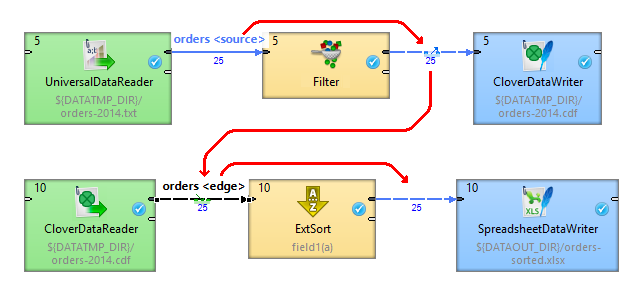
*Figure 227. Metadata propagated from an unconnected distant edge*

Let us explain the figure above: the metadata **orders** assigned to the edge between **FlatFileReader** and **Filter** are propagated through **Filter**.

We need the same metadata to read records using **CloverDataReader** as **CloverDataWriter** uses; therefore, we define that the edge between **CloverDataReader** and **ExtSort** takes metadata (see the green symbol) from the edge (the blue symbol) between **Filter** and **CloverDataWriter**.

##### Assigning explicitly propagated metadata

Right click the edge to which you need to assign metadata and choose **Select metadata** ****Select metadata from Edge**

The message informs you about activation of a selection tool.

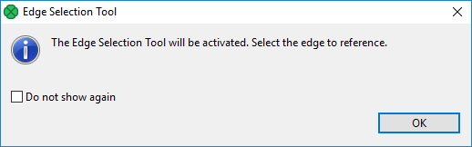

The cursor has changed and the graph editor pane is now transparent.

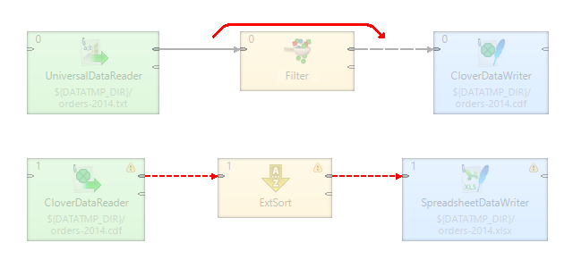

Click the edge you need to take metadata from.

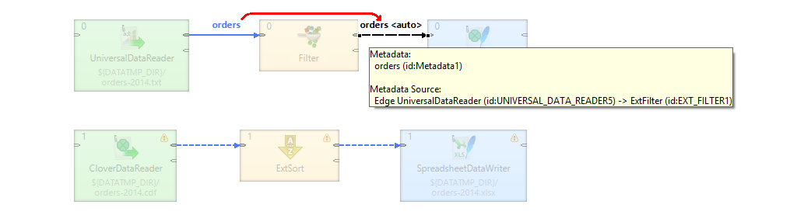

The metadata has been propagated. The blue symbol denotes the source edge of metadata, the green one denotes the target edge.

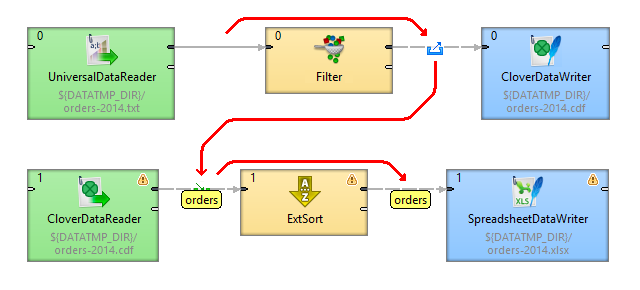

#### Priorities of metadata

**Auto-propagated metadata** has lower priority than explicitly defined metadata. You are free to override metadata assigned to the edge with different metadata. The auto-propagated metadata can be overridden in the same way as assigning new metadata to the edge: either by dragging and dropping from outline or by right clicking on the edge and choosing **Select metadata** or **New metadata**.

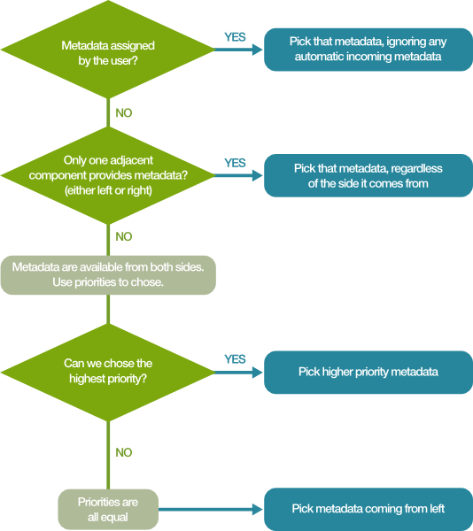

#### Propagation of SQL query metadata

[SQL query metadata](metadata-types.md#sql-query-metadata) can be propagated; however, editing is done in the editor for user defined metadata and any changes must be saved as a new non-SQL query metadata. This limitation also applies to editing SQL query metadata in Transformation editor output (e.g. [Map](reformat.md)).

#### Propagation of metadata in jobflows

**Auto-propagated metadata** work also with jobflow components.

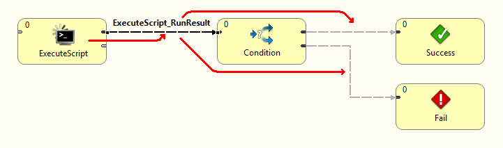
*Figure 228. Metadata propagated from another edge*
> [!NOTE]
> COMPATIBILITY NOTICE
> Auto-propagated metadata is available since version 4.0.0.
>
> To propagate metadata, you must also open the context menu by right-clicking the edge, then selecting the **Propagate metadata** item. The metadata will be propagated until it reaches a component in which metadata can be changed (e.g. **Map**, **Joiners**, etc.).
