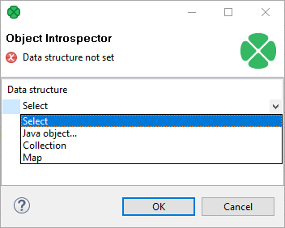
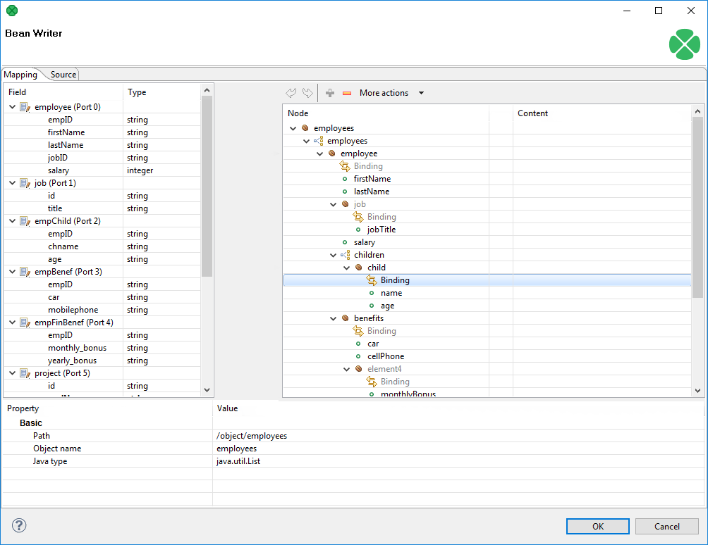
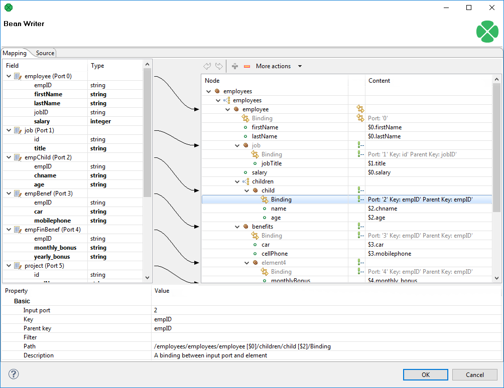

<!-- Development > Component reference > Writers > JavaBeanWriter -->

### JavaBeanWriter

| [Short description](beanwriter.md#short-description) |
| --- |
| [Ports](beanwriter.md#ports) |
| [JavaBeanWriter attributes](beanwriter.md#javabeanwriter-attributes) |
| [Details](beanwriter.md#details) |
| [See also](beanwriter.md#see-also) |

#### Short description

**JavaBeanWriter** writes a hierarchical structure as [JavaBeans](http://en.wikipedia.org/wiki/Java_Bean) into a dictionary. This allows *dynamic* data interchange between **CloverDX** graphs and external environment, such as cloud.

Depending on JavaBean you choose, it defines the output to a certain extent - that is why you map inputs to a pre-set but customizable tree structure. You can write data to Java collections (Lists, Maps), as well. When writing, **JavaBeanWriter** consults your bean’s classpath to decide which data types to write. This means it performs type conversions between your metadata field types and JavaBeans types. If a conversion fails, you will experience errors on writing.

A number of classes is supported for writing.

If you are looking for a more flexible component which is less restrictive in terms of data types and requires no external classpath, choose **JavaMapWriter**.

| Data output | Input ports | Output ports | Each to all outputs | Different to different outputs | Transformation | Transf. req. | Java | CTL | Auto-propagated metadata |
| --- | --- | --- | --- | --- | --- | --- | --- | --- | --- |
| dictionary | 1-n | 0 | **✓** | **⨯** | **⨯** | **⨯** | **⨯** | **⨯** | **⨯** |

#### Ports

| Port type | Number | Required | Description | Metadata |
| --- | --- | --- | --- | --- |
| Input | 0-n | At least one | Input records to be joined and mapped to JavaBeans. | Any (each port can have different metadata) |

#### JavaBeanWriter attributes

| Attribute | Req | Description | Possible values |
| --- | --- | --- | --- |
| Basic |  |  |  |
| Dictionary target | yes | The dictionary you want to write JavaBeans to. | Name of a dictionary you have previously defined. |
| Bean structure |  | Click the **…​** button to design the structure of your output JavaBean consisting of custom classes, objects, collections or maps. | See [Defining Bean structure](beanwriter.md#defining-bean-structure). |
| Mapping | [[1]](beanwriter.md#javabeanwriter-attributes-fn01) | Defines how input data is mapped to output JavaBeans. | See [Mapping Editor](beanwriter.md#mapping-editor). |
| Mapping URL | [[1]](beanwriter.md#javabeanwriter-attributes-fn01) | The external text file containing the mapping definition. |  |
| Advanced |  |  |  |
| Cache size |  | The size of the database used when caching data from ports to elements (the data is first processed then written). The larger your data is, the larger cache is needed to maintain fast processing. | auto (default) \| e.g. 300MB, 1GB etc. |
| Cache in Memory |  | Cache data records in memory instead of disk cache. Note that while it is possible to set a maximal size of the cache for the disk cache, this setting is ignored in case in-memory-cache is used. As a result, an `OutOfMemoryError` may occur when caching too many data records. | true \| false (default) |
| Sorted input |  | Tells JavaBeanWriter whether the input data is sorted. Setting the attribute to `true` declares you want to use the sort order defined in **Sort keys**, see below. | false (default) \| true |
| Sort keys |  | Tells JavaBeanWriter how the input data is sorted, thus enabling streaming. The sort order of fields can be given for each port in a separate tab. Working with **Sort keys** has been described in [Sort key](components.md#sort-key). |  |
| Max number of records |  | The maximum number of records written to the output. See [Selecting output records](selecting-output-records.md). | 0-N |

| 1 |  One of these has to be specified. If both are specified, **Mapping URL** has a higher priority. |
| --- | --- |

#### Details

**JavaBeanWriter** receives data through all connected input ports and converts **CloverDX** records to JavaBean properties based on the mapping you define. Lastly, the resulting tree structure is written to a [dictionary](dictionary.md) (which is the only possible output). **Remember** the component cannot write to a file.

The logic of mapping is similar to [XMLWriter](extxmlwriter.md#details) - if you are familiar with its mapping editor, you will have no problems designing the output tree in this component. The differences are:

- you cannot map an input to output freely - the design of the tree structure you can see in the mapping editor is determined by the JavaBean you are using;
- **JavaBeanWriter** allows you to map to Beans, their properties or collections - Lists, Maps;
- there are no attributes, wildcard attributes and wildcard elements as in XML.

##### Defining Bean structure

Before you can start mapping, you need to define contents of the output JavaBean. Start by editing the **Bean structure** attribute which opens this dialog:

*Figure 389. Defining the Bean structure - click the Select combo box to start*

- **Java object** - clicking it opens a dialog in which you can choose from Java classes. **Important**: if you intend to use a custom JavaBeans class, place it into the `trans` folder. The class will then be available in this dialog.
- **Collection** - adds a list consisting of other objects, maps or other collections.
- **Map** - adds a key-value map.

##### Mapping Editor

Having defined the Bean structure, proceed to mapping input records to output JavaBeans. If you are familiar with [XMLWriter](extxmlwriter.md#details), you will find this process analogous. Mapping editors in both components have similar logic.

The very basics of the mapping are:

- Edit the component’s **Mapping** attribute. This will open the visual mapping editor:

*Figure 390. Mapping editor in JavaBeanWriter after first open.*

Metadata on the input edge(s) are displayed on the left hand side. The right hand pane is where you design the desired output tree - it is pre-defined by your bean’s structure (note: in the example, the bean contains employees and projects they are working on). Mapping is then performed by dragging metadata from left to right (and performing additional tasks described below).

- In the right hand pane, you can map input metadata to:
  - Beans
  - Bean properties
  - Lists
  - Maps
  Click the green '+' sign to **Add entry**. This adds a new item into the tree - its type depends on context (the node you have selected). **Remember** the button is not available every time as the output structure is determined by [bean structure](beanwriter.md#defining-bean-structure).
- Connect input records to output nodes to create [Binding](extxmlwriter.md#creating-the-mapping-mapping-ports-and-fields).
  Example 378. Creating Binding
  
  *Figure 391. Example mapping in JavaBeanWriter*
  In the example above, you can see the employees are joined with projects they work on. Fields in bold (their content) will be printed to the output dictionary, i.e. they are used in the mapping.
- At any time, you can switch to the [Source tab](extxmlwriter.md#creating-the-mapping-source-tab) and write/check the mapping yourself in code.
- If the basic instructions found here are not satisfying, consult XMLWriter’s [Details](extxmlwriter.md#details) where the whole mapping process is described in detail.

#### See also

| [JavaBeanReader](beanreader.md) |
| --- |
| [Common properties of components](components.md#common-properties-of-components) |
| [Specific attribute types](components.md#specific-attribute-types) |
| [Common properties of Writers](common-of-writers.md) |
| [Writers comparison](common-of-writers.md#writers-comparison) |
