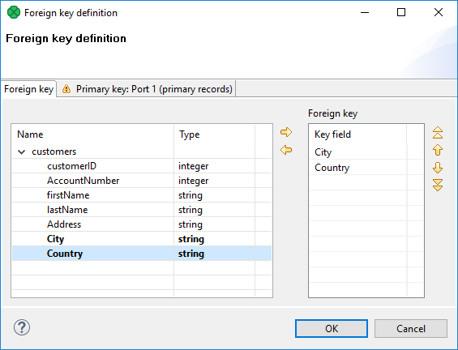
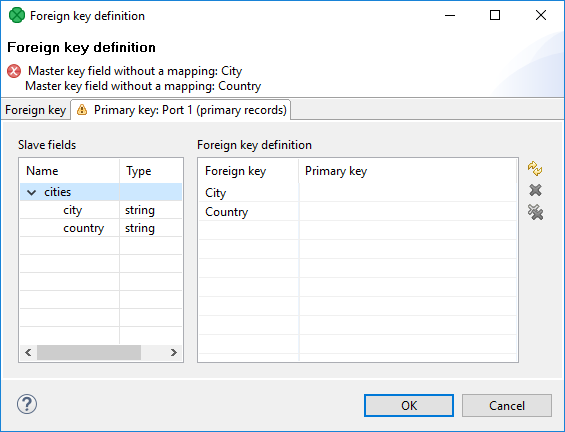
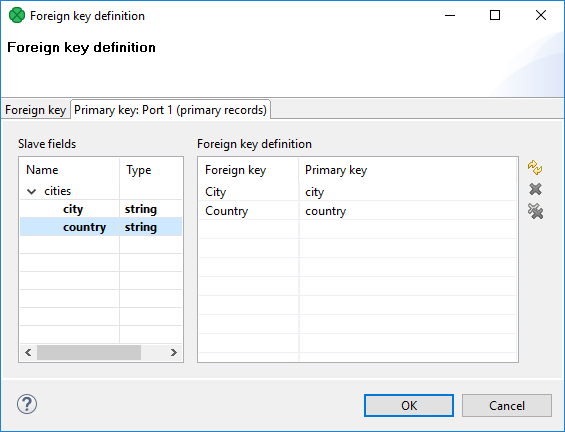

<!-- Development > Component reference > Others > CheckForeignKey -->

### CheckForeignKey


| [Short description](checkforeignkey.md#short-description) |
| --- |
| [Ports](checkforeignkey.md#ports) |
| [Metadata](checkforeignkey.md#metadata) |
| [CheckForeignKey attributes](checkforeignkey.md#checkforeignkey-attributes) |
| [Details](checkforeignkey.md#details) |
| [Examples](checkforeignkey.md#examples) |
| [See also](checkforeignkey.md#see-also) |

#### Short description

**CheckForeignKey** checks the validity of foreign key values and replaces invalid values by valid ones.

| Same input metadata | Sorted inputs | Inputs | Outputs | Each to all outputs | Java | CTL | Auto-propagated metadata |
| --- | --- | --- | --- | --- | --- | --- | --- |
| - | **⨯** | 2 | 1-2 | - | **⨯** | **⨯** | **⨯** |

#### Ports

| Port type | Number | Required | Description | Metadata |
| --- | --- | --- | --- | --- |
| Input | 0 | **✓** | For data with a foreign key | Any1 |
| 1 | **✓** | For data with a primary key | Any2 |  |
| Output | 0 | **✓** | For data with a corrected key | Input 0 |
| 1 | **⨯** | For data with an invalid key | Input 0 |  |

#### Metadata

Metadata cannot be propagated through this component.

**CheckForeignKey** has no metadata template.

Metadata on both input ports can be different. Metadata on the output(s) are usually the same as those on the first input port. They must at least have the same metadata structure (the number of fields, data types and sizes). Field names may differ.

#### CheckForeignKey attributes

| Attribute | Req | Description | Possible values |
| --- | --- | --- | --- |
| Basic |  |  |  |
| Foreign key | yes | A key according to which both incoming data flows are compared and data records are distributed among different output ports. For more information, see [Foreign key](checkforeignkey.md#foreign-key). |  |
| Default foreign key | yes | A sequence of values corresponding to the **Foreign key** data types separated from each other by a semicolon. Serves to replace invalid foreign key values. For more information, see [Foreign key](checkforeignkey.md#foreign-key). |  |
| Equal NULL |  | By default, records with null values of fields are considered to be different. If set to `true`, nulls are considered to be equal. | false (default) \| true |
| Advanced |  |  |  |
| Hash table size |  | A table for storing key values. Should be higher than the number of records with unique key values. | 512 (default) \| properties |
| Deprecated |  |  |  |
| Primary key |  | A sequence of field names from the second input port separated from each other by semicolon. For more information, see [Deprecated: Primary Key](checkforeignkey.md#deprecated-primary-key). |  |

#### Details

**CheckForeignKey** receives data records through two input ports.

The data records on the first input port are compared with those on the second input port. If a value of the specified foreign key (input port 0) is not found within the values of the primary key (input port1), the default value is given to the foreign key instead of its invalid value. Then all foreign records are sent to the first output port with the new (corrected) foreign key values and the original foreign records with invalid foreign key values can be sent to the optional second output port, if it is connected.

##### Foreign key

The **Foreign key** is a sequence of individual assignments separated from each other by a semicolon. Each of these individual assignments looks like this: `$foreignField=$primaryKey`.

To define **Foreign key**, you must select the desired fields in the **Foreign key** tab of the **Foreign key definition** wizard. Select the fields from the **Fields** pane on the left and move them to the **Foreign key** pane on the right.


*Figure 455. Foreign key definition wizard (Foreign key tab)*

When you switch to the **Primary key** tab, you will see that the selected foreign fields appeared in the **Foreign key** column of the **Foreign key definition** pane.


*Figure 456. Foreign key definition wizard (Primary key tab)*

You only need to select some primary fields from the left pane and move them to the **Primary key** column of the **Foreign key definition** pane on the right.


*Figure 457. Foreign key definition wizard (Foreign and primary keys assigned)*

You must also define the default foreign key values (**Default foreign key**). This key is also a sequence of values of corresponding data types separated from each other by a semicolon. The number and data types must correspond to metadata of the foreign key.

If you want to define the default foreign key values, you need to click the **Default foreign key** attribute row and type the default values for all fields.

##### Deprecated: Primary Key

In older versions of **CloverDX**, you had to specify both the primary and the foreign keys using the **Primary key** and the **Foreign key** attributes, respectively. They had a form of a sequence of field names separated from each other by a semicolon. However, the use of **Primary key** is deprecated now.

#### Examples

##### Checking city names of branch offices

Check list of customers for cities without our branch office.

List of customers

```
John Doe        | London
Lucy Brown      | Glasgow
Elisabeth Smith | Stratford-upon-Avon
...
```

List of cities with our branch office

```
Edinburgh
Glasgow
London
...
```

###### Solution

Pass the list of customers (**CustomerName** and **BranchOfficeCity**) to the first input port and the list of cities with branch offices to the second input port.

Use the **Foreign key** and **Default foreign key** attributes.

| Attribute | Value |
| --- | --- |
| Foreign key | $BranchOfficeCity=$city |
| Default foreign key | Not Found; |

If a city from the list of customers was not found in the list with branch office cities, we changed the city name to **Not Found**.

#### See also

| [Common properties of components](components.md#common-properties-of-components) |
| --- |
| [Specific attribute types](components.md#specific-attribute-types) |
| [Others comparison](common-of-others.md#others-comparison) |
