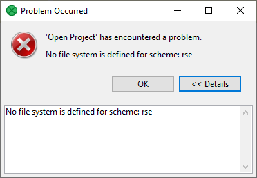
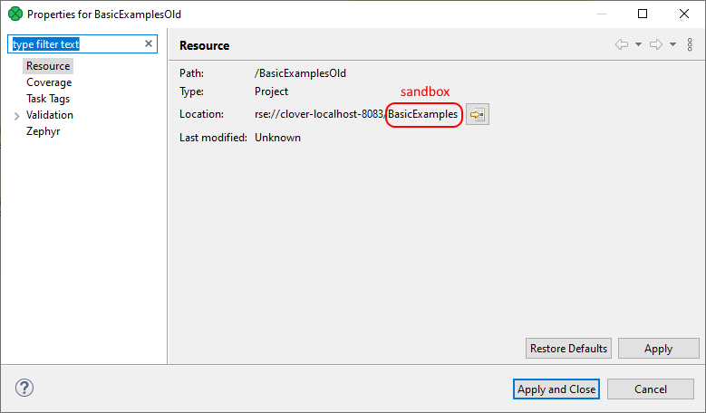

<!-- Development > Projects > Types of CloverDX projects -->

## 10. Types of CloverDX projects

| [CloverDX (local) project](cloverdx-projects-type.md#cloverdx-local-project) |
| --- |
| [CloverDX server project](cloverdx-projects-type.md#cloverdx-server-project) |

### CloverDX (local) project

**CloverDX project** is a local **CloverDX** project. The whole project structure is only on your local computer. All data and graphs reside locally in a project in a workspace, graphs runs locally with help of **CloverDX** Runtime.

Local projects can be easily versioned with version system of your choice (Git, Mercurial, SVN, Bazaar, CVS, etc.).

### CloverDX server project

CloverDX Server project is a **CloverDX** project corresponding to a **CloverDX Server** sandbox. The whole project structure is on **CloverDX Server**. The files are on the Server and on your local computer.

You save the file locally and **CloverDX Designer** synchronizes its content with **CloverDX Server**. When a file is created on the server, the file content is automatically downloaded and you see it in **Designer**.

You can choose files that will not be synchronized with the Server. These files are chosen according to the file name. For example, you can avoid downloading the `data-tmp` directory. See [Ignored files](../admin/designer-configuration.md#ignored-files).

You can avoid downloading files above specified size limit with help of [placeholder files](server-projects-usage.md#placeholder-files).

As the project files are available on your computer, the projects can be versioned with your preferred versioning system, e.g. SVN or Git. See [Versioning of server project content](server-projects-versioning.md).

The graphs in server projects run on the **CloverDX Server**, therefore you need working connection to the Server to run graphs.

See [Working with Server projects](server-projects-usage.md) for more information.

#### Legacy RSE server projects

There is an older, legacy type of CloverDX Server projects, so-called RSE Server projects. These are not supported from CloverDX 5.10. The old RSE Server projects cannot be opened and used anymore. If you try to open such a project, you will get the following error:

*Figure 117. Opening legacy CloverDX server project*

However, you will not lose your data as the old project was basically just a link to the CloverDX Server, where the data actually reside. You can create new CloverDX Server project to connect to the same sandbox and continue your work there. You can open Properties of the old project to find connection information, e.g. which sandbox was used by it:

*Figure 118. Legacy CloverDX server project properties*
