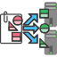

<!-- Development > Component reference > Data Partitioning > ParallelLoadBalancingPartition -->

### ParallelLoadBalancingPartition

| [Short description](clusterloadbalancingpartition.md#short-description) |
| --- |
| [Ports](clusterloadbalancingpartition.md#ports) |
| [Metadata](clusterloadbalancingpartition.md#metadata) |
| [Details](clusterloadbalancingpartition.md#details) |
| [Compatibility](clusterloadbalancingpartition.md#compatibility) |
| [See also](clusterloadbalancingpartition.md#see-also) |

#### Short description

**ParallelLoadBalancingPartition** distributes incoming data records among different **CloverDX Cluster** workers. The algorithm of the component is derived from the regular [LoadBalancingPartition](loadbalancingpartition.md) component.

| Same input metadata | Sorted inputs | Inputs | Outputs | Java | CTL | Auto-propagated metadata |
| --- | --- | --- | --- | --- | --- | --- |
| **✓** | **⨯** | 1 | 1[[1]](clusterloadbalancingpartition.md#clusterloadbalancingpartition-footnote1) | **⨯** | **⨯** | **✓** |

| 1 |  The single output port represents multiple virtual output ports. |
| --- | --- |

#### Ports

| Port type | Number | Required | Description | Metadata |
| --- | --- | --- | --- | --- |
| Input | 0 | **✓** | For input data records. | Any |
| Output | 0 | **✓** | For output data records. | Input 0 |

#### Metadata

**ParallelLoadBalancingPartition** propagates metadata in both directions. The component does not change priorities of metadata.

**ParallelLoadBalancingPartition** has no metadata template.

**ParallelLoadBalancingPartition** does not require any specific metadata fields.

#### Details

**ParallelLoadBalancingPartition** distributes incoming data records among different **CloverDX cluster** workers.

The algorithm of this component is derived from the regular [LoadBalancingPartition](loadbalancingpartition.md) component. For more details about attributes and other component-specific behavior, see the [*LoadBalancingPartition*](loadbalancingpartition.md) component.

This component belongs to a group of Cluster components that allows the change from a single-worker allocation to a multiple-worker allocation. So the allocation of the component preceding the **ParallelLoadBalancingPartition** component has to provide just a single worker. The allocation of the component following the **ParallelLoadBalancingPartition** component can provide multiple workers.
> [!NOTE]
> For more information about this component, see [Data partitioning in cluster](../admin/cluster-setup-index.md#cluster-introduction).

#### Compatibility

| Version | Compatibility Notice |
| --- | --- |
| 3.4 | The component is available since version **3.4**. |
| 4.3.0-M2 | **ClusterLoadBalancingPartition** was renamed to **ParallelLoadBalancingPartition**. |

#### See also

| [ParallelPartition](clusterpartition.md) |
| --- |
| [ParallelRepartition](clusterrepartition.md) |
| [ParallelMerge](clustermerge.md) |
| [ParallelSimpleCopy](clustersimplecopy.md) |
| [ParallelSimpleGather](clustersimplegather.md) |
| [LoadBalancingPartition](loadbalancingpartition.md) |
| [Common properties of components](components.md#common-properties-of-components) |
| [Specific attribute types](components.md#specific-attribute-types) |
| [Common properties of Data Partitioning components](common-of-cluster-components.md) |
