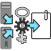

<!-- Development > Component reference > Data Partitioning > ParallelMerge -->

### ParallelMerge

| [Short description](clustermerge.md#short-description) |
| --- |
| [Ports](clustermerge.md#ports) |
| [Metadata](clustermerge.md#metadata) |
| [Details](clustermerge.md#details) |
| [Compatibility](clustermerge.md#compatibility) |
| [See also](clustermerge.md#see-also) |

#### Short description

**ParallelMerge** gathers data records from multiple **CloverDX Cluster** workers. The algorithm of the component is derived from the regular [Merge](merge.md) component.

| Same input metadata | Sorted inputs | Inputs | Outputs | Java | CTL | Auto-propagated metadata |
| --- | --- | --- | --- | --- | --- | --- |
| **✓** | **✓** | 1[[1]](clustermerge.md#clustermerge-footnote1) | 1 | **⨯** | **⨯** | **✓** |

| 1 |  The single input port represents multiple virtual input ports. |
| --- | --- |

#### Ports

| Port type | Number | Required | Description | Metadata |
| --- | --- | --- | --- | --- |
| Input | 0 | **✓** | For input data records | Any |
| Output | 0 | **✓** | For gathered data records | Input 0 |

#### Metadata

**ParallelMerge** propagates metadata in both directions. The component does not change metadata priorities.

The component has no metadata template.

The component does not require any specific metadata fields on its ports.

#### ParallelMerge attributes

**ParallelMerge** has same attributes as **Merge**. See [Merge attributes](merge.md#merge-attributes).

#### Details

**ParallelMerge** gathers data records from multiple **CloverDX Cluster** workers.

The algorithm of this component is derived from the regular [Merge](merge.md) component. For more details about attributes and other component specific behavior, see the [*Merge*](merge.md) component.

This component belongs to a group of Cluster components that allows the change from a multiple-workers allocation to a single-worker allocation. So the allocation of the component preceding the **ParallelMerge** component can provide multiple workers. The allocation of the component following the **ParallelMerge** component has to provide a single worker.
> [!NOTE]
> For more information about this component, see [Data partitioning in cluster](../admin/cluster-setup-index.md#cluster-introduction).

#### Compatibility

| Version | Compatibility Notice |
| --- | --- |
| 3.4 | The component is available since version **3.4**. |
| 4.3.0-M2 | **ClusterMerge** was renamed to **ParallelMerge**. |

#### See also

| [ParallelSimpleGather](clustersimplegather.md) |
| --- |
| [ParallelSimpleCopy](clustersimplecopy.md) |
| [ParallelLoadBalancingPartition](clusterloadbalancingpartition.md) |
| [ParallelPartition](clusterpartition.md) |
| [Merge](merge.md) |
| [Common properties of components](components.md#common-properties-of-components) |
| [Specific attribute types](components.md#specific-attribute-types) |
| [Common properties of Data Partitioning components](common-of-cluster-components.md) |
