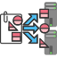
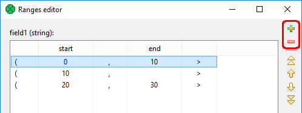

<!-- Development > Component reference > Data Partitioning > ParallelPartition -->

### ParallelPartition

| [Short description](clusterpartition.md#short-description) |
| --- |
| [Ports](clusterpartition.md#ports) |
| [Metadata](clusterpartition.md#metadata) |
| [ParallelPartition attributes](clusterpartition.md#parallelpartition-attributes) |
| [Details](clusterpartition.md#details) |
| [Compatibility](clusterpartition.md#compatibility) |
| [See also](clusterpartition.md#see-also) |

#### Short description

**ParallelPartition** distributes incoming data records among different **CloverDX Cluster** workers. The algorithm of the component is derived from the regular [Partition](partition.md) component.

| Same input metadata | Sorted inputs | Inputs | Outputs | Java | CTL | Auto-propagated metadata |
| --- | --- | --- | --- | --- | --- | --- |
| **✓** | **⨯** | 1 | 1[[1]](clusterpartition.md#clusterpartition-component-fn01) | [[2]](clusterpartition.md#clusterpartition-component-fn02) | [[2]](clusterpartition.md#clusterpartition-component-fn02) | **✓** |

| 1 |  The single output port represents multiple virtual output ports. |
| --- | --- |

| 2 |  **ParallelPartition** can use either a transformation or two other attributes (**Ranges** and/or **Partition key**). A transformation must be defined unless at least one of the attributes is specified. |
| --- | --- |

#### Ports

| Port type | Number | Required | Description | Metadata |
| --- | --- | --- | --- | --- |
| Input | 0 | **✓** | For input data records | Any |
| Output | 0 | **✓** | For output data records | Input 0 |

#### Metadata

**ParallelPartition** propagates metadata in both directions. The component does not change priority of propagated metadata.

The component has no metadata templates.

The component does not require any specific metadata fields on its ports.

#### ParallelPartition attributes

**ParallelPartition** has same attributes as **Partition**. See [Partition attributes](partition.md#partition-attributes).

#### Details

**ParallelPartition** distributes incoming data records among different **CloverDX Cluster** workers.

The algorithm of this component is derived from the regular [Partition](partition.md) component. For more details about attributes and other component specific behavior, see the [Partition](partition.md) component.

If the **Ranges** attribute is used for partitioning, the number of defined ranges must match the [allocation](components.md#component-allocation) of the following component. Use the **Add** and **Remove** toolbar buttons to adjust the number of defined ranges:

This component belongs to a group of Cluster components that allows the change from a single-worker allocation to a multiple-worker allocation. So the allocation of the component preceding the **ParallelPartition** component has to provide just a single worker. The allocation of the component following the **ParallelPartition** component can provide multiple workers.
> [!NOTE]
> For more information about this component, see [Data partitioning in cluster](../admin/cluster-setup-index.md#cluster-introduction).

#### Compatibility

| Version | Compatibility Notice |
| --- | --- |
| 3.4 | The component is available since version **3.4**. |
| 4.3.0-M2 | **ClusterPartition** was renamed to **ParallelPartition**. |

#### See also

| [ParallelLoadBalancingPartition](clusterloadbalancingpartition.md) |
| --- |
| [ParallelMerge](clustermerge.md) |
| [ParallelRepartition](clusterrepartition.md) |
| [ParallelSimpleCopy](clustersimplecopy.md) |
| [ParallelSimpleGather](clustersimplegather.md) |
| [Partition](partition.md) |
| [Common properties of components](components.md#common-properties-of-components) |
| [Specific attribute types](components.md#specific-attribute-types) |
| [Common properties of Data Partitioning components](common-of-cluster-components.md) |
