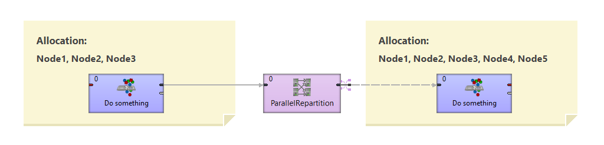
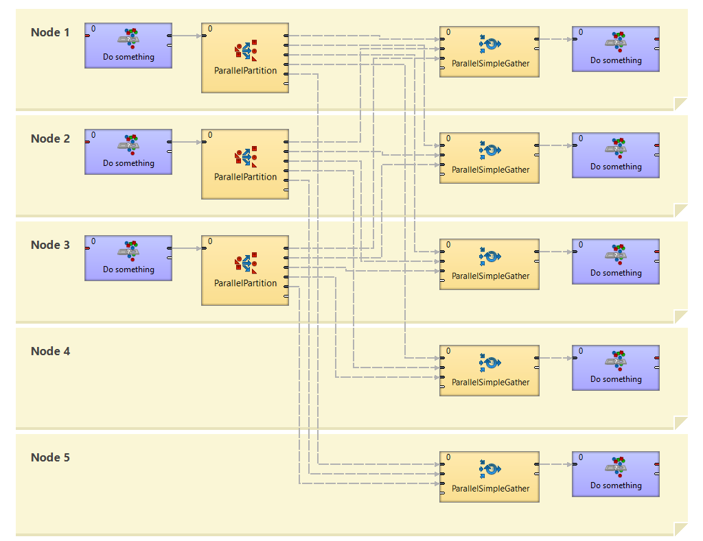

<!-- Development > Component reference > Data Partitioning > ParallelRepartition -->

### ParallelRepartition

| [Short description](clusterrepartition.md#short-description) |
| --- |
| [Ports](clusterrepartition.md#ports) |
| [Metadata](clusterrepartition.md#metadata) |
| [ParallelRepartition attributes](clusterrepartition.md#parallelrepartition-attributes) |
| [Details](clusterrepartition.md#details) |
| [Compatibility](clusterrepartition.md#compatibility) |
| [See also](clusterrepartition.md#see-also) |

#### Short description

**ParallelRepartition** component re-distributes already partitioned data according new rules among a different set of **CloverDX Cluster** workers.

| Same input metadata | Sorted inputs | Inputs | Outputs | Java | CTL | Auto-propagated metadata |
| --- | --- | --- | --- | --- | --- | --- |
| **✓** | **⨯** | 1[[1]](clusterrepartition.md#clusterrepartition-footnote1) | 1[[2]](clusterrepartition.md#clusterrepartition-footnote2) | [[3]](clusterrepartition.md#clusterpartition-components-fn03) | [[3]](clusterrepartition.md#clusterpartition-components-fn03) | **✓** |

| 1 |  The single input port represents multiple virtual input ports. |
| --- | --- |

| 2 |  The single output port represents multiple virtual output ports. |
| --- | --- |

| 3 |  **ParallelRepartition** can use either a transformation or two other attributes (**Ranges** and/or **Partition key**). A transformation must be defined unless at least one of the attributes is specified. |
| --- | --- |

#### Ports

| Port type | Number | Required | Description | Metadata |
| --- | --- | --- | --- | --- |
| Input | 0 | **✓** | For input data records | Any |
| Output | 0 | **✓** | For output data records | Input 0 |

#### Metadata

**ParallelRepartition** propagates metadata in both directions. The component does not change priorities of metadata.

**ParallelRepartition** has no metadata templates.

The component does not require any specific metadata fields.

#### ParallelRepartition attributes

**ParallelRepartition** has same attributes as **ParallelPartition**. See [ParallelPartition attributes](clusterpartition.md#parallelpartition-attributes).

#### Details

**ParallelRepartition** component re-distributes already partitioned data according to new rules among different set of **CloverDX Cluster** workers.

This component is functionally analogous of the [ParallelPartition](clusterpartition.md) component, it distributes incoming data records among different **CloverDX Cluster** workers. Unlike ParallelPartition, the incoming data can be already partitioned.

For more details about this component, consider following usage of the repartitioner:

*Figure 427. Usage example of ParallelRepartition component*

The **ParallelRepartition** component defines a boundary between two incompatible allocations. Data in front of ParallelRepartition is already partitioned on node1 and node2, let’s say according to a key A. The component allows changing an allocation (even cardinality), in our case the allocation behind the repartitioner is node1, node2 and node3, according to a new key B. All is done in one step. Let’s look at the following image, which shows how the repartitioner works.

*Figure 428. Example of actual working of ParallelRepartition component in runtime*

Three separate graphs are executed, one on each of three nodes - node1, node2 and node3. The **ParallelRepartition** component is substituted by one **Partition** component for each source partition and by one **SimpleGather** component for each target partition. So altogether, five components do the work instead of the **ParallelRepartition**. Each Partition splits the data from single input partition to all output partitions where the data is gathered by the **SimpleGather** component.
> [!NOTE]
> For more information about this component, see [Data partitioning in cluster](../admin/cluster-setup-index.md#cluster-introduction).

##### Notes And Limitations

**ParallelRepartition** creates remote edges between each node on the left side and each node on the right side. For example, if you have allocation of 16 on the left side and allocation of 15 on the right side, 225 remote edges will be created. (15 times 15 remote edges to the nodes on the right side, one edge to the each node one the right side is not remote.) Try to avoid overusing of **ParallelRepartition** with high allocation numbers on both sides as you may reach limit on the number of parallel HTTP connections.

If you have such a high allocation, use [ParallelSimpleGather](clustersimplegather.md) to gather the records first and subsequently distribute the records with [ParallelPartition](clusterpartition.md) to the Cluster nodes with a new allocation. For example, if you have an allocation of 16 on the left side and 15 on the right side, you will need 29 remote edges instead of 225 edges. (There will be 15 remote edges in **ParallelSimpleGather**, as one edge is not remote, and 14 remote edges in **ParallelPartition**, as one edge is not remote.)

#### Compatibility

| Version | Compatibility Notice |
| --- | --- |
| 3.4 | The component is available since version **3.4**. |
| 4.3.0-M2 | **ClusterRepartition** was renamed to **ParallelRepartition**. |

#### See also

| [ParallelLoadBalancingPartition](clusterloadbalancingpartition.md) |
| --- |
| [ParallelPartition](clusterpartition.md) |
| [Common properties of components](components.md#common-properties-of-components) |
| [Specific attribute types](components.md#specific-attribute-types) |
| [Common properties of Data Partitioning components](common-of-cluster-components.md) |
