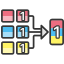

<!-- Development > Component reference > Joiners > Combine -->

### Combine

| [Short description](combine.md#short-description) |
| --- |
| [Ports](combine.md#ports) |
| [Metadata](combine.md#metadata) |
| [Combine attributes](combine.md#combine-attributes) |
| [Details](combine.md#details) |
| [Best practices](combine.md#best-practices) |
| [See also](combine.md#see-also) |

#### Short description

**Combine** takes one record from each input port, combines them according to a specified transformation and sends the resulting records to one or more ports.

| Same input metadata | Sorted inputs | Inputs | Outputs | Transformation | Transf. req. | Java | CTL | Auto-propagated metadata |
| --- | --- | --- | --- | --- | --- | --- | --- | --- |
| **⨯** | **⨯** | 1–n | 1-n | **✓** | **✓** | **✓** | **✓** | **⨯** |

#### Ports

| Port type | Number | Required | Description | Metadata |
| --- | --- | --- | --- | --- |
| Input | 0–n | **✓** | Input records to be combined. | Any |
| Output | 0-n | **✓** | An output record which is the result of combination. | Any |

#### Metadata

**Combine** does not propagate metadata.

**Combine** has no metadata templates.

#### Combine attributes

| Attribute | Req | Description | Possible values |
| --- | --- | --- | --- |
| Basic |  |  |  |
| Transform | [[1]](combine.md#combine-attributes-fn01) | The definition of how input records should be combined into output record. Written in the graph source either in CTL or in Java. |  |
| Transform URL | [[1]](combine.md#combine-attributes-fn01) | The name of an external file, including the path, containing the definition of the way how records should be combined. Written in CTL or in Java. |  |
| Transform class | [[1]](combine.md#combine-attributes-fn01) | The name of an external class defining the way how records should be combined. |  |
| Transform source charset |  | Encoding of external file defining the transformation.  The default encoding depends on `DEFAULT_SOURCE_CODE_CHARSET` in `defaultProperties`. | E.g. UTF-8 |
| Allow incomplete tuples |  | Whether each input port has to contribute a record for each output record. | true (default) \| false |

| 1 |  One of these must be specified. Any of these transformation attributes uses a CTL template for **Map** or implements a `RecordTransform` interface. |
| --- | --- |

For detailed information about transformations, see also [Defining transformations](transformations.md#defining-transformations).

#### Details

In each step, the **Combine** component takes one record from all input ports, creates a single output record, and fills fields of this output record with data from input record (or other data) according to the specified transformation.

The simplest way to define the combination transformation is using the [Transform Editor](transformations.md#transform-editor) available at the **Transform** component attribute. There you will see metadata for each input port on the left side and metadata for the single output port on the right side. Simply drag and drop the fields from the left to the fields on the right to create the desired combination transformation.

In default setting, the component assumes that the same number of records will arrive on each input port, and in case that some input edge becomes empty while others still contain some records, the component fails. You can avoid this failures by setting the **Allow incomplete tuples** attribute to true.

#### Best practices

If the transformation is specified in an external file (with **Transform URL**), we recommend users to explicitly specify **Transform source charset**.

#### See also

| [Common properties of components](components.md#common-properties-of-components) |
| --- |
| [Specific attribute types](components.md#specific-attribute-types) |
| [Joiners comparison](common-of-joiners.md#joiners-comparison) |
