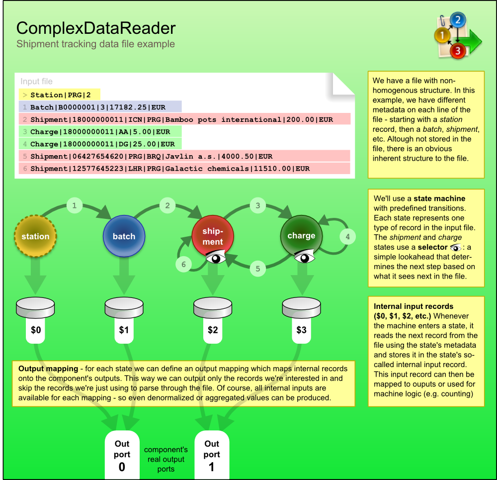
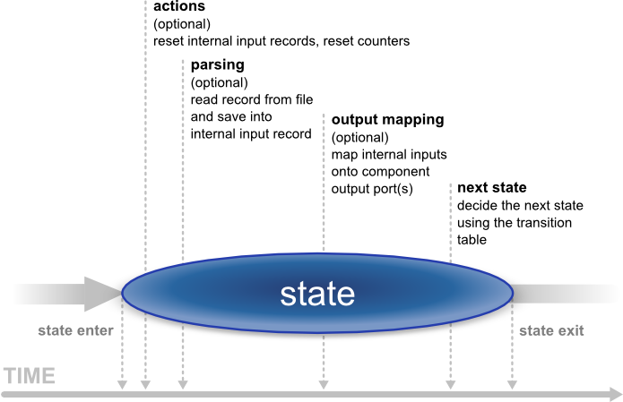
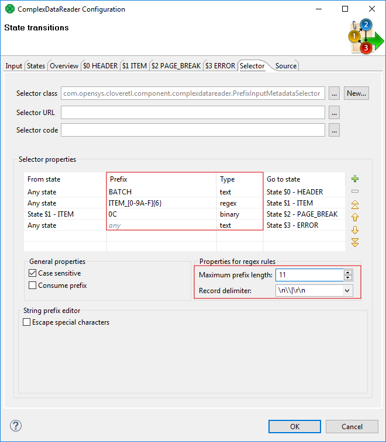

<!-- Development > Component reference > Readers > ComplexDataReader -->

### ComplexDataReader


| [Short description](complexdatareader.md#short-description) |
| --- |
| [Ports](complexdatareader.md#ports) |
| [Metadata](complexdatareader.md#metadata) |
| [ComplexDataReader attributes](complexdatareader.md#complexdatareader-attributes) |
| [Details](complexdatareader.md#details) |
| [Examples](complexdatareader.md#examples) |
| [Best practices](complexdatareader.md#best-practices) |
| [See also](complexdatareader.md#see-also) |

#### Short description

**ComplexDataReader** reads non-homogeneous data and sends records to the corresponding output edge(s).

The component uses a concept of states and transitions and optional lookahead (selector). The user-defined states and their transitions impose the order of metadata used for parsing the file - presumably following the file’s structure.

| Data source | Input ports | Output ports | Each to all outputs | Different to different outputs | Transformation | Transf. req. | Java | CTL | Auto-propagated metadata |
| --- | --- | --- | --- | --- | --- | --- | --- | --- | --- |
| Flat file | 1 | 1-n | **⨯** | **✓** | **✓** | **✓** | **✓** | **✓** | **⨯** |

#### Ports

| Port type | Number | Required | Description | Metadata |
| --- | --- | --- | --- | --- |
| Input | 0 | **⨯** | For port reading. See [Reading from input port](examples-of-file-url-in-readers.md#reading-from-input-port). | One field (`byte`, `cbyte`, `string`). |
| Output | 0 | **✓** | For correct data records | Any (Out0) |
| 1-n | **⨯** | For correct data records | Any (Out1-OutN) |  |

#### Metadata

ComplexDataReader does not propagate metadata.

ComplexDataReader does not have any metadata template.

Metadata on output ports may differ. The component usually has different metadata on its output ports.

Metadata on output ports can use [Autofilling functions](metadata-records-and-fields.md#autofilling-functions).

The `source_timestamp` and `source_size` functions work only if records are read from a file directly. If the file is an archive or it is stored in a remote location, the timestamp will be empty and the size will be `0`.

#### ComplexDataReader attributes

| Attribute | Req | Description | Possible values |
| --- | --- | --- | --- |
| Basic |  |  |  |
| File URL | yes | The data source(s) which **ComplexDataReader** should read from. The source can be a flat file, an input port or a dictionary. See [Supported file URL formats for Readers](examples-of-file-url-in-readers.md). |  |
| Transform |  | The definition of the state machine that carries out the reading. The settings dialog opens in a separate window that is described in [Details](complexdatareader.md#details). |  |
| Charset |  | The encoding of records that are read.  The default encoding depends on `DEFAULT_SOURCE_CODE_CHARSET` in defaultProperties. | UTF-8 \| <any encoding> |
| Data policy |  | Determines steps that are done when an error occurs. For details, see [Data policy](data-policy.md).  Unlike other Readers, `Controlled`**Data policy** is not implemented.  `Lenient` allows you to skip redundant columns in metadata with a record delimiter (but not incorrect lines). Lenient data policy cannot be used to skip invalid records. | Strict (default) \| Lenient |
| Trim strings |  | Specifies whether leading and trailing whitespaces should be removed from strings before inserting them to data fields. See [Trimming data](flatfilereader.md#trimming-data). | false (default) \| true |
| Quoted strings |  | Fields containing a special character (comma, newline or double quote) have to be enclosed in quotes. Only single/double quote is accepted as the quote character. If `true`, special characters are removed when read by the component (they are not treated as delimiters).  **Example:** To read input data `"25"\|"John"`, switch **Quoted strings** to `true` and set **Quote character** to `"`. This will produce two fields: `25\|John`.  By default, the value of this attribute is inherited from metadata on output port 0. See also [Record details](metadata-editor.md#record-details). | false \| true |
| Quote character |  | Specifies which kind of quotes will be permitted in **Quoted strings**. By default, the value of this attribute is inherited from metadata on output port 0. See also [Record details](metadata-editor.md#record-details). | both \| " \| ' |
| Advanced |  |  |  |
| Skip leading blanks |  | Specifies whether leading whitespace characters (spaces, etc.) will be skipped before inserting input strings to data fields. If set to default, the value of **Trim strings** is used. See [Trimming data](flatfilereader.md#trimming-data). | false (default) \| true |
| Skip trailing blanks |  | Specifies whether trailing whitespace characters (spaces, etc.) will be skipped before inserting input strings to data fields. If set to default, the value of **Trim strings** is used. See [Trimming data](flatfilereader.md#trimming-data). | false (default) \| true |
| Max error count |  | The maximum number of tolerated error records on the input. The attribute is applicable only if `Controlled`**Data policy** is being used. | 0 (default) - N |
| Treat multiple delimiters as one |  | If a field is delimited by a multiplied delimiter character, it will be interpreted as a single delimiter if this attribute is `true`. | false (default) \| true |
| Verbose |  | By default, a simple error notification is provided, with higher performance. If switched to `true`, a detailed error notification is provided, with lower performance. | false (default) \| true |
| Selector code | [[1]](complexdatareader.md#complexdatareader-attributes-fn01) | If you decide to use a selector, you can write its code in Java here. A selector is only an optional feature in the transformation. It supports decision-making when you need to look ahead at the data file. See [Selector](complexdatareader.md#selector). |  |
| Selector URL | [[1]](complexdatareader.md#complexdatareader-attributes-fn01) | The name and path to an external file containing a selector code written in Java. To learn more about the Selector, see [Details](complexdatareader.md#details). |  |
| Selector class | [[1]](complexdatareader.md#complexdatareader-attributes-fn01) | The name of an external class containing the Selector. To learn more about the Selector, see [Details](complexdatareader.md#details). |  |
| Transform URL |  | The path to an external file which defines state transitions in the state machine. |  |
| Transform class |  | The name of a Java class that defines state transitions in the state machine. |  |
| Selector properties |  | Allows you to instantly edit the current Selector in the **State transitions** window. |  |
| State metadata |  | Allows you to instantly edit the metadata and states assigned to them in the **State transitions** window. |  |

| 1 |  If you do not define any of these three attributes, the default **Selector class** (`PrefixInputMetadataSelector`) will be used. |
| --- | --- |

#### Details

**ComplexDataReader** uses principle of the state machine to read the input record and to send data to the correct output port. The data may mix various data formats, delimiters, fields and record types. On top of that, records and their semantics can be dependent on each other. For example, a record of a type `address` can mean a person’s address if the preceding record is a `person`, or company’s address if the `address` follows the `company` record.

**MultiLevelReader** and **ComplexDataReader** are very similar components in terms of what they can achieve. In **MultiLevelReader**, you needed to program the whole logic as a Java transform (in the form of AbstractMultiLevelSelector extension); while in ComplexDataReader, even the trickiest data structures can be configured using the GUI.



##### Transitions between states

Transitions between states can either be given explicitly - for example, state 3 always follows 2, computed in CTL - for example, by counting the number of entries in a group, or you can consult the helping tool to choose the transition. The tool is called **Selector** and it can be understood as a magnifying glass that looks ahead at the upcoming data without actually parsing it.

You can either custom-implement the selector in Java or just use the default one. The default selector uses a table of prefixes and their corresponding transitions. Once it encounters a particular prefix it evaluates all transitions and returns the first matching target state.

In the figure below, you can see what happens in a state. As soon as we enter a state, its **Actions** are performed. Available actions are:

- **Reset counter** - resets a counter which stores the number of times the state has been accessed.
- **Reset record** - resets the number of records located in internal storage, ensuring that various data read do not mix with each other.

Next, **Parsing** of the input data is done. This reads a record in from the file and stores it in the state’s internal input.

After that comes **Output** which involves mapping the internal inputs to the component’s output ports. This is the only step in which data is sent out of the component.

Finally, there is **Transition** which defines how the machine changes to the next state.



Last but not least, writing the whole reading logics in CTL is possible as well. For a reference, see [CTL in ComplexDataReader](complexdatareader.md#ctl-in-complexdatareader)

##### Designing state machine

To start designing the machine, edit the **Transform** attribute. A new window opens offering these tabs: **States**, **Overview**, **Selector**, **Source** and other tabs representing states labeled **$stateNo stateLabel**, e.g. "$0 myFirstState".

On the left side of the **States** tab, you can see a pane with all the **Available metadata** your graph works with. In this tab, you design new states by dragging metadata to the **States** pane on the right. At the bottom, you can set the **Initial state** (the first state) and the **Final state** (the machine switches to it shortly before terminating its execution or if you call **Flush and finish**). The final state can serve mapping data to the output before the automaton terminates (useful for treating the last records of your input). Finally, in the center there is the **Expression editor** pane, which supports Ctrl+Space content assist and lets you directly edit the code.

In the **Overview** tab, the machine is graphically visualized. Here you can **Export Image** to an external file or **Cycle View Modes** to see other graphical representations of the same machine. If you click **Undock**, the whole view will open in a separate window that is regularly refreshed.

In state tabs (e.g. "$0 firstState"), you define the outputs in the **Output ports** pane. What you see in **Output field** is in fact the (fixed) output metadata. Next, you define **Actions** and work with the **Transition table** at the bottom pane in the tab. Inside the table, there are **Conditions** which are evaluated top-down and **Target states** assigned to them. These are the following values for **Target states**:

- **Let selector decide** - the selector determines which state to go to next;
- **Flush and finish** - this causes a regular ending of the machine’s work;
- **Fail** - the machine fails and stops its execution. (e.g it comes across an invalid record);
- A particular state the machine changes to.

The **Selector** tab allows you to implement your own selector or supply it in an external file/Java class.

Finally, the **Source** tab shows the code the machine performs. For more information, see [CTL in ComplexDataReader](complexdatareader.md#ctl-in-complexdatareader).

#### CTL in ComplexDataReader

The machine can be specified in three ways:

1. you can design it as a whole through the GUI;
2. you can create a Java class that describes it;
3. you can write its code in CTL inside the GUI by switching to the **Source** tab in **Transform**, where you can see the source code the machine performs.
> [!NOTE]
> You do not have to handle the source code at all. The machine can be configured entirely in the other graphical tabs of this window.

Changes made in **Source** take effect in remaining tabs if you click **Refresh states**. If you want to synchronize the source code with states configuration, click **Refresh source**.

Let us now outline significant elements of the code:

##### Counters

There are the `counterStateNo` variables which store the number of times a state has been accessed. There is one such variable for each state and their numbering starts with 0. So for example, counter2 stores how many times state $2 was accessed. The counter can be reset in **Actions**.

##### InitialState function

`integer initialState()` - determines which state of the automaton is the first one initiated. If you return `ALL`, it means **Let selector decide**, i.e. it passes the current state to the selector that determines which state will be next (if it cannot do that, the machine fails).

##### FinalState function

`integer finalState(integer lastState)` - specifies the last state of the automaton. If you return `STOP`, it means the final state is not defined.

##### Functions in every state

Each state has two major functions describing it:

- `nextState`
- `nextOutput`

`integer nextState_stateNo()` returns a number saying which state follows the current state (`stateNo`). If you return `ALL`, it means **Let selector decide**. If you return `STOP`, it means **Flush and finish**.
Example 366. Example state function

```ctl
nextState_0() {
    if(counter0 > 5) {
        return 1;    // if state 0 has been accessed more than five times since
                    // the last counter reset, go to state 1
    }
    return 0;  // otherwise stay in state 0
}
```

`nextOutput_stateNo(integer seq)` - the main output function for a particular state (`stateNo`). It calls the individual `nextOutput_stateNo_seq()` service functions according to the value of `seq`. The `seq` is a counter which stores how many times the `nextOutput_stateNo` function has been called so far. At last, it calls `nextOutput_stateNo_default(integer seq)` which typically returns `STOP` meaning everything has been sent to the output and the automaton can change to the next state.

`integer nextOutput_stateNo_seq()` - maps data to output ports. In particular, the function can look like, for example, `integer nextOutput_1_0()` meaning it defines mapping for state $1 and `seq` equal to 0 (i.e. this is the first time the function has been called). The function returns a number. The number says which port has been served by this function.

##### Global nextState function

`integer nextState(integer state))` - calls individual `nextState()` functions according to the current state

##### Global nextOutput function

`integer nextOutput(integer state, integer seq)` - calls individual `nextOutput()` functions according to the current state and the value of `seq`.

#### Selector

By default, the selector takes the initial part of the data being read (a *prefix*) to decide about the next state of the state machine. This is implemented as `PrefixInputMetadataSelector`.

Rules are defined in the Selector properties pane. Notice the two extra attributes for regular expressions:


*Figure 340. Configuring prefix selector in ComplexDataReader*

The selector can be configured by creating a list of *rules*. Every rule consists of:

1. a state in which it is applied (**From state**)
2. a specification of **Prefix** and its **Type**. A prefix may be specified as a plain text, a sequence of bytes written in hexadecimal code, or using a regular expression. These are the **Types** of the rules. The prefix can be empty meaning the rule will be always applied no matter the input.
3. the next state of the automaton (**Go to state**)

As the selector is invoked, it goes through the list of rules (top to bottom) and searches for the first applicable rule. If successful, the automaton switches to the target state of the selected rule.
> [!CAUTION]
> **Be very careful:** the remaining rules are not checked at all, so you have to think thoroughly over the order of rules. If a rule with an empty prefix appears in the list, the selector will not get to the rules below it. Generally, the least specific rules should be at the end of the list. See example below:
Example 367.
Let us have two rules and assume both are applicable in any state:

- `.{1,3}PATH` (a regular expression)
- `APATHY`

If rules are defined in this exact order, **the latter will never be applied** because the regular expression also matches the first five letters of "APATHY".
> [!NOTE]
> Because some regular expressions can match sequences of characters of arbitrary length, two new attributes were introduced to prevent `PrefixInputMetadataSelector` from reading the whole input. These attributes are optional, but it is strongly recommended to use at least one of them; otherwise, the selector always reads the whole input whenever there is a rule with a regular expression. The two attributes: **Maximum prefix length** and **Record delimiter**. When matching regular expressions, the selector reads ahead at most **Maximum prefix length** of characters (0 meaning "unlimited"). The reading is also terminated if a **Record delimiter** is encountered.

#### Notes and limitations

Lenient data policy cannot be used to skip invalid records.

#### Examples

| [Reading different records from single file](complexdatareader.md#reading-different-records-from-single-file) |
| --- |
| [Omitting prefix from records](complexdatareader.md#omitting-prefix-from-records) |
| [Reading multiple records from single line](complexdatareader.md#reading-multiple-records-from-single-line) |
| [Adding identifiers](complexdatareader.md#adding-identifiers) |

##### Reading different records from single file

Three programs log actions to one logging facility and the facility produces a single file. Each program uses different log format. Categorize lines of a log file for further processing.

Record produced by program A1:

```
programName|action|time|message
```

Record produced by program A2:

```
programName|time|user
```

Record produced by program A3:

```
programName|severity|code
```

Input data:

```
A1|received|2015-02-28|Message received
A2|2015-03-11 10:12:00|smithj
A1|received|2015-03-11|Message received
A3|INFO|login
A3|INFO|password changed
A2|2015-03-11 10:15:30|taylorg
```

###### Solution

Use **File URL** to define source file name(s).

Open dialog in the **Transforms** attribute.

On the **States** tab, add three states with corresponding metadata. You can either add states using the **plus** button and subsequently add metadata from the combo box, or you can drag metadata from metadata pane onto pane with fields.

Switch to the **Selector** tab. Set up **Maximum prefix length** to `2`. Add states using the **plus** button and fill in the **Prefix** and **Go to state** columns in the tab: `A1` for state $0, `A2` for state $1 and `A3` for state $2.

Define the mapping on tabs with particular states: on **$0** map record with metadata for A1, on **$1** map record with metadata for A2 and on **$2** map record with metadata for A3.

The following records will be sent to particular output ports.

```
A1|received|2015-02-28|Message received
A1|received|2015-03-11|Message received
```

```
A2|2015-03-11 10:12:00|smithj
A2|2015-03-11 10:15:30|taylorg
```

```
A3|INFO|login
A3|INFO|password changed
```

##### Omitting prefix from records

See data from previous example. There is an unnecessary field in output produced in the last example. Process the same file, but remove prefixes A1, A2 and A3 from the result.

###### Solution

On the selector tab, set prefix to "A1|", "A2|" and "A3|" and check **Consume prefix** checkbox. Note: you need to modify metadata.

##### Reading multiple records from single line

Input file contains records about shipments. Data of one shipment occupies one line. Each shipment has **identifier** (11 chars), **source** (7) and **destination** (7).

One shipment consists of zero or more pieces. Each piece is described by a record having **header** (4) beginning with 300B, **piece identifier** (3) and **description** (7).

There can be zero or more charges related to the shipment or particular pieces. Each charge consists of **header** (4) beginning with 400B, **piece identifier** in the case of charge related to the piece (3), **amount** (7) and **description** (27).

Pieces and charges are on the same line with shipment.

Parse records, each type of record should be passed to a different output port.

The source file example:

```
1426089255 London Nice   300B001paper  400B0011000.00good too heavy surcharge   400B001  50.00special delivery conditions
1426089256 Narvik Rome   300B001snow   400B001 500.00bulk good surcharge        300A002ski    400B002 100.00long good surcharge
1426089257 Nimes  Miami  300B001wine   400B001 500.00dangerous good surcharge
```

###### Solution

Input file contains fixed-length data. As a result we need fixed-length metadata. Create fixed-length metadata **Shipment**, **Piece** and **Charge**. All these fixed-length metadata must have empty record delimiter.

Create auxiliary delimited metadata **Aux** with one string field. This will be used to read line ends.

Use **File URL** and **Transform** attributes.

On **States** tab, create states **$0** with **Shipment** metadata, **$1** with **Piece** metadata, **$2** with **Charge** metadata and **$3** with **Aux** metadata.

Set up the **Selector**:

| From state | prefix | To state |
| --- | --- | --- |
| State $0 | 300B | State $1 |
| State $0 | 400B | State $2 |
| State $1 | 300B | State $1 |
| State $1 | 400B | State $2 |
| State $2 | 300B | State $1 |
| State $2 | 400B | State $2 |
| State $3 | any | State $0 |
| Any state | any | State $3 |

Set up output mapping of particular states: produce output on port 0 in state $0, on port 1 in state $1 and on port 2 in state $2. Do not produce any output in state $3.

Results on particular output ports are following:

```
1426089255 London Nice
1426089256 Narvik Rome
1426089257 Nimes  Miami
```

```
300B001paper
300B001snow
300B001wine
```

```
400B0011000.00good too heavy surcharge
400B001 500.00bulk good surcharge
400B001 500.00dangerous good surcharge
```

##### Adding identifiers

Records read by **ComplexDataReader** in the previous steps have lost mutual binding. It is impossible to track which charges or pieces are connected to which shipment. Add identifier from Shipment record to other records.

###### Solution

The solution is built on the solution from previous example.

Add the **identifier** field to **Piece** and to **Charge** metadata.

On tab **$1**, add mapping of identifier from **Shipment** to the identifier in **Piece**. Do the same of **$2** tab with Charge.

#### Best practices

We recommend users to explicitly specify encoding of input file (with the **Charset** attribute). It ensures better portability of the graph across systems with different default encoding.

The recommended encoding is UTF-8.

#### See also

| [MultiLevelReader](multilevelreader.md) |
| --- |
| [Common properties of components](components.md#common-properties-of-components) |
| [Specific attribute types](components.md#specific-attribute-types) |
| [Common properties of Readers](common-of-readers.md) |
| [Readers comparison](common-of-readers.md#readers-comparison) |
