<!-- Development > Job elements > Components -->

## 23. Components

Components (nodes) are the most important graph elements. They all serve to process data. Most of them have ports through which they can receive data and/or send the processed data out. Most components work only when edges are connected to these ports. Each edge in a graph connected to a port must have metadata assigned to it. Metadata describes the structure of data flowing through the edge from one component to another.

You can configure the properties of any graph component in the following way:

- You can double-click the component in the **Graph Editor**.
- You can select the component and/or its item in the **Outline** pane and edit the items in the **Properties** tab.
- You can select the component item in the **Outline** pane and press Enter.
- You can also open the context menu by right-clicking the component in the **Graph Editor** and/or in the **Outline** pane. Then you can select the **Edit** item from the context menu and edit the items in the **Edit component** wizard.

### Adding components

If you need to quickly add a component without navigating to **Palette**, press ShiftSpace. This brings the **Add component** dialog.

Components are searched by their [*name and description*](components.md#search-components).
Example 4. Finding a Sort component
You need to sort your data, but CloverDX offers various sort components. A quick solution: press Shift+Space and type 'sort'. You will see all available sorters (with a description).

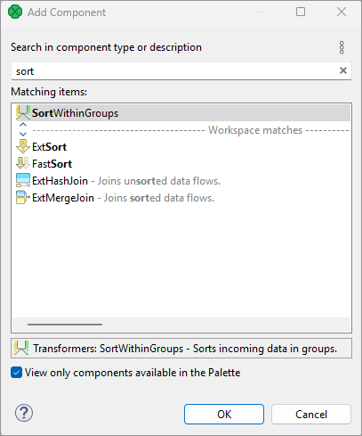
*Figure 208. Add Components dialog - finding a sorter*
> [!NOTE]
> For easier access, recently searched/added components appears at the top of the dialog.

### Component types

All components can be divided into several groups:

#### Readers

[Readers](readers.md) are usually the initial nodes of a graph. **Readers** read data from input files (either local or remote), receive it from a connected input port, read it from a dictionary or generate data.

#### Writers

[Writers](writers.md) are the terminal nodes of a graph. **Writers** receive data through their input port(s) and write it to files (either local or remote), send it out through a connected output port, send emails, write data to a dictionary or discard the received data.

#### Transformers

[Transformers](transformers.md) are intermediate nodes of a graph. **Transformers** receive data and copy it to all output ports, deduplicate, filter or sort data, concatenate, gather or merge received data through many ports and send it out through a single output port, distribute records among many connected output ports, intersect data received through two input ports, aggregate data to get new information or transform data in a more complex way.

#### AI / ML

[AI components](ai-components.md) are also intermediate nodes of a graph. They process various data transformations using pre-trained machine learning models.

#### Joiners

[Joiners](joiners.md) are also intermediate nodes of a graph. **Joiners** receive data from two or more sources, join them according to a specified key, and send the joined data out through the output ports.

#### Job Control

[Job Control](job-control.md) is a group of components focused on execution and monitoring of various job types. These components allow running Graphs, jobflows and any interpreted scripts. Graphs and jobflows can be monitored and optionally aborted.
> [!TIP]
> **Note** if you cannot see this component category, navigate to **Window** ****Preferences** ****CloverDX** ****Components in Palette** and tick both checkboxes next to **Job Control**.

#### File Operations

[File Operations](file-operations.md) are components suitable for handling files on the file system - either local or remote (via FTP). They can also access files in **CloverDX** Server sandboxes.
> [!TIP]
> **Note** if you cannot see this component category, navigate to **Window** ****Preferences** ****CloverDX** ****Components in Palette** and tick both checkboxes next to **File Operations**.

#### Cluster components

The [Data Partitioning](cluster-components.md) serve to distribute data records among various nodes of a Cluster of **CloverDX Server** instances or to gather these records together.

Graphs with **Cluster Components** run in parallel in a Cluster.

#### Data Quality

The [Data Quality](data-quality.md) is a group of components performing various tasks related to quality of your data - determining information about the data, finding and fixing problems, etc.

#### Other

The [Others](others.md) group is a heterogeneous group of components. They can perform different tasks - execute system, Java or DB commands; run **CloverDX** graphs or send HTTP requests to a server. Other components of this group can read from or write to lookup tables, check the key of some data and replace it with another one, check the sort order of a sequence or slow down processing of data flowing through the component.

#### Subgraphs

[*Subgraph*](subgraphs.md) is a special type of graph that can be used as a component in another graph. Subgraph belongs to the **Job Control** components.

##### Deprecated

A component is **Deprecated**, should not be used anymore and we do not describe them.

### Component properties

Some properties are common to most of components or all components.

- [Common properties of components](components.md#common-properties-of-components)

Other properties are common to each of the groups:

- [Common properties of Readers](common-of-readers.md)
- [Common properties of Writers](common-of-writers.md)
- [Common properties of Transformers](common-of-transformers.md)
- [Common properties of Joiners](common-of-joiners.md)
- [Common properties of Data Partitioning components](common-of-cluster-components.md)
- [Common properties of Others](common-of-others.md)
- [Common properties of Data Quality](common-of-data-quality.md)

For information about individual components, see [Component reference](part6.md).

### Edit component dialog

| [Commands](components.md#commands) |
| --- |
| [attributes](components.md#attributes) |

The **Edit component** serves for editing component attributes. This dialog is available in each component. You can access the dialog by double-clicking the component that has been pasted in the **Graph Editor** pane.

In the **Edit component** dialog you can edit attributes of a component. At the top of the window, there is a **toolbar** with several commands for attribute values. There are several groups of **attributes** below the toolbar.

#### Commands

##### Copy property

Copies selected attribute value into the clipboard.

##### Paste property

Pastes the value from the clipboard as a value of selected attribute.

##### Clear property

Clears the value of the selected attribute.

##### Add custom property

Adds a custom attribute to the component.

##### Remove custom property

Removes the selected custom attribute from the component.

##### Use Parameter as value

Opens a dialog to select an existing graph parameter as an attribute value.

##### Export as graph parameter

Export an existing attribute value as a graph parameter.

#### Attributes

In the **Properties** dialog, all attributes of the components are divided into 5 groups: **Basic**, **Advanced**, **Runtime**, **Deprecated** and **Custom**.

Two groups (**Basic** and **Runtime**) can be set in all of them.

The other groups (**Basic**, **Advanced** and **Deprecated**) differ in different components.

However, some of them may be common for most of them or, at least, for some category of components (**Readers**, **Writers**, **Transformers**, **Joiners** or **Others**).

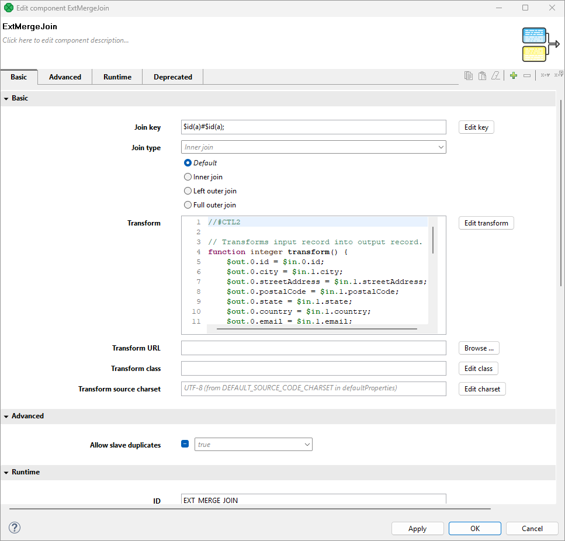
*Figure 209. Edit component dialog (Properties tab)*

##### Basic

These are the basic attributes of the components. These attributes depend on the type of the component. They can be either required or optional.

They may be specific for an individual component, for a category of components or for most of the components.

- **Required** - Required attributes are marked by a warning sign. Some of them can be expressed in two or more ways; two or more attributes can serve the same purpose.
- **Optional** - They are displayed without any warning sign.

##### Advanced

These attributes contain complex (advanced) or specific use case related settings of the components.

Advanced attributes may be specific for an individual component, for a category of components, or for most of the components.

##### Deprecated

These attributes were used in older releases of **CloverDX Designer** and they still remain here and can be used even now. However we suggest you do not use them unless necessary.

May be specific for an individual component, for a category of components or for most of the components.

##### Custom

The **Custom** attributes are defined by the user. Use the button at the top of the dialog to add a new custom attribute.

##### Runtime

These attributes are also common for all components.

- **ID** - a unique identifier of a component. If you check **Generate component ID from its name** in **Window** ****Preferences** ****CloverDX** and your component is called e.g. `Write employees to XML`, then it automatically gets the ID `WRITE_EMPLOYEES_TO_XML`. While the option is checked, the ID changes every time you rename the component.
- **Component type** - Describes the type of the component. By adding a number to this component type, you can get a component ID.
- **Specification** - Describes the function of the component. It cannot be changed.
- **Phase** - An integer number of the phase to which the component belongs. All components with the same phase number run in parallel. And all phase numbers follow each other. Each phase starts after the previous one has terminated successfully; otherwise, data parsing stops.
  For more detailed description, see [Phases](components.md#phases).
- **Enabled** - Specifies whether the component should be **enabled**, **disabled** or whether it should run in a **passThrough** mode. This can also be set in the **Properties** tab or in the context menu (except the **passThrough** mode).
  For a more detailed description, see [Enable/disable component](components.md#enabledisable-component).
- **Pass through input port** - If the component runs in the **passThrough** mode, you should specify which input port should receive the data records and which output port should send the data records out. This attribute serves to select the input port from the combo list of all input ports.
- **Pass through output port** - If the component runs in the **passThrough** mode, you should specify which input port should receive the data records and which output port should send the data records out. This attribute serves to select the output port from the combo list of all output ports.
- **Allocation** - If the graph is executed in Cluster, this attribute must be specified in the graph.
  For more detailed description, see [Component allocation](components.md#component-allocation).
> [!IMPORTANT]
> **Java-style Unicode expressions**
>
> Remember that since version **3.0**, you can also use the Java-style Unicode expressions anyway (except in URL attributes).
>
> You may use one or more Java-style Unicode expressions, for example: `\u0014`.
>
> Such expressions consist of series of the `\uxxxx` codes of characters.
>
> They may also serve as delimiter (like CTL expression shown above, without any quotes):
>
> `\u0014`

#### Common properties of components

Some properties are common for all components or at least for most of them:

- You can choose which components should be displayed in the **Palette of Components** and which should be removed from there ([Components in Palette](designer-layout.md#components-in-palette)).
- Each component can be set up using **Edit component dialog** ([Edit component dialog](components.md#edit-component-dialog)).

Among the properties that can be set in this **Edit component dialog**, the following are described in more detail:

- Each component has a label with **Component name** ([Component name](components.md#component-name)).
- Each graph can be processed in phases ([Phases](components.md#phases)).
- Components can be disabled ([Enable/disable component](components.md#enabledisable-component)).
- Components can have specified on which cluster nodes they will be executed ([Component allocation](components.md#component-allocation)).

##### Component name

Each component has a label which can be changed. Since you can have multiple components in a graph, each with specified function, you can name them accordingly for easier reference.

You can rename any component in one of the following four ways:

- In the **Edit component** dialog by specifying the **Component name** attribute.
- In the **Properties** tab by specifying the **Component name** attribute.
- By highlighting and clicking it.
  If you highlight any component (by clicking the component itself or by clicking its item in the **Outline** pane), a hint appears showing the name of the component. After clicking the component, a rectangle appears below the component, showing the **Component name** on a blue background. You can change the name shown in this rectangle and press **Enter**.
  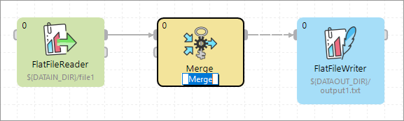
  *Figure 210. Simple renaming components*
- You can right-click the component and select **Rename** from the context menu. After that, the same rectangle as mentioned above appears below the component. You can rename the component in the way described above.

##### Phases

Each graph can be divided into several phases by setting the phase numbers on components. You can see this phase number in the upper left corner of every component.

The meaning of a phase is that each graph runs in parallel within the same phase number; i.e. each component and each edge that have the same phase number run simultaneously. If the process stops within some phase, higher phases do not start. Only after all processes within one phase terminate successfully, will the next phase start.

That is why phases must remain the same while a graph is running. They cannot descend.

So, when you increase some phase number on any of the graph components, all components with the same phase number (unlike those with higher phase numbers) lying further along the graph change their phase to this new value automatically.

You can select more components and set their phase number(s). Either you set the same phase number for all selected components or you can choose the step by which the phase number of each individual component should be incremented or decremented.

To do that, use the following **Phase setting** wizard:

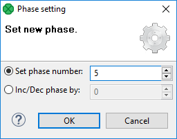
*Figure 211. Setting the phases for more components*
> [!TIP]
> When assigning phases to individual graphs, you should consider an increment by a number higher than 1 (e.g. 5, 10, 15…​). This way, you can later add phased graphs in between two phases, without a need to adjust all consecutive phases.

##### Component allocation

This attribute is taken into account only on the **CloverDX cluster** environment.

The **Allocation** attribute is common for all Components. This attribute is used for cluster graph processing to plan how many instances of a component will be executed and on which cluster nodes. Allocation is our basic concept for parallelization of data processing and inter-cluster-node data routing.

Allocation can be specified in three different ways:

- based on number of workers - the component will be executed in requested instances on some cluster nodes, which are preferred by **CloverDX cluster**;
- based on a reference on a partitioned sandbox - the component will be executed on all cluster nodes where the partitioned sandbox has a location;
  > [!NOTE]
  > This allocation type is transparently used as a default for most of data readers and data writers which refer to a file in a partitioned sandbox.
- allocation defined by a list of cluster node identifiers (a cluster node can be used more times)

Allocation is automatically inherited from neighboring components. Therefore, continuous graph may have only a single component with an allocation and this allocation is used by all other components as well. All components of clustered graphs are decorated by the number of instances (x3) in which the component will be finally executed - so called allocation cardinality. These annotations are updated on a graph save operation. Allocation cardinality derived from neighbors is indicated in gray italic font and the cardinality derived from an allocation defined right on the component is printed out with a solid font.

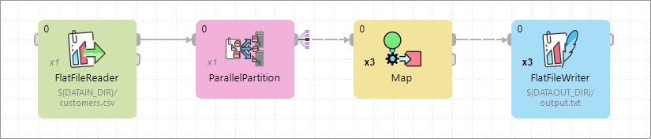
*Figure 212. Allocation cardinality decorator*

Two interconnected components have to have compatible allocations - the number of specified workers has to be equal. The only exception from this rule are Cluster components, which are dedicated just to change the level of parallelism. **Parallel Partitioners** change a single-worker allocation to multi-worker allocation. On the other hand, **Parallel Gatherers** change a multi-worker allocation to single-worker allocation.

For more details about clustered graph processing, see [Data partitioning in cluster](../admin/cluster-setup-index.md#cluster-introduction).

#### Specific attribute types

Here is a brief overview of complex attribute types. These attribute types are common for various groups of components.

Links to corresponding sections follow:

- When you need to specify a file in a component, you need to use [URL file dialog](common-dialogs.md#url-file-dialog).
- Some components use a specific metadata structure on their ports. The connected edges can be easily assigned metadata from predefined templates. See [Metadata templates](components.md#metadata-templates).
- Some components can be configured with a time interval (usually a delay or a timeout). For an overview of the syntax of time interval specification, see [Time intervals](components.md#time-intervals) .
- In some of the components, records must be grouped according to values of a group key. In this key, neither the order of key fields nor the sort order are of importance. See [Group key](components.md#group-key).
- In some of the components, records must be grouped and sorted according to the values of a sort key. In this key, both the order of key fields and the sort order are of importance. See [Sort key](components.md#sort-key).
- In many components from different groups of components, a transformation can be or must be defined. See [Defining transformations](transformations.md#defining-transformations).

##### Time intervals

The following time units may be used when specifying time intervals:
`w`
week (7 days)
`d`
day (24 hours)
`h`
hour (60 minutes)
`m`
minute (60 seconds)
`s`
second (1000 milliseconds)
`ms`
millisecond

The units may be arbitrarily combined, but their order must be from the largest to the smallest one.
Example 5. Time interval specification
`1w 2d 5h 30m 5s 100ms` = 797405100 milliseconds

`1h 30m` = 5400000 milliseconds

`120s` = 120000 milliseconds

When no time unit is specified, the number is assumed to denote the default unit, which is component-specific (usually milliseconds).

**See also:**[ExecuteJobflow](executejobflow.md), [ExecuteGraph](executegraph.md), [ExecuteWranglerJob](executewranglerjob.md), [ExecuteMapReduce](executemapreduce.md), [ExecuteScript](executescript.md), [MonitorGraph](monitorgraph.md), [HTTPConnector](httpconnector.html), [Sleep](sleep.md), [SystemExecute](sysexecute.md), [WebServiceClient](webserviceclient.md)

##### Group key

Sometimes you need to select fields that will create a grouping key. This can be done in the **Edit key** dialog. After opening the dialog, you need to select the fields that should create the group key.

Select the fields you want and drag and drop each of the selected key fields to the **Key parts** pane on the right. (You can also use the **Arrow** buttons.)

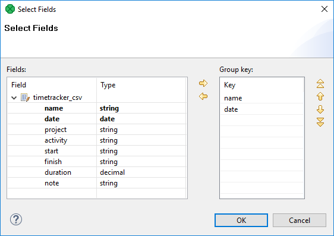
*Figure 213. Defining group key*

After selecting the fields, you can click the **OK** button and the selected field names will turn to a sequence of the same field names separated by a semicolon. This sequence can be seen in the corresponding attribute row.

The resulting group key is a sequence of field names separated by a semicolon. It looks like this: `FieldM;…FieldN`.

In this kind of key, no sort order is shown unlike in **Sort key**. By default, the order is ascending for all fields and priority of these fields descends down from top in the dialog pane and to the right from the left in the attribute row. For more detailed information, see [Sort key](components.md#sort-key).

When a key is defined and used in a component, input records are gathered together into a group of the records with equal key values.

###### Ordering type

The key is ordered in following ways:

1. *Ascending* - if the input records are sorted in ascending order
2. *Descending* - if the input records are sorted in descending order
3. *Auto* - the sorting order of the input records is guessed from the first two records with different value in the key field, i.e., from the first records of the first two groups.
4. *Ignore* - if the input records with the same key field value(s) are not sorted

Group key is used in the following components:

- **Group key** in [SortWithinGroups](sortwithingroups.md)
- **Merge key** in [Merge](merge.md)
- **Partition key** in [Partition](partition.md), and [ParallelPartition](clusterpartition.md)
- **Aggregate key** in [Aggregate](aggregate.md)
- **Key** in [Denormalizer](denormalizer.md)
- **Group key** in [Rollup](rollup.md)
- Also **Partition key** that serves for distributing data records among different output ports (or Cluster nodes in case of **clusterpartition**) is of this type. See [Partitioning output into different output files](partitioning-output-into-different-output-files.md)

##### Sort key

In some of the components you need to define a sort key. Like a group key, this sort key can also be defined by selecting key fields using the **Edit key** dialog. There you can also choose what sort order should be used for each of the selected fields.

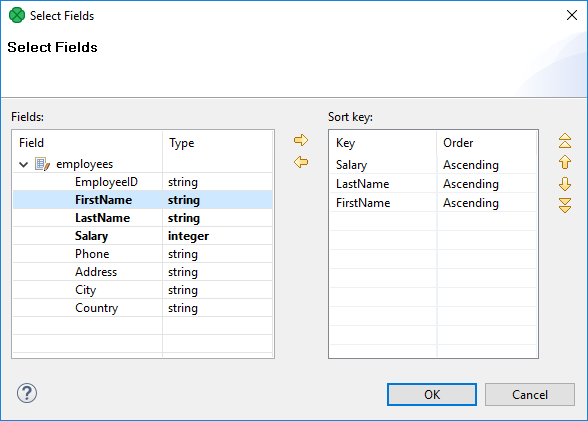
*Figure 214. Defining Sort key and Sort order*

In the **Edit key** dialog, select the fields you want and drag and drop each of the selected key fields to the **Key** column of the **Key parts** pane on the right. (You can also use the **Arrow** buttons.)

Unlike in the case of a group key, in any sort key the order in which the fields are selected is of importance.

In every sort key, the field at the top has the highest sorting priority. Then the sorting priority descends down from top. The field at the bottom has the lowest sorting priority.

When you click the **OK** button, the selected fields will turn to a sequence of the same field names and an `a` or `d` letter in parentheses (with the meaning: `ascending` or `descending`, respectively) separated by a semicolon.

It can look like this: `FieldM(a);…FieldN(d)`.

This sequence can be seen in the corresponding attribute row. (The highest sorting priority has the first field in the sequence. The priority descends towards the end of the sequence.)

As you can see, in this kind of key, the sort order is expressed separately for each key field (either **Ascending** or **Descending**). The default sort order is **Ascending**. The default sort order can also be changed in the **Order** column of the **Key parts** pane.
> [!IMPORTANT]
> **ASCIIbetical vs. alphabetical order**
>
> Remember that `string` data fields are sorted in ASCII order (0,1,11,12,2,21,22 …​ A,B,C,D …​ a,b,c,d,e,f …​) while the other data type fields in the alphabetical order (0,1,2,11,12,21,22 …​ A,a,B,b,C,c,D,d …​).
Example 6. Sorting
If your sort key is the following: `Salary(d);LastName(a);FirstName(a)`. The records will be sorted according to the `Salary` values in descending order, then the records will be sorted according to `LastName` within the same `Salary` value and they will be sorted according to `FirstName` within the same `LastName` and the same `Salary` (both in ascending order) value.

Thus, any person with `Salary` of `25000` will be processed after any other person with a salary of `28000`. And, within the same `Salary`, any `Brown` will be processed before any `Smith`. And again, within the same salary, any `John Smith` will be processed before any `Peter Smith`. The highest priority is `Salary`, the lowest is `FirstName`.

Sort key is used in the following cases:

- **Sort key** in [ExtSort](extsort.md)
- **Sort key** in [FastSort](fastsort.md)
- **Sort key** in [SortWithinGroups](sortwithingroups.md)
- **Sort key** in [SequenceChecker](sequencechecker.md)

### Enable/disable component

| [Enabling component](components.md#enabling-component) |
| --- |
| [Disabling component](components.md#disabling-component) |
| [Enabling by graph parameter](components.md#enabling-by-graph-parameter) |
| [Enabling by connected input port](components.md#enabling-by-connected-input-port) |
| [Disable as Trash](components.md#disable-as-trash) |

Each component can be enabled or disabled. It can be turned on or off explicitly or by using a graph parameter. In subgraphs, components can be enabled in dependence on connected or disconnected ports of a subgraph component.

When you disable a component, it becomes gray and does not parse data when the process starts. If a component is disabled, data coming to the component is sent to the next one. If there is no such component, the graph fails.

Data parsed by a component must be sent to other components and if it is not possible, parsing is impossible as well.

Disabling can be done in the context menu or **Properties** tab. You can see the following example of a situation when parsing is possible even with a disabled component:

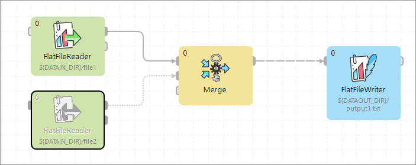
*Figure 215. Graph with disabled component*

You can see that data records from the disabled component are not necessary for the **Merge** component so parsing is possible. But if you disabled the **Merge** component, readers before this component would not have at their disposal any component to which they could send their data records and graph would terminate with an error.

#### Enabling component

Choose the component and right click to display the **Context Menu**. Select **Enable**.

The component is enabled. All components are enabled by default.

You can enable the component by pressing Shift+E, too.

#### Disabling component

Choose the component and right click to display the **Context Menu**. Select **Disable**.

Component is disabled. Any records sent to the component will be **passed through** (will be sent to the following component).

You can disable the component by pressing Shift+D, too.

#### Enabling by graph parameter

Choose the component and right click to display the **Context Menu**. Select **Enable with condition** ****By Graph Parameter**. Finally, select the right parameter from a dialog.

If there is no suitable parameter, you can create a new one. In the dialog, click the **Create new parameter** button.

The component will be enabled or disabled depending on a value of the graph parameter. The graph parameter has to contain one of the following values:

- `enabled` - the component is enabled (it has an alias `true`).
- `disabled` - the component is disabled (it has an alias `false`).
- `trash` - the component will behave like **Trash** component, all following components are disabled.
> [!NOTE]
> You need an existing graph parameter to see the **By Graph Parameter** option.

#### Enabling by connected input port

This option is available in subgraphs with optional ports only - at least one port of a subgraph has to be marked as optional to see the option in a context menu.

Choose the component and right click to display the **Context Menu**. To enable the component in case the first input port is connected, select **Enable** ****Input Port 0** ****Is Connected**.

You can choose another port depending on your graph and intention. You can also enable the component in case the port is disconnected by using the **Is Disconnected** option.

See also [Optional Ports](subgraphs.md#optional-ports).

##### Disable as Trash

**Disable as Trash** disables all subsequent components. The component behaves like **Trash** - it discards all incoming records.

Right click the component and select **Disable as Trash** from the context menu. A trash icon appears on the component and all subsequent components turn gray.

**Disable as Trash** is useful for graph development.

You can **Disable as Trash** the component by pressing Shift+T, too.

#### Disabled components and pass-through behavior

When a component is [disabled](components.md#enabledisable-component), it doesn’t process or pass any data. However, its configuration influences how downstream components behave.

The data itself does not flow through the disabled component. Instead, the **Pass through output port** setting determines which output port is considered active for validation. Components connected to this port will not error out, even though they receive no data. Other connected components, on different ports, will show an error because they appear to be missing input.

In general, passthrough does not need to be configured—it works out of the box using the first output port by default (port 0). Configuration is only necessary if you need to simulate pass-through behavior on a different output port.

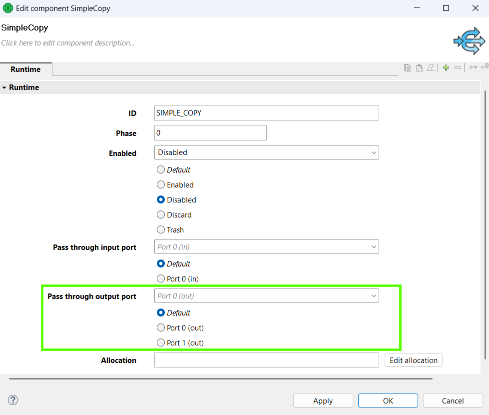

In the example below, the default pass-through setting (port 0) of the *SimpleCopy* component leaves the second *Trash* component with a missing input error.

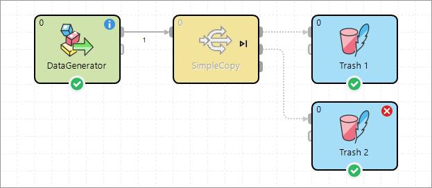
*Figure 216. Default pass-through option*

Setting the pass-through to Port 1 avoids the error on the second *Trash* component by treating that connection as valid, making the first Trash component invalid in this case.

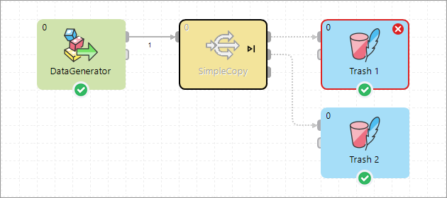
*Figure 217. Pass through port set to port 1*

This mechanism allows you to suppress validation errors and control graph behavior during testing or development when some components are turned off.

### Metadata templates

Some components require metadata on their ports to have a specific structure. For example, see [Error metadata for FlatFileReader](flatfilereader.md#flatfilereader-error-metadata). For some other components, such as [File Operations](file-operations.md), the metadata structure is not required, but recommended. In both cases, it is possible to make use of pre-defined metadata templates.

In order to create a new metadata with the recommended structure, right-click an edge connected to a port which has a template defined, select **New metadata from template** from the context menu, and then pick a template from the submenu.

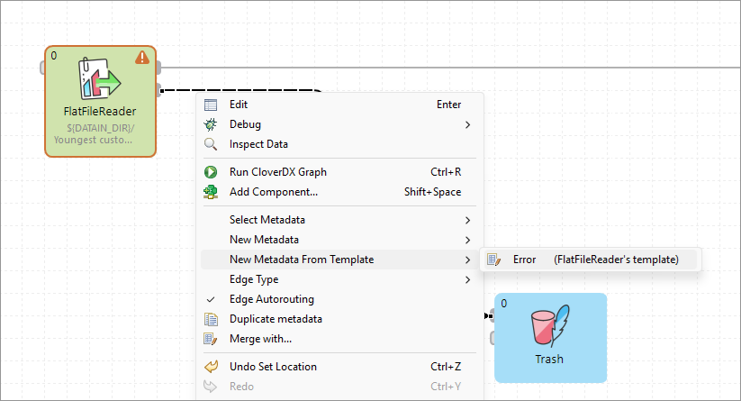
*Figure 218. Creating metadata from a template*

### Finding components in jobs

If you have a complex graph and cannot find components quickly and easily, press Ctrl+O to open the **Find component** dialog. The searched text is highlighted both in component names and description:

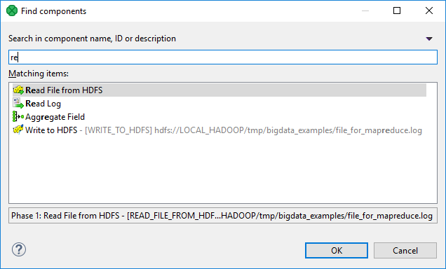
*Figure 219. Find components dialog*

As you type, the components are searched by their:

- name - for example, if you rename **FlatFileReader** to **read customers from text file**, you can search the component by typing *customers*, *text file*, etc.
- description - both the default description and the custom one you have added to a component can be searched.

After that:

1. Click the component in the search results.
2. Press Enter
3. The component will flash several times and at the same time it will be selected and focused in your graph layout.
