<!-- Development > Job elements > Metadata > Creating metadata -->

### Creating metadata

As mentioned above, metadata describes the structure of data.

Data itself can be contained in flat files, XLS files, DBF files, XML files, or database tables. You need to extract or create metadata in a different way for each of these data sources. You can also create metadata by hand.

Each description below is valid for both internal and external (shared) metadata.

| [Extracting metadata from a flat file](creating-metadata.md#extracting-metadata-from-a-flat-file) |
| --- |
| [Extracting metadata from an XLS(X) file](creating-metadata.md#extracting-metadata-from-an-xlsx-file) |
| [Extracting metadata from a database](creating-metadata.md#extracting-metadata-from-a-database) |
| [Extracting metadata from a DBase File](creating-metadata.md#extracting-metadata-from-a-dbase-file) |
| [Extracting metadata from Salesforce](creating-metadata.md#extracting-metadata-from-salesforce) |
| [SQL Query metadata](metadata-types.md#sql-query-metadata) |
| [User defined metadata](creating-metadata.md#user-defined-metadata) |

#### Extracting metadata from a flat file

When you want to create metadata by extracting them from a flat file, right click **Metadata** in **Outline** and select **New metadata** ****Extract from flat file**. After that, the **Flat file** wizard opens.

In the wizard, type the file name or locate it using the **Browse…​** button. Once you have selected the file, you can specify the **Encoding** and **Record type** options as well. The default **Encoding** is `UTF-8` and the default **Record type** is `delimited`.

If the fields of records are separated from each other by some delimiters, you may agree with the default **Delimited** as the **Record type** option. If the fields are of some defined sizes, you need to switch to the **Fixed Length** option.

After selecting the file, its contents will be displayed in the **Input file** pane. See below:

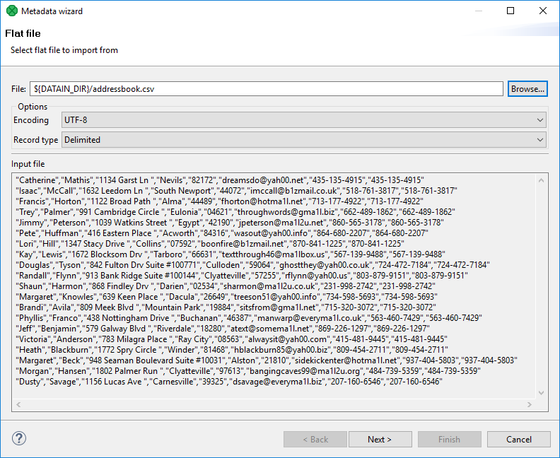
*Figure 229. Extracting metadata from delimited flat file*

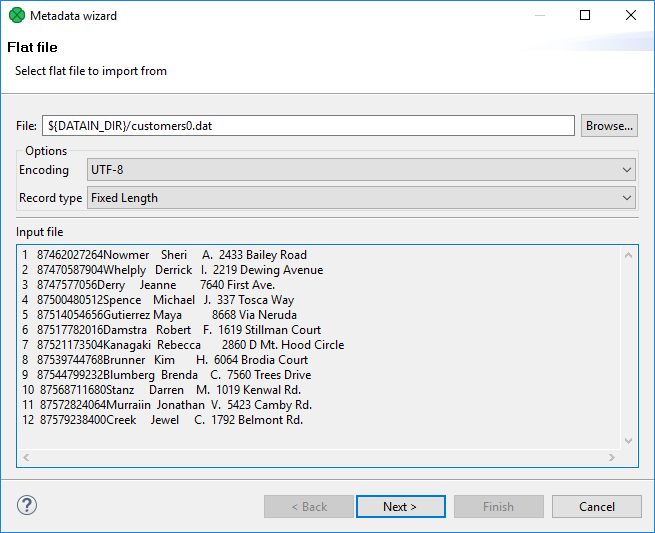
*Figure 230. Extracting metadata from fixed length flat file*

##### Extracted metadata preview

After clicking **Next**, you can see more detailed information about the content of the input file and the delimiters in the **Metadata** dialog. It consists of four panes. The first two are at the upper part of the window, the third is at the middle, the fourth is at the bottom. Each pane can be expanded to the whole window by clicking the corresponding symbol in its upper right corner.

The first two panes at the top are the panes described in [Metadata Editor](metadata-editor.md). If you want to set up the metadata, you can do it in the way explained in more details in the mentioned section. You can click the symbol in the upper right corner of the pane after which the two panes expand to the whole window. The left and the right panes can be called the **Record** and the **Details** panes, respectively. In the **Record** pane, there are displayed either **Delimiters** (for delimited metadata), or **Sizes** (for fixed length metadata) of the fields or both (for mixed metadata only).

After clicking any of the fields in the **Record** pane, detailed information about the selected field or the whole record will be displayed in the **Details** pane.

Some **Properties** have default values, whereas others have not.

In this pane, you can see the **Basic** properties (**Name** of the field, **Type** of the field, **Delimiter** after the field, **Size** of the field, **Nullable**, **Default** value of the field, **Skip source rows**, **Description**) and **Advanced** properties (**Format**, **Locale**, **Autofilling**, **Shift**, **EOF as delimiter**). For more details on how you can change the metadata structure, see [Metadata Editor](metadata-editor.md).

You can change some metadata settings in the third pane. You can specify whether the first line of the file contains the names of the record fields. If so, you need to check the **Extract names** checkbox. If you want, you can also click some column header and decide whether you want to change the name of the field (**Rename**) or the data type of the field (**Retype**). If there are no field names in the file, **CloverDX Designer** gives them the names **Field#** as the default names of the fields. By default, the type of all record fields is set to `string`. You can change this data type for any other type by selecting the right option from the presented list. These options are as follows: `boolean`, `byte`, `cbyte`, `date`, `decimal`, `integer`, `long`, `number`, `string`. For more detailed description, see [Data Types in metadata](metadata-records-and-fields.md#data-types-in-metadata).

This third pane is different between **Delimited** and **Fixed Length** files. See:

- [Extracting metadata from delimited Files](creating-metadata.md#extracting-metadata-from-delimited-files)
- [Extracting metadata from fixed length files](creating-metadata.md#extracting-metadata-from-fixed-length-files)

At the bottom of the wizard, the fourth pane displays the contents of the file.

In case you are creating internal metadata, click the **Finish** button. If you are creating external (shared) metadata, click the offered **Next** button, then select the folder (`meta`) and name of metadata and click **Finish**. The extension `.fmt` will be added to the metadata file automatically.

##### Extracting metadata from delimited files

If you expand the pane in the middle to the whole wizard window, you will see the following:

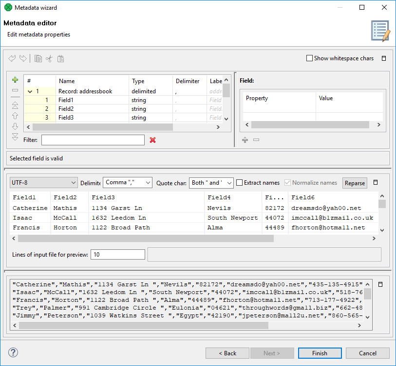
*Figure 231. Setting up delimited metadata*

You may need to specify which delimiter is used in the file (**Delimiter**). The delimiter can be a comma, colon, semicolon, space, tabulator, or a sequence of characters. You need to select the right option.

Finally, click the **Reparse** button, after which you will see the file as it has been parsed in the pane below.

The **Normalize names** option allows you to get rid of invalid characters in fields. They will be replaced with the underscore character (_). This is available only with **Extract names** checked.

Alternatively, use the **Quote char** combo box to select which kind of quotation marks should be removed from string fields. Do not forget to click **Reparse** after you have selected one of the options: **"** or **'** or **Both " and '**. Quotation marks have to form a pair and selecting one kind of **Quote char** results in ignoring the other one (e.g. if you select " then they will be removed from each field while all ' characters are treated as common strings). If you need to retain the actual quote character in the field, it has to be escaped, e.g. "" - this will be extracted as a single ". Delimiters (selected in **Delimiter**) surrounded by quotes are ignored. Moreover, you can enter your own delimiter into the combo box as a single character, e.g. the pipe - type only | (no quotes around).

Examples:

`"person"` - will be extracted as `person` (**Quote char** set to **"** or **Both " and '**).

`"address"1` - will not be extracted and the field will show an error; the reason is the delimiter is expected right after the quotes (`"address";` would be fine with ; as the delimiter).

`first"Name"` - will be extracted as `first"Name"` - if there is no quotation mark at the beginning of the field, the whole field is regarded as a common string.

`"'doubleQuotes'"` (**Quote char** set to **"** or **Both " and '**) - will be extracted as `'doubleQuotes'` as only the outer quotation marks are always removed and the rest of the field is left untouched.

`"unpaired` - will not be extracted as quotation marks have be in pair; this would be an error

`'delimiter;'` (with **Quote char** set to **'** or **Both " and '** and **Delimiter** set to ;) - will be extracted as `delimiter;` as the delimiter inside quotation marks is ignored.

##### Extracting metadata from fixed length files

If you expand the pane in the middle to the whole wizard window, you will see the following:

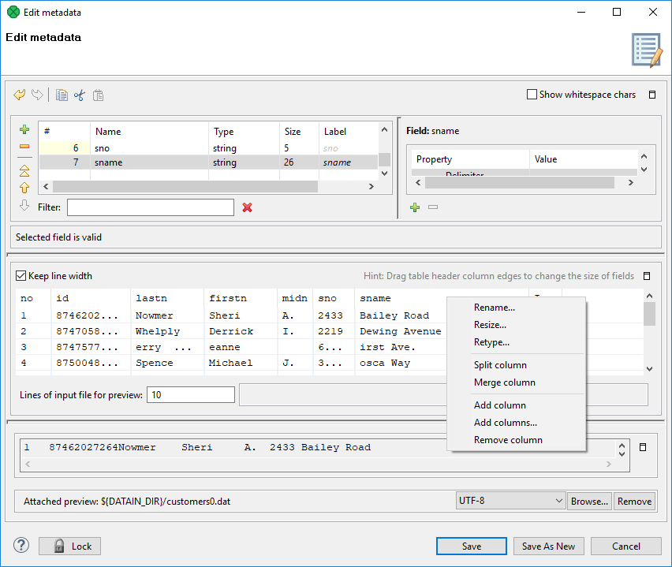
*Figure 232. Setting up fixed length metadata*

You must specify the sizes of each field (**Resize**). You may also want to split any column, merge columns, add one or more columns, remove columns. You can change the sizes by moving the borders of the columns.

##### Extracting metadata from an XLS(X) file

If you want to extract metadata from an XLS(X) file, right-click **Metadata** (in **Outline**) and select **New metadata** ****Extract from XLS(X) file**.
> [!TIP]
> Equally, you can drag an XLS file from the **Project Explorer** area and drop it on **Metadata** in the **Outline**. This will also bring the extracting wizard described below.

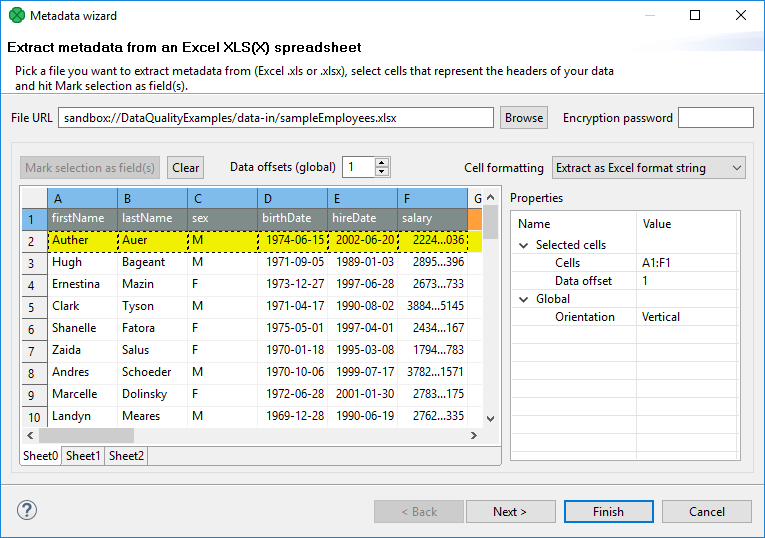
*Figure 233. Extract metadata from Excel Spreadsheet wizard*

In this wizard:

- **Browse** for the desired XLS file and click **OK**.
- Choose the orientation of the source data. In **Properties** ****Global** ****Orientation**, you can switch between **Vertical** processing (row by row) or **Horizontal** processing (column by column).
- Select cells representing the header of your data. You can do that by clicking a whole Excel row/column, clicking and drawing a selection area, Ctrl-clicking or Shift-clicking cells just like you would do in Excel. By default, the first row is selected.
- Click **Mark selection as fields**. Cells you have selected will change color and will be considered metadata fields from now on. If you change your mind, click a selected cell and click **Clear** to not extract metadata from it.
- For each field, you need to specify a cell providing a sample value. The wizard then derives the corresponding metadata type from it. By default, a cell just underneath a marked cell is selected (notice its dashed border), see below. In the figure, 'Percent' will become the field name while '10,00%' determines the field type (which would be `long` in this case). To change the area where sample values are taken from, adjust **Data offset** (more on that below). 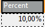
  As for colors: orange cells form the header, yellow ones indicate the beginning of the area data is taken from.

Optional tasks you can do in this dialog:

- Type in **Encryption password** if the source file is locked. Be sure to type the password exactly as it should be, including correct letter case or special characters.
  Type the password before specifying the file.
- **Data contains headers** - cells marked for field extraction will be considered headers. Data type and format is extracted from cells below the marked ones - with respect to the current **Data offset**.
- **Extract formats** - for each field, its **Format** property will get populated with a pattern corresponding to the sample data. This format pattern will appear in the next step of the wizard, in **Property** ****Advanced** ****Format** as e.g. #0.00%. For more information, see [Numeric Format](metadata-records-and-fields.md#numeric-format).

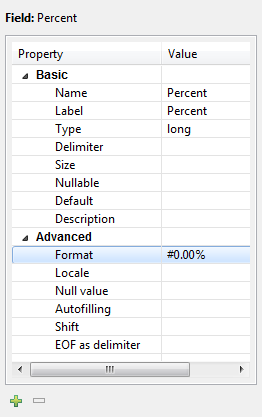
*Figure 234. Format extracted from Spreadsheet cell*
> [!CAUTION]
> The format extracted from metadata is not relevant to **Format field** in [SpreadsheetDataReader](spreadsheetreader.md). **Format field** is an extra metadata field holding the Excel format of a particular cell (as a string).

- Adjust **Data offset** (in the right-hand **Properties** pane, **Selected cells** tab). In metadata, data offset determines where data types are guessed from. Basically, its value represents 'a number of rows (in vertical mode) or columns (in horizontal mode) to be omitted'. By default, data offset is 1 ('data beginning in the following row'). Click the spinner  in the **Value** field to adjust data offset smoothly. Notice how modifying data offset is visualized in the sheet preview - you can see the 'omitted' rows change color.

As a final step, click either **Finish** or **Next**. If you use **Next**, you can change the metadata name.

##### Extraction of metadata from XLS(X) file into external metadata file

You can extract metadata from an XLS(X) file and save it to an external file. In main menu, choose **File** ****New** ****Other**. A new window opens. In the window, choose **CloverDX** ****Metadata** ****metadata (Extract metadata from XLS(X) file)**.

The last step of the wizard lets you specify the metadata file name and its location.

#### Extracting metadata from a database

If you want to extract metadata from a database (when you select the **Extract from database** option), you must have some database connection defined prior to extracting metadata.

In addition, if you want to extract internal metadata from a database, you can also right-click any connection item in the **Outline** pane and select **New metadata** ****Extract from database**.

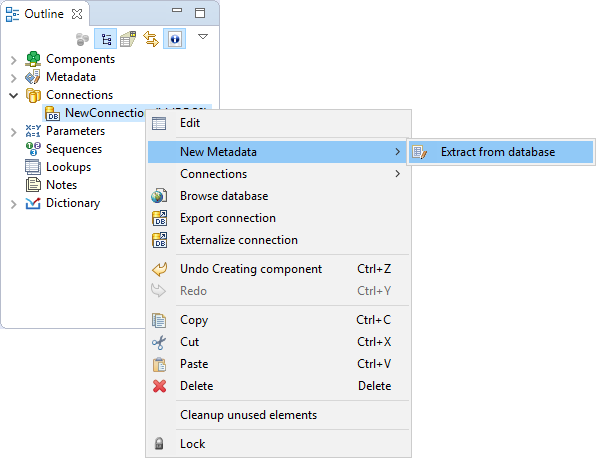
*Figure 235. Extracting internal metadata from a database*

After each of these three options, a **Database Connection** properties dialog opens.

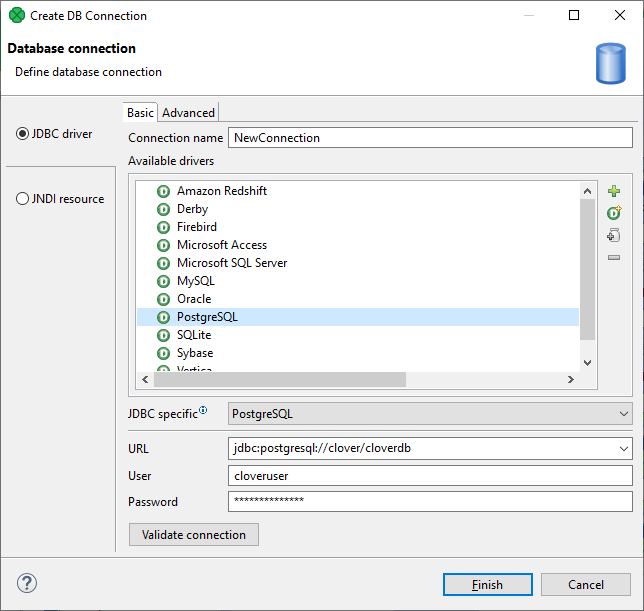
*Figure 236. Database connection properties dialog*

In order to extract metadata, you must first select database connection from the existing ones (using the **Connection** menu) or load a database connection using the **Load from file** button or create a new connection as shown in the corresponding section. Once it has been defined, **Name**, **User**, **Password**, **URL** and/or **JNDI** fields become filled in the **Database Connection** wizard.

Then click **Next** to see a database schema.

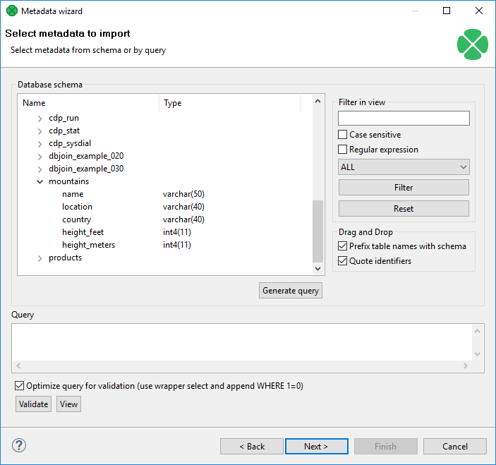
*Figure 237. Selecting columns for metadata*

Now you have two possibilities:

Either you write a query directly, or you generate the query by selecting individual columns of database tables.

If you want to generate the query, hold Ctrl on the keyboard, highlight individual columns from individual tables by clicking the mouse button and click the **Generate** button. The query will be generated automatically.

See the following window:

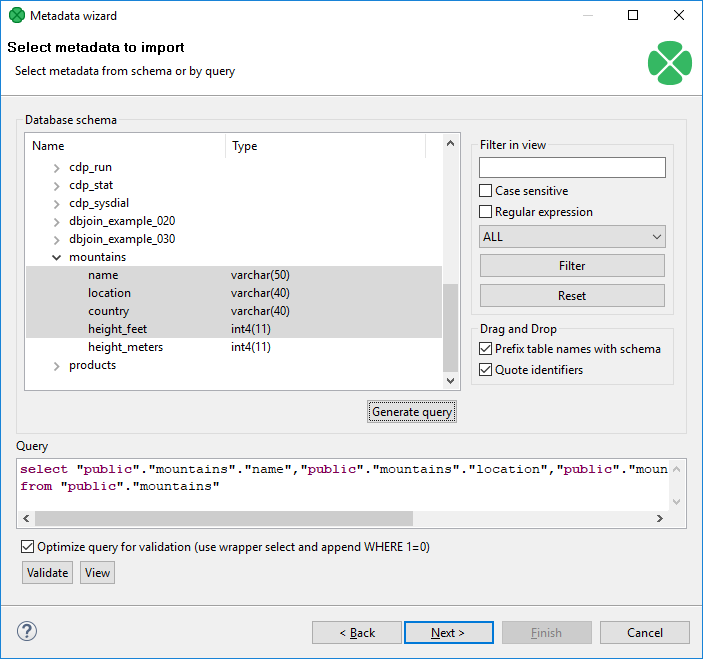
*Figure 238. Generating a query*

If you check the **Prefix table names with schema** checkbox, it will have the following form: `schema.table.column`. If you check the **Quote identifiers** checkbox, it will look like one of this: `"schema"."table"."column"` (**Prefix table names with schema** is checked) or `"table"."column"` only (the mentioned checkbox is not checked). This query is also generated using the default (**Generic**) JDBC specific. Only it does not include quotes.

Remember that **Sybase** has another type of query which is prefixed by schema. It looks like this:

`"schema"."dbowner"."table"."column"`
> [!IMPORTANT]
> Remember that quoted identifiers may differ for different databases. They are:
>
> - **double quotes**
>   **DB2**, **Informix** (for **Informix**, the `DELIMIDENT` variable must be set to `yes`, otherwise no quoted identifiers will be used), **Oracle**, **PostgreSQL**, **SQLite**, **Sybase**
> - **back quotes**
>   **Infobright**
> - **backslash with back quotes**
>   **MySQL** (back quote is used as inline CTL special character)
> - **square brackets**
>   **MSSQL**
> - **without quotes**
>   When the default (**Generic**) JDBC specific is selected for corresponding database, the generated query will not be quoted at all.

Once you have written or generated the query, you can check its validity by clicking the **Validate** button.

Then you must click **Next**. After that, **Metadata****Editor** opens. In it, you must finish the extraction of metadata. If you wish to store the original database field length constraints (especially for `strings`/`varchars`), choose the **fixed** length or **mixed** record type. Such metadata provide the exact database field definition when used for creating (generating) table in a database, see [Create Database Table from metadata](metadata-merge.md#creating-database-table-from-metadata-and-database-connection).

- By clicking the **Finish** button (in case of internal metadata), you will get internal metadata in the **Outline** pane.
- On the other hand, if you wanted to extract external (shared) metadata, you must click the **Next** button first, after which you will be prompted to decide which project and which subfolder should contain your future metadata file. After expanding the project, selecting the `meta` subfolder, specifying the name of the metadata file and clicking **Finish**, it is saved into the selected location.

#### Extracting metadata from a DBase file

When you want to extract metadata from a DBase file, you must select the **Extract from DBF file** option.

Locate the file from which you want to extract metadata. The file will open in the following editor:

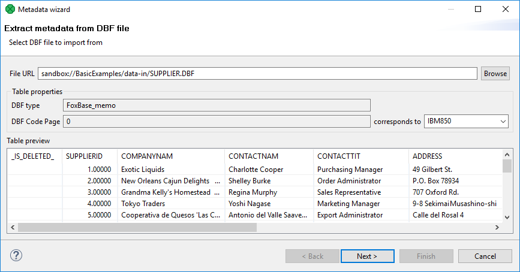
*Figure 239. DBF metadata editor*

**DBF type**, **DBF Code Page** will be selected automatically. If they do not correspond to what you want, change their values.

When you click **Next**, the **Metadata Editor** with extracted metadata will open. You can keep the default metadata values and types and click **Finish**.

#### Extracting metadata from Salesforce

To extract metadata from Salesforce object, right click an edge and select **New metadata** ****Extract from salesforce** from context menu.

A wizard for metadata extraction from Salesforce opens.

In the first step, select an existing Salesforce connection or create a new one.

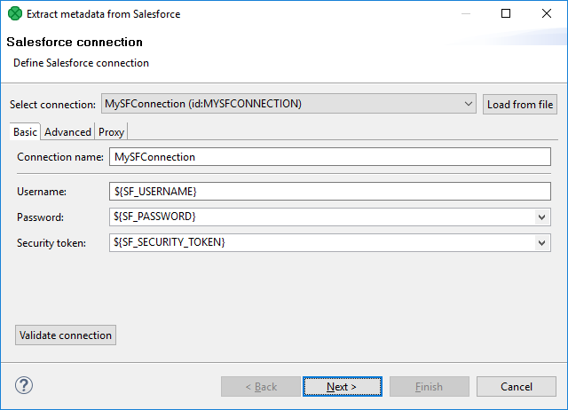
*Figure 240. Extract metadata from Salesforce - specify connection*

In the second step, enter an SOQL query. You can use Workbench, [https://workbench.developerforce.com/](https://workbench.developerforce.com/), to create an SOQL query and then paste the query to this metadata extraction wizard.

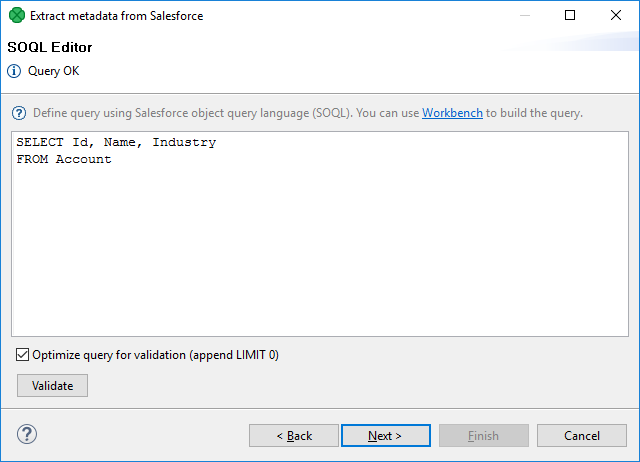
*Figure 241. Extract metadata from Salesforce - enter SOQL query*

In the last step, check the created metadata. In this step, you can do some customization, e.g. you can rename the record.

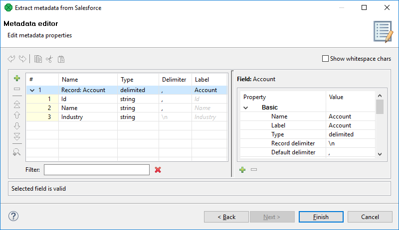
*Figure 242. Extract metadata from Salesforce - edit created metadata*

##### See also

| [Salesforce connections](salesforce-connections.md) |
| --- |
| [SalesforceBulkReader](salesforcebulkreader.md) |
| [SalesforceReader](salesforcereader.md) |
| [SalesforceBulkWriter](salesforcebulkwriter.md) |

#### SQL Query metadata

To create metadata from an SQL query, right click **Metadata** in the **Outline** pane and select **New metadata** ****SQL query metadata**. After that, the SQL query metadata editor opens.

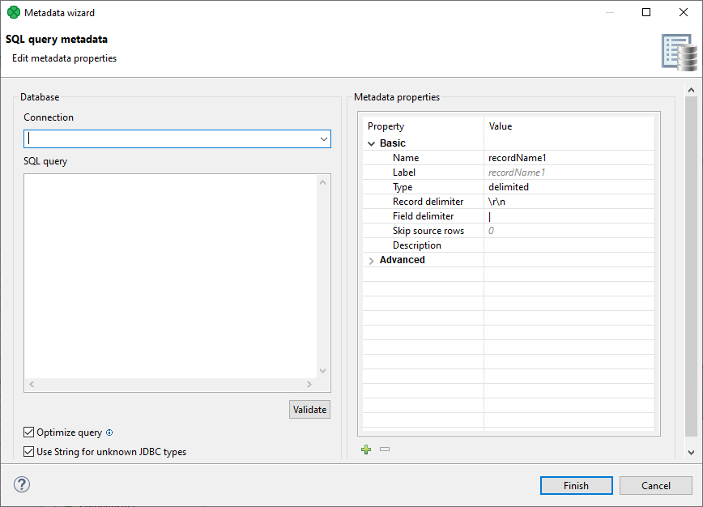
*Figure 243. SQL query metadata editor*

In the left pane of this editor, you have to provide a connection to database and an SQL query. You can either [create a new connection](database-connections.md#database-connection-properties), or [link to an existing one](database-connections.md#linking-external-shared-database-connections). The SQL Query can be validated - if the query is invalid an error message is shown.

The result of the SQL query is automatically converted to Clover types using the same algorithm that is used when [extracting metadata from a database](creating-metadata.md#extracting-metadata-from-a-database). If there are JDBC types that cannot be converted to Clover types automatically, the metadata creation fails. To avoid this, you can use the **Use String for unknown JDBC types** option.
> [!IMPORTANT]
> Optimizing database queries
> Since database queries are expensive operations, it is important to optimize the query used in the SQL query metadata, so that it does not return any data. This can be done manually, or by using the **Optimize Query** option which wraps the query in a `SELECT` and appends `WHERE 1=0`.

In the right pane, you can edit properties of the metadata extracted from the SQL query, and add/remove custom properties by clicking on +/- symbols.

During design time, the structure of the SQL query metadata is automatically initialized, so that it is easier to work with (the user can see what metadata are propagated from it, what fields can be mapped in Transform editors, etc.). Changes to configuration of the SQL query metadata or related connections/parameters trigger a re-initialization of the metadata structure.

If initialization fails during design time, the structure of metadata is unknown. In this case, Transform editor displays the `cannot resolve SQL metadata` message. Furthermore, the metadata in the Designer’s Outline pane displays an error decorator. Placing a cursor over it, displays details of the error.

#### User defined metadata

To create metadata yourself (**User defined**), follow these steps:

After opening the **Metadata Editor**, add a desired number of fields by clicking the plus sign, set up their names, their data types, their delimiters, their sizes, formats and all that has been described above.

For more detailed information see [Metadata Editor](metadata-editor.md).

Then click either **OK** for internal metadata, or **Next** for external (shared) metadata. In the last case, you only need to select the location (`meta`, by default) and a name for metadata file. When you click **OK**, your metadata file will be saved and the extension `.fmt` will be added to the file automatically.
