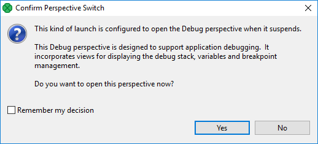
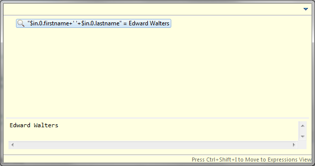
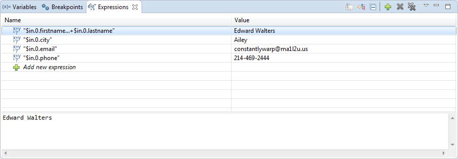

<!-- Development > CTL2 - CloverDX Transformation Language > CTL debugging -->

## 33. CTL debugging

**CloverDX** lets you debug CTL code in the same way as development tools do it for other programming languages.

Debugging is useful if you have a complex transformation and you would like to step the transformation to see the values of variables.

To debug the transformation, add breakpoints and launch the transformation in the debug mode. Breakpoints can be added in **Transform Editor** on the source code tab.

### Adding breakpoint

1. Open the **Transform Editor**.
2. Switch to the source tab.
3. In the source tab, right click the line number and choose **Toggle Breakpoint** from the context menu.

#### Types of breakpoints

Breakpoints can be internal or external (in external .ctl file).

By default, the execution stops each time a breakpoint is hit.

With **Hit count**, the execution stop each n-th hit of the breakpoint.

With a **Conditional** breakpoint, the execution stops only if a condition is true, e.g. the value of a variable equals to 10, or if the value of a variable changes.

### Debugging

Run the graph from the main menu: **Run** ****Debug**.

When the first breakpoint is reached, you are asked to confirm switching to the **Debug Perspective**.



In the **Debug Perspective**, you can step the program and enable or disable the breakpoints.
> [!NOTE]
> To use the breakpoint, you should run the graph using **Run** ****Debug**. If you run the graph from the context menu, the breakpoint will not be reached.

#### Debugging transformation in multiple components

To debug in multiple components, place breakpoints to these components and run the graph in debug mode. The components run in parallel, the graph run stops when the first breakpoint is reached.

### Compatibility

The CTL Debugging is available since **CloverETL 4.3.0-M1**.

### See also

Java Debugging is described in [this chapter.](transformations.md#debugging-java-transformations)

### Debug perspective

**Debug perspective** serves for debugging graphs.

#### Debug view

The **Debug** view, located in the upper left corner, displays a stack trace of function calls.

#### Variables and breakpoints

The **Variables** tab displays a list of variables and their values. You can read values, but you cannot modify them.

The **Breakpoints** tab displays a list of breakpoints. You can disable breakpoints, enable disabled breakpoints, export breakpoints and import breakpoints.

To go to the line in source code, right click the breakpoint in the list and choose **Go to file** from the context menu.

To disable the breakpoint, uncheck the checkbox.

To enable the breakpoint, check the checkbox.

To export breakpoints, right click the breakpoints and choose **Export breakpoints** from the context menu. In the dialog, choose breakpoints to export and specify a file name.

To import breakpoints, right click the breakpoint and choose **Import breakpoints** from the context menu. In the first step of the wizard, specify the file name. Then choose the breakpoints to be imported.

#### Graph Editor and Outline

**Graph Editor** and **Outline** have the same functionality as in **CloverDX** perspective.

### Importing and exporting breakpoints

You can export breakpoints to an external file and import them back.

#### Exporting breakpoints

You can export breakpoints from the main menu.

In the main menu, choose **File** ****Export**. In the dialog, choose **Run/Debug** ****Breakpoints**. In the **Export breakpoints** dialog, choose breakpoints, enter the file name and click **Finish**.

#### Importing breakpoints

You can import breakpoints from the main menu.

In the main menu, choose **File** ****Import**. In the dialog, choose **Run/Debug** ****Breakpoints**. In the **Import breakpoints** dialog, enter the file name and click **Finish**.

### Inspecting variables and expressions

When debugging CTL code, it is often useful to see the values of variables or expressions. The simplest way to see a variable’s value is to hover the mouse cursor over it. A pop-up dialog will open displaying the value. The dialog’s visuals are the same as those of the [Inspect Action](ctl-debugging.md#inspect-action)'s pop-up dialog.

#### Inspect action

The **Inspect Action** can be used to evaluate expressions in your CTL code. Select an expression and choose **Inspect** from the context menu or press **Ctrl+Shift+I**. A pop-up dialog will open containing the result. Once the pop-up is opened, the expression can be moved to the [Expressions View](ctl-debugging.md#expressions-view-and-watch-action) by pressing **Ctrl+Shift+I**.


*Figure 319. Inspect action pop-up dialog*

#### Expressions view and watch action

The **Expressions View** can be used to evaluate arbitrary CTL expressions, that is, not just those present in your code. To add an expression, either click **Add new expression** or right click the view and select **Add Watch Expression…​**. A third way to add an expression is to use the **Watch Action** - select an expression in your code and choose **Watch** from the context menu. Expressions are reevaluated after each stepping action or manually by choosing **Reevaluate Watch Expression** from the context menu. Expressions added using the **Inspect Action** cannot be reevaluated, but they can be converted to watch expressions. It is also possible to edit and disable or enable an expression.


*Figure 320. Expressions view*

### Examples

#### Basic example

This example shows basic usage of debugging.

You have a graph with **Map**. There is the following transformation in Map:

```ctl
//#CTL2

function integer transform() {
    if ($in.0.product == "A") {
        $out.0.price = $in.0.basePrice + 5;
    } else {
        $out.0.price = $in.0.basePrice + 10;
    }
    return ALL;
}
```

Stop when `else`-branch is reached.

##### Solution

Right click the line number below `else` and select **Toggle breakpoint** from the context menu. A breakpoint has been created.

Run the graph with **Run** ****Debug**. The graph runs until the breakpoint is hit.

When the breakpoint is hit, you are asked to confirm **perspective switch**. Designer switches to **Debug** perspective. There you can inspect variables, manage breakpoints, or continue in execution.

#### Using hit count

This example shows usage of hit count.

You perform some calculation in cycle. The calculation gives an interesting result in 20th cycle. Stop in 20th cycle without stopping earlier.

##### Solution

Place breakpoint into the correct place with the cycle.

Right click the breakpoint and select **Breakpoint properties…​**.

In breakpoint properties, enable **Hit count** and enter 20.

Run graph in the debug mode: **Run** ****Debug**.

#### Conditional breakpoint

This example shows creating a breakpoint that stops only if the field contains a specific value.

Stop transformation only if `$in.0.field1` is 500 or more.

##### Solution

Create a breakpoint.

Right click the breakpoint and select **Breakpoint properties…​**.

Select conditional. In the field below, type `$in.0.field1 >= 500`.

Run the graph in the debug mode: **Run** ****Debug**.

#### Detecting changes of the value

This example shows usage of Conditional breakpoint with the **Suspend when value changes** option.

Stop at the breakpoint if value of a variable changes.

##### Solution

Create a breakpoint.

Right click the breakpoint and select **Breakpoint properties…​**.

Select **Conditional** and **Suspend when value changes**.

Enter a name of the variable to be watched.

Run the graph in the debug mode: **Run** ****Debug**.
