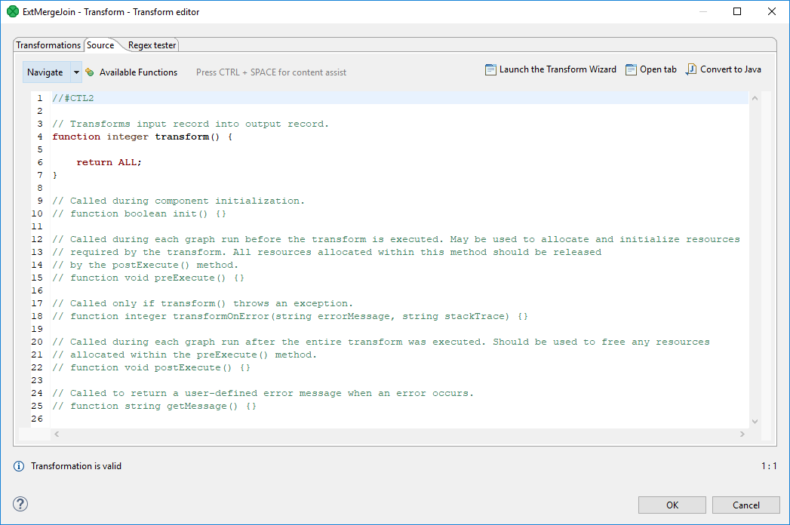

<!-- Development > Component reference > Joiners > Common properties of Joiners > CTL templates for Joiners -->

#### CTL templates for Joiners

This transformation template is used in every **Joiner** and also in [Map](reformat.md) and [DataIntersection](dataintersection.md).

Here is an example of how the **Source** tab for defining the transformation in CTL looks.


*Figure 414. Source tab of the Transform editor in Joiners*

| CTL Template Functions |  |
| --- | --- |
| boolean init() |  |
| Required | No |
| Description | Initialize the component, setup the environment, global variables. |
| Invocation | Called before processing the first record. |
| Returns | `true` \| `false` (if `false`, the graph fails) |
| integer transform() |  |
| Required | yes |
| Input Parameters | none |
| Returns | Integer numbers. For detailed information, see [Return values of transformations](transformations.md#return-values-of-transformations). |
| Invocation | Called repeatedly for each set of joined or intersected input records (**Joiners** and **DataIntersection**) and for each input record (**Map**). |
| Description | Allows you to map input fields to the output fields using a script. If any part of the `transform()` function for some output record causes fail of the `transform()` function, and if the user has defined another function (`transformOnError()`), processing continues in this `transformOnError()` at the place where `transform()` failed.  If `transform()` fails and the user has not defined any `transformOnError()`, the whole graph will fail. The `transformOnError()` function gets the information gathered by `transform()` that was gotten from previously successfully processed code. Also an error message and stack trace are passed to `transformOnError()`. |
| Example | ```ctl function integer transform() {    $out.0.name = $in.0.name;    $out.0.address = $in.0.city + $in.0.street + $in.0.zip;    $out.0.country = toUpper($in.0.country);    return ALL; } ``` |
| integer transformOnError(string errorMessage, string stackTrace, integer idx) |  |
| Required | no |
| Input Parameters | `string errorMessage` |
| `string stackTrace` |  |
| Returns | Integer numbers. For detailed information, see [Return values of transformations](transformations.md#return-values-of-transformations). |
| Invocation | Called if `transform()` throws an exception. |
| Description | It creates output records. If any part of the `transform()` function for some output record causes fail of the function, and if the user has defined another function (`transformOnError()`), processing continues in this `transformOnError()` at the place where `transform()` failed.  If `transform()` fails and the user has not defined any `transformOnError()`, the whole graph will fail. The `transformOnError()` function gets the information gathered by `transform()` that was gotten from previously successfully processed code. Also an error message and stack trace are passed to `transformOnError()`. |
| Example | ```ctl function integer transformOnError(                        string errorMessage,                        string stackTrace) {    $in.0.name = $in.0.name;    $in.0.address = $in.0.city + $in.0.street + $in.0.zip;    $in.0.country = "country was empty";    printErr(stackTrace);    return ALL; } ``` |
| string getMessage() |  |
| Required | No |
| Description | Prints an error message specified and invoked by user. |
| Invocation | Called in any time specified by the user (called only when `transform()` returns value less than or equal to -2). |
| Returns | `string` |
| void preExecute() |  |
| Required | No |
| Input parameters | None |
| Returns | `void` |
| Description | May be used to allocate and initialize resources required by the transformation. All resources allocated within this function should be released by the `postExecute()` function. |
| Invocation | Called during each graph run before the transform is executed. |
| void postExecute() |  |
| Required | No |
| Input parameters | None |
| Returns | `void` |
| Description | Should be used to free up any resources allocated within the `preExecute()` function. |
| Invocation | Called during each graph run after the entire transform was executed. |
> [!IMPORTANT]
> - **Input records or fields and output records or fields**
>   Both inputs and outputs are accessible within the `transform()` and `transformOnError()` functions only.
> - All of the other CTL template functions allow to access neither inputs nor outputs.
> [!WARNING]
> Remember that if you do not hold these rules, NPE will be thrown.
