<!-- Development > CTL2 - CloverDX Transformation Language > CTL2 functions reference > CTL2 appendix - list of national-specific characters -->

### CTL2 appendix - list of national-specific characters

Several functions, e.g. ["editDistance (string, string, integer, string, integer)"](string-functions-ctl2.md#editdistance-arg1-arg2-strength-locale-maxdifference) need to operate with special national characters. These are important especially when sorting items with a defined comparison strength.

The list below shows first the locale and then the list of its national-specific derivatives for each letter. These may be treated either as equal or different characters depending on the comparison strength you define.

| Locale | National Characters |
| --- | --- |
| CA - Catalan | 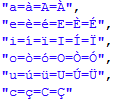 |
| CZ - Czech | 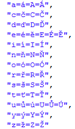 |
| DA - Danish and Norwegian | 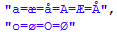 |
| DE - German | 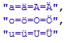 |
| ES - Spanish | 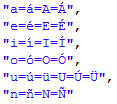 |
| ET - Estonian | 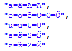 |
| FI - Finnish | 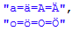 |
| FR - French | 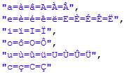 |
| HR - Croatian | 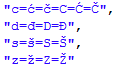 |
| HU - Hungarian | 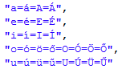 |
| IS - Icelandic | 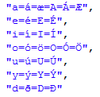 |
| IT - Italian | 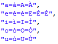 |
| LT - Lithuanian | 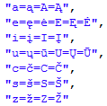 |
| LV - Latvian | 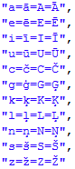 |
| PL - Polish | 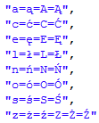 |
| PT - Portuguese | 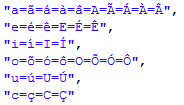 |
| RO - Romanian | 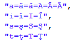 |
| RU - Russian | 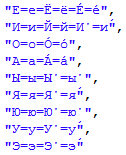 |
| SK - Slovak | 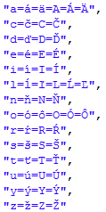 |
| SL - Slovenian | 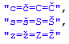 |
| SQ - Albanian | 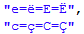 |
| SV - Swedish | 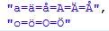 |
